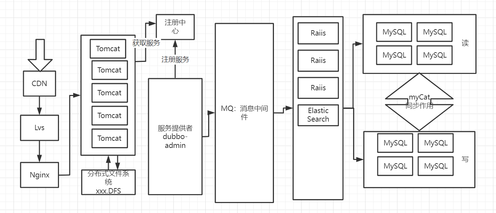
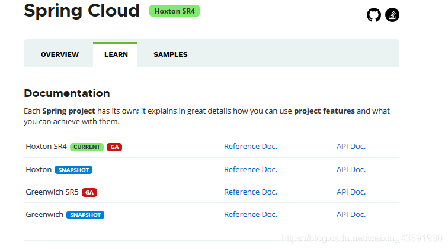
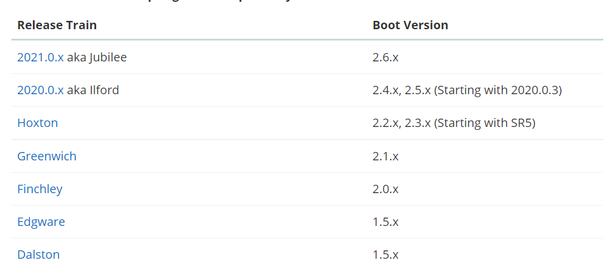
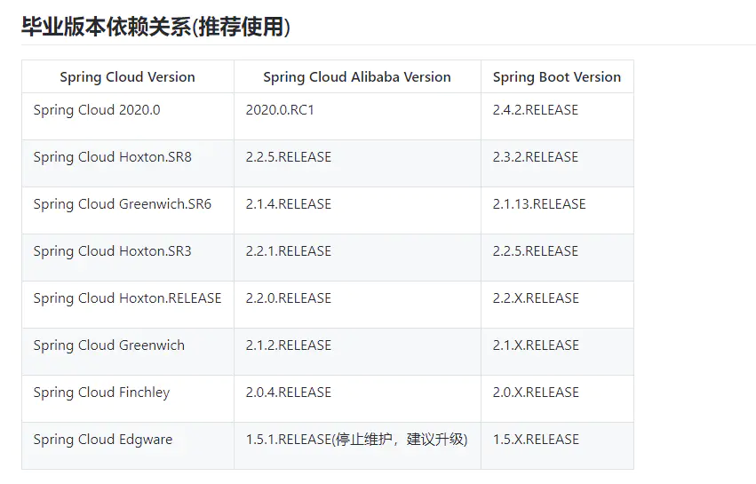

## SpringCloud入门概述

#### SpringCloud是什么？

Spring官网：https://spring.io/


#### SpringCloud和SpringBoot的关系

1. SpringBoot专注于开发方便的开发单个个体微服务；
2. SpringCloud是关注全局的微服务协调整理治理框架，它将SpringBoot开发的一个个单体微服务，整合并管理起来，为各个微服务之间提供：配置管理、服务发现、断路器、路由、微代理、事件总栈、全局锁、决策竞选、分布式会话等等集成服务；
3. SpringBoot可以离开SpringCloud独立使用，开发项目，但SpringCloud离不开SpringBoot，属于依赖关系；
4. **SpringBoot专注于快速、方便的开发单个个体微服务，SpringCloud关注全局的服务治理框架**；

#### 一个传统的互联网架构



#### Dubbo 和 SpringCloud技术选型

1. 分布式+服务治理Dubbo
   1. 目前成熟的互联网架构，应用服务化拆分 + 消息中间件
2.  Dubbo 和 SpringCloud对比
   1. 可以看一下社区活跃度：
      1. https://github.com/dubbo
      2. https://github.com/spring-cloud
3. 对比结果

```
|            | Dubbo         | SpringCloud                  |
| ---------- | ------------- | ---------------------------- |
| 服务注册中心 | Zookeeper     | Spring Cloud Netfilx Eureka  |
| 服务调用方式 | RPC           | REST API                     |
| 服务监控    | Dubbo-monitor | Spring Boot Admin            |
| 断路器      | 不完善         | Spring Cloud Netfilx Hystrix |
| 服务网关    | 无             | Spring Cloud Netfilx Zuul   |
| 分布式配置  | 无             | Spring Cloud Config         |
| 服务跟踪    | 无             | Spring Cloud Sleuth         |
| 消息总栈    | 无             | Spring Cloud Bus            |
| 数据流     | 无             | Spring Cloud Stream          |
| 批量任务    | 无             | Spring Cloud Task            |
```

1. 最大区别：Spring Cloud 抛弃了Dubbo的RPC通信，采用的是**基于HTTP的REST方式**
2. 严格来说，这两种方式各有优劣。虽然从一定程度上来说，后者牺牲了服务调用的性能，但也避免了上面提到的原生RPC带来的问题。而且REST相比RPC更为灵活，服务提供方和调用方的依赖只依靠一纸契约，不存在代码级别的强依赖，这个优点在当下强调快速演化的微服务环境下，显得更加合适。
3. 品牌机和组装机的区别
4. 社区支持与更新力度的区别
5. **软实力：设计模式+微服务拆分思想**
6. **总结：**二者解决的问题域不一样：Dubbo的定位是一款RPC框架，而SpringCloud的目标是微服务架构下的一站式解决方案。

#### 3.5 SpringCloud下载

1. 官网：http://projects.spring.io/spring-cloud/
2. 版本号有点特别：



- SpringCloud没有采用数字编号的方式命名版本号，而是采用了伦敦地铁站的名称，**同时根据字母表的顺序来对应版本时间顺序**，比如最早的Realse版本：Angel，第二个Realse版本：Brixton，然后是Camden、Dalston、Edgware，目前最新的是Hoxton SR4 CURRENT GA通用稳定版。

>spirngcloud版本演变过程
>
>版本名称 版本
>Finchley snapshot版
>Edgware snapshot版
>Dalston SR1 当前最新稳定版本
>Camden SR7 稳定版本
>Brixton SR7 稳定版本
>Angel SR6 稳定版本

springBoot和SpringCloud对应关系

- 



- **自学参考书：**
  - SpringCloud Netflix 中文文档：https://springcloud.cc/spring-cloud-netflix.html
  - SpringCloud 中文API文档(官方文档翻译版)：https://springcloud.cc/spring-cloud-dalston.html
  - SpringCloud中国社区：http://springcloud.cn/
  - SpringCloud中文网：[https://springcloud.cc](https://springcloud.cc/)

