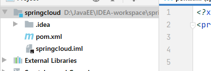

## SpringCloud Rest学习环境搭建：服务提供者

#### 介绍

- 我们会使用一个Dept部门模块做一个微服务通用案例**Consumer**消费者(**Client**)通过REST调用**Provider**提供者(**Server**)提供的服务。
- 回顾Spring，SpringMVC，Mybatis等以往学习的知识。
- Maven的分包分模块架构复习。

```
一个简单的Maven模块结构是这样的：
-- app-parent: 一个父项目(app-parent)聚合了很多子项目(app-util\app-dao\app-web...)
	|-- pom.xml
    |
    |-- app-core  
    ||---- pom.xml 
    |  
    |-- app-web 
    ||---- pom.xml 
    ......
```

- 一个父工程带着多个Moudule子模块
- MicroServiceCloud父工程(Project)下初次带着3个子模块(Module)
  - microservicecloud-api 【封装的整体entity/接口/公共配置等】
  - microservicecloud-consumer-dept-80 【服务提供者】
  - microservicecloud-provider-dept-8001 【服务消费者】

#### SpringCloud版本选择

- **大版本说明**

```
| SpringBoot | SpringCloud       | 关系                                        |
| ---------- | --------------------- | -------------------------------------- |
| 1.2.x      | Angel版本(天使)        | 兼容SpringBoot1.2x                      |
| 1.3.x      | Brixton版本(布里克斯顿) | 兼容SpringBoot1.3x，也兼容SpringBoot1.4x  |
| 1.4.x      | Camden版本(卡姆登)     | 兼容SpringBoot1.4x，也兼容SpringBoot1.5x  |
| 1.5.x      | Dalston版本(多尔斯顿)   | 兼容SpringBoot1.5x，不兼容SpringBoot2.0x |
| 1.5.x      | Edgware版本(埃奇韦尔)   | 兼容SpringBoot1.5x，不兼容SpringBoot2.0x |
| 2.0.x      | Finchley版本(芬奇利)    | 兼容SpringBoot2.0x，不兼容SpringBoot1.5x |
| 2.1.x      | Greenwich版本(格林威治) |                                         |
```

**实际开发版本关系**

```
| spring-boot-starter-parent |             | spring-cloud-dependencles |          |
|:--------------------------:| -----------:|:-------------------------:|:--------:|
|          **版本号**         | **发布日期** |          **版本号**      | **发布日期** |
|       1.5.2.RELEASE        |  2017-03   |        Dalston.RC1        |  2017-x  |
|       1.5.9.RELEASE        |  2017-11   |      Edgware.RELEASE      | 2017-11  |
|       1.5.16.RELEASE       |  2018-04   |        Edgware.SR5        | 2018-10  |
|       1.5.20.RELEASE       |  2018-09   |        Edgware.SR5        | 2018-10  |
|       2.0.2.RELEASE        |  2018-05   |  Fomchiey.BULD-SNAPSHOT   |  2018-x  |
|       2.0.6.RELEASE        |  2018-10   |       Fomchiey-SR2        | 2018-10  |
|       2.1.4.RELEASE        |  2019-04   |       Greenwich.SR1       | 2019-03  |
```

**使用后两个**

####  创建父工程

- 创建普通的maven项目，父工程项目springcloud，删掉src文件夹，切记**Packageing是pom模式**

- 主要是定义POM文件，将后续各个子模块公用的jar包等统一提取出来，类似一个抽象父类
  

- **pom.xml**，导包时不要翻墙，不然导不进来

  - dependencyManagement注解只是管理，只起到声明作用，只有子模块使用时才会导入到maven
  - 子模块导入依赖时可以不用定义版本了，直接默认指向父项目的依赖
  - 这里的type和scope需要指定pom和import。意味着父项目只是单纯的声明依赖，子项目会继承父项目中的依赖。子项目在需要依赖时，先从自身pom中查找，如果没有找到，就从父项目的pom中查找，与Java中的继承机制类似。
  
  ```xml
  <?xml version="1.0" encoding="UTF-8"?>
  <project xmlns="http://maven.apache.org/POM/4.0.0"
           xmlns:xsi="http://www.w3.org/2001/XMLSchema-instance"
           xsi:schemaLocation="http://maven.apache.org/POM/4.0.0 http://maven.apache.org/xsd/maven-4.0.0.xsd">
      <modelVersion>4.0.0</modelVersion>
  
      <groupId>com.zi</groupId>
      <artifactId>springcloud</artifactId>
      <version>1.0-SNAPSHOT</version>
      <modules>
          <module>spring-cloud-api</module>
          <module>spring-cloud-provider-8001</module>
      </modules>
  
      <packaging>pom</packaging>
      
  <!--草帽路飞版-->
      <properties>
          <project.build.sourceEncoding>UTF-8</project.build.sourceEncoding>
          <maven.compiler.source>1.8</maven.compiler.source>
          <maven.compiler.target>1.8</maven.compiler.target>
  		<!--  -->
  <!--        <junit.version>4.1.2</junit.version>-->
          <log4j.version>1.2.17</log4j.version>
          <lombok.version>1.16.18</lombok.version>
      </properties>
      <dependencyManagement>
          <dependencies>
              <dependency>
                  <groupId>org.springframework.cloud</groupId>
                  <artifactId>spring-cloud-alibaba-dependencies</artifactId>
                  <version>0.2.0.RELEASE</version>
                  <type>pom</type>
                  <scope>import</scope>
              </dependency>
              <!--springCloud的依赖-->
              <dependency>
                  <groupId>org.springframework.cloud</groupId>
                  <artifactId>spring-cloud-dependencies</artifactId>
                  <version>Greenwich.SR1</version>
                  <type>pom</type>
                  <scope>import</scope>
              </dependency>
              <!--SpringBoot，里面有大量SpringBoot相关依赖，替代<parent>标签spring-boot-starter-parent-->
              <!--有了它将不再需要导入任何<groupId>org.springframework.boot</groupId>的依赖了-->
              <!--这个一般只写在dependencyManagement中管理，因为它包含的依赖太多了-->
              <dependency>
                  <groupId>org.springframework.boot</groupId>
                  <artifactId>spring-boot-dependencies</artifactId>
                  <version>2.1.4.RELEASE</version>
                  <type>pom</type>
                  <scope>import</scope>
              </dependency>
              <!--数据库-->
              <dependency>
                  <groupId>mysql</groupId>
                  <artifactId>mysql-connector-java</artifactId>
                  <version>5.1.47</version>
              </dependency>
              <dependency>
                  <groupId>com.alibaba</groupId>
                  <artifactId>druid</artifactId>
                  <version>1.1.10</version>
              </dependency>
              <!--SpringBoot 启动器-->
              <dependency>
                  <groupId>org.mybatis.spring.boot</groupId>
                  <artifactId>mybatis-spring-boot-starter</artifactId>
                  <version>1.3.2</version>
              </dependency>
              <!--日志测试~-->
              <dependency>
                  <groupId>ch.qos.logback</groupId>
                  <artifactId>logback-core</artifactId>
                  <version>1.2.3</version>
              </dependency>
              <!--其中包含了junit~-->
              <dependency>
                  <groupId>org.springframework.boot</groupId>
                  <artifactId>spring-boot-starter-test</artifactId>
                  <version>2.1.4.RELEASE</version>
              </dependency>
              <!--<dependency>
                  <groupId>junit</groupId>
                  <artifactId>junit</artifactId>
              </dependency>-->
              <dependency>
                  <groupId>log4j</groupId>
                  <artifactId>log4j</artifactId>
                  <version>${log4j.version}</version>
              </dependency>
              <dependency>
                  <groupId>org.projectlombok</groupId>
                  <artifactId>lombok</artifactId>
                  <version>${lombok.version}</version>
              </dependency>
          </dependencies>
      </dependencyManagement>
  
  <!--项目实践版-->
    <!--<properties>
      <maven.compiler.source>8</maven.compiler.source>
      <maven.compiler.target>8</maven.compiler.target>
      &lt;!&ndash;        测试&ndash;&gt;
      <junit.version>4.12</junit.version>
      &lt;!&ndash;        boot-test&ndash;&gt;
      <boot-test.version>2.6.4</boot-test.version>
      &lt;!&ndash;        日志&ndash;&gt;
      <log4j.version>1.2.17</log4j.version>
      &lt;!&ndash;        日志测试&ndash;&gt;
      <logback-core.version>1.2.3</logback-core.version>
      &lt;!&ndash;        快速开发&ndash;&gt;
      <lombok.version>1.16.18</lombok.version>
      &lt;!&ndash;        boot版本&ndash;&gt;
      <boot-dependencies.version>2.1.4.RELEASE</boot-dependencies.version>
      &lt;!&ndash;        阿里巴巴云&ndash;&gt;
      <cloud-alibaba-dependencies.version>0.2.0.RELEASE</cloud-alibaba-dependencies.version>
      &lt;!&ndash;        mysql连接&ndash;&gt;
      <mysql-connector.version>5.1.47</mysql-connector.version>
      &lt;!&ndash;        spring cloud版本&ndash;&gt;
      <cloud-dependencies.version>Greenwich.SR1</cloud-dependencies.version>
      &lt;!&ndash;        德鲁伊连接池&ndash;&gt;
      <druid.version>1.1.10</druid.version>
      &lt;!&ndash;        Mybatis启动器&ndash;&gt;
      <boot-starter.version>1.3.2</boot-starter.version>
      &lt;!&ndash;        eureka注册中心&ndash;&gt;
      <eureka.version>1.4.6.RELEASE</eureka.version>
    </properties>
  
    <dependencyManagement>
      <dependencies>
        <dependency>
          <groupId>org.springframework.cloud</groupId>
          <artifactId>spring-cloud-alibaba-dependencies</artifactId>
          <version>${cloud-alibaba-dependencies.version}</version>
          <type>pom</type>
          <scope>import</scope>
        </dependency>
        &lt;!&ndash;springCloud的依赖&ndash;&gt;
        <dependency>
          <groupId>org.springframework.cloud</groupId>
          <artifactId>spring-cloud-dependencies</artifactId>
          <version>${cloud-dependencies.version}</version>
          <type>pom</type>
          <scope>import</scope>
        </dependency>
        &lt;!&ndash;SpringBoot&ndash;&gt;
        <dependency>
          <groupId>org.springframework.boot</groupId>
          <artifactId>spring-boot-dependencies</artifactId>
          <version>${boot-dependencies.version}</version>
          <type>pom</type>
          <scope>import</scope>
        </dependency>
        &lt;!&ndash;数据库&ndash;&gt;
        <dependency>
          <groupId>mysql</groupId>
          <artifactId>mysql-connector-java</artifactId>
          <version>${mysql-connector.version}</version>
        </dependency>
        <dependency>
          <groupId>com.alibaba</groupId>
          <artifactId>druid</artifactId>
          <version>${druid.version}</version>
        </dependency>
        &lt;!&ndash;Mybatis 启动器&ndash;&gt;
        <dependency>
          <groupId>org.mybatis.spring.boot</groupId>
          <artifactId>mybatis-spring-boot-starter</artifactId>
          <version>${boot-starter.version}</version>
        </dependency>
        &lt;!&ndash;日志测试~&ndash;&gt;
        <dependency>
          <groupId>ch.qos.logback</groupId>
          <artifactId>logback-core</artifactId>
          <version>${logback-core.version}</version>
        </dependency>
        &lt;!&ndash;            测试&ndash;&gt;
        <dependency>
          <groupId>junit</groupId>
          <artifactId>junit</artifactId>
          <version>${junit.version}</version>
        </dependency>
        &lt;!&ndash;            日志&ndash;&gt;
        <dependency>
          <groupId>log4j</groupId>
          <artifactId>log4j</artifactId>
          <version>${log4j.version}</version>
        </dependency>
        &lt;!&ndash;            快速开发&ndash;&gt;
        <dependency>
          <groupId>org.projectlombok</groupId>
          <artifactId>lombok</artifactId>
          <version>${lombok.version}</version>
        </dependency>
  
        &lt;!&ndash;            eureka server&ndash;&gt;
        <dependency>
          <groupId>org.springframework.cloud</groupId>
          <artifactId>spring-cloud-starter-eureka-server</artifactId>
          <version>${eureka.version}</version>
        </dependency>
        &lt;!&ndash;            eureka starter&ndash;&gt;
        <dependency>
          <groupId>org.springframework.cloud</groupId>
          <artifactId>spring-cloud-starter-eureka</artifactId>
          <version>${eureka.version}</version>
        </dependency>
        &lt;!&ndash;            &ndash;&gt;
        <dependency>
          <groupId>org.springframework.cloud</groupId>
          <artifactId>spring-cloud-starter-ribbon</artifactId>
          <version>${eureka.version}</version>
        </dependency>
  
        &lt;!&ndash;            boot-test&ndash;&gt;
        <dependency>
          <groupId>org.springframework.boot</groupId>
          <artifactId>spring-boot-test</artifactId>
          <version>${boot-test.version}</version>
        </dependency>
      </dependencies>
    </dependencyManagement>-->
      
  <!--视频原版-->
  <!--
          <properties>
          <project.build.sourceEncoding>UTF-8</project.build.sourceEncoding>
          <maven.compiler.source>1.8</maven.compiler.source>
          <maven.compiler.target>1.8</maven.compiler.target>
  
          <junit.version>4.12</junit.version>
          <lombok.version>1.16.10</lombok.version>
          <logback.version>1.2.3</logback.version>
          <log4j.version>1.2.17</log4j.version>
          <mybatis.version>1.3.2</mybatis.version>
          <druid.version>1.1.10</druid.version>
          <mysql.version>5.1.47</mysql.version>
  &lt;!&ndash;        听视频的评论区说要改成2.2.5，2.1.4会有版本错误&ndash;&gt;
          <spingboot.version>2.2.5.RELEASE</spingboot.version>
          <spingcloud.version>Greenwich.SR1</spingcloud.version>
      </properties>
  
      <dependencyManagement>
          <dependencies>
  &lt;!&ndash;             SpringCloud&ndash;&gt;
              <dependency>
                  <groupId>org.springframework.cloud</groupId>
                  <artifactId>spring-cloud-dependencies</artifactId>
                  <version>${spingcloud.version}</version>
                  <type>pom</type>
                  <scope>import</scope>
              </dependency>
  &lt;!&ndash;             SpringBoot&ndash;&gt;
              <dependency>
                  <groupId>org.springframework.boot</groupId>
                  <artifactId>sping-boot-dependencies</artifactId>
                  <version>${spingboot.version}</version>
                  <type>pom</type>
                  <scope>import</scope>
              </dependency>
  &lt;!&ndash;            数据库&ndash;&gt;
              <dependency>
                  <groupId>mysql</groupId>
                  <artifactId>mysql-connector-java</artifactId>
                  <version>${mysql.version}</version>
              </dependency>
  &lt;!&ndash;            数据源&ndash;&gt;
              <dependency>
                  <groupId>com.alibaba</groupId>
                  <artifactId>druid</artifactId>
                  <version>${druid.version}</version>
              </dependency>
  &lt;!&ndash;            Mybatis启动器&ndash;&gt;
              <dependency>
                  <groupId>org.mybatis.spring.boot</groupId>
                  <artifactId>mybatis-spring-boot-starter</artifactId>
                  <version>${mybatis.version}</version>
              </dependency>
  &lt;!&ndash;            lombok&ndash;&gt;
              <dependency>
                  <groupId>org.projectlombok</groupId>
                  <artifactId>lombok</artifactId>
                  <version>${lombok.version}</version>
              </dependency>
  &lt;!&ndash;            junit&ndash;&gt;
              <dependency>
                  <groupId>junit</groupId>
                  <artifactId>junit</artifactId>
                  <version>${junit.version}</version>
              </dependency>
  &lt;!&ndash;            log4j&ndash;&gt;
              <dependency>
                  <groupId>log4j</groupId>
                  <artifactId>log4j</artifactId>
                  <version>${log4j.version}</version>
              </dependency>
  &lt;!&ndash;            logback&ndash;&gt;
              <dependency>
                  <groupId>ch.qos.logback</groupId>
                  <artifactId>logback-core</artifactId>
                  <version>${logback.version}</version>
              </dependency>
          </dependencies>
      </dependencyManagement>-->
  
  
  </project>
  ```
  
- idea连接数据库，使用idea的Database面板创建springcloud数据库和dept部门表

  ```sql
  drop database if EXISTS springcloud;
  
  create database springcloud CHARACTER SET utf8 COLLATE utf8_general_ci;
  #alter database springcloud CHARACTER SET utf8 COLLATE utf8_general_ci;
  use springcloud;
  
  create table dept
  (
  	deptno bigint auto_increment,#部门编号
  	dname varchar(60) null,#部门名称
  	db_source varchar(60) null,#数据库名称，因为是分布式，肯定有很多数据库
  	constraint dept_pk
  		primary key (deptno)
  );
  
  insert into dept (dname, db_source) values ('开发部',DATABASE());#DATABASE()函数获取当前数据库的名称
  insert into dept (dname, db_source) values ('人事部',DATABASE());
  insert into dept (dname, db_source) values ('财务部',DATABASE());
  insert into dept (dname, db_source) values ('市场部',DATABASE());
  insert into dept (dname, db_source) values ('运维部',DATABASE());
  ```

#### 创建api模块

- 创建普通maven模块spring-cloud-api，在java文件夹创建com.zi.springcloud.pojo包，创建实体类Dept

  - pom.xml

  ```xml
  <?xml version="1.0" encoding="UTF-8"?>
  <project xmlns="http://maven.apache.org/POM/4.0.0"
           xmlns:xsi="http://www.w3.org/2001/XMLSchema-instance"
           xsi:schemaLocation="http://maven.apache.org/POM/4.0.0 http://maven.apache.org/xsd/maven-4.0.0.xsd">
      <parent>
          <artifactId>springcloud</artifactId>
          <groupId>com.zi</groupId>
          <version>1.0-SNAPSHOT</version>
      </parent>
      <modelVersion>4.0.0</modelVersion>
  
      <artifactId>spring-cloud-api</artifactId>
  
      <properties>
          <maven.compiler.source>8</maven.compiler.source>
          <maven.compiler.target>8</maven.compiler.target>
      </properties>
  
      <dependencies>
          <dependency>
              <groupId>org.projectlombok</groupId>
              <artifactId>lombok</artifactId>
          </dependency>
      </dependencies>
  </project>
  ```

  

  ```java
  package com.zi.springcloud.pojo;
  
  import lombok.Data;
  import lombok.NoArgsConstructor;
  import lombok.experimental.Accessors;
  
  import java.io.Serializable;
  
  @Data
  @NoArgsConstructor
  @Accessors(chain = true)//链式写法
  public class Dept implements Serializable {
      private Long deptno;//主键
      private String dname;
      //这个数据库存在哪个数据库
      private String db_source;
  
      public Dept(String dname){
          this.dname=dname;
      }
      
      /*
          链式写法：
          Dept dept = new Dept();
          dept.setDname("").setDeptno(1).setDb_source("");
      */
  }
  
  ```

#### 创建spring-cloud-provider生产者模块

- 创建spring-cloud-provider生产者模块，artifactId设置为spring-cloud-provider-8001，因为分布式肯定有很多模块，写上端口好区分

  - pom.xml

  ```xml
  <?xml version="1.0" encoding="UTF-8"?>
  <project xmlns="http://maven.apache.org/POM/4.0.0"
           xmlns:xsi="http://www.w3.org/2001/XMLSchema-instance"
           xsi:schemaLocation="http://maven.apache.org/POM/4.0.0 http://maven.apache.org/xsd/maven-4.0.0.xsd">
      <parent>
          <artifactId>springcloud</artifactId>
          <groupId>com.zi</groupId>
          <version>1.0-SNAPSHOT</version>
      </parent>
      <modelVersion>4.0.0</modelVersion>
  
  
      <artifactId>spring-cloud-privider-8001</artifactId>
  
      <properties>
          <maven.compiler.source>8</maven.compiler.source>
          <maven.compiler.target>8</maven.compiler.target>
      </properties>
  
      <dependencies>
          <dependency>
              <groupId>com.zi</groupId>
              <artifactId>spring-cloud-api</artifactId>
              <version>1.0-SNAPSHOT</version>
          </dependency>
          <dependency>
              <groupId>junit</groupId>
              <artifactId>junit</artifactId>
          </dependency>
          <dependency>
              <groupId>com.alibaba</groupId>
              <artifactId>druid</artifactId>
          </dependency>
          <!--
              druid可能会报错：create connection SQLException, url:..., errorCode 0, state null
              把mysql的原始驱动加上，报错的话yml的数据源就不用了，驱动换成com.mysql.jdbc.Driver
          -->
          <dependency>
              <groupId>mysql</groupId>
              <artifactId>mysql-connector-java</artifactId>
          </dependency>
          <dependency>
              <groupId>ch.qos.logback</groupId>
              <artifactId>logback-core</artifactId>
          </dependency>
          <dependency>
              <groupId>org.mybatis.spring.boot</groupId>
              <artifactId>mybatis-spring-boot-starter</artifactId>
          </dependency>
          <!--test-->
          <!--这里不用导入版本是因为父项目已经导入了spring-boot-dependencies-->
          <dependency>
              <groupId>org.springframework.boot</groupId>
              <artifactId>spring-boot-test</artifactId>
          </dependency>
          <!--web-->
          <dependency>
              <groupId>org.springframework.boot</groupId>
              <artifactId>spring-boot-starter-web</artifactId>
          </dependency>
          <!--jetty-->
          <!--可以使用这个当作项目的web服务器，虽然说没有什么区别-->
          <dependency>
              <groupId>org.springframework.boot</groupId>
              <artifactId>spring-boot-starter-jetty</artifactId>
          </dependency>
          <!--热部署-->
          <dependency>
              <groupId>org.springframework.boot</groupId>
              <artifactId>spring-boot-devtools</artifactId>
          </dependency>
      </dependencies>
  </project>
  ```

  - 在resource文件夹中创建application.yml，**yml识别不了就yaml**

    ```yml
    server:
      port: 8001
    
    #mybatis配置
    mybatis:
      type-aliases-package: com.zi.springcloud.pojo
      config-location: classpath:mybatis/mybatis-config.xml
      mapper-locations: classpath:mybatis/mapper/*.xml
    #  configuration:
    #    map-underscore-to-camel-case: true #  驼峰命名
    
    #Spring配置
    spring:
      application:
        name: spring-cloud-privider #    起个名字
      datasource:
         type: com.alibaba.druid.pool.DruidDataSource #数据源
    #    driver-class-name: org.gjt.mm.mysql.Driver #启动器
        driver-class-name: com.mysql.jdbc.Driver #druid用不了的话就换回这个吧
        url: jdbc:mysql://localhost:3306/springcloud?characterEncoding=UTF-8&useUnicode=true&useSSL=true&serverTimezone=UTC
        username: root
        password: root
    ```

  - 创建mybatis-config.xml

    ```xml-dtd
    <?xml version="1.0" encoding="utf-8"?>
    <!DOCTYPE configuration PUBLIC "-//mybatis.org//DTD Config 3.0//EN"
            "http://mybatis.org/dtd/mybatis-3-config.dtd">
    <configuration>
        <settings>
            <!--开启二级缓存-->
            <setting name="cacheEnabled" value="true"/>
        </settings>
    </configuration>
    ```

  - 创建mybatis-mapper.xml

    ```xml-dtd
    <?xml version="1.0" encoding="UTF-8"?>
    <!DOCTYPE mapper
            PUBLIC "-//mybatis.org//DTD Mapper 3.0//EN"
            "http://mybatis.org/dtd/mybatis-3-mapper.dtd">
    <mapper namespace="com.zi.springcloud.dao.Dao">
        <insert id="addDept" parameterType="com.zi.springcloud.pojo.Dept">
            insert into springcloud.dept (dname, db_source) values (#{dname},DATABASE())
        </insert>
        <select id="queryById" parameterType="Long" resultType="com.zi.springcloud.pojo.Dept">
            select * from springcloud.dept where deptno = #{id}
        </select>
        <select id="queryAll" parameterType="Long" resultType="com.zi.springcloud.pojo.Dept">
            select * from springcloud.dept
        </select>
    </mapper>
    ```

  - 编写dao接口，编写service接口和实现类，编写Controller
  
    - 正常情况下，增删改查中，增加操作要用PostMapping注解，查询操作要用GetMapping注解，
    
    - 控制器类
    
      ```java
      package com.zi.springcloud.controller;
      
      import com.zi.springcloud.pojo.Dept;
      import com.zi.springcloud.service.DeptServiceImpl;
      import org.springframework.beans.factory.annotation.Autowired;
      import org.springframework.web.bind.annotation.*;
      
      import java.util.List;
      
      //提供Restful服务
      @RestController
      public class DeptController {
          @Autowired
          DeptServiceImpl service;
      
          @PostMapping("/dept/add")
          public boolean addDept(@RequestBody Dept dept){
              //加上RequestBody注解后，消费者可以输入http://localhost/consumer/add?dname=消费部，来添加数据，生产者模块不可以，因为这是PostMapping注解
              return service.addDept(dept);
          };
      
          @GetMapping("/dept/query{id}")
          public Dept queryById(@PathVariable("id") Long id){
              return service.queryById(id);
          };
      
          @GetMapping("/dept/queryAll")
          public List<Dept> queryAll(){
              return service.queryAll();
          };
      }
      
      ```
    
      

#### 创建spring-cloud-consumer消费者模块

- pom.xml

  ```xml
  <?xml version="1.0" encoding="UTF-8"?>
  <project xmlns="http://maven.apache.org/POM/4.0.0"
           xmlns:xsi="http://www.w3.org/2001/XMLSchema-instance"
           xsi:schemaLocation="http://maven.apache.org/POM/4.0.0 http://maven.apache.org/xsd/maven-4.0.0.xsd">
      <parent>
          <artifactId>springcloud</artifactId>
          <groupId>com.zi</groupId>
          <version>1.0-SNAPSHOT</version>
      </parent>
      <modelVersion>4.0.0</modelVersion>
  
      <artifactId>spring-cloud-consumer</artifactId>
  
      <properties>
          <maven.compiler.source>8</maven.compiler.source>
          <maven.compiler.target>8</maven.compiler.target>
      </properties>
  
      <dependencies>
          <dependency>
              <groupId>com.zi</groupId>
              <artifactId>spring-cloud-api</artifactId>
              <version>1.0-SNAPSHOT</version>
          </dependency>
          <dependency>
              <groupId>org.springframework.boot</groupId>
              <artifactId>spring-boot-starter-web</artifactId>
          </dependency>
      </dependencies>
  
  </project>
  ```

- application.yml

  ```yml
  server:
    port: 80
  ```

- 定义config类

  - 我们不使用applicationContext.xml，而是使用配置类，将RestTemplate对象注入到Spring

  ```java
  package com.zi.springcloud.config;
  
  import org.springframework.context.annotation.Bean;
  import org.springframework.context.annotation.Configuration;
  import org.springframework.web.client.RestTemplate;
  
  @Configuration //相当于spring中的applicationContext.xml
  public class ConfigBean {
  
  //    注入RestTemplate
      @Bean
      public RestTemplate getRestTemplate(){
          return new RestTemplate();
      }
  }
  
  ```

- 定义控制器

  - RestTemplate提供了多种远程访问http的方法，对应各种提交方式，比如get请求对应getForObject方法，post请求对应postForObject方法
  - 注意：不同服务之间的session是不能共享的，请求参数为session的接口时，取不到session中的数据，可以使用redis做到session共享
  
  ```java
  package com.zi.springcloud.controller;
  
  import com.zi.springcloud.pojo.Dept;
  import org.springframework.beans.factory.annotation.Autowired;
  import org.springframework.stereotype.Controller;
  import org.springframework.web.bind.annotation.PathVariable;
  import org.springframework.web.bind.annotation.RequestMapping;
  import org.springframework.web.bind.annotation.RestController;
  import org.springframework.web.client.RestTemplate;
  
  import java.util.List;
  
  @RestController
  public class DeptConsumerController {
      //理解：消费者不应该有service层
      //那消费者模块怎么调用service类呢
      //RestTemplate模板供我们直接调用就可以，注册到Spring中，通过config类
      //(地址：url, 实体(可以没有)：Map ,Class<T> responseType)
  
  //    因为config类中注入过，所以才能用Autowired使用
      @Autowired
      private RestTemplate restTemplate;//提供多种远程访问http的方法
  
      //因为consumer没有service层，只能远程调用服务器的service层，这个就是服务器的地址，要什么功能直接在后面加
      private static final String REST_URL_PREFIX="http://localhost:8001";
  
      @RequestMapping("/consumer/get{id}")
      public Dept get(@PathVariable("id") Long id){
          //(地址：url, 实体(可以没有)：Map ,Class<T> responseType)
          return restTemplate.getForObject(REST_URL_PREFIX+"/dept/query"+id,Dept.class);
      }
      @RequestMapping("/consumer/add")
      public Boolean add(@RequestBody Dept dept){
          //生产者对应的方法加上RequestBody注解后，消费者可以输入http://localhost/consumer/add?dname=消费部，无论生产者对应的该方法是PostMapping还是GetMapping，只要本方法不是PostMapping注解修饰，其实消费者不加RequestBody注解也没有影响
          //(地址：url, 实体(可以没有)：Map ,Class<T> responseType)
          //服务地址，服务的参数，服务返回的参数（本方法返回类型要与其一致）
          return restTemplate.postForObject(REST_URL_PREFIX+"/dept/add",dept,Boolean.class);
      }
      @RequestMapping("/consumer/getAll")
      public List<Dept> add(){
          //(地址：url, 实体(可以没有)：Map ,Class<T> responseType)
          //服务地址，服务的参数，服务返回的参数（本方法返回类型要与其一致）
          return restTemplate.getForObject(REST_URL_PREFIX+"/dept/queryAll",List.class);
      }
  }
  
  ```
  
  

