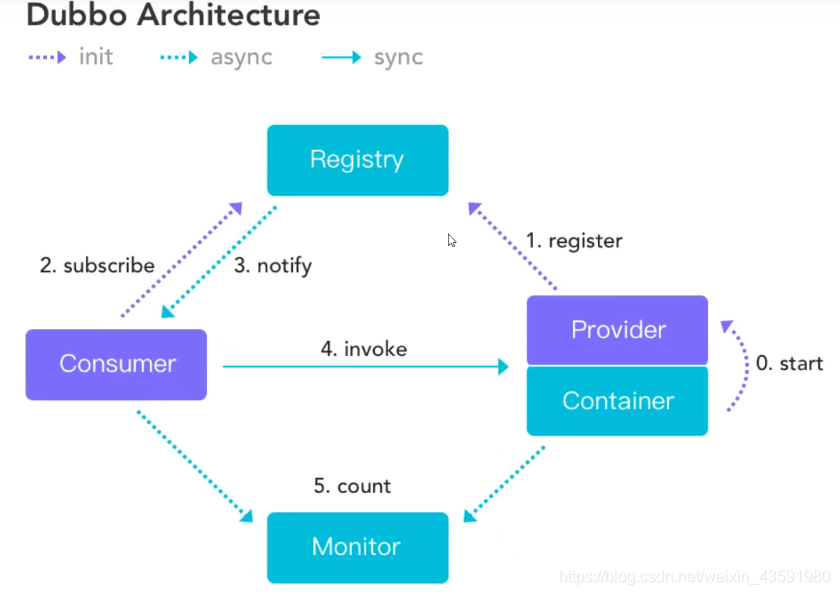

#### Eureka服务注册中心

- ##### 什么是Eureka
  - Netflix在涉及Eureka时，遵循的就是AP原则.
  - Eureka是Netflix的有个子模块，也是核心模块之一。Eureka是基于REST的服务，用于定位服务，以实现云端中间件层服务发现和故障转移，服务注册与发现对于微服务来说是非常重要的，有了服务注册与发现，只需要使用服务的标识符，就可以访问到服务，而不需要修改服务调用的配置文件了，功能类似于Dubbo的注册中心，比如Zookeeper.

#### 原理理解

- **Eureka基本的架构**
  - 之前写的代码是消费者服务直接请求生产者服务的数据，现在生产者将服务注册到注册中心，消费者去注册中心找服务，虽然还是消费者远程调用生产者，但是更好管理了，不用注册中心是不支持负载的
  - Springcloud 封装了Netflix公司开发的Eureka模块来实现服务注册与发现 (对比Zookeeper).
  - Eureka采用了C-S的架构设计，EurekaServer作为服务注册功能的服务器，他是服务注册中心.
  - 而系统中的其他微服务，使用Eureka的客户端连接到EurekaServer并维持心跳连接。这样系统的维护人员就可以通过EurekaServer来监控系统中各个微服务是否正常运行，Springcloud 的一些其他模块 (比如Zuul) 就可以通过EurekaServer来发现系统中的其他微服务，并执行相关的逻辑.


- 和Dubbo架构对比.

  

- Eureka 包含两个组件：**Eureka Server** 和 **Eureka Client**.

- Eureka Server 提供服务注册，各个节点启动后，回在EurekaServer中进行注册，这样Eureka Server中的服务注册表中将会储存所有课用服务节点的信息，服务节点的信息可以在界面中直观的看到.

- Eureka Client 是一个Java客户端，用于简化EurekaServer的交互，客户端同时也具备一个内置的，使用轮询负载算法的负载均衡器。在应用启动后，将会向EurekaServer发送心跳 (默认周期为30秒) 。如果Eureka Server在多个心跳周期内没有接收到某个节点的心跳，EurekaServer将会从服务注册表中把这个服务节点移除掉 (默认周期为90s).

- **三大角色**

  - Eureka Server：提供服务的注册与发现，类似于zookeeper的服务端
  - Service Provider：服务生产方，将自身服务注册到Eureka中，从而使服务消费方能狗找到
  - Service Consumer：服务消费方，从Eureka中获取注册服务列表，从而找到消费服务

#### 继续在之前SpringCloud项目下配置eureka

- 固定套路
  - 导入依赖
  - 编写配置文件
  - 开启这个服务 @EnableXXX
  - 配置类

- 创建Spring-cloud-eureka-7001模块，导入Pom文件

  ```xml
  <?xml version="1.0" encoding="UTF-8"?>
  <project xmlns="http://maven.apache.org/POM/4.0.0"
           xmlns:xsi="http://www.w3.org/2001/XMLSchema-instance"
           xsi:schemaLocation="http://maven.apache.org/POM/4.0.0 http://maven.apache.org/xsd/maven-4.0.0.xsd">
      <parent>
          <artifactId>springcloud</artifactId>
          <groupId>com.zi</groupId>
          <version>1.0-SNAPSHOT</version>
      </parent>
      <modelVersion>4.0.0</modelVersion>
  
      <artifactId>spring-cloud-eureka-7001</artifactId>
  
      <properties>
          <maven.compiler.source>8</maven.compiler.source>
          <maven.compiler.target>8</maven.compiler.target>
      </properties>
  
      <!--导包~-->
      <dependencies>
          <!-- https://mvnrepository.com/artifact/org.springframework.cloud/spring-cloud-starter-eureka-server -->
          <!--导入Eureka Server依赖-->
          <dependency>
              <groupId>org.springframework.cloud</groupId>
              <artifactId>spring-cloud-starter-eureka-server</artifactId>
              <version>1.4.6.RELEASE</version>
          </dependency>
          <!--热部署工具-->
          <dependency>
              <groupId>org.springframework.boot</groupId>
              <artifactId>spring-boot-devtools</artifactId>
          </dependency>
      </dependencies>
  
  </project>
  ```

- 配置application.yml

  ```yml
  server:
    port: 7001
  
  #Eureka配置
  eureka:
    instance:
      hostname: localhost #Eureka服务端的主机名称或IP
    client:
      register-with-eureka: false #表示eureka是否向eureka注册中心注册自己
      fetch-registry: false #如果为false，不获取注册中心，表示自己为注册中心
      service-url: #如果defaultZone不知道怎么配，那就Ctrl点击service-url，找到EurekaClientConfigBean构造方法
        defaultZone: http://${eureka.instance.hostname}:${server.port}/eureka/ #服务注册到哪里去
  
  ```

  

- 编写启动类，服务localhost:7001

  ```java
  package com.zi;
  
  import org.springframework.boot.SpringApplication;
  import org.springframework.boot.autoconfigure.SpringBootApplication;
  import org.springframework.cloud.netflix.eureka.server.EnableEurekaServer;
  
  @SpringBootApplication
  @EnableEurekaServer //表示它是服务端的启动类，可以接收别人注册进来
  public class EurekaServer_7001 {
      //开启之后访问http://localhost:7001/，跳转监控页面
      public static void main(String[] args) {
          SpringApplication.run(EurekaServer_7001.class,args);
      }
  }
  
  ```

- 

  - Instances currently registered with Eureka面板是已经注册的服务，application列是服务名称，是yml文件中的spring.application.name配置

#### 注册spring-cloud-provider-8001

- 回到spring-cloud-provider-8001模块，将生产者注册到Eureka注册中心

  - pom文件中加入eureka依赖

    ```xml
    <!--Eureka依赖-->
    <!-- https://mvnrepository.com/artifact/org.springframework.cloud/spring-cloud-starter-eureka -->
    <dependency>
        <groupId>org.springframework.cloud</groupId>
        <artifactId>spring-cloud-starter-eureka</artifactId>
        <version>1.4.6.RELEASE</version>
    </dependency>
    ```

  - 增加application.yml配置

    ```yml
    #Eureka配置
    eureka:
      client:
        service-url:
          defaultZone: http://localhost:7001/eureka/
      instance:
        instance-id: spring-cloud-dept-8001 #可以修改eureka监控中心Instances currently registered with Eureka面板的Status默认描述信息
    ```

  - 在启动类上加上@EnableEurekaClient注解，它会在服务启动后自动注册到eureka

  - 如果停止服务，eureka的注册信息不会直接消失，会有一段时间，过了这段时间之后监控页面会出现红色的错误信息EMERGENCY! EUREKA MAY BE INCORRECTLY CLAIMING INSTANCES ARE UP WHEN THEY'RE NOT. RENEWALS ARE LESSER THAN THRESHOLD AND HENCE THE INSTANCES ARE NOT BEING EXPIRED JUST TO BE SAFE.，不过这个错误好像不配置eureka.instanceinstance-id也会出现，这是eureka的保护机制

  - 监控页面点击描述信息会报404，因为该服务的模块没有导入驱动依赖

    ```xml
    <!--actuator完善监控信息-->
    <dependency>
        <groupId>org.springframework.boot</groupId>
    	<artifactId>spring-boot-starter-actuator</artifactId>
    </dependency>
    ```

  - 然后添加yml配置，这样再点击页面就有一个json字符串了，key是xxx，值是xxxx

    ```yml
    #info配置
    info:
      app.name: zi-spring-cloud
      xxx: xxxx
      xxx: xxxx
    ```

  - 注意：重启监控中心之后，也要重启服务重新注册

- #### Eureka自我保护机制

  - 一句话总结就是：**某时刻某一个微服务不可用，eureka不会立即清理，依旧会对该微服务的信息进行保存！**

    - 默认情况下，当eureka server在一定时间内没有收到实例的心跳，便会把该实例从注册表中删除（**默认是90秒**），但是，如果短时间内丢失大量的实例心跳，便会触发eureka server的自我保护机制，比如在开发测试时，需要频繁地重启微服务实例，但是我们很少会把eureka server一起重启（因为在开发过程中不会修改eureka注册中心），**当一分钟内收到的心跳数大量减少时，会触发该保护机制**。可以在eureka管理界面看到Renews threshold和Renews(last min)，当后者（最后一分钟收到的心跳数）小于前者（心跳阈值）的时候，触发保护机制，会出现红色的警告：`EMERGENCY!EUREKA MAY BE INCORRECTLY CLAIMING INSTANCES ARE UP WHEN THEY'RE NOT.RENEWALS ARE LESSER THAN THRESHOLD AND HENCE THE INSTANCES ARE NOT BEGING EXPIRED JUST TO BE SAFE.`从警告中可以看到，eureka认为虽然收不到实例的心跳，但它认为实例还是健康的，eureka会保护这些实例，不会把它们从注册表中删掉。
    - 该保护机制的目的是避免网络连接故障，在发生网络故障时，微服务和注册中心之间无法正常通信，但服务本身是健康的，不应该注销该服务，如果eureka因网络故障而把微服务误删了，那即使网络恢复了，该微服务也不会重新注册到eureka server了，因为只有在微服务启动的时候才会发起注册请求，后面只会发送心跳和服务列表请求，这样的话，该实例虽然是运行着，但永远不会被其它服务所感知。所以，eureka server在短时间内丢失过多的客户端心跳时，会进入自我保护模式，该模式下，eureka会保护注册表中的信息，不在注销任何微服务，当网络故障恢复后，eureka会自动退出保护模式。自我保护模式可以让集群更加健壮。
    - 但是我们在开发测试阶段，需要频繁地重启发布，如果触发了保护机制，则旧的服务实例没有被删除，这时请求有可能跑到旧的实例中，而该实例已经关闭了，这就导致请求错误，影响开发测试。所以，在开发测试阶段，我们可以把自我保护模式关闭，只需在eureka server配置文件中加上如下配置即可：`eureka.server.enable-self-preservation=false`【不推荐关闭自我保护机制】

    详细内容可以参考下这篇博客内容：https://blog.csdn.net/wudiyong22/article/details/80827594

- #### 注册进来的微服务，获取一些消息（团队开发会用到）

  - 生产者模块的yml中配置了info，在控制器中是可以拿到这些info的一些信息

    ```java
    /**
     * DiscoveryClient 可以用来获取一些配置的信息，得到具体的微服务！
     */
    @Autowired
    private DiscoveryClient client;
    /**
     * 获取一些注册进来的微服务的信息~，
     *
     * @return
     */
    @GetMapping("/dept/discovery")
    public Object discovery() {
        // 获取微服务列表的清单
        List<String> services = client.getServices();
        System.out.println("discovery=>services:" + services);
        // 得到一个具体的微服务信息,通过具体的微服务id，applicaioinName；
        List<ServiceInstance> instances = client.getInstances("SPRINGCLOUD-PROVIDER-DEPT");
        for (ServiceInstance instance : instances) {
            System.out.println(
                    instance.getHost() + "\t" + // 主机名称
                            instance.getPort() + "\t" + // 端口号
                            instance.getUri() + "\t" + // uri
                            instance.getServiceId() // 服务id
            );
        }
        return this.client;
    }
    ```

  - 主启动类中加入EnableDiscoveryClient注解

    ```java
    @SpringBootApplication
    // @EnableEurekaClient 开启Eureka客户端注解，在服务启动后自动向注册中心注册服务
    @EnableEurekaClient
    // @EnableDiscoveryClient 开启服务发现客户端的注解，可以用来获取一些配置的信息，得到具体的微服务，同时如果没有这个注解，其它服务将无法通过restTemplate访问该服务
    @EnableDiscoveryClient
    public class DeptProvider_8001 
    {
        ...
    }
    ```

  

## 新老版本

### Server端

以前的老版本 (1.X)

```xml
<dependency>
    <groupId>org.springframework.cloud</groupId>
    <artifactId>spring-cloud-starter-eureka</artifactId>
</dependency>
```

现在的新版本（2020.2） 博主用的boot 2.2.2 cloud H版

```xml
<dependency>
    <groupId>org.springframework.cloud</groupId>
    <artifactId>spring-cloud-starter-netflix-eureka-server</artifactId>
</dependency>
```

另外Eureka现已停更

### Client端

以前的老版本 (1.X)

```xml
<dependency>
    <groupId>org.springframework.cloud</groupId>
    <artifactId>spring-cloud-starter-eureka</artifactId>
</dependency>
```

新版本，maven下载不了依赖就看看Server端是什么版本，加上版本再reload

**`springboot 2.3.4.RELEASE`对应`springcloud Hoxton.SR8`对应`eureka-client2.2.5.RELEASE`**

```xml
<dependency>
    <groupId>org.springframework.cloud</groupId>
    <artifactId>spring-cloud-starter-netflix-eureka-client</artifactId>
</dependency>
```