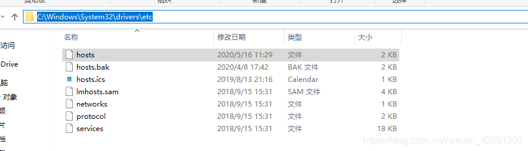

##### 新建springcloud-eureka-7002、springcloud-eureka-7003 模块

1. 为pom.xml添加依赖 (与springcloud-eureka-7001相同)
2. application.yml配置(与springcloud-eureka-7001相同)，改一下端口
3. 主启动类(与springcloud-eureka-7001相同)

##### 集群成员相互关联

1. 配置一些自定义本机名字，找到本机hosts文件并打开

2. 在hosts文件最后加上，要访问的本机名称，默认是localhost

3. 修改application.yml的配置，如图为springcloud-eureka-7001配置，springcloud-eureka-7002/springcloud-eureka-7003同样分别修改为其对应的名称即可，不改搭不了集群，因为**都是localhost会自动忽略**

4. 完整的springcloud-eureka-7001下的application.yml如下，同时在集群中使springcloud-eureka-7002关联springcloud-eureka-7001、springcloud-eureka-7003，就是把多个注册中心地址用逗号连接

   ```yml
   server:
     port: 7001
   #Eureka配置
   eureka:
     instance:
       hostname: eureka7001.com #Eureka服务端的实例名字
     client:
       register-with-eureka: false #表示是否向 Eureka 注册中心注册自己(这个模块本身是服务器,所以不需要)
       fetch-registry: false #fetch-registry如果为false,则表示自己为注册中心
       service-url: #监控页面~
         #重写Eureka的默认端口以及访问路径 --->http://localhost:7001/eureka/
         # 单机： defaultZone: http://${eureka.instance.hostname}:${server.port}/eureka/
         # 集群（关联）：7001关联7002、7003
         defaultZone: http://eureka7002.com:7002/eureka/,http://eureka7003.com:7003/eureka/
   ```

5. 完整的springcloud-eureka-7002下的application.yml如下

   ```yml
   server:
     port: 7002
   #Eureka配置
   eureka:
     instance:
       hostname: eureka7002.com #Eureka服务端的实例名字
     client:
       register-with-eureka: false #表示是否向 Eureka 注册中心注册自己(这个模块本身是服务器,所以不需要)
       fetch-registry: false #fetch-registry如果为false,则表示自己为注册中心
       service-url: #监控页面~
         #重写Eureka的默认端口以及访问路径 --->http://localhost:7001/eureka/
         # 单机： defaultZone: http://${eureka.instance.hostname}:${server.port}/eureka/
         # 集群（关联）：7002关联7001、7003
         defaultZone: http://eureka7001.com:7001/eureka/,http://eureka7003.com:7003/eureka/
   ```

6. 通过springcloud-provider-dept-8001下的yml配置文件，修改**Eureka配置：配置服务注册中心地址**

   ```yml
   # Eureka配置：配置服务注册中心地址
   eureka:
     client:
       service-url:
         # 注册中心地址7001-7003
         defaultZone: http://eureka7001.com:7001/eureka/,http://eureka7002.com:7002/eureka/,http://eureka7003.com:7003/eureka/
     instance:
       instance-id: springcloud-provider-dept-8001 #修改Eureka上的默认描述信息
   ```

7. DS Replicas面板会出现eureka7002、eureka7001两个链接，指向注册地址

8. 消费者不用改