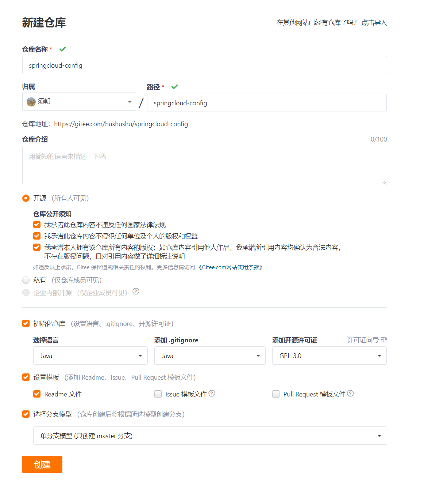

- **Dalston.RELEASE**

- **Spring Cloud Config为分布式系统中的外部配置提供服务器和客户端支持**。使用Config Server，您可以在所有环境中管理应用程序的外部属性。客户端和服务器上的概念映射与Spring `Environment`和`PropertySource`抽象相同，因此它们与Spring应用程序非常契合，但可以与任何以任何语言运行的应用程序一起使用。随着应用程序通过从开发人员到测试和生产的部署流程，您可以管理这些环境之间的配置，并确定应用程序具有迁移时需要运行的一切。服务器存储后端的默认实现使用git，因此它轻松支持标签版本的配置环境，以及可以访问用于管理内容的各种工具。很容易添加替代实现，并使用Spring配置将其插入。

  #### 概述

- **分布式系统面临的–配置文件问题**

- 微服务意味着要将单体应用中的业务拆分成一个个子服务，每个服务的粒度相对较小，因此系统中会出现大量的服务，由于每个服务都需要必要的配置信息才能运行，所以一套集中式的，动态的配置管理设施是必不可少的。spring cloud提供了configServer来解决这个问题，我们每一个微服务自己带着一个application.yml，那上百个的配置文件修改起来，令人头疼！

#### **什么是SpringCloud config分布式配置中心？**


- spring cloud config 为微服务架构中的微服务提供集中化的外部支持，配置服务器为各个不同微服务应用的所有环节提供了一个**中心化的外部配置**。
- spring cloud config 分为**服务端**和**客户端**两部分。
- 服务端也称为 **分布式配置中心**，它是一个独立的微服务应用，用来连接配置服务器并为客户端提供获取配置信息，加密，解密信息等访问接口。
- 客户端则是**通过指定的配置中心来管理应用资源，以及与业务相关的配置内容，并在启动的时候从配置中心获取和加载配置信息**。配置服务器默认采用git来存储配置信息，这样就有助于对环境配置进行版本管理。并且可用通过git客户端工具来方便的管理和访问配置内容。

#### **spring cloud config 分布式配置中心能干嘛？**

- 集中式管理配置文件
- 不同环境，不同配置，动态化的配置更新，分环境部署，比如 /dev /test /prod /beta /release
- 运行期间动态调整配置，不再需要在每个服务部署的机器上编写配置文件，服务会向配置中心统一拉取配置自己的信息
- 当配置发生变动时，服务不需要重启，即可感知到配置的变化（需要热部署插件），并应用新的配置
- 将配置信息以REST接口的形式暴露

#### **spring cloud config 分布式配置中心与GitHub整合**

- 由于spring cloud config 默认使用git来存储配置文件 (也有其他方式，比如自持SVN 和本地文件)，但是最推荐的还是git ，而且使用的是 http / https 访问的形式。

- 登录码云创建仓库

- 拉到码云页面最下方有很多超链接，点击Git大全，里面有一些简单的配置

- Git使用教学网站[使用Gitee - 廖雪峰的官方网站 (liaoxuefeng.com)](https://www.liaoxuefeng.com/wiki/896043488029600/1163625339727712)

- 打开本地Git仓库文件夹，右击选择Git Bash Here，输入以下命令

  ```shell
  #设置全局用户名
  $ git config --global user.name "zi"
  #设置全局用户邮箱
  $ git config --global user.email "2992833016@qq.com"
  #查看配置
  $ git config --list
  #生成SSH密钥，需要密钥和用户名及邮箱才能克隆，C:\Users\29928\.ssh文件夹会生成id_rsa和id_rsa.pub两个文件，known_hosts文件可以删掉
  $ ssh-keygen -t rsa -C "2992833016@qq.com"
  ```

- 复制id_rsa.pub文件中的公钥，打开码云的设置，在安全设置面板里面选择SSH公钥，在公钥文本域中粘贴确认。点击仓库的克隆/下载按钮，选择SSH，复制链接，git@gitee.com:hushushu/springcloud-config.git，然后克隆本地仓库

  - 好像使用HTTP更方便
  - http和ssh方式的不同点：
    - https是git clone到本地，进行文件修改，当再次提交到远程服务器，会进行账号与密码输入；
    - ssh git到本地后，首先需要进行账号密码的设置，当再次push到远程github上面的时候就不需要进行账号密码输入。
    - 关于SSH：clone的项目，本人必须是拥有者或管理者，且需要再clone前添加SSH Key。

  ```shell
  #将码云的仓库克隆到本地，输入yes
  $ git clone git@gitee.com:hushushu/springcloud-config.git
  ```

- 进入克隆好的本地文件夹springcloud-config，右键创建一个application.yml文件，spring.profile.active激活一个生产环境，**---分隔多个生产环境**，如果后来访问[localhost:3344/application-dev.yml](http://localhost:3344/application-dev.yml)报错Failed to load property source from location 'file:/C:/Users/xxx/AppData/Local/Temp/config-repo-xxx/application.yml'，看看yml格式或者字母有没有写错

  ```yml
  spring:
    profile:
      active: dev
  
  ---
  spring:
    profiles: dev
    application:
      name: springcloud-config-dev
  
  ---
  spring:
    profiles: test
    application:
      name: springcloud-config-test
  ```

- 将springcloud-config目录的修改提交到Git上

  ```shell
  #进入仓库目录
  $ cd springcloud-config/
  #将修改提交到本地Git上，远程仓库没有变化
  $ git add .
  #查看git状态，执行后会出现绿色字体new file:   application.yml
  $ git status
  #提交消息
  $ git commit -m "first commit"
  #push到远程仓库
  $ git push origin master
  ```

  

