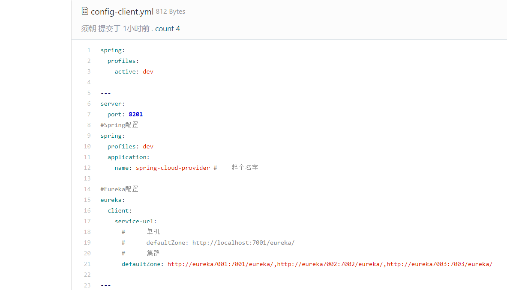
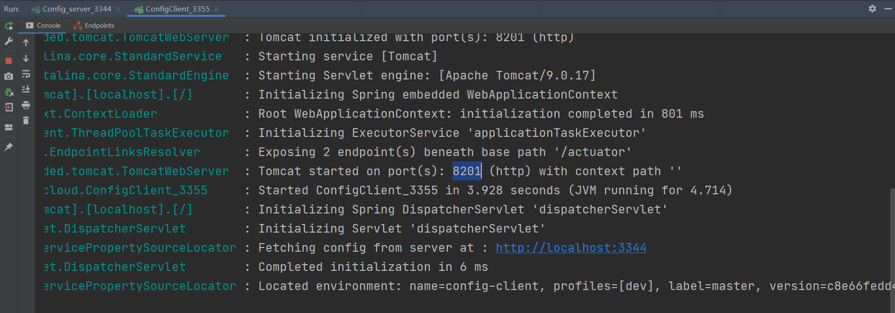

- 将本地git仓库springcloud-config文件夹下新建的config-client.yml提交到码云仓库：

  ```yml
  spring:
    profiles:
      active: dev
  
  ---
  server:
    port: 8201
  #Spring配置
  spring:
    profiles: dev
    application:
      name: spring-cloud-provider #    起个名字
  
  #Eureka配置
  eureka:
    client:
      service-url:
        #      单机
        #      defaultZone: http://localhost:7001/eureka/
        #      集群
        defaultZone: http://eureka7001:7001/eureka/,http://eureka7002:7002/eureka/,http://eureka7003:7003/eureka/
  
  ---
  
  server:
    port: 8202
  #Spring配置
  spring:
    profiles: test
    application:
      name: spring-cloud-provider #    起个名字
  
  #Eureka配置
  eureka:
    client:
      service-url:
        #      单机
        #      defaultZone: http://localhost:7001/eureka/
        #      集群
        defaultZone: http://eureka7001:7001/eureka/,http://eureka7002:7002/eureka/,http://eureka7003:7003/eureka/
  
  ```

- 开启springcloud-config-server-3344，访问http://localhost:3344/config-client-test.yml看看能不能拿到结果

- 新建一个springcloud-config-client-3355模块

  - 导入依赖

  ```xml
  <!--config-->
  <!-- https://mvnrepository.com/artifact/org.springframework.cloud/spring-cloud-start -->
  <dependency>
      <groupId>org.springframework.cloud</groupId>
      <artifactId>spring-cloud-starter-config</artifactId>
      <version>2.1.1.RELEASE</version>
  </dependency>
  <dependency>
      <groupId>org.springframework.boot</groupId>
      <artifactId>spring-boot-starter-actuator</artifactId>
  </dependency>
  <dependency>
      <groupId>org.springframework.boot</groupId>
      <artifactId>spring-boot-starter-web</artifactId>
  </dependency>
  ```

  - resources下创建application.yml和bootstrap.yml配置文件

    - **bootstrap.yml** 是系统级别的配置，因为系统优先级比用户高，为了防止用户级配置和远程冲突

    ```yml
    # 系统级别的配置
    spring:
      cloud:
        config:
          name: config-client # 需要从git上读取的资源名称，不要后缀
          profile: dev #yml中的哪个环境
          label: master #分支
          uri: http://localhost:3344 #config服务端模块的地址
    ```

    - **application.yml** 是用户级别的配置

    ```yml
    # 用户级别的配置
    spring:
      application:
        name: springcloud-config-client
    ```

  - 创建controller包下的**ConfigClientController.java** 用于测试

    ```java
    @RestController
    public class ConfigClientController {
        @Value("${spring.application.name}") //会自动寻找bootstrap.yml中配置的config-client中的spring.application.name，赋值给变量applicationName
        private String applicationName; //获取微服务名称
        @Value("${eureka.client.service-url.defaultZone}")
        private String eurekaServer; //获取Eureka服务
        @Value("${server.port}")
        private String port; //获取服务端的端口号
        @RequestMapping("/config")
        public String getConfig(){
            return "applicationName:"+applicationName +
             "eurekaServer:"+eurekaServer +
             "port:"+port;
        }
    }
    ```

  - 主启动类

    ```java
    @SpringBootApplication
    public class ConfigClient {
        public static void main(String[] args) {
            SpringApplication.run(ConfigClient.class,args);
        }
    }
    ```

  - 启动服务端Config_server_3344 再启动客户端ConfigClient，访问：http://localhost:8201/config/，yml文件中没有配置端口，为什么不访问8080呢，因为服务实际连接的是配置的远程资源中spring.profiles.active指定的生产环境的端口

    

  

- 客户端挂掉了，服务端依旧能够获取到远程资源的数据，但是启动时必须先启动服务端才能启动客户端