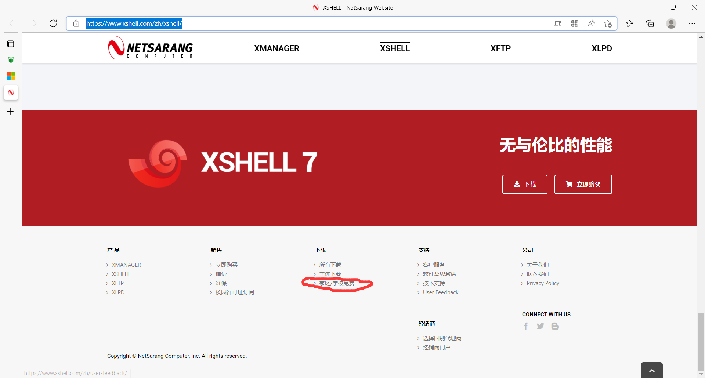
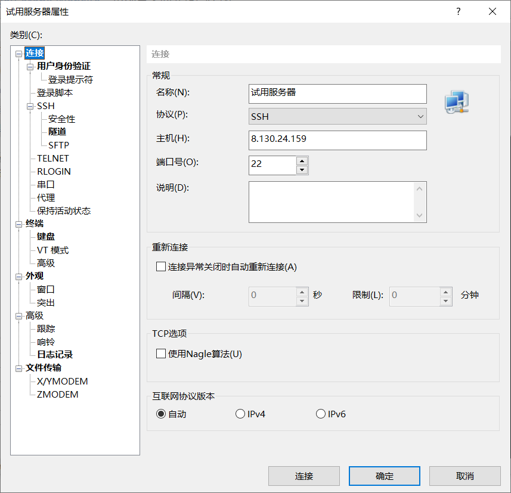
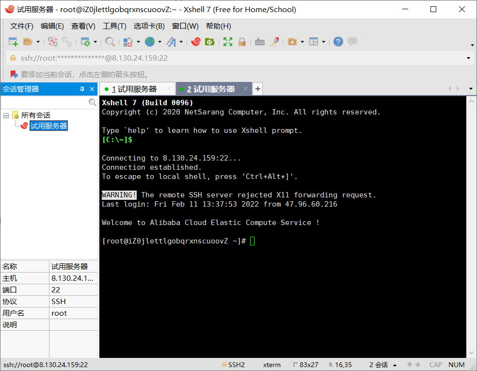
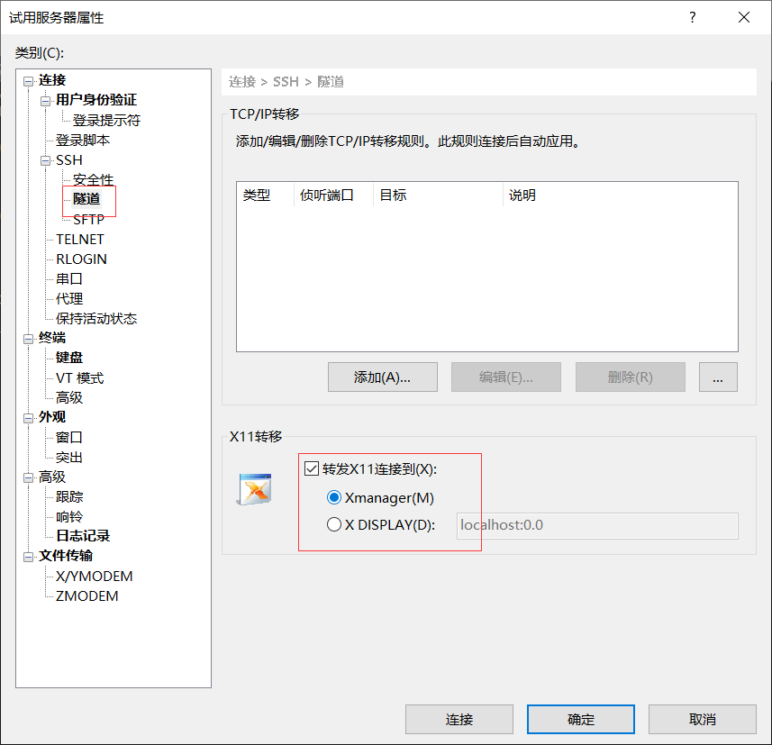

进入Xshell官网[XSHELL - NetSarang Website](https://www.xshell.com/zh/xshell/)，拉到最下面选择学生版

安装完XShell打开，主机为服务器公网IP，点击连接

- 解决警告：WARNING！The remote SSH server rejected X11 forwarding request.
  - 右击会话，选择属性，在隧道面板取消勾选

