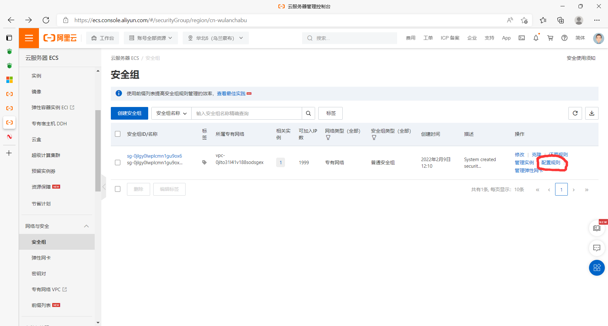
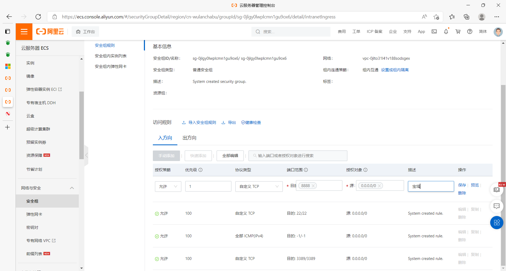
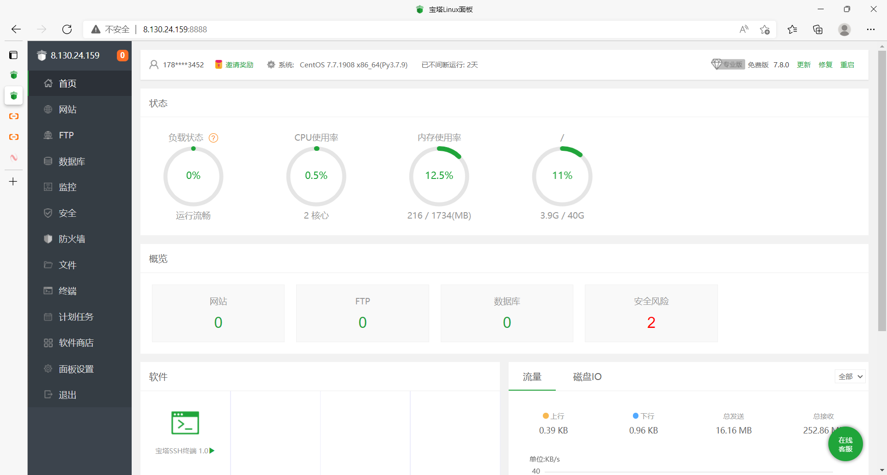
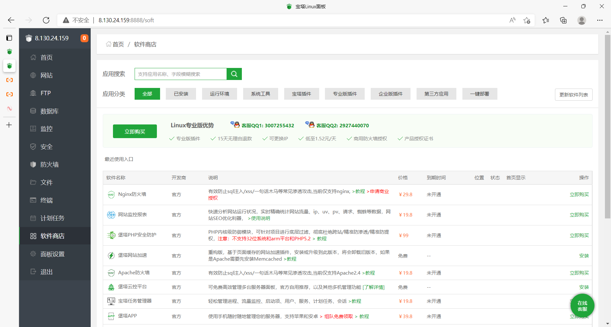
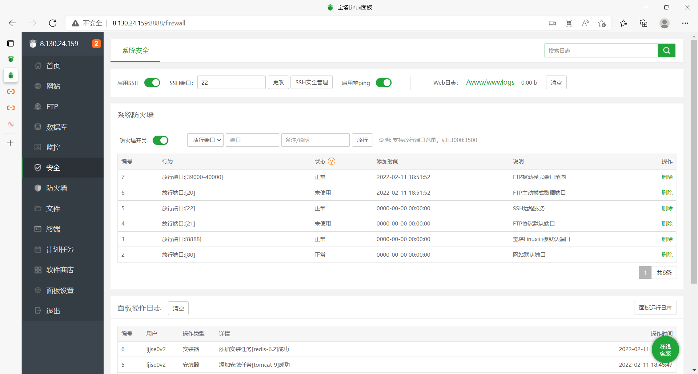

# 宝塔基本使用

宝塔面板安装教学：[宝塔Linux面板安装教程 - 2021年12月28日更新 - 7.8.0正式版 - Linux面板 - 宝塔面板论坛 (bt.cn)](https://www.bt.cn/bbs/thread-19376-1-1.html)

### 开放安全组

开放服务器的宝塔端口，在安全组里点击实例的配置规则

点击手动添加，然后添加开放端口

- 注意：
  如需完整使用宝塔的所有功能 你还需要放行如下端口
  20 、21、 39000-40000端口（linux 系统 ），3000-4000（windows系统）
  22 (SSH)
  80、443（网站及SSL）
  3306 （数据库远程连接）
  
  8080（tomcat）
  
  888 （phpmyadmin）
  
  8888 （宝塔页面）

- 开放39000-40000端口，要写成39000/40000
- **如果你进入面板里修改了面板端口或FTP端口，记得要在安全组和面板防火墙放行相应端口**

### 安装宝塔

宝塔安装命令（服务器中输入）

```shell
yum install -y wget && wget -O install.sh http://download.bt.cn/install/install_6.0.sh && sh install.sh 
```

安装要下载很多东西，提示确认时输入y，下载完会得到面板地址，访问外网面板地址，在面板设置面板可以修改宝塔端口、安全入口、面板用户、面板密码等等，用户名密码建议修改，常用用户名`178********`，密码`178********Hz*`

```shell
==================================================================
Congratulations! Installed successfully!
==================================================================
外网面板地址: http://8.130.24.159:8888/bbe6eef1
内网面板地址: http://172.16.216.152:8888/bbe6eef1
username: ljjse0v2
password: 6c6303bb
If you cannot access the panel,
release the following panel port [8888] in the security group
若无法访问面板，请检查防火墙/安全组是否有放行面板[8888]端口
==================================================================
```

### 访问宝塔页面



### 安装环境

在软件商店安装需要的环境

**宝塔安装的环境都在服务器的`/www/server/panel/vhost`目录中**

- nginx1.16、mysql5.7、apache2.4、tomcat9、redis6.2、pm2管理器5.2（node.js管理器，内置 node.js + npm + nvm + pm2），也可以点击应用分类的一键部署，里面有各种项目的环境

在安全面板启用禁ping（防止黑客发现服务器），其他电脑将不能使用ping Ip地址来Ping数据了，但不影响服务器使用

系统防火墙可以放行端口，但是放行的端口必须已经在阿里服务器的安全组开放，放行3306和8080，安装好tomcat环境且阿里云开放和宝塔放行8080后可以访问http://8.130.24.159:8080/看汤姆猫

放入网站进行访问

- tomcat的就直接放在webapps目录下
- 特殊的网站“开源项目，就按照自己的操作来

上传文件尽量使用XFTP

在文件面板，进入/www/server/tomcat/webapps/，创建test-hu目录，里面创建一个有web.xml的WEB-INF目录

和index.jsp，访问http://8.130.24.159:8080/test-hu/可以查看index.jsp页面，如果访问不到应该是防火墙问题

war包直接丢到tomcat，jar包直接用java -jar执行即可访问，springboot项目就是直接打成jar包


# 宝塔常用命令

Bt宝塔的面板很好用，但是我们不排除面板出现问题，不能登陆，这种情况我们就只能利用ssh登陆来输入命令解决很多的问题，大鸟这里收罗了一点常用命令，不过我看到他们官方也是有的。宵云这里也就是记录一下，方便自己平时查阅。

### 一：安装宝塔

宝塔Linux面板5.9（稳定版）安装命令：

Centos安装脚本

yum install -y wget && wget -O install.sh http://download.bt.cn/install/install_6.0.sh && sh install.sh 8c0882dde

Ubuntu/Deepin安装脚本

wget -O install.sh http://download.bt.cn/install/install-ubuntu_6.0.sh && sudo bash install.sh 8c0882dde

Debian安装脚本

wget -O install.sh http://download.bt.cn/install/install-ubuntu_6.0.sh && bash install.sh 8c0882dde

Fedora安装脚本

wget -O install.sh http://download.bt.cn/install/install_6.0.sh && bash install.sh 8c0882dde

### 二：管理宝塔面板

**停止面板**

- /etc/init.d/bt stop


**启动面板**

- /etc/init.d/bt start


**重启面板**

- /etc/init.d/bt restart


**卸载面板**

- /etc/init.d/bt stop && chkconfig --del bt && rm -f /etc/init.d/bt && rm -rf /www/server/panel

##### 查看面板的基本信息，包括访问地址

- bt default
- 注意：显示出来的用户名是正确的，但是密码密码修改过，显示的就不一定是对的

**查看当前面板端口**

- cat /www/server/panel/data/port.pl


**修改面板端口，如要改成8881（centos 7 系统）**

- echo '8881' > /www/server/panel/data/port.pl && /etc/init.d/bt restartfirewall-cmd --permanent --zone=public --add-port=8881/tcpfirewall-cmd --reload


**强制修改MySQL管理(root)密码，如要改成123456**

- cd /www/server/panel && python tools.pyc root 123456


**修改面板密码，如要改成123456**

- cd /www/server/panel && python tools.pyc panel 123456


**查看宝塔日志**

- cat /tmp/panelBoot.pl


**查看软件安装日志**

- cat /tmp/panelExec.log


**站点配置文件位置**

- /www/server/panel/vhost


**删除域名绑定面板**

- rm -f /www/server/panel/data/domain.conf


**清理登陆限制**

- rm -f /www/server/panel/data/*.login


**查看面板授权IP**

- cat /www/server/panel/data/limitip.conf


**关闭访问限制**

- rm -f /www/server/panel/data/limitip.conf


**查看许可域名**

- cat /www/server/panel/data/domain.conf

**关闭面板SSL**

- rm -f /www/server/panel/data/ssl.pl && /etc/init.d/bt restart


**查看面板错误日志**

- cat /tmp/panelBoot


**查看数据库错误日志**

- cat /www/server/data/*.err


**站点配置文件目录(nginx)**

- /www/server/panel/vhost/nginx


**站点配置文件目录(apache)**

- /www/server/panel/vhost/apache


**站点默认目录**

- /www/wwwroot


**数据库备份目录**

- /www/backup/database


**站点备份目录**

- /www/backup/site


**站点日志**

- /www/wwwlogs


### 三：Nginx服务管理

nginx安装目录

/www/server/nginx

启动

/etc/init.d/nginx start

停止

/etc/init.d/nginx stop

重启

/etc/init.d/nginx restart

启载

/etc/init.d/nginx reload

nginx配置文件

/www/server/nginx/conf/nginx.conf

### 四：Apache服务管理

apache安装目录

/www/server/httpd

启动

/etc/init.d/httpd start

停止

/etc/init.d/httpd stop

重启

/etc/init.d/httpd restart

启载

/etc/init.d/httpd reload

apache配置文件

/www/server/apache/conf/httpd.conf

### 五：MySQL服务管理

mysql安装目录

/www/server/mysql

phpmyadmin安装目录

/www/server/phpmyadmin

数据存储目录

/www/server/data

启动

/etc/init.d/mysqld start

停止

/etc/init.d/mysqld stop

重启

/etc/init.d/mysqld restart

启载

/etc/init.d/mysqld reload

mysql配置文件

/etc/my.cnf

### 六：FTP服务管理

ftp安装目录

/www/server/pure-ftpd

启动

/etc/init.d/pure-ftpd start

停止

/etc/init.d/pure-ftpd stop

重启

/etc/init.d/pure-ftpd restart

ftp配置文件

/www/server/pure-ftpd/etc/pure-ftpd.conf

### 七：PHP服务管理

php安装目录

/www/server/php

启动 (请根据安装PHP版本号做更改，例如：/etc/init.d/php-fpm-54 start)

/etc/init.d/php-fpm-{52|53|54|55|56|70|71|72} start

停止 (请根据安装PHP版本号做更改，例如：/etc/init.d/php-fpm-54 stop)

/etc/init.d/php-fpm-{52|53|54|55|56|70|71|72} stop

重启 (请根据安装PHP版本号做更改，例如：/etc/init.d/php-fpm-54 restart)

/etc/init.d/php-fpm-{52|53|54|55|56|70|71|72} restart

启载 (请根据安装PHP版本号做更改，例如：/etc/init.d/php-fpm-54 reload)

/etc/init.d/php-fpm-{52|53|54|55|56|70|71|72} reload

配置文件 (请根据安装PHP版本号做更改，例如：/www/server/php/52/etc/php.ini)

/www/server/php/{52|53|54|55|56|70|71|72}/etc/php.ini

### 八：Redis服务管理

redis安装目录

/www/server/redis

启动

/etc/init.d/redis start

停止

/etc/init.d/redis stop

redis配置文件

/www/server/redis/redis.conf

### 九：Memcached服务管理

memcached安装目录

/usr/local/memcached

启动

/etc/init.d/memcached start

停止

/etc/init.d/memcached stop

重启

/etc/init.d/memcached restart

启载

/etc/init.d/memcached reload

### 十：宝塔面板切换免费版/专业版

免费版升级专业版

wget -O update.sh http://download.bt.cn/install/update.sh && bash update.sh pro

专业版降级为免费版

wget -O update.sh http://download.bt.cn/install/update.sh && bash update.sh free

如果免费版专业版切换看的不是很明了，可以看看大鸟写过的教程：Linux-BT(宝塔面板)切换免费版/专业版教程

### 十一：Linux面板6.X安装命令

Centos安装命令：

yum install -y wget && wget -O install.sh http://download.bt.cn/install/install_6.0.sh && sh install.sh

Ubuntu/Deepin安装命令：

wget -O install.sh http://download.bt.cn/install/install-ubuntu_6.0.sh && sudo bash install.sh

Debian安装命令：

wget -O install.sh http://download.bt.cn/install/install-ubuntu_6.0.sh && bash install.sh

Fedora安装命令:

wget -O install.sh http://download.bt.cn/install/install_6.0.sh && bash install.sh

### 十二：5.x平滑升级到6.x命令

curl http://download.bt.cn/install/update_to_6.sh|bash

注意：

1、Centos6 请勿执行此升级命令，仅限于Centos7系统平滑升级

2、升级过程耗时较长且可能会受网络因素影响导致升级失败

3、如果升级后无法正常启动面板，请重新执行升级命令

4、升级有一定的风险，生产环境请谨慎升级

### 十三：宝塔面板卸载命令

wget http://download.bt.cn/install/bt-uninstall.shsh bt-uninstall.sh

卸载教程：宝塔面板(linux)卸载的一些方法的整理以及卸载之后一些文件的删除

### 十四：更新证书

"/root/.acme.sh"/acme.sh --cron --home "/root/.acme.sh"

强制更新所有let证书

"/root/.acme.sh"/acme.sh --cron --home "/root/.acme.sh" --force

十五：提示ip地址获取失败

面板绑定宝塔账号提示ip地址获取失败：

echo "125.88.182.170 www.bt.cn" >> /etc/hosts

### 十六：bt命令

宝塔面板新增快捷命令，SSH中输入 bt直接调出来15个小工具，其中包括重启面板、修改面板密码、修改MYSQL密码、取消绑定域名限制等。