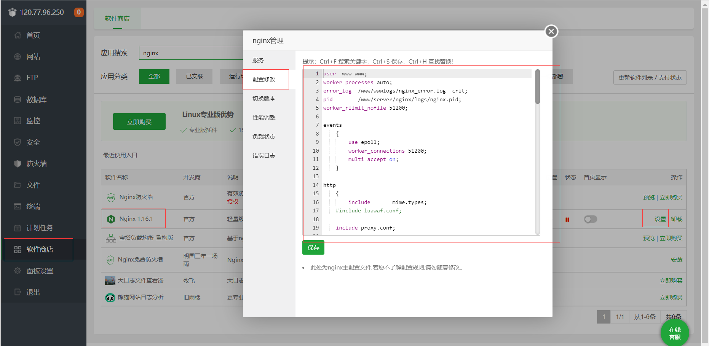

# 1、部署Tomcat项目

# 2、部署SpringBoot项目

## 1、使用Xftp将项目上传到服务器

## 2、打包成jar包（需要maven环境）

在项目目录下执行`mvn package`，将项目打包成jar包，同时他会下载pom文件的依赖，需要一段时间

打包完成后，在项目的target文件夹中会生成一个jar包，名字是项目名

因为target文件夹每次生成都会重置，把这个jar包拷贝出来备份防丢失

服务器没装maven环境在本地打包也可以

## 3、运行jar包

执行`nohup java -jar xxx.jar &`命令

`nohup `意思是不挂断运行命令，当账户退出或终端关闭时，程序仍然运行。

`&`意为后台运行

如果要看日志，比如配置了logback日志输出到sys-info.log，执行tail -f sys-info.log实时监测日志信息

## 4、如果要打包成war包

1、需要改配置，把pom.xml里的packaging标签的值改成war

2、把springboot自带的tomcat去除，使用默认的tomcat

```xml
<!-- 其中自带了tomcat -->
<!--<dependency>
	<groupId>org.springframework.boot</groupId>
	<artifactId>spring-boot-starter-web</artifactId>
</dependency>-->
<dependency>
    <groupId>org.springframework.boot</groupId>
    <artifactId>spring-boot-starter-tomcat</artifactId>
    <!-- provided：类似compile，期望JDK、容器或使用者会提供这个依赖，不使用默认的。 -->
    <!-- 编译测试的时候用，发布的时候剔除掉 -->
    <scope>provided</scope>
</dependency>
```

3、修改启动类，因为内部tomcat被剥离了

在启动类同级目录添加一个Java文件，名字随意

```java
public class SpringBootStarterApplication extends SpringBootServletInitializer {
    @Override
    protected SpringApplicationBuilder configure(SpringApplicationBuilder builder) {
        //指向启动类
        return builder.sources(启动类.class)
    }
}
```

4、同样将项目复制到服务器，然后指向mvn package命令打包，war包不能直接运行，需要放到tomcat的webapp目录中

5、如果SSM项目，可以配置启动方式为war，启动时会自动生成war包

## 5、启动war包

执行`service tomcat start`启动tomcat，tomcat会自动将webapps目录下的xxx.war包解压出一个xxx文件夹

访问`服务器IP:8080/xxx`就可以访问到服务了

如果启动报错java.util.zip.ZipException: zip END header not found就换一个tomcat版本，比如说`tomcat:8.5-jdk11-temurin-focal`

如果想要通过`服务器IP:8080`就能访问到该服务，需要修改tomcat的conf文件夹中的service.xml文件，找到Host标签，添加如下配置，然后重启tomcat

```xml
<!--这里是Host标签的子标签，添加一行配置-->
<!--同一端口部署多个应用则复制多个Context-->
<Context path="/" docBase="解压出的xxx文件夹的路径（可以用pwd命令查看）" reloadable="false"/> 
```


# 3、部署Vue项目

使用npm run build命令将vue项目打包成html项目，打包好的项目在dist目录中，也可以在服务器中打包，这里主要讲全部在服务器解决


## 1、使用Xftp将项目上传到服务器

## 2、安装依赖（需要Node.js环境）

在项目目录下执行`npm install --unsafe-perm --registry=https://registry.npm.taobao.org`

## 3、将vue项目打包成html

在项目目录下执行`npm run build build:prod`

vue项目打包完会生成一个dist目录，里面是打包好的html、css和js文件

prod：打的包为生产环境

## 4、修改nginx配置

**修改nginx.conf文件**

将第一行的`user xxx;`改成`user root;`，防止出现403权限问题

修改`localhost /部分`

```json
location / {
    root   dist目录的路径（可以用pwd命令查看）;
    index  index.html index.htm;
}

如果跳转路由404，就这么改
server {
    listen   80; # 监听的端口 
    server_name  xx.xx.xxx.xx; # 处理的host地址 （请替换成你对应的项目访问 ip 或 域名，可以说服务器IP）!!!
    root    dist目录的路径（可以用pwd命令查看）; # vue项目存在的目录（替换成你对应的地址，如果你这是用docker部署的请改成你容器内的地址）
    location / {
        try_files $uri $uri/ @router;#需要指向下面的@router否则会出现vue的路由在nginx中刷新出现404
        index  index.html index.htm;
	}
    #对应上面的@router，主要原因是路由的路径资源并不是一个真实的路径，所以无法找到具体的文件
    #因此需要rewrite到index.html中，然后交给路由在处理请求资源
    location @router {
        rewrite ^.*$ /index.html last;
    }
}
```

如果是宝塔安装的nginx，就在宝塔面板修改配置，把里面的换成默认的nginx.conf内容，再进行上面的修改




## 5、启动nginx

进入nginx目录的sbin目录，执行`./nginx`可执行文件

如果是宝塔面板安装的

6、访问前端页面

访问`服务器IP:server块中listen值`，跳转index.html

server块中listen值默认80，宝塔安装的默认888

## 6、如果访问后端404，可能是反向代理没有配置好

配置反向代理，在nginx.conf中配置反向代理，修改完nginx要reload一下

```json
# 写在个location / 同级
# 例如访问 http://192.168.1.101:8080/prod-api/xxx接口
location /prod-api/ {
    #代理头，如果不加这些，请求的时候header会丢失一些东西
    proxy_set_header Host $http_host;
    proxy_set_header X-Real-IP $remote_addr;
    proxy_set_header REMOTE-HOST $remote_addr;
    proxy_set_header X-Forwarded-For $proxy_add_x_forwarded_for;
    #代理地址
    proxy_pass http://192.168.1.101:8080/;
    #如果要负载均衡这里就要变
    #proxy_pass http://ruoyi/;
    
    #如果报cros错误，说CORS 请求未能成功未能成功，就如以下配置跨域
    add_header 'Access-Control-Allow-Origin' '*';
    add_header 'Access-Control-Allow-Origin' $http_origin;
    add_header 'Access-Control-Allow-Credentials' 'true';
    add_header 'Access-Control-Allow-Methods' 'GET, POST, OPTIONS';
    add_header 'Access-Control-Allow-Headers' 'DNT,web-token,app-token,Authorization,Accept,Origin,Keep-Alive,User-Agent,X-Mx-ReqToken,X-Data-Type,X-Auth-Token,X-Requested-With,If-Modified-Since,Cache-Control,Content-Type,Range';
    add_header 'Access-Control-Expose-Headers' 'Content-Length,Content-Range';
    if ($request_method = 'OPTIONS') {
        add_header 'Access-Control-Max-Age' 1728000;
        add_header 'Content-Type' 'text/plain; charset=utf-8';
        add_header 'Content-Length' 0;
        return 204;
    }
}

#如果要负载均衡
upstream ruoyi{
    server http://192.168.1.101:8080 weight=5;
    server http://192.168.1.102:8080 weight=3;
}
```

