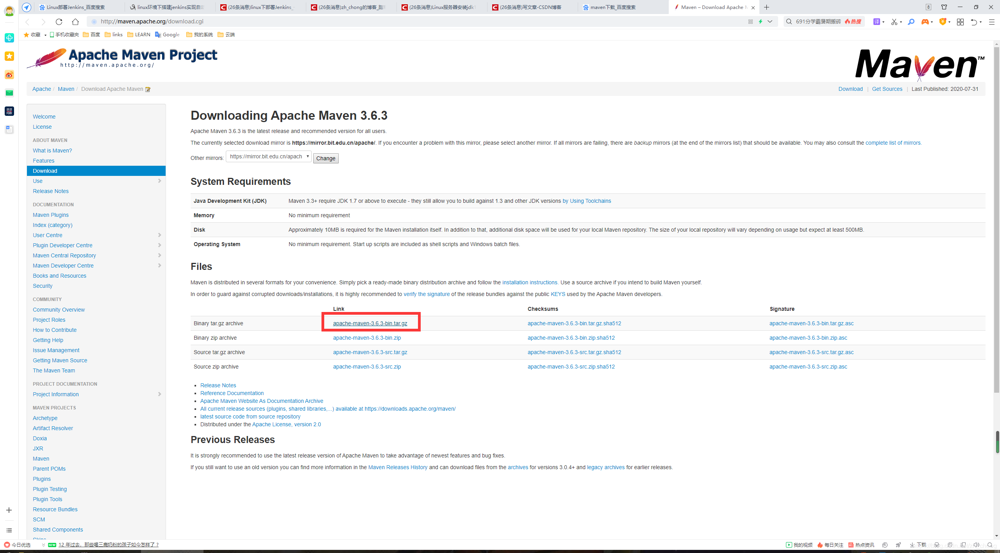
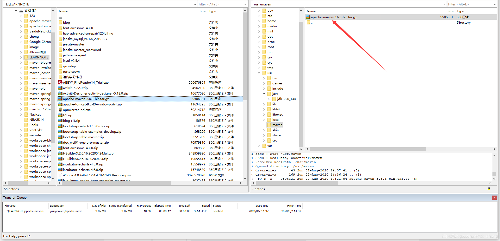
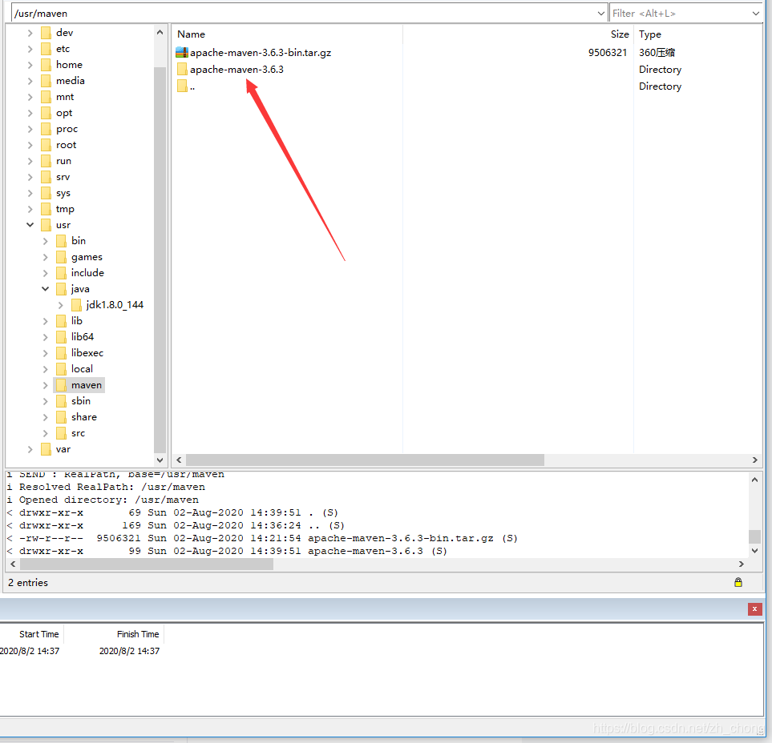
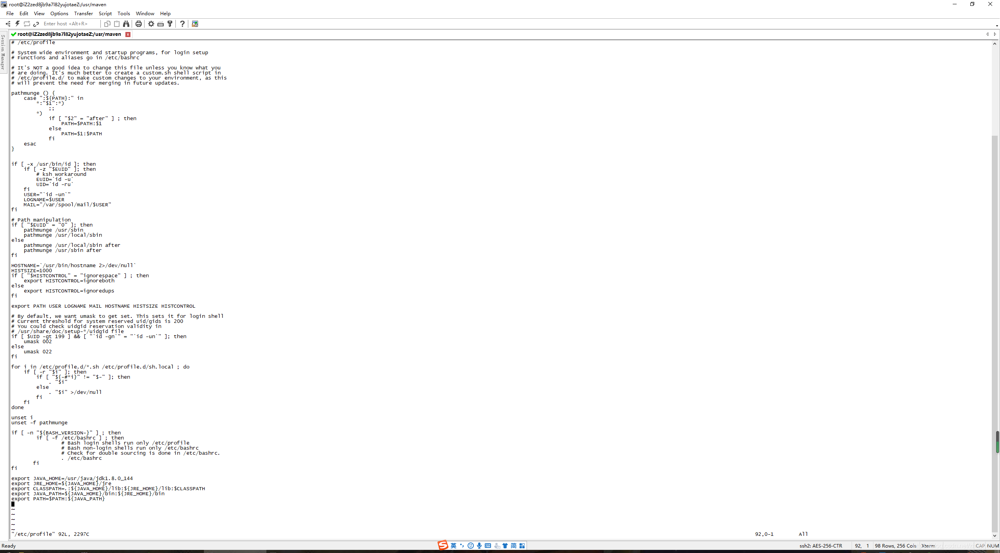

1，下载[maven](https://so.csdn.net/so/search?q=maven&spm=1001.2101.3001.7020)

http://maven.apache.org/download.cgi



2，将下载好的maven文件上传到Linux服务器，这里上传工具在《Linux服务器安装jdk1.8》一文中有介绍。

3，登录Linux服务器创建文件夹maven

```bash
mkdir /usr/maven
```

4，将下载的maven文件上传至Linux服务器刚创建的文件夹maven下面：



5，解压maven安装包

```bash
tar -zxvf apache-maven-3.6.3-bin.tar.gz
```

6，解压效果如下图：



7，配置maven环境变量，打开profile文件，命令如下：

```bash
vim /etc/profile
```

界面如下：



这个界面是不可以编辑的，需要进入编辑模式，按键i即可。

8，进入编辑模式后输入以下代码

```bash
export MAVEN_HOME=/usr/maven/apache-maven-3.6.3
export PATH=${PATH}:${MAVEN_HOME}/bin
```

9，按Esc键  输入:wq  保存并退出。

10，让配置文件生效

```bash
source /etc/profile
```

11，检查是否配置成功

```bash
mvn -version
```

12，安装完成以后可删除maven安装包，节省空间。

```python
rm apache-maven-3.6.3-bin.tar.gz -f
```