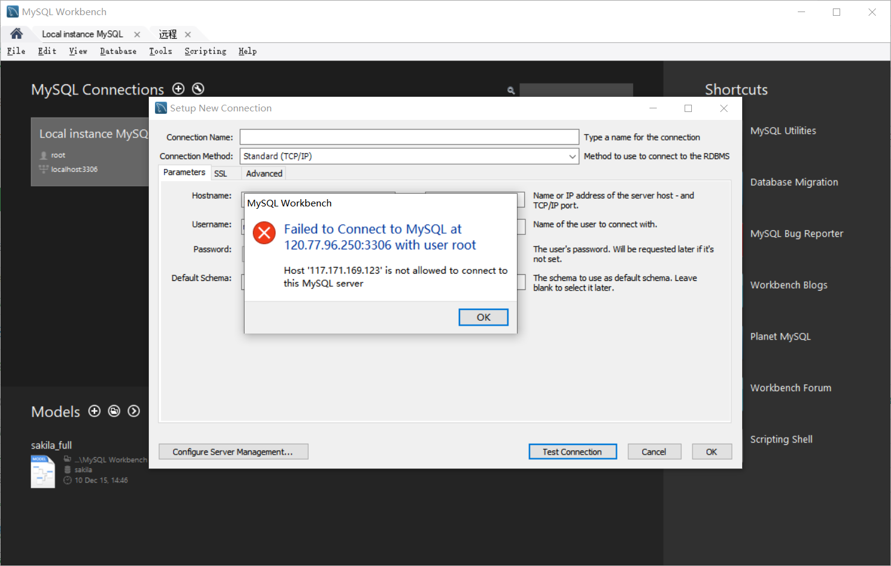
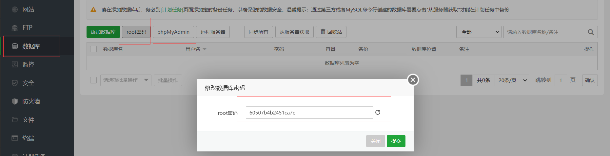
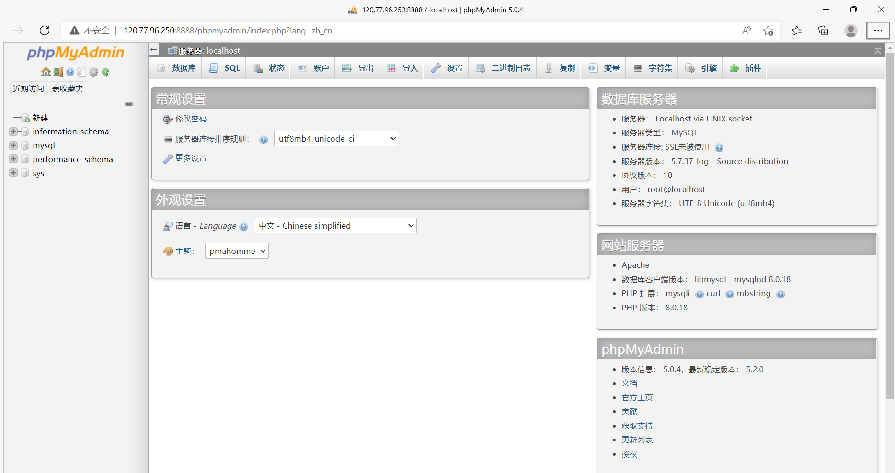
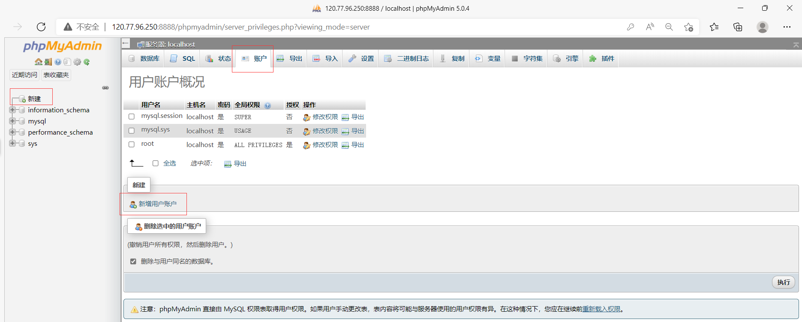
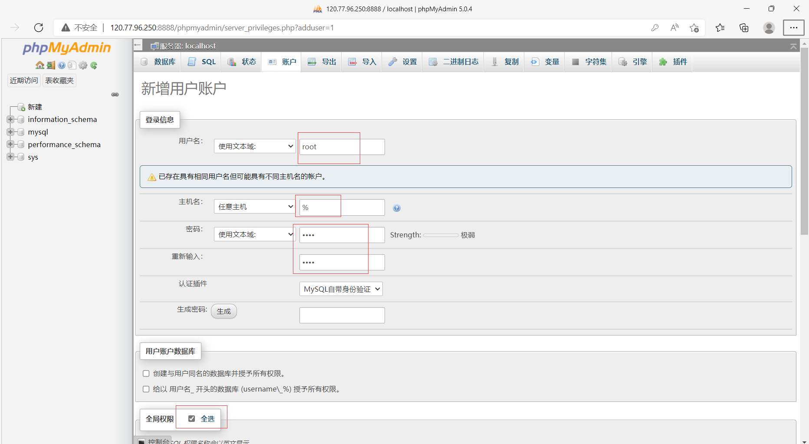
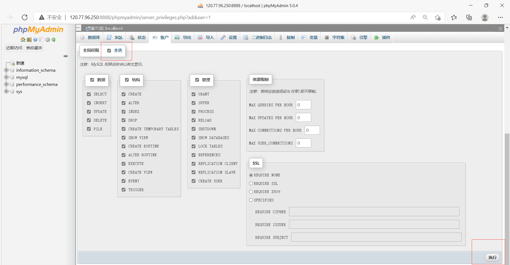
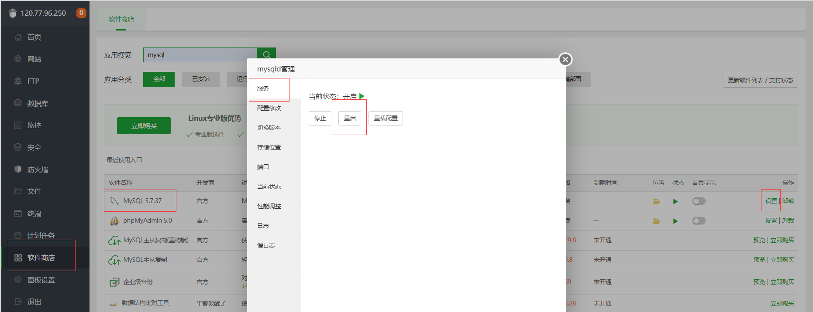
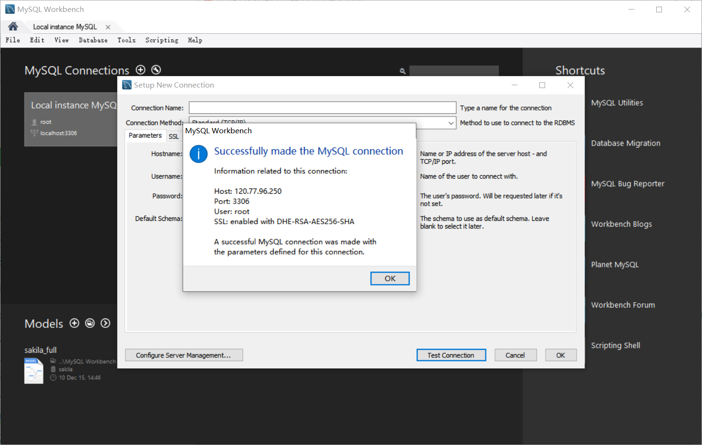
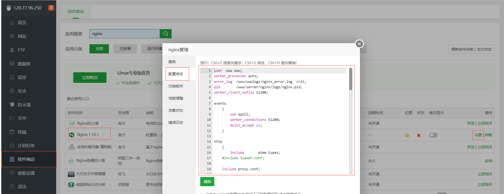

# 1、mysql远程连接不上

- 使用MySQL Workbench连接报错

- 宝塔安装**phpMyAdmin 5.0**和**php-8.0**（用来支持phpMyAdmin 5.0）

- 安装完成后，去数据库面板使用**phpMyAdmin**连接

- 先查看**root**用户的密码
- 再点击**phpMyAdmin**，通过**面板访问**，输入用户名**root**和**上一步中的密码**

- 进入之后的页面

- 添加任意主机可访问root

- 重启MySQL服务

- 使用MySQL Workbench连接

# 2、Nginx的安装目录没有nginx.conf

**Nginx的安装目录：/www/server/panel/vhost/nginx**

Nginx的安装目录没有`nginx.conf`，只有`phpfpm_status.conf`，通过配置`phpfpm_status.conf`也可以的

在宝塔界面配置