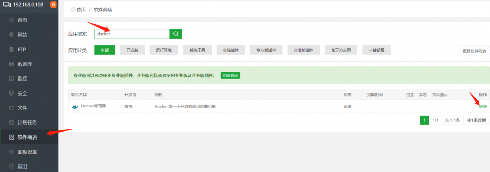
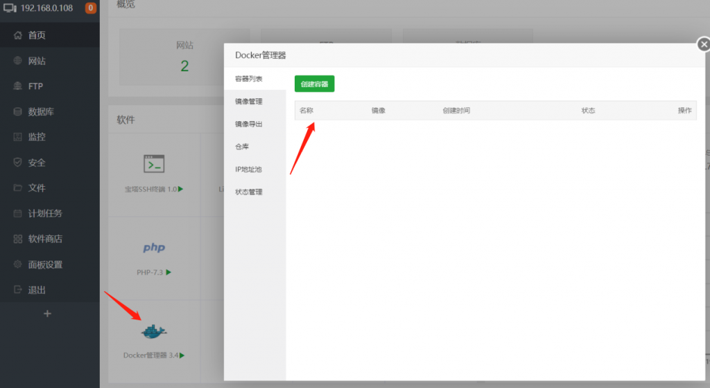
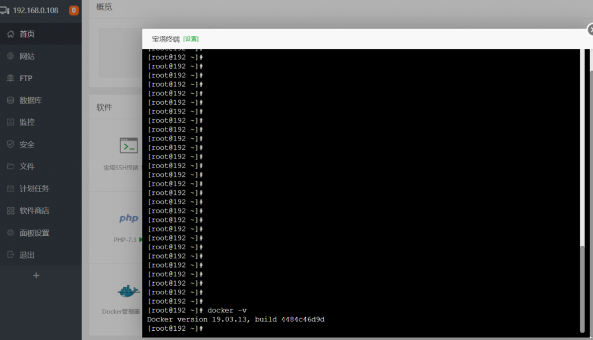
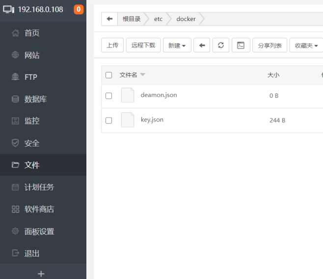
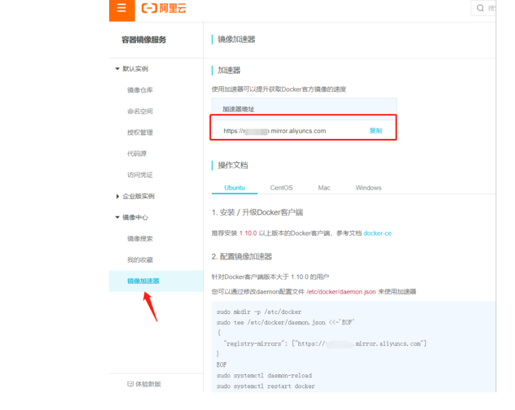
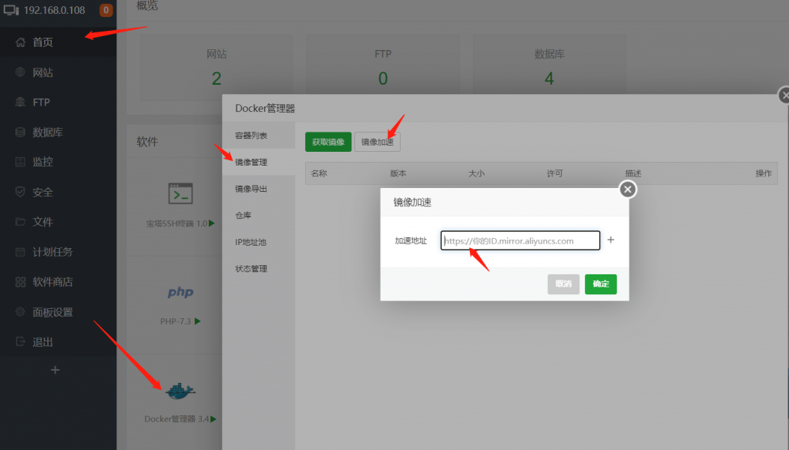

# 1、前言

docker是什么？

Docker 是世界领先的软件容器平台。
开发人员利用 Docker 可以消除协作编码时“在我的机器上可正常工作”的问题。
运维人员利用 Docker 可以在隔离容器中并行运行和管理应用，获得更好的计算密度。
企业利用 Docker 可以构建敏捷的软件交付管道，以更快的速度、更高的安全性和可靠的信誉为 Linux 和 Windows Server 应用发布新功能。

本文讲的是centos7.7 (安装宝塔面板)安装docker。

# 2、安装



在软件商搜索“docker”，然后点击右侧安装即可。安装完毕在主页显示,然后在命令行输入“docker -v”有版本信息表示安装成功。





# 3、配置源

docker是国外的产物，由于墙的原因，我们访问和下载镜像的时候比较慢，所以需要配置国内的镜像源。

一共有两种方式，第一种是设置json文件，另一种是在宝塔里设置，先说第一种。

我们打开 /etc/docker/deamon.json 如果没有docker文件夹，就自己新建一个。如果没有json文件，就自己新建一个。



将下面其中一个复制到json文件中

（1）docker中国官方加速

```json
{
  "registry-mirrors": ["https://registry.docker-cn.com"]
}
```

（2）网易163加速

```json
{
"registry-mirrors": ["http://hub-mirror.c.163.com"]
}
```

（3）中科大加速

```json
{
    "registry-mirrors": ["https://docker.mirrors.ustc.edu.cn"]     
}
```

当然，这些都没有在阿里云自己注册一个加速地址好，因为你可能大概率要用到阿里云的镜像仓库做存储，所以还是注册一个加速地址吧。

```json
https://www.aliyun.com/
```

登录阿里云，选择控制台，然后搜索“容器镜像服务”


点击“镜像加速器”，然后右侧就是你的加速器地址，这个是你的专属地址，可以把他复制到deamon.json文件中了。



然后输入指令重启docker即可。

```bash
sudo systemctl daemon-reload
sudo systemctl restart docker
```

第二种，直接在宝塔面板里面设置加速地址就OK了，当然也要reload和重启。



源配置错了或者没有成功，速度差别很大的，我第一种方法没有成功，第二种方法成功了，速度很快。