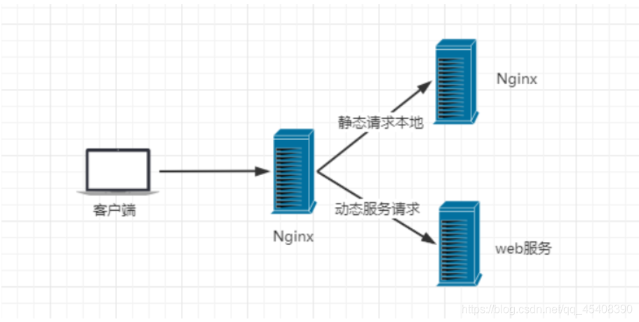

### Nginx产生的原因

- 一个公司的项目刚刚上线的时候，并发量小，用户使用的少，所以在低并发的情况下，一个jar包启动应用就够了，然后内部tomcat返回内容给用户![[(Nginx.assets/1628221226329.png)]](01.png)

- 
  慢慢的，使用平台的用户越来越多了，并发量慢慢增大了，这时候一台服务器满足不了我们的需求了![[(Nginx.assets/1628221258323.png)]](02.png)

- 
  于是我们横向扩展，又增加了服务器。这个时候几个项目启动在不同的服务器上，用户要访问，就需要增加一个代理服务器了，通过代理服务器来帮我们转发和处理请求，负载服务器应该有代理和负载均衡功能。![[(Nginx.assets/1628221284447.png)]](03.png)

- 我们希望这个代理服务器可以帮助我们接收用户的请求，然后将用户的请求按照规则帮我们转发到不同的服务器节点之上。这个过程用户是无感知的，用户并不知道是哪个服务器返回的结果，我们还希望他可以按照服务器的性能提供不同的权重选择。保证最佳体验！所以我们使用了Nginx，没有什么是再加一层解决不了的，如果有就再加一层。

### Nginx简介

- Nginx (engine x) 是一个高性能的HTTP和反向代理web服务器，同时也提供了IMAP/POP3/SMTP服务。Nginx是由伊戈尔·赛索耶夫为俄罗斯访问量第二的Rambler.ru站点（俄文：Рамблер）开发的，第一个公开版本0.1.0发布于2004年10月4日。2011年6月1日，nginx 1.0.4发布。
- 其特点是占有内存少，并发能力强，事实上nginx的并发能力在同类型的网页服务器中表现较好，中国大陆使用nginx网站用户有：百度、京东、新浪、网易、腾讯、淘宝等。在全球活跃的网站中有12.18%的使用比率，大约为2220万个网站。

- Nginx 是一个安装非常的简单、配置文件非常简洁（还能够支持perl语法）、Bug非常少的服务。Nginx 启动特别容易，并且几乎可以做到7*24不间断运行，即使运行数个月也不需要重新启动。你还能够不间断服务的情况下进行软件版本的升级。

- Nginx代码完全用C语言从头写成。官方数据测试表明能够支持高达 50,000 个并发连接数的响应，tomcat好像只有五六百。

### Nginx的作用

- **Http代理，反向代理：作为web服务器最常用的功能之一，尤其是反向代理。**
  - 正向代理：了解反向代理前先了解一下正向代理吧，正向代理是代理客户端的，比如说VPN，类似于一个跳板![[(Nginx.assets/1628221458725.png)]](04.png)
  - 反向代理 ：反向代理是代理服务器的，所以用户是无感知的，比如，百度的服务器是在不同的服务器上，我们只需要搜索baidu.com就可以访问其各台服务器。![[(Nginx.assets/1628221515354.png)]](05.png)

- **Nginx提供的负载均衡策略有2种：内置策略和扩展策略。内置策略为轮询，加权轮询，Ip hash。扩展策略，就像天马行空，只有你想不到的没有他做不到的。**
  - 轮询![[(Nginx.assets/1628221543126.png)]](06.png)
  - 加权轮询，因为可能不同服务器性能不一样，能接收的请求数量不同，权重越高能接受的请求就越多，权重1能接收的数量小于权重3的![[(Nginx.assets/1628221558749.png)]](07.png)
    - iphash对客户端请求的ip进行hash操作，然后根据hash结果将同一个客户端ip的请求分发给同一台服务器进行处理，也就是说一个IP只能固定访问一台服务器，可以解决session不共享的问题，但是性能不是太好，还是建议使用Redis去做session共享。![[(Nginx.assets/1628221600221.png)]](08.png)

- **动静分离**，在我们的软件开发中，有些请求是需要后台处理的，有些请求是不需要经过后台处理的（如：css、html、jpg、js等等文件），这些不需要经过后台处理的文件称为静态文件。让动态网站里的动态网页根据一定规则把不变的资源和经常变的资源区分开来，动静资源做好了拆分以后，我们就可以根据静态资源的特点将其做缓存操作。提高资源响应的速度。