## **下载Nginx**

http://nginx.org/en/download.html 下载Windows稳定版本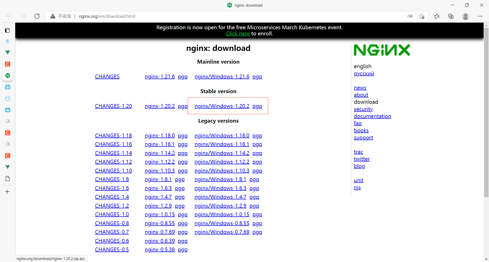

- 直接解压就可以了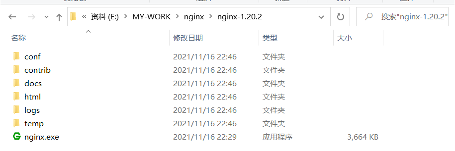
  - conf文件是我们常用的，里面有一个nginx.conf，listen设置80后所有访问80端口的服务都会被nginx拦截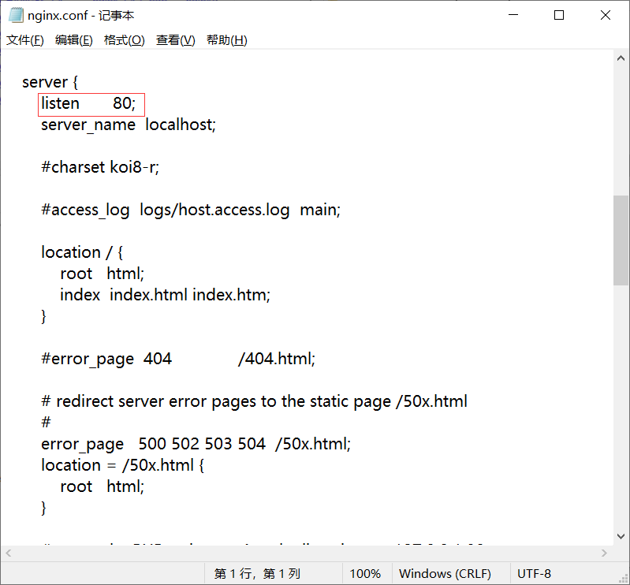

## **启动Nginx**(两种方法)

- 直接双击nginx.exe，双击后一个黑色的弹窗一闪而过，不建议用这个方法
- 打开cmd命令窗口，切换到nginx解压目录下，输入命令**nginx.exe**，回车即可，中文路径下会报错

- **检查Nginx是否启动成功**：直接在浏览器地址栏输入网址 [http://localhost:80](http://localhost/) 回车，出现以下页面说明启动成功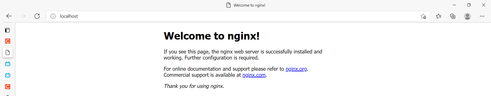

## **Linux安装**

1. 下载没有标明的Windows那个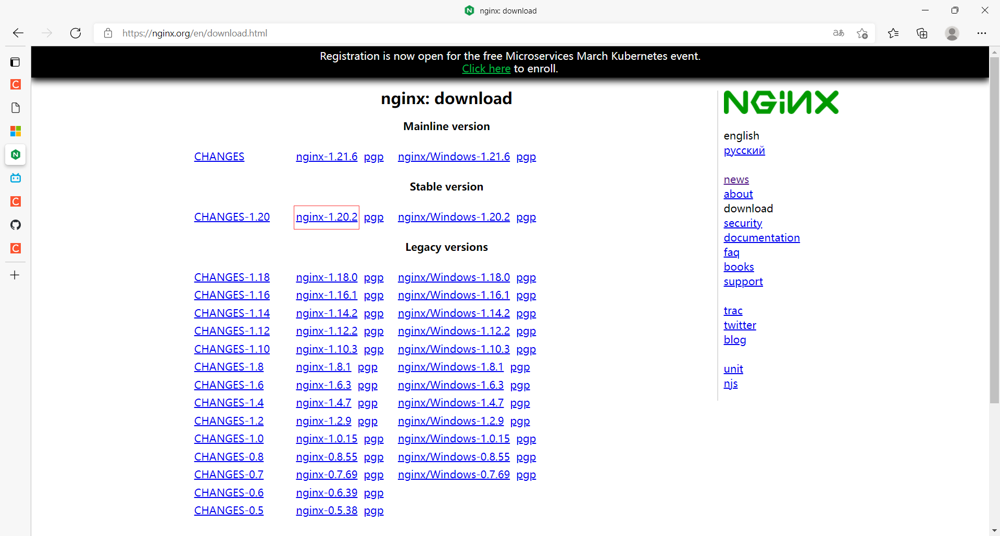

2. 输入**whereis nginx命令或者nginx命令**查看有没有安装nginx（whereis nginx应该显示没有啊，奇怪，这明明是新的服务器），有的话就卸载掉，下面一大堆是因为80端口被占用了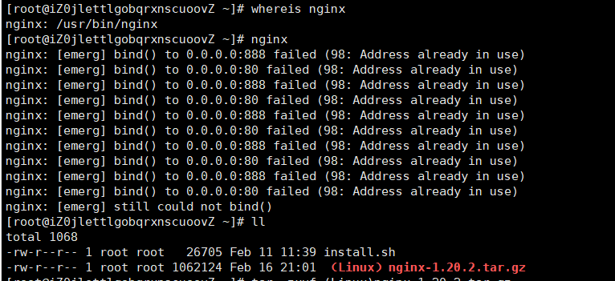

3. 将nginx转移到Linux，点击**绿色图标Xftp新建文件传输**，找到nginx压缩包双击移动到服务器，以下步骤没有卸载原有的nginx（不知道咋卸载）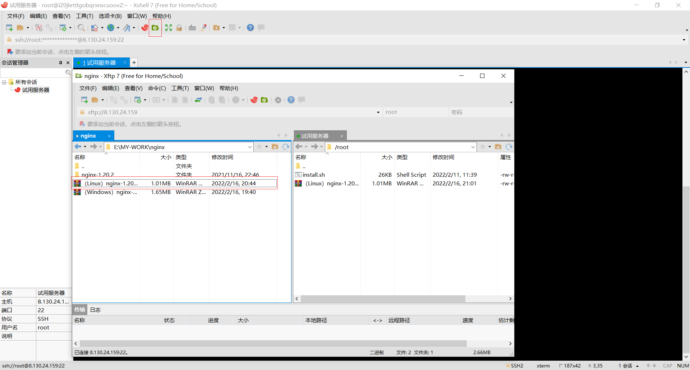

4. 使用**tar -zxvf (Linux)nginx-1.20.2.tar.gz**命令解压压缩包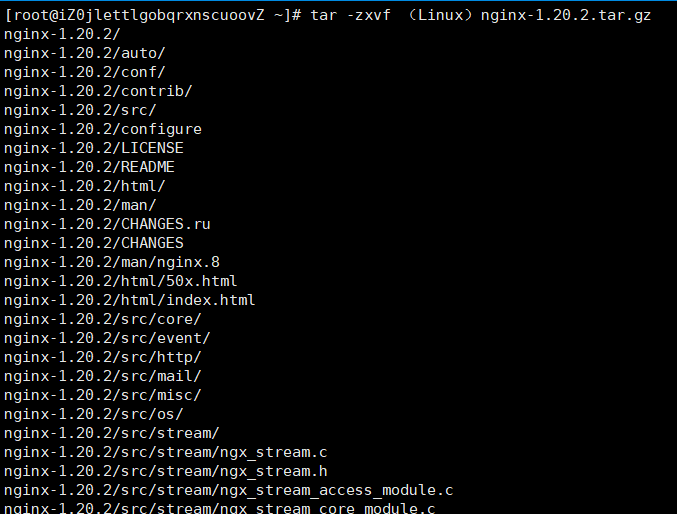

5. 使用**cd nginx-1.20.2**命令进入nginx解压目录，内容和Windows是一样的，里面有一个绿色的**configure**文件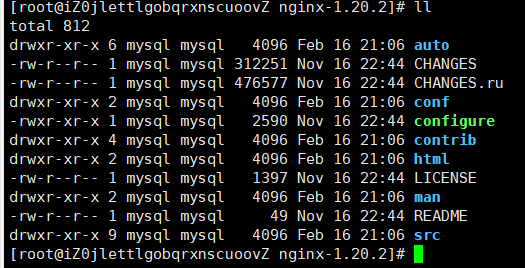

6. 使用**./configure**让Linux自动配置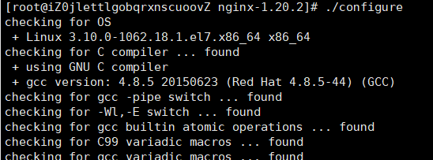

7. 最后执行**make和make install**完成安装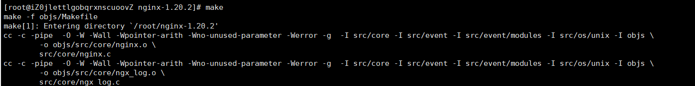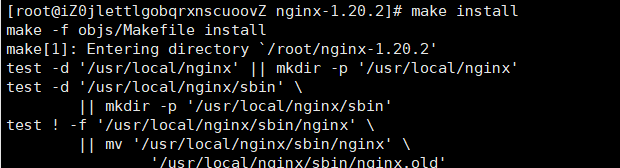

8. 用**whereis nginx**命令找到nginx目录，然后使用**cd /usr/local/nginx/**命令进入目录 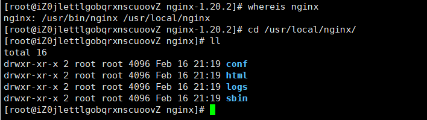

9. 在sbin目录中有一个绿色的nginx，使用**./nginx**命令直接执行这个文件开启nginx，教学里面直接执行是没有打印内容的，没有报错就代表成功了，这里是失败了

   1. 解决nginx: [emerg] bind() to 0.0.0.0:80 failed (98: Address already in use)，可能是80端口被占用了，使用**sudo fuser -k 80/tcp**命令关闭80端口，或者netstat -anp | grep 80，然后 kill -9 进程PID

  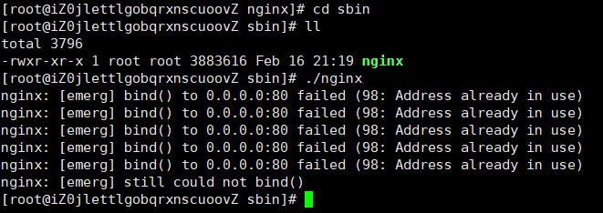

10. 成功解决端口占用问题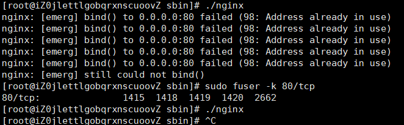

11. 进入nginx的conf目录，使用cat nginx.conf查看文件内容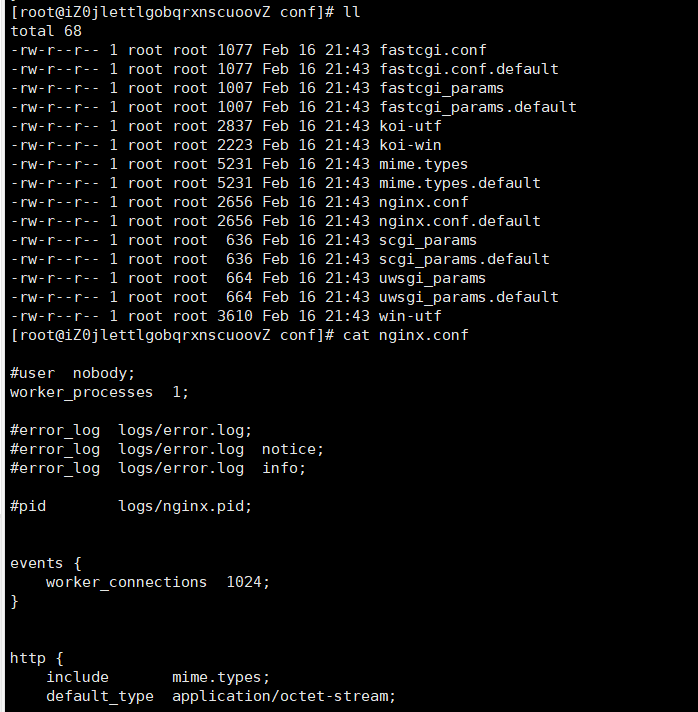

12. 访问该服务器的80端口，如果显示Welcome to nginx!则成功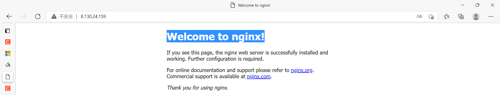