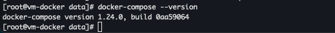
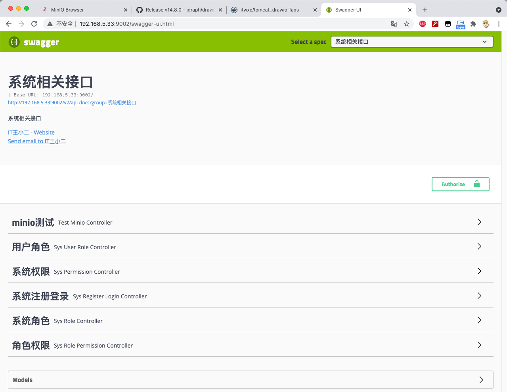

Docker 编排利器 DockerCompose，编排之后可以一次性通过一条命令启动一组服务。

例如一条命令启动 SpringBoot 项目，同时启动 SpringBoot 项目依赖的其他中间件（MySQL、Redis等）。

## 一、安装DockerCompose

1、下载 Docker Compose 。

```bash
curl -L https://get.daocloud.io/docker/compose/releases/download/1.24.0/docker-compose-`uname -s`-`uname -m` > /usr/local/bin/docker-compose
```

2、授予 `docker-compose` 文件可执行权限。

```bash
chmod +x /usr/local/bin/docker-compose
```

3、查看会否安装成功。

```bash
docker-compose --version
```



## 二、DockerCompose详解

### 1. 使用DockerCompose步骤

- 使用 `Dockerfile` 构建自定义镜像上传服务器，一般需要修改初始镜像行为时才需要使用。
- 使用 `docker-compose.yml` 文件定义需要部署的应用程序服务，这样它们可以在隔离环境中一起运行，以便执行脚本一次性部署。
- 最后执行 `docker-compose up` 命令来创建并启动所有服务。

### 2. docker-compose.yml常用命令

**version**

描述 Compose 文件的版本信息，各版本详细信息可以参考 [官方文档 (opens new window)](https://docs.docker.com/compose/compose-file/compose-versioning/)。

```yaml
# 指定 3 版本语法
version: '3'
```

**services**

services 节点下面的即是定义的各种服务，服务之下为容器，容器与容器直之间可以以服务名称为域名进行访问。

**image**

指定运行的镜像名称。

```yaml
# 指定镜像为 mysql5.7
image: mysql:5.7
```

**container_name**

指定容器名称。

```yaml
# 容器名称
container_name: admin_mysql
```

**ports**

指定宿主机和容器的端口映射。

```yaml
# 映射 mysql端口
ports:
  - 3306:3306
```

**volumes**

将宿主机的文件或目录挂载到容器中。

```yaml
# 挂载 mysql 目录到容器
volumes:
  - /itwxe/dockerData/mysql/data:/var/lib/mysql
  - /itwxe/dockerData/mysql/conf:/etc/mysql
  - /itwxe/dockerData/mysql/log:/var/log/mysql
```

**environment**

配置环境变量。

```yaml
# 设置 mysql 密码
environment:
  - MYSQL_ROOT_PASSWORD=root
```

**links**

连接其他容器的服务。

```yaml
# 可以 admin_mysql 为域名访问服务名称为 db 的容器
links:
  - db:admin_mysql
```

### 3. Docker Compose常用命令

**启动所有相关容器**

```bash
docker-compose up -d
```

**指定文件启动**

```bash
docker-compose -f docker-compose.yml up -d
```

**停止所有相关容器**

```bash
docker-compose stop
```

**列出所有容器信息**

```bash
docker-compose ps
```

**停止并删除所有容器(注意数据挂载)**

```bash
docker-compose down
```

## 三、SpringBoot示例

此处还是以自己写的项目为示例，我的项目依赖 MySQL、Redis、minio(非必要)。

1、打包 SpringBoot 项目镜像，打包可以参考 [Docker使用maven插件打包SpringBoot项目 (opens new window)](https://itwxe.com/posts/2e8bc142/)。

2、我的项目启动依赖 MySQL 中的 sunny 库，首先得创建容器，挂载宿主机目录，可以参考 [Docker搭建MySQL并挂载数据 (opens new window)](https://itwxe.com/posts/53489f6d/)。

3、项目依赖 Redis 镜像自定义配置启动，可以参考 [Docker搭建Redis5.0并挂载数据 (opens new window)](https://itwxe.com/posts/7fbf91c/)。

4、修改项目 MySQL 和 Redis 使用别名访问，以 MySQL 为例。

```yml
# 修改前
jdbc:mysql://192.168.5.33:3306/sunny?useUnicode=true&characterEncoding=utf8mb4&serverTimezone=GMT%2B8

# 修改后
jdbc:mysql://admin_mysql:3306/sunny?useUnicode=true&characterEncoding=utf8mb4&serverTimezone=GMT%2B8
```

5、编辑 docker-compose.yml 文件。

```yaml
version: '3'
services:
  # 指定MySQL服务名称
  mysql:
    # 指定服务使用的镜像
    image: mysql:5.7
    # 指定容器名称
    container_name: admin_mysql
    # 指定服务运行的端口
    ports:
      - 3306:3306
    # 指定容器中需要挂载的文件
    volumes:
      - /itwxe/dockerData/mysql/data:/var/lib/mysql
      - /itwxe/dockerData/mysql/conf:/etc/mysql
      - /itwxe/dockerData/mysql/log:/var/log/mysql
    # 指定容器的环境变量
    environment:
      - MYSQL_ROOT_PASSWORD=123456
  # 指定Redis服务名称
  redis:
    # 使用自定义镜像(指定配置文件)
    image: itwxe/redis:5.0.8
    container_name: admin_redis
    ports:
      - 6379:6379
    volumes:
      - /itwxe/dockerData/redis/data:/data
  # 指定项目服务名称
  sunny-admin:
    # 指定服务使用的镜像
    image: itwxe/sunny-admin:0.0.1
    # 指定容器名称
    container_name: sunny-admin
    # 指定服务运行的端口
    ports:
      - 9002:9002
    # 指定容器中需要挂载的文件
    volumes:
      - /itwxe/dockerData/sunny-admin/logs:/var/logs
    # 指定别名，项目yml中可以通过别名访问，例如：
    links:
      - mysql:admin_mysql
      - redis:admin_redis
```

6、进入 docker-compose.yml 文件目录，启动服务。

```bash
docker-compose up -d
```


可以看到服务都正常启动了，此时可以访问下项目，项目正常访问。




## 四、docker-compose.yml

### 简介

什么是YAML呢？

YAML全称YAML Ain't Markup Language表示“YAML不是一种标记语言”的缩写，为了强调YAML语言以数据作为中心，不是以标记语言为重点，使用返璞词重新命名。

YAML是一种直观的能够被电脑识别的数据序列化格式，是一个可读性高且容易被人类阅读，容易和脚本语言交互，用来表达资料序列的编程语言。

YAML是一种类似于标准通用标记语言的子集XML的数据描述语言，语法比XML更加容易简单。

什么是Docker Compose呢？

`docker-compose`是用来将Docker自动化的命令，有了`docker-compose`可将繁琐的Docker操作整合为一条命令，自动化的完成。

Docker Compose命令请参见 [《docker-compose命令》](https://www.jianshu.com/p/c51d92a9f91d)

什么是docker-compose.yml文件呢？

Docker Compose默认的模板文件是`docker-compose.yml`，其中定义的每个服务都必须通过`image`指令指定镜像或使用Dockerfile的`build`指令进行自动构建，其它大部分指令跟`docker run`中选项类似。

如果使用Dockerfile的`build`指令，则在Dockerfile中设置的选项如`CMD`、`EXPOSE`、`VOLUME`、`ENV`等将会自动被获取，无需在`docker-comopse.yml`文件中再次设置。

如果使用`image`指定为镜像名称或镜像ID时镜像在本地不存在，Compose将会尝试去拉取这个镜像。

典型的`docker-comopse.yml`文件格式

```shell
$ vim docker-compose.yml
```

```ruby
version: '2'
services:
  web:
    image: dockercloud/hello-world
    ports:
      - 8080
    networks:
      - front-tier
      - back-tier
 
  redis:
    image: redis
    links:
      - web
    networks:
      - back-tier
 
  lb:
    image: dockercloud/haproxy
    ports:
      - 80:80
    links:
      - web
    networks:
      - front-tier
      - back-tier
    volumes:
      - /var/run/docker.sock:/var/run/docker.sock 
 
networks:
  front-tier:
    driver: bridge
  back-tier:
driver: bridge
```

Compose文件是一个定义服务`services`、网络`networks`和卷`volumes`的YAML文件，默认路径是`./docker-compose.yml`，可使用`.yml`或`.yaml`作为文件扩展名。

服务`services`定义包含应用于为该服务启动的每个容器的配置，类似传递命令行参数一样`docker container create`。同样，网络`networks`和卷`volumes`的定义类似于`docker network create`和`docker volume create`。正如`docker container create`在`Dockerfile`指定选项，如`CMD`、`EXPOSE`、`VOLUME`、`ENV`，在默认情况下，不需要在`docker-compose.yml`配置中再次指定。可以使用Bash类`${VARIABLE}`语法在配置值中使用环境变量。

```dart
version: "3"
services:

  redis:
    image: redis:alpine
    ports:
      - "6379"
    networks:
      - frontend
    deploy:
      replicas: 2
      update_config:
        parallelism: 2
        delay: 10s
      restart_policy:
        condition: on-failure

  db:
    image: postgres:9.4
    volumes:
      - db-data:/var/lib/postgresql/data
    networks:
      - backend
    deploy:
      placement:
        constraints: [node.role == manager]

  vote:
    image: dockersamples/examplevotingapp_vote:before
    ports:
      - 5000:80
    networks:
      - frontend
    depends_on:
      - redis
    deploy:
      replicas: 2
      update_config:
        parallelism: 2
      restart_policy:
        condition: on-failure

  result:
    image: dockersamples/examplevotingapp_result:before
    ports:
      - 5001:80
    networks:
      - backend
    depends_on:
      - db
    deploy:
      replicas: 1
      update_config:
        parallelism: 2
        delay: 10s
      restart_policy:
        condition: on-failure

  worker:
    image: dockersamples/examplevotingapp_worker
    networks:
      - frontend
      - backend
    deploy:
      mode: replicated
      replicas: 1
      labels: [APP=VOTING]
      restart_policy:
        condition: on-failure
        delay: 10s
        max_attempts: 3
        window: 120s
      placement:
        constraints: [node.role == manager]

  visualizer:
    image: dockersamples/visualizer:stable
    ports:
      - "8080:8080"
    stop_grace_period: 1m30s
    volumes:
      - "/var/run/docker.sock:/var/run/docker.sock"
    deploy:
      placement:
        constraints: [node.role == manager]

networks:
  frontend:
  backend:

volumes:
  db-data:
```

docker-compose.yml指令有那些呢？

标准配置文件应该包含`version`、`services`、`networks`三部分，其中最关键的是`services`和`networks`两个部分。

### images

`images`用来指定服务的镜像名称或镜像ID，如果镜像在本地不存在，compose将会尝试去拉取这个镜像。

```css
services:
  web:
    image:redis
```

### volumes

`volumes`指令用于设置数据卷挂载路径，数据卷挂载路径可以是一个目录或一个已经存在的数据卷容器，可以设置宿主机路径`HOST:CONTAINER`或加上访问模式`HOST:CONTAINER:ro`。使用`ro`表示对于容器来说数据卷是只读的，这样可以有效地保护宿主机的文件系统。

```shell
volumes:
  # 指定一个容器内的路径，Docker会自动创建一个数据卷。
  - /var/lib/mysql
  # 使用绝对路径挂载数据卷
  - /opt/data:/var/lib/mysql
  # 以compose配置文件所在目录为根的相对路径作为数据卷挂载到容器
  - ./cache:/tmp/cache
  # 使用用户的相对路径
  - ~/configs:/etc/configs:ro
```

### networks

`networks`指令用于设置指定网络

```undefined
services:
  some-service:
    networks:
      - some-network
```

`networks`标签拥有一个特别的子标签`aliases`用于设置服务别名，相同的别名可以在不同的网络中拥有不同的别名。

```undefined
services:
  some-service:
    networks:
      some-network:
        aliases:
          - alias1
```