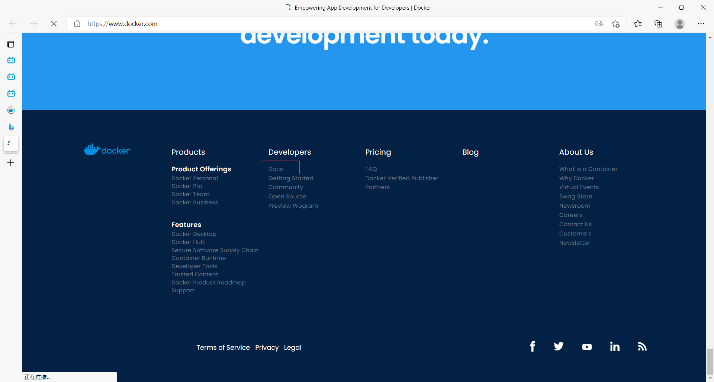
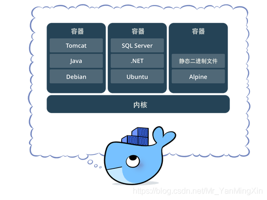

### 概述

- Docker官网：[Empowering App Development for Developers | Docker](https://www.docker.com/)
- Docker文档（很详细）：[Docker Documentation | Docker Documentation](https://docs.docker.com/)
- 仓库地址：[Docker Hub Container Image Library | App Containerization](https://hub.docker.com/)
- 一个项目的应用环境和应用配置是很麻烦的，我们项目打成jar包war包运行还需要大量的环境支持，而且Windows项目上线到Linux服务器环境配置不能跨平台，docker可以把项目所需要的环境一起打到包里
- 服务器就像一个仓库，docker就像一个个独立的集装箱装各种各样的东西，docker通过隔离机制可以将服务器空间利用到极致，不用担心集装箱里的东西相互影响，高内聚低耦合
- Docker容器技术是一种虚拟化技术，它只需要Linux内核（不是完整的操作系统）和一些开发环境（jdk、mysql...），十分轻巧（几MB，秒级启动），Linux虚拟机也属于虚拟化技术，但是很笨重（几个GB，几分钟启动），就像一台子电脑
- 容器化后开发、测试环境高度一致，就不会出现，”我的电脑上能用，你的怎么就不行了“的问题了
- Docker容器较为**官方的解释**
  - 一句话概括容器：**容器就是将软件打包成标准化单元，以用于开发、交付和部署。**
  - **容器镜像是轻量的、可执行的独立软件包** ，包含软件运行所需的所有内容：代码、运行时环境、系统工具、系统库和设置。
  - 容器化软件适用于基于 Linux 和 Windows 的应用，在任何环境中都能够始终如一地运行。
  - **容器赋予了软件独立性**，使其免受外在环境差异（例如，开发和预演环境的差异）的影响，从而有助于减少团队间在相同基础设施上运行不同软件时的冲突。

### 虚拟化技术和容器化技术

- **虚拟化技术**

  - 首先，Docker **容器虚拟化**技术为基础的软件，那么什么是虚拟化技术呢？

  - 简单点来说，虚拟化技术可以这样定义

  - > 虚拟化技术是一种资源管理技术，是将计算机的各种实体资源（CPU、内存、磁盘空间、网络适配器等），予以抽象、转换后呈现出来并可供分割、组合为一个或多个电脑配置环境。由此，打破实体结构间的不可切割的障碍，使用户可以比原本的配置更好的方式来应用这些电脑硬件资源。这些资源的新虚拟部分是不受现有资源的架设方式，地域或物理配置所限制。一般所指的虚拟化资源包括计算能力和数据存储。

- **Docker 基于 LXC 虚拟容器技术**

  - Docker 技术是基于 LXC（Linux container- Linux 容器）虚拟容器技术的。

  - > LXC，其名称来自 Linux 软件容器（Linux Containers）的缩写，一种操作系统层虚拟化（Operating system–level virtualization）技术，为 Linux 内核容器功能的一个用户空间接口。它将应用软件系统打包成一个软件容（Container），内含应用软件本身的代码，以及所需要的操作系统核心和库。通过统一的名字空间和共用 API 来分配不同软件容器的可用硬件件资源，创造出应用程序的独立沙箱运行环境，使得 Linux 用户可以容易的创建和管理系统或应用容器。

  - LXC 技术主要是借助 Linux 内核中提供的 CGroup 功能和 name space 来实现的，通过 LXC 可以为软件提供一个独立的操作系统运行环境。

  - **cgroup 和 namespace 介绍：**

    - **namespace 是 Linux 内核用来隔离内核资源的方式。** 通过 namespace 可以让一些进程只能看到与自己相关的一部分资源，而另外一些进程也只能看到与它们自己相关的资源，这两拨进程根本就感觉不到对方的存在。具体的实现方式是把一个或多个进程的相关资源指定在同一个 namespace 中。Linux namespaces 是对全局系统资源的一种封装隔离，使得处于不同 namespace 的进程拥有独立的全局系统资源，改变一个 namespace 中的系统资源只会影响当前 namespace 里的进程，对其他 namespace 中的进程没有影响。
    - **CGroup 是 Control Groups 的缩写，是 Linux 内核提供的一种可以限制、记录、隔离进程组 (process groups) 所使用的物力资源 (如 cpu memory i/o 等等) 的机制。**

  - **cgroup 和 namespace 两者对比：**

    - 两者都是将进程进行分组，但是两者的作用还是有本质区别。namespace 是为了隔离进程组之间的资源，而 cgroup 是为了对一组进程进行统一的资源监控和限制。

  

