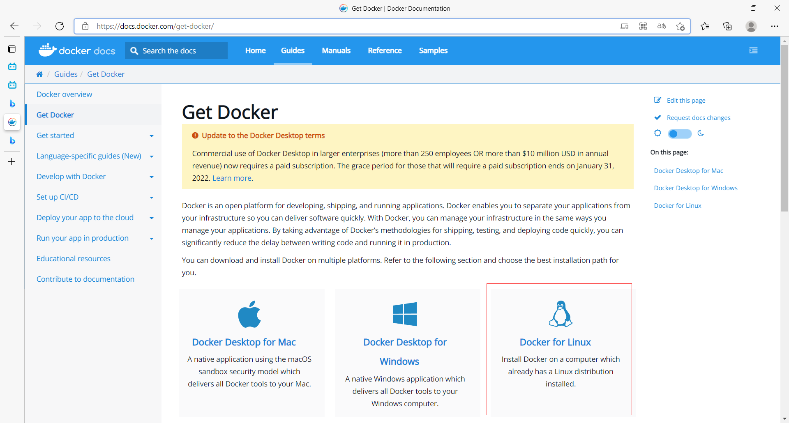

#### 环境准备

1. 需要一点点Linux基础
2. CentOS 7
3. 使用XShell连接远程服务器进行操作

#### 环境查看

- Xshell连接服务器

```shell
#系统内核是3.10以上
[root@iZ0jlettlgobqrxnscuoovZ ~]# uname -r
3.10.0-1062.18.1.el7.x86_64
```

```shell
#查看系统配置的所有信息
[root@iZ0jlettlgobqrxnscuoovZ ~]# cat /etc/os-release
NAME="CentOS Linux"
VERSION="7 (Core)"
ID="centos"
ID_LIKE="rhel fedora"
VERSION_ID="7"
PRETTY_NAME="CentOS Linux 7 (Core)"
ANSI_COLOR="0;31"
CPE_NAME="cpe:/o:centos:centos:7"
HOME_URL="https://www.centos.org/"
BUG_REPORT_URL="https://bugs.centos.org/"

CENTOS_MANTISBT_PROJECT="CentOS-7"
CENTOS_MANTISBT_PROJECT_VERSION="7"
REDHAT_SUPPORT_PRODUCT="centos"
REDHAT_SUPPORT_PRODUCT_VERSION="7"

```

#### 安装Docker

- 在Docker帮助文档选择Download And Install

- 选择Linux下安装

- 查看CentOS安装步骤

1. 安装步骤

   ```shell
   #1.卸载旧的版本
   yum remove docker \
                     docker-client \
                     docker-client-latest \
                     docker-common \
                     docker-latest \
                     docker-latest-logrotate \
                     docker-logrotate \
                     docker-engine
   
   #2.需要的安装包
   yum install -y yum-utils
   
   #3.设置镜像的仓库
   yum-config-manager \
       --add-repo \
       https://download.docker.com/linux/centos/docker-ce.repo #这是国外的，速度十分慢，建议安装阿里云的
    
   yum-config-manager \
       --add-repo \
       http://mirrors.aliyun.com/docker-ce/linux/centos/docker-ce.repo #推荐：阿里云镜像地址
    
    #4.更新软件包的索引
    yum makecache fast
    
    #5.安装最新的Docker相关依赖，询问Is this ok [y/d/N]，输入y，docker-ce是社区版（官方推荐），ee是企业版
    yum install docker-ce docker-ce-cli containerd.io
    
    #6.启动Docker，没打印报错内容就是成功了
    systemctl start docker
    
    #7.查看是否安装成功，打印了Docker信息就是成功了
    docker version
    
    #8.启动hello-world测试一下
    #提示Unable to find image 'hello-world:latest，locally没有镜像
    #提示latest: Pulling from library/hello-world，去远程下载拉取镜像
    #提示2db29710123e: Pull complete ，拉取成功
    #Hello from Docker!，运行成功
   docker run hello-world
   
   #9.查看一下下载的hello-world镜像
   docker images
   #示例
   [root@iZ0jlettlgobqrxnscuoovZ ~]# docker images
   REPOSITORY    TAG       IMAGE ID       CREATED        SIZE
   hello-world   latest    feb5d9fea6a5   4 months ago   13.3kB
   ```

2. 卸载Docker

   ```shell
   #1.移除安装的Docker依赖
   yum remove docker-ce docker-ce-cli containerd.io
   
   #2.删除Docker目录
   rm -rf /var/lib/docker
   rm -rf /var/lib/containerd
   ```

#### 配置阿里镜像加速

- 进入控制台

- 点击左上角列表

- 在产品与服务面板的弹性计算列中有**容器镜像服务**

- 镜像工具菜单中有一个**镜像加速器**，选择CentOS文档


- 配置使用，四个命令

  ```shell
  #创建文件夹
  sudo mkdir -p /etc/docker
  
  #创建一个daemon.json并写入数据
  sudo tee /etc/docker/daemon.json <<-'EOF'
  {
    "registry-mirrors": ["https://zw44ywmn.mirror.aliyuncs.com"]
  }
  EOF
  
  #加载配置文件
  sudo systemctl daemon-reload
  
  #重启docker
  sudo systemctl restart docker
  ```

  

