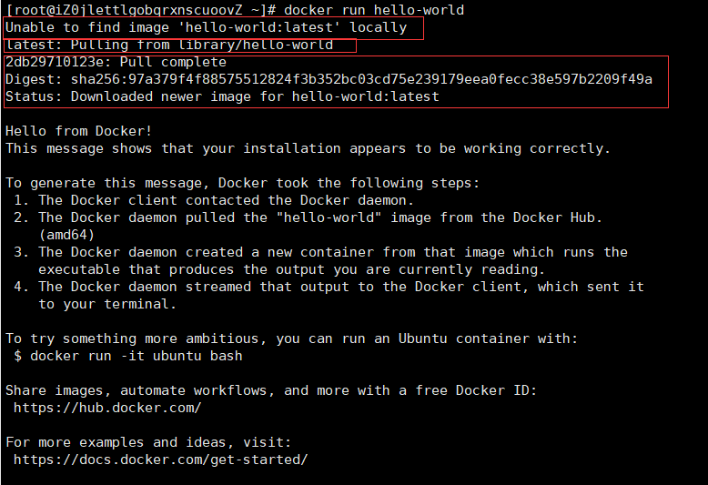
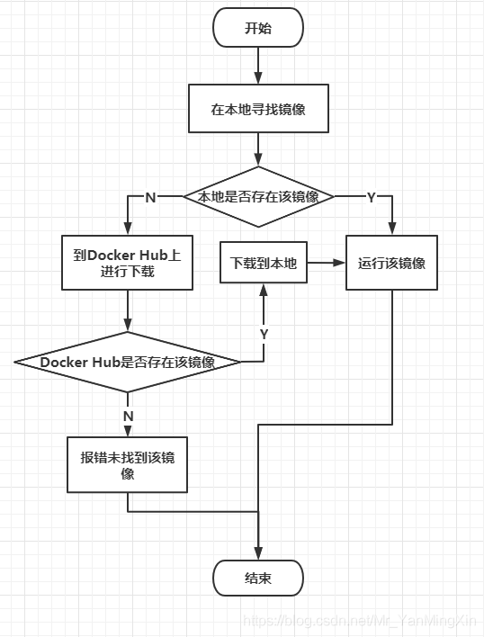
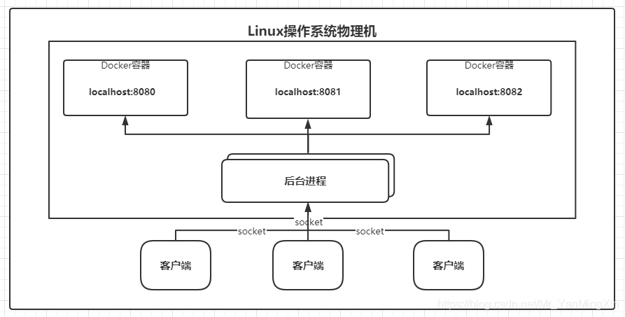
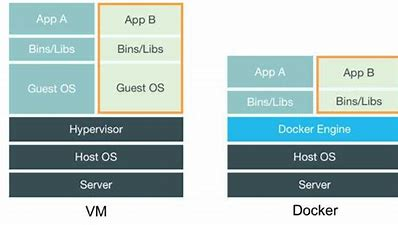
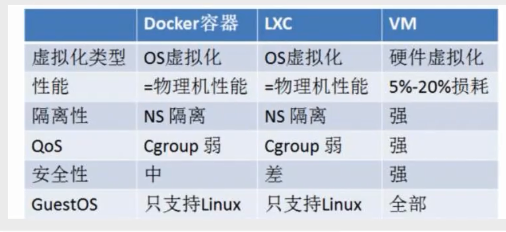

#### hello-world运行结果

#### Docker的Run的运行流程

#### Docker运行原理

- docker是怎么工作的？
- Docker是一个client-server结构的系统，Docker的守护进程（Docker Server）运行在主机上。通过socket从客户端访问。
- Docker Server接收到Docker Client的指令，就会执行这个命令

#### Docker整体架构

![[(Docker学习笔记.assets/image-20210803134704395.png)]](14.png)

#### Docker为什么比VM快

- Docker有着比虚拟机更少的抽象层
- Docker利用的是宿主机的内核，VM需要Guest OS
- 所以新建一个容器时，Docker不需要像虚拟机一样重新加载一个操作系统内核。虚拟机要加载Guest OS，是分钟级别的，而Docker利用宿主机的操作系统，省略了这个复杂的步骤，是秒级的。

- 这张图是Docker和虚拟机的对比，比较老的图了，现在Docker对于Guest OS也是全部支持了的

