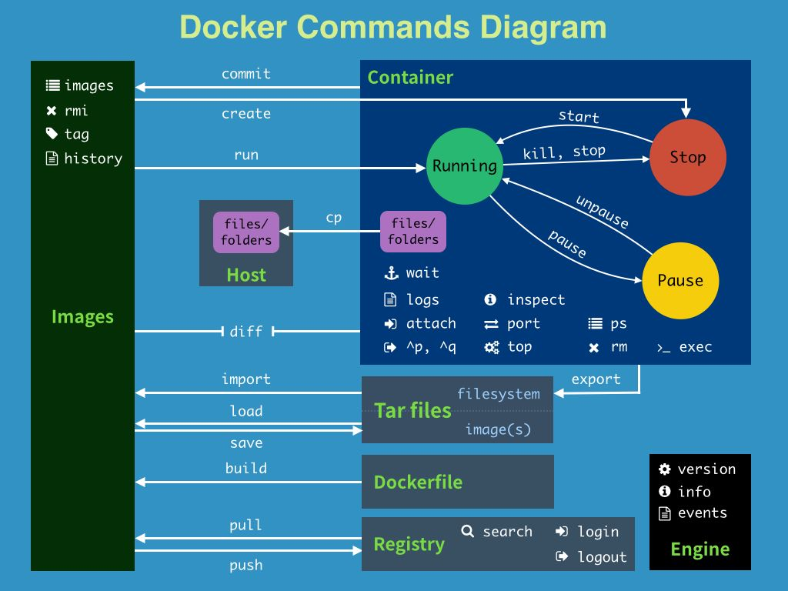

#### 基本命令

```shell
docker version          #查看docker的版本信息
docker info             #查看docker的系统信息,包括镜像和容器的数量
docker 命令 --help       #帮助命令(可查看可选的参数)
docker COMMAND --help
```

**帮助文档：[Reference documentation | Docker Documentation](https://docs.docker.com/reference/)**

- 左侧导航栏中Command-line reference是命令行命令

#### 镜像命令

##### **docker images**

查看本地主机的所有镜像

- docker images --help：查看命令用法，或者去帮助文档查看

- 扩展

  ```shell
  [root@iZ0jlettlgobqrxnscuoovZ ~]# docker images
  REPOSITORY    TAG       IMAGE ID       CREATED        SIZE
  hello-world   latest    feb5d9fea6a5   4 months ago   13.3kB
  
  #解释
  REPOSITORY 镜像的仓库源
  TAG        镜像的标签
  IMAGE ID   镜像的ID
  CREATED    镜像的创建时间
  SIZE       镜像的大小
  指向一个镜像一般通过其仓库源或者ID
  
  #可选项
    -a, --all             列出所有的镜像
    -q, --quiet           只显示镜像的id
  
  ```

##### **docker search xxx**

搜索镜像，xxx是镜像名称

```shell
[root@iZ0jlettlgobqrxnscuoovZ ~]# docker search mysql
NAME                             DESCRIPTION                                     STARS     OFFICIAL   AUTOMATED
mysql/mysql-server               Optimized MySQL Server Docker images. Create…   905                  [OK]
centos/mysql-57-centos7          MySQL 5.7 SQL database server                   92                   

#可选项
  --filter=STARS=3000 搜出的镜像结果收藏数将不小于3000
      --format string   Pretty-print search using a Go template
      --limit int       Max number of search results (default 25)
      --no-trunc        Don't truncate output
```

- docker search --help
- 也可以在DockerHub官网上直接搜，搜到了点进去还能看支持的版本，带alpine的是瘦身版，非常的小

##### **docker pull xxx**

下载镜像，xxx是镜像名称

```shell
#docker pull 镜像名[:tag] 指定版本
[root@iZ0jlettlgobqrxnscuoovZ ~]# docker pull mysql
Using default tag: latest #latest意为最新版，如果命令中不写tag默认最新
latest: Pulling from library/mysql
72a69066d2fe: Pull complete #分层下载，docker image的核心，联合文件系统
93619dbc5b36: Pull complete 
99da31dd6142: Pull complete 
626033c43d70: Pull complete 
37d5d7efb64e: Pull complete 
ac563158d721: Pull complete 
d2ba16033dad: Pull complete 
688ba7d5c01a: Pull complete 
00e060b6d11d: Pull complete 
1c04857f594f: Pull complete 
4d7cfa90e6ea: Pull complete 
e0431212d27d: Pull complete 
Digest: sha256:e9027fe4d91c0153429607251656806cc784e914937271037f7738bd5b8e7709 #签名，防伪
Status: Downloaded newer image for mysql:latest
docker.io/library/mysql:latest #真实地址

#docker pull mysql 等价于 docker pull docker.io/library/mysql:latest

#指定版本下载
[root@iZ0jlettlgobqrxnscuoovZ ~]# docker pull mysql:5.7
5.7: Pulling from library/mysql
72a69066d2fe: Already exists 
93619dbc5b36: Already exists 
99da31dd6142: Already exists 
626033c43d70: Already exists 
37d5d7efb64e: Already exists 
ac563158d721: Already exists 
d2ba16033dad: Already exists 
0ceb82207cd7: Pull complete 
37f2405cae96: Pull complete 
e2482e017e53: Pull complete 
70deed891d42: Pull complete 
Digest: sha256:f2ad209efe9c67104167fc609cca6973c8422939491c9345270175a300419f94
Status: Downloaded newer image for mysql:5.7
docker.io/library/mysql:5.7

#查看下载好的镜像
[root@iZ0jlettlgobqrxnscuoovZ ~]# docker images
REPOSITORY    TAG       IMAGE ID       CREATED        SIZE
mysql         5.7       c20987f18b13   8 weeks ago    448MB
mysql         latest    3218b38490ce   8 weeks ago    516MB
hello-world   latest    feb5d9fea6a5   4 months ago   13.3kB

```

##### **docker rmi**：删除镜像

```shell
#1.删除指定的镜像id
[root@iZwz99sm8v95sckz8bd2c4Z ~]# docker rmi -f  镜像id
#2.删除多个镜像id
[root@iZwz99sm8v95sckz8bd2c4Z ~]# docker rmi -f  镜像id 镜像id 镜像id
#3.删除全部的镜像id
#$() 组合查询，参数传递
[root@iZwz99sm8v95sckz8bd2c4Z ~]# docker rmi -f  $(docker images -aq)

[root@iZ0jlettlgobqrxnscuoovZ ~]# docker rmi c20987f18b13
Untagged: mysql:5.7
Untagged: mysql@sha256:f2ad209efe9c67104167fc609cca6973c8422939491c9345270175a300419f94
Deleted: sha256:c20987f18b130f9d144c9828df630417e2a9523148930dc3963e9d0dab302a76
Deleted: sha256:6567396b065ee734fb2dbb80c8923324a778426dfd01969f091f1ab2d52c7989
Deleted: sha256:0910f12649d514b471f1583a16f672ab67e3d29d9833a15dc2df50dd5536e40f
Deleted: sha256:6682af2fb40555c448b84711c7302d0f86fc716bbe9c7dc7dbd739ef9d757150
Deleted: sha256:5c062c3ac20f576d24454e74781511a5f96739f289edaadf2de934d06e910b92
```

#### 容器命令

##### **docker pull centos**

下载centos镜像，有镜像才能构建容器

##### **docker run**

运行镜像，构建容器，如果镜像有版本要把版本加上去，例如tomcat:9.0，不然会去远程仓库找最新版

```shell
docker run [可选参数] imageID（常用）或REPOSITORY

#参数说明
--name="名字"           指定容器名字，不写名称默和仓库源一样
-d                     后台方式运行
-it                    使用交互方式运行,进入容器查看内容
-p                     指定容器的端口
( -p ip:主机端口:容器端口  配置主机端口映射到容器端口
  -p 主机端口:容器端口
  -p 容器端口)
-P                     随机指定端口(大写的P)

#示例，启动并进入容器内的centos，就像一个小型的服务器，套娃，可以使用linux命令
[root@iZ0jlettlgobqrxnscuoovZ ~]# docker run -it centos /bin/bash
[root@c3863531b327 /]# ls #查看容器内的centos，基础版本，很多命令都是不完善的
bin  dev  etc  home  lib  lib64  lost+found  media  mnt  opt  proc  root  run  sbin  srv  sys  tmp  usr  var
#从容器中退回主机
[root@c3863531b327 /]# exit 
exit
[root@iZ0jlettlgobqrxnscuoovZ ~]# 
```

- 如果**端口被占用**了，例如8080，使用netstat -anp|grep 8080查看被占用的端口，找到其进程号，sudo kill 3516将其杀掉，再重新执行run命令

##### **docker ps**

查看当前正在运行的容器

```shell
#docker ps 
     # 列出当前正在运行的容器
-a   # 列出所有容器的运行记录
-n=? # 显示最近创建的n个容器
-q   # 只显示容器的编号


#示例
[root@iZ0jlettlgobqrxnscuoovZ ~]# docker ps
CONTAINER ID   IMAGE     COMMAND   CREATED   STATUS    PORTS     NAMES
[root@iZ0jlettlgobqrxnscuoovZ ~]# docker ps -a
CONTAINER ID   IMAGE          COMMAND       CREATED         STATUS                     PORTS     NAMES
c3863531b327   centos         "/bin/bash"   8 minutes ago   Exited (0) 4 minutes ago             boring_swartz
6fdc6d8ba4db   centos         "/bin/bash"   8 minutes ago   Exited (0) 8 minutes ago             affectionate_mirzakhani
ca633ee5d8a6   centos         "/bin/bash"   18 hours ago    Exited (0) 15 hours ago              stoic_mendeleev
14f929d4b9c6   feb5d9fea6a5   "/hello"      2 days ago      Exited (0) 2 days ago                gracious_knuth
[root@iZ0jlettlgobqrxnscuoovZ ~]# docker ps -a -n=1 -q #docker ps -aq -n=1，只有字母可以连在一起
c3863531b327
```

##### **退出容器**

```shell
#退出且终止运行
#如果用docker exec进入容器exit退出不会停止容器
#但是用docker attach进入容器会停止，因为exit停止的是当前终端，而不是该容器的所有终端
exit
#退出但后台运行
Ctrl+P+Q快捷键

#示例
[root@iZwz9dz9p8ei9h0gwdz6ohZ docker]# docker run -d --name mynginx -p 3344:80 nginx
94b3e2ca675d9aa99fe57849b5cd7482bff83e345d726f805648a945f5acce13
[root@iZwz9dz9p8ei9h0gwdz6ohZ docker]# docker ps
CONTAINER ID   IMAGE     COMMAND                 CREATED         STATUS         PORTS                  NAMES
94b3e2ca675d   nginx  "/docker-entrypoint.…"   7 seconds ago   Up 5 seconds   0.0.0.0:3344->80/tcp   mynginx
[root@iZwz9dz9p8ei9h0gwdz6ohZ docker]# docker exec -it 94b3e2ca675d /bin/bash
root@94b3e2ca675d:/# ls
bin  boot  dev	docker-entrypoint.d  docker-entrypoint.sh  etc	home  lib  lib64  media  mnt  opt  proc  root  run  sbin  srv  sys  tmp  usr  var
root@94b3e2ca675d:/# exit
exit
[root@iZwz9dz9p8ei9h0gwdz6ohZ docker]# docker attach mynginx
#为什么attach运行就停住了，ctrl+c才能退出去
```

##### **docker rm**

删除容器

```shell
#删除指定容器，不能删除正在运行的容器，要使用docker rm -f 容器ID才能强制删除全部
docker rm 容器ID
#-f删除指定容器，此命令删除所有容器
dockers rm -f $(docker ps -aq)
#管道删除，删除所有的容器
docker ps -a -q|xargs docker rm 
```

##### **启动和停止容器**

```shell
docker run 容器id    #创建启动容器
docker start 容器id    #容器停止后，启动容器
docker restart 容器id  #重启容器
docker stop 容器id     #停止当前正在运行的容器
docker kill 容器id  #强制停止当前正在运行的容器
```

##### **常用其他命令**

###### 后台启动容器

```shell
#后台启动容器
#docker ps发现centos自动停止了
#docker的一个坑：docker容器后台运行，里面必须要有一个前台进程，否则docker发现没有应用了就会自动停止
#一般是已经启动过进程，例如tomcat，才能使用该命令
docker run -d centos
```

###### **查看日志**

```shell
docker stop --help #查看帮助
      --details        Show extra details provided to logs
  -f, --follow         Follow log output
      --since string   Show logs since timestamp (e.g. 2013-01-02T13:23:37Z) or relative (e.g. 42m for 42 minutes)
  -n, --tail string    指定日志显示条数，没这个可选项默认全部
  -t, --timestamps     显示时间戳
      --until string   Show logs before a timestamp (e.g. 2013-01-02T13:23:37Z) or relative (e.g. 42m for 42 minutes)
 
#常用：
docker logs -tf 容器id #查看该容器全部日志
docker logs --tail number 容器id #查看该容器指定条数日志，num为要显示的日志条数

#docker容器后台运行，必须要有一个前台的进程，否则会自动停止
#编写shell脚本循环执行，使得centos容器保持运行状态
[root@iZ0jlettlgobqrxnscuoovZ ~]# docker run -d centos /bin/sh -c "while true;do echo hello;sleep 1;done"
9db2df25366ff17103bb01001e92fb63190929dc5490a380223c04b2eb3c30ed
[root@iZ0jlettlgobqrxnscuoovZ ~]# docker ps
CONTAINER ID   IMAGE     COMMAND                  CREATED         STATUS         PORTS     NAMES
9db2df25366f   centos    "/bin/sh -c 'while t…"   3 seconds ago   Up 2 seconds             priceless_lamport
[root@iZ0jlettlgobqrxnscuoovZ ~]# docker logs -t -f --tail 5 9db2df25366f #--tail可以用-n替代
2022-02-21T06:10:26.994704833Z hello
2022-02-21T06:10:27.996970779Z hello
2022-02-21T06:10:28.999137487Z hello
2022-02-21T06:10:30.001184502Z hello
2022-02-21T06:10:31.004253957Z hello
2022-02-21T06:10:32.006265123Z hello

```

###### **查看容器中的进程信息**

```shell
docker top 容器ID
#查看该id容器进程信息（把TTY、TIME、CMD部分删掉了，看着更清晰）
#UID是用户id，PID是进程id，PPID是父进程id
[root@iZ0jlettlgobqrxnscuoovZ ~]# docker top 9db2df25366f
UID                 PID                 PPID                C                   STIME               
root                22020               22001               0                   14:05
root                24291               22020               0                   14:17
```

###### 查看容器内部信息，元数据

```shell
docker inspect 容器id（数据卷名也行）

[root@iZ0jlettlgobqrxnscuoovZ ~]# docker inspect 9db2df25366f #这个id只是全id的前面一部分
[
    {
        "Id": "9db2df25366ff17103bb01001e92fb63190929dc5490a380223c04b2eb3c30ed", #容器全id
        "Created": "2022-02-21T06:05:23.023085495Z", #容器创建时间
        "Path": "/bin/sh", #默认的bash控制台
        "Args": [ #创建容器时传递的参数
            "-c",
            "while true;do echo hello;sleep 1;done"
        ],
        "State": { #容器状态
            "Status": "running", #运行中
            "Running": true,
            "Paused": false,
            "Restarting": false,
            "OOMKilled": false,
            "Dead": false,
            "Pid": 22020,
            "ExitCode": 0,
            "Error": "",
            "StartedAt": "2022-02-21T06:05:23.333833593Z",
            "FinishedAt": "0001-01-01T00:00:00Z"
        },
		...
		"Mount":[], #挂载
		"Config":{ #基本配置
            "Hostname": "9db2df25366f", #容器id
                "Domainname": "",
                "User": "",
                "AttachStdin": false,
                "AttachStdout": false,
                "AttachStderr": false,
                "Tty": false,
                "OpenStdin": false,
                "StdinOnce": false,
                "Env": [ #环境变量，可见这里没有配置jdk
                    "PATH=/usr/local/sbin:/usr/local/bin:/usr/sbin:/usr/bin:/sbin:/bin"
                ],
                "Cmd": [ #控制台相关
                    "/bin/sh",
                    "-c",
                    "while true;do echo hello;sleep 1;done"
                ],
                "Image": "centos",
                "Volumes": null,
                "WorkingDir": "",
                "Entrypoint": null,
                "OnBuild": null,
                "Labels": {
                    "org.label-schema.build-date": "20210915",
                    "org.label-schema.license": "GPLv2",
                    "org.label-schema.name": "CentOS Base Image",
                    "org.label-schema.schema-version": "1.0",
                    "org.label-schema.vendor": "CentOS"
                }
		}, 
		"NetworkSettings":{...} #网络相关
```

###### **进入当前正在运行的容器**（重要）

```shell
#我们容器通常都是使用后台方式运行的，需要进入容器，修改一些配置

#方式一：以交互模式执行，这个其实是打开了一个新的终端（常用）
docker exec -it 容器id /bin/bash

#示例
[root@iZ0jlettlgobqrxnscuoovZ ~]# docker ps
CONTAINER ID   IMAGE     COMMAND                  CREATED          STATUS          PORTS     NAMES
9db2df25366f   centos    "/bin/sh -c 'while t…"   32 minutes ago   Up 32 minutes             priceless_lamport
[root@iZ0jlettlgobqrxnscuoovZ ~]# docker exec -it 9db2df25366f /bin/bash 
[root@9db2df25366f /]# ls
bin  dev  etc  home  lib  lib64  lost+found  media  mnt  opt  proc  root  run  sbin  srv  sys  tmp  usr  var
[root@9db2df25366f /]#  ps -ef
UID        PID  PPID  C STIME TTY          TIME CMD
root         1     0  0 06:05 ?        00:00:00 /bin/sh -c while true;do echo hello;sleep 1;done
root      2055     0  0 06:39 pts/0    00:00:00 /bin/bash
root      2187     1  0 06:41 ?        00:00:00 /usr/bin/coreutils --coreutils-prog-shebang=sleep /usr/bin/sleep 1
root      2188  2055  0 06:41 pts/0    00:00:00 ps -ef

#方式二：进入，这个才是真正的进入了正在运行的命令行
docker attach 容器id

#示例
[root@iZ0jlettlgobqrxnscuoovZ ~]# docker attach 9db2df25366f #要退出这个容器就把连接断了吧，因为这是死循环脚本
hello
hello
hello
hello
```

###### **将文件从docker拷贝到主机**

```shell
这里是从容器内拷到主机上，从主机拷到容器一般用挂载
docker cp 容器id:容器内路径 主机目的路径

#示例
[root@iZ0jlettlgobqrxnscuoovZ home]# docker ps #查看当前正在运行的容器
CONTAINER ID   IMAGE     COMMAND       CREATED         STATUS         PORTS     NAMES
6fc327232c7e   centos    "/bin/bash"   4 minutes ago   Up 4 minutes             jovial_yonath
[root@iZ0jlettlgobqrxnscuoovZ home]# docker attach 6fc327232c7e #进入容器
[root@6fc327232c7e /]# cd /home #进入容器的home目录
[root@6fc327232c7e home]# ls #查看home目录的文件，没有文件
[root@6fc327232c7e home]# touch test.java #创建test.java文件
[root@6fc327232c7e home]# ls #看看home目录里有没有出现这个文件
test.java
[root@6fc327232c7e home]# exit #退出容器
exit
[root@iZ0jlettlgobqrxnscuoovZ ~]# docker cp 6fc327232c7e:/home/test.java /home #将test.java拷贝到主机home目录中
[root@iZ0jlettlgobqrxnscuoovZ ~]# cd /home #进入home目录
[root@iZ0jlettlgobqrxnscuoovZ home]# ls #查看拷贝是否成功
redis  test.java  www

#拷贝是一个手动过程，未来我们可以使用 -v 卷的技术，可以实现自动同步，将容器的home目录和主机home联通
```

#### 小结



```shell
#docker的命令是十分多的，这些只是常用的
port       # 查看映射端口对应的容器内部源端口
pause     # 暂停容器
ps        # 猎户容器列表
pull      # 从docker镜像源服务器拉取指定镜像或者库镜像
push      # 推送指定镜像或者库镜像至docker源服务器
restart   # 重启运行的容器
rm        # 移除一个或多个容器
rmi       # 移除一个或多个镜像 （无容器使用该镜像才可删除，否则需要删除相关容器才可继续或 -f 强制删除）
run       # 创建一个新的容器并运行一个命令
save      # 保存一个镜像为一个 tar 包【对应 load】
search    # 在 docker hub 中搜索镜像
start     # 启动容器
stop      # 停止容器
tag       # 给源中镜像打标签
top       # 查看容器中运行的进程信息
unpause   # 取消暂停容器
version   # 查看 docker版本号
wait      # 截取容器停止时的退出状态值
```

