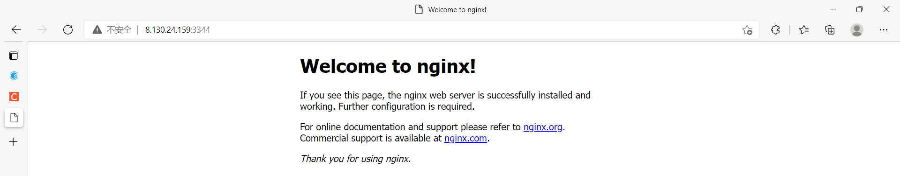
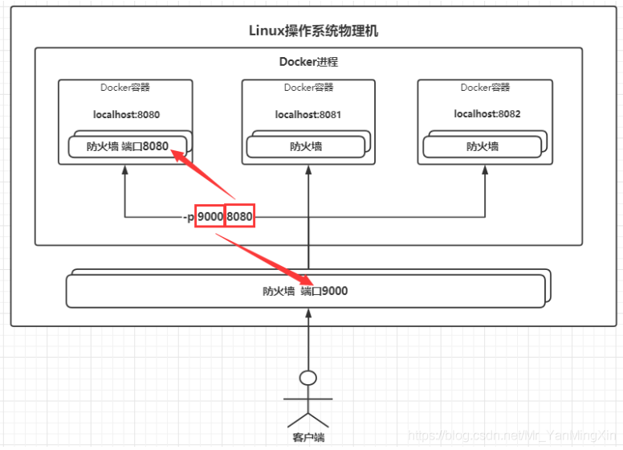

### Docker安装Nginx

1. **搜索nginx镜像**：docker search nginx，建议去DockerHub网站[Docker Hub Container Image Library | App Containerization](https://hub.docker.com/)上搜索，这样还能看支持的版本、详细信息和帮助文档
2. **拉取镜像**：docker pull nginx
3. **查看是否拉取成功**：docker images
4. **运行nginx**：docker run -d --name nginx01 -p 3344:80 nginx，后台运行，起名nginx01，将docker端口80映射到公网端口3344，可通过公网3344服务docker80
5. **查看容器是否运行成功**：docker ps

6. **本机自测访问**：curl localhost:3344，curl发起请求

7. **外网同样也能连通**：连不通的话可能是阿里安全组没有开，或者linux防火墙拦截了 

8. **进入nginx容器**：docker exec-it nginx01 /bin/bash 

  1. **在容器内寻找nginx**：whereis nginx
  2. **进入nginx目录**：cd /etc/nginx

9. 思考：每次改动nginx配置文件都需要进入容器内部，非常麻烦。能不能在容器外部提供一个映射路径，在容器外部修改，容器内自动修改呢？-v 数据卷

10. 到这有点理解了，一个容器就是一个环境，一个项目需要多个环境就开多个docker容器，我原本还以为一个docker容器内有很多环境和一个项目，就像一个小虚拟机里跑项目

  ```shell
  [root@iZ0jlettlgobqrxnscuoovZ ~]# docker search nginx
  NAME                                              DESCRIPTION                                     STARS     OFFICIAL   AUTOMATED
  bitnami/nginx                                     Bitnami nginx Docker Image                      117                  [OK]
  bitnami/wordpress-nginx                           Bitnami Docker Image for WordPress with NGINX   55                   [OK]
  ubuntu/nginx                                      Nginx, a high-performance reverse proxy & we…   32                   
  bitnami/nginx-ingress-controller                  Bitnami Docker Image for NGINX Ingress Contr…   15     
  [root@iZ0jlettlgobqrxnscuoovZ ~]# docker pull nginx
  Using default tag: latest
  latest: Pulling from library/nginx
  a2abf6c4d29d: Pull complete 
  a9edb18cadd1: Pull complete 
  589b7251471a: Pull complete 
  186b1aaa4aa6: Pull complete 
  b4df32aa5a72: Pull complete 
  a0bcbecc962e: Pull complete 
  Digest: sha256:0d17b565c37bcbd895e9d92315a05c1c3c9a29f762b011a10c54a66cd53c9b31
  Status: Downloaded newer image for nginx:latest
  docker.io/library/nginx:latest
  [root@iZ0jlettlgobqrxnscuoovZ ~]# docker images
  REPOSITORY   TAG       IMAGE ID       CREATED        SIZE
  nginx        latest    605c77e624dd   7 weeks ago    141MB
  centos       latest    5d0da3dc9764   5 months ago   231MB
  #运行容器
  [root@iZ0jlettlgobqrxnscuoovZ ~]# docker run -d --name nginx01 -p 3344:80 nginx
  9aa841769941da4a6937a4877213b9b021bc84ffd1833bd557a569fd37bf4e7b
  [root@iZ0jlettlgobqrxnscuoovZ ~]# docker ps
  CONTAINER ID   IMAGE     COMMAND                  CREATED         STATUS         PORTS                  NAMES
  9aa841769941   nginx     "/docker-entrypoint.…"   6 seconds ago   Up 5 seconds   0.0.0.0:3344->80/tcp   nginx01
  #本地测试
  [root@iZ0jlettlgobqrxnscuoovZ ~]# curl localhost:3344
  <!DOCTYPE html>
  <html>
  <head>
  <title>Welcome to nginx!</title>
  <style>
  html { color-scheme: light dark; }
  body { width: 35em; margin: 0 auto;
  font-family: Tahoma, Verdana, Arial, sans-serif; }
  </style>
  </head>
  <body>
  <h1>Welcome to nginx!</h1>
  <p>If you see this page, the nginx web server is successfully installed and
  working. Further configuration is requir
  ed.</p>
  
  <p>For online documentation and support please refer to
  <a href="http://nginx.org/">nginx.org</a>.<br/>
  Commercial support is available at
  <a href="http://nginx.com/">nginx.com</a>.</p>
  
  <p><em>Thank you for using nginx.</em></p>
  </body>
  </html>
  #进入容器
  [root@iZ0jlettlgobqrxnscuoovZ ~]# docker attach -it nginx01 /bin/bash
  unknown shorthand flag: 'i' in -it
  See 'docker attach --help'.
  [root@iZ0jlettlgobqrxnscuoovZ ~]# docker exec -it nginx01 /bin/bash
  root@9aa841769941:/# whereis nginx
  nginx: /usr/sbin/nginx /usr/lib/nginx /etc/nginx /usr/share/nginx
  root@9aa841769941:/# whereis nginx
  nginx: /usr/sbin/nginx /usr/lib/nginx /etc/nginx /usr/share/nginx
  root@9aa841769941:/# cd /etc/nginx
  root@9aa841769941:/etc/nginx# 
  
  ```

  - 端口暴露原理
  - 

