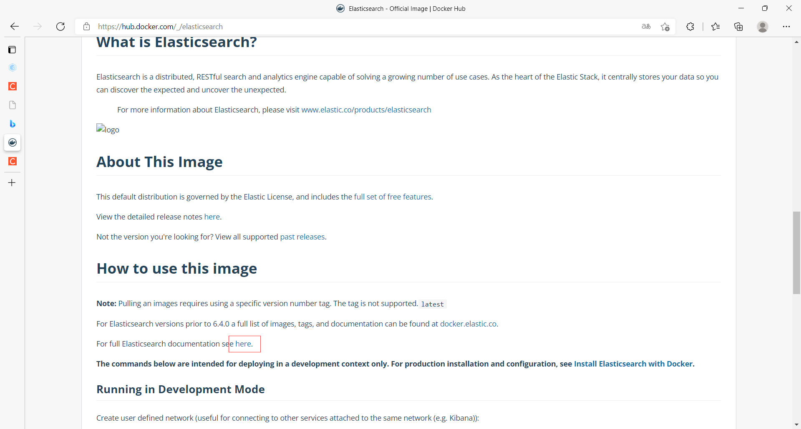

**问题**

- es暴露的端口很多
- es十分耗内存
- es的数据一般需要放置到安全目录！挂载

#### 步骤

1. 在DockerHub中搜索elastic找到elasticsearch，其帮助文档有一个**启动命令**

   ```shell
   docker run -d --name elasticsearch --net somenetwork -p 9200:9200 -p 9300:9300 -e "discovery.type=single-node" elasticsearch:tag
   ```

   - --net：网络配置，这里先把它去掉，删掉--net somenetwork
   - tag是版本，这里使用7.6.2，也就是elasticsearch7.6.2

2. curl localhost:9200**本地测试**

   ```shell
   [root@iZ0jlettlgobqrxnscuoovZ ~]# curl localhost:9200
   {
     "name" : "60d55c133e38",
     "cluster_name" : "docker-cluster",
     "cluster_uuid" : "9XIY4TPuTKSqZRBeYDVqZA",
     "version" : {
       "number" : "7.6.2",
       "build_flavor" : "default",
       "build_type" : "docker",
       "build_hash" : "ef48eb35cf30adf4db14086e8aabd07ef6fb113f",
       "build_date" : "2020-03-26T06:34:37.794943Z",
       "build_snapshot" : false,
       "lucene_version" : "8.4.0",
       "minimum_wire_compatibility_version" : "6.8.0",
       "minimum_index_compatibility_version" : "6.0.0-beta1"
     },
     "tagline" : "You Know, for Search"
   }
   ```

3. 运行es后会发现linux特别的卡，特别耗内存，一启动就是一点几个G，该怎么解决？docker stats命令**查看cpu状态**

   - docker stop停止一些没必要的容器

   - docker stats查看容器每秒CPU运行状态

     ```
     [root@iZ0jlettlgobqrxnscuoovZ ~]# docker stats
     CONTAINER ID   NAME            CPU %     MEM USAGE / LIMIT     MEM %     NET I/O           BLOCK I/O         PIDS
     60d55c133e38   elasticsearch   0.01%     1.238GiB / 1.694GiB   73.11%    1.02kB / 1.39kB   6.76GB / 4.24MB   44
     
     CONTAINER ID   NAME            CPU %     MEM USAGE / LIMIT     MEM %     NET I/O           BLOCK I/O         PIDS
     60d55c133e38   elasticsearch   0.01%     1.238GiB / 1.694GiB   73.11%    1.02kB / 1.39kB   6.76GB / 4.24MB   44
     ```

   - 增加内存的限制，具体去参考elasticsearch手册，在帮助文档跳转

   - 关闭es容器，增加内存的限制，修改配置文件，-e 配置修改

     ```shell
     #-Xms:启动时分配的内存
     #-Xmx：运行过程中分配的最大内存，如果超出就报oom
     #elastic search默认tcp端口9300，http端口9200
     docker run -d --name es01 -p 9200:9200 -p 9300:9300 -e "discovery.type=single-node" -e ES_JAVA_OPTS="-Xms64m -Xmx512m" elasticsearch:7.6.2
     
     #示例
     [root@iZ0jlettlgobqrxnscuoovZ ~]# docker run -d --name es03 -p 9200:9200 -p 9300:9300 -e "discovery.type=single-node" -e ES_JAVA_OPTS="-Xms64m -Xmx512m" elasticsearch:7.6.2
     2d108199af5bea0ec9fa0c9477c145c28b60164d0d052c992797e0120e0bf81c
     [root@iZ0jlettlgobqrxnscuoovZ ~]# docker ps
     CONTAINER ID   IMAGE                 COMMAND                  CREATED         STATUS         PORTS                                            NAMES
     2d108199af5b   elasticsearch:7.6.2   "/usr/local/bin/dock…"   7 seconds ago   Up 6 seconds   0.0.0.0:9200->9200/tcp, 0.0.0.0:9300->9300/tcp   es03
     [root@iZ0jlettlgobqrxnscuoovZ ~]# curl localhost:9200
     {
       "name" : "2d108199af5b",
       "cluster_name" : "docker-cluster",
       "cluster_uuid" : "v9fAi9odQsuSYce6iamUFA",
       "version" : {
         "number" : "7.6.2",
         "build_flavor" : "default",
         "build_type" : "docker",
         "build_hash" : "ef48eb35cf30adf4db14086e8aabd07ef6fb113f",
         "build_date" : "2020-03-26T06:34:37.794943Z",
         "build_snapshot" : false,
         "lucene_version" : "8.4.0",
         "minimum_wire_compatibility_version" : "6.8.0",
         "minimum_index_compatibility_version" : "6.0.0-beta1"
       },
       "tagline" : "You Know, for Search"
     }
     ```

#### 作业：使用kibana连接es

- 容器内部相互隔离，有各自的内部地址，怎么才能连接呢？
- Linux有一个内网IP，可以通过内网IP转发，首先kibana走到内网地址，通过内网地址请求到es。
- Docker网络原理？