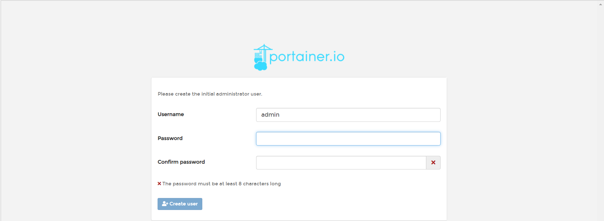
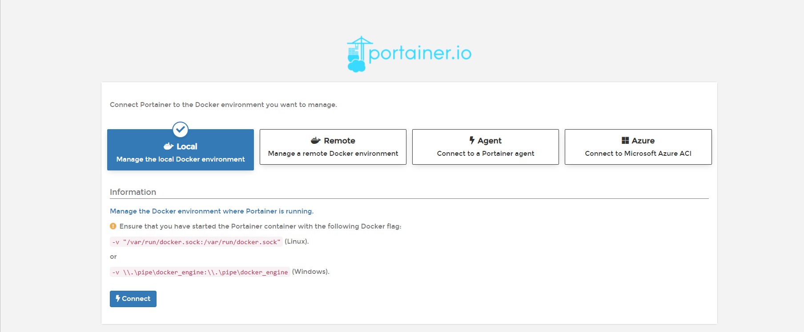
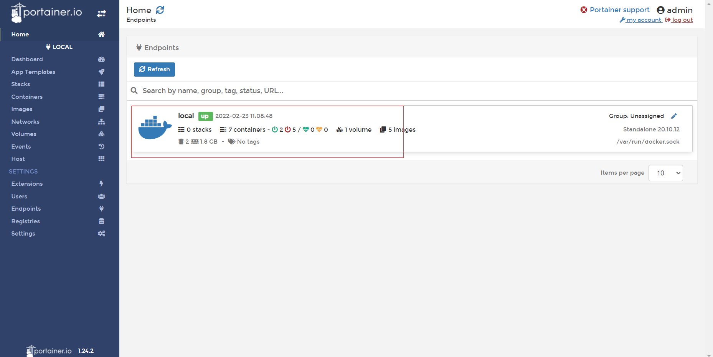
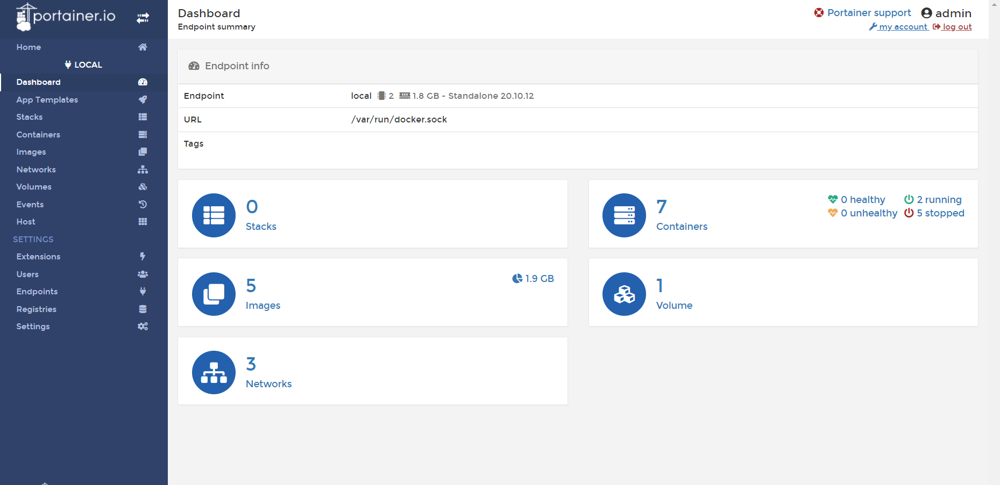

#### 可视化

- Rancher（CI/CD再用）

- **portainer**（先用这个）

  - 什么是Portainer？Docker的图形化界面管理工具！提供了一个后台面板供我们操作。
  - 端口映射：8088是外部端口，9000是内部端口
  - \是换行，写不写都可以，不写的话命令太长了
  - --restart是启动方式
  - -v是本地卷挂载
  - --privilege是权限

  ```shell
  docker run -d -p 8088:9000 \
  --restart=always -v /var/run/docker.sock:/var/run/docker.sock --privileged=true portainer/portainer
  ```

- **测试访问**：curl localhost:8088

- **外部测试**：8.130.24.159:8088，需要开安全组，第一次这里要你设置登陆密码，以后就可以这样登陆了

  - 设置好密码后会进入连接页面，选择仓库，一般使用本地的Local
  - 连接后进入控制页面，点击Home面板的仓库进入详细页面
  - 详细页面

- 这个测试玩玩就行，一般也不会用