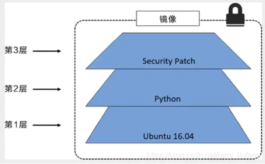

#### 镜像是什么

- 镜像是一种轻量级、可执行的独立软件包，用来打包软件和基于软件运行环境开发的软件，它包含了运行某个软件所需的所有内容，包括代码、运行时、库、环境变量和配置文件
- 以后我们的项目不用再部署服务器了，直接打包Docker镜像，启动容器就可以直接跑起来！
- 如何得到镜像：
  - 从仓库中拉取镜像（docker pull）
  - 从本地文件中载入镜像（docker load）
  - 由容器生成新的镜像（docker commit）
  - 自己构建新的镜像DockerFile（docker build）

#### 镜像加载原理

- UnionFS（联合文件系统）
  - Union文件系统（UnionFS）是一种分层、轻量级并且高性能的文件系统，它支持对文件系统的修改作为一次提交（好比git每一次提交就记录一次），来一层层的叠加。
  
  - 同时可以将不同目录，挂载到同一个虚拟文件系统下（unite several directories into a single virtual filesystem）。
    Union文件系统是Docker镜像的基础。
    
  - 镜像可以通过分层来进行继承，基于基础镜像（没有父镜像概念），可以制作各种具体的应用镜像。
  
  - bootfs文件系统位于镜像最底层，主要包含bootloader、kernal，bootloader主要是引导加载kernal。当镜像加载好了就会卸载bootfs文件系统，转而使用rootfs文件系统，其在bootfs之上，包含了典型的Linux内核的/dev、/proc、/bin、/etc等标准目录。rootfs就是不同操作系统的发行版，比如Ubuntu、Centos
  
  - 多个镜像都是从相同的base镜像构建的，宿主机只需要在磁盘上保留一份Base镜像，同时内存中也只需要加载一份Base镜像，就可以应用在所有的容器服务之中了。而且镜像的每一层都可以被共享。
  
  - rootfs是一个精简的操作系统OS，只包含最基本的命令、工具、程序就可以了，因为镜像底层直接用Host的Kernel，自己只需要提供rootfs就可以了。
  
  - 这里下载一个redis镜像，docker pull redis
  
    ```shell
    [root@iZ0jlettlgobqrxnscuoovZ ~]# docker pull redis
    Using default tag: latest
    latest: Pulling from library/redis
    a2abf6c4d29d: Already exists #这一层就是已经下过了，就没有再去下载了，这一层是base镜像
    c7a4e4382001: Pull complete #这些都是一层一层
    4044b9ba67c9: Pull complete 
    c8388a79482f: Pull complete 
    413c8bb60be2: Pull complete 
    1abfd3011519: Pull complete 
    Digest: sha256:db485f2e245b5b3329fdc7eff4eb00f913e09d8feb9ca720788059fdc2ed8339
    Status: Downloaded newer image for redis:latest
    docker.io/library/redis:latest
    ```
  
  - 使用docker image inspect命令可以查看元数据
  
    ```shell
    [root@iZ0jlettlgobqrxnscuoovZ ~]# docker image inspect redis
    [
        {
            "Id": "sha256:7614ae9453d1d87e740a2056257a6de7135c84037c367e1fffa92ae922784631",
            "RepoTags": [ #版本
                "redis:latest"
            ],
            ...
            "RootFS": { #这里就是镜像的rootfs
                "Type": "layers",
                "Layers": [ #这里是镜像的每一层
                    "sha256:2edcec3590a4ec7f40cf0743c15d78fb39d8326bc029073b41ef9727da6c851f",
                    "sha256:9b24afeb7c2f21e50a686ead025823cd2c6e9730c013ca77ad5f115c079b57cb",
                    "sha256:4b8e2801e0f956a4220c32e2c8b0a590e6f9bd2420ec65453685246b82766ea1",
                    "sha256:529cdb636f61e95ab91a62a51526a84fd7314d6aab0d414040796150b4522372",
                    "sha256:9975392591f2777d6bf4d9919ad1b2c9afa12f9a9b4d260f45025ec3cc9b18ed",
                    "sha256:8e5669d8329116b8444b9bbb1663dda568ede12d3dbcce950199b582f6e94952"
                ]
            },
            ...
        }
    ]
    ```
  
- **加深理解**

  - 所有的Docker镜像都起始于一个基础镜像层，当进行修改或增加新的内容时，就会在当前镜像层之上，创建新的镜像层。

  - 举一个简单的例子，假如基于Ubuntu Linux 16.04创建一个新的镜像，这就是新镜像的第一层；如果在该镜像中添加Python包，就会在基础镜像层之上创建第二个镜像层；如果继续添加一个安全补丁，就会创建第三个镜像层。

  - 在添加额外的镜像层的同时，镜像始终保持是当前所有镜像的组合，理解这一点非常重要。下图中举了一个简单的例子，每个镜像层包含3个文件，而整体的镜像包含了来自两个镜像层的6个文件。本图中的镜像层跟之前图中的略有区别，主要目的是便于展示文件。

  - 下图中展示了一个稍微复杂的三层镜像，在外部看来整个镜像只有6个文件，这是因为最上层中的文件7作为文件5的更新版本将其覆盖了。就假如文件12346都是环境，文件5是App1.0，现在新加一层文件7App2.0，覆盖文件5。这时假如又来了一个新项目需要一层文件同样为文件123，那么这一层不用再去下载，可以直接共享这个镜像的第一层。

  - Docker通过存储引擎（新版本采用快照机制）的方式来实现镜像层堆栈，并保证多镜像层对外展示为统一的文件系统。

    如上边的三层镜像，Docker最终会把所有镜像层堆叠并合并，对外提供统一的视图，如下图

- **特点**

  - Docker镜像都是只读的，当容器启动run的时候，一个新的可写层被加载到镜像的顶部。这一层就是我们通常说的容器层，其下都是镜像层。我们所有的操作都在容器层，我们可以将这一容器层加上原来的镜像层再打包成一个新的镜像发布。

