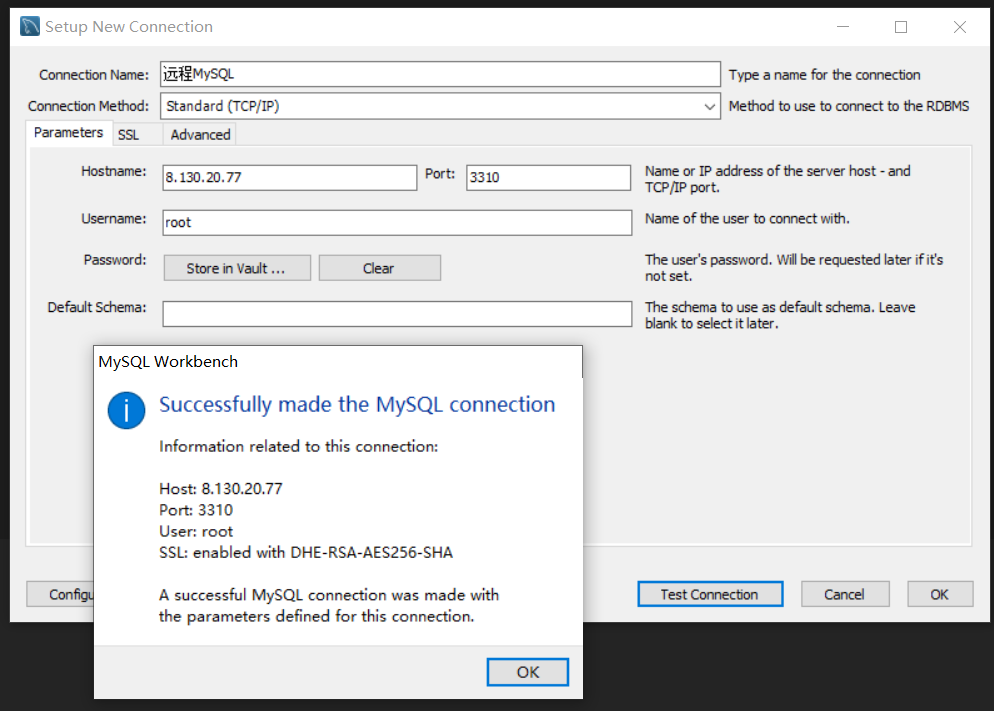

#### 思考：MYSQL的持久化问题

- MYSQL的数据都存放在**data目录**

#### 安装MYSQL

- 下载MYSQL镜像

  ```shell
  [root@iZ0jldalqlhwtqori6z48lZ test]# docker pull mysql:5.7
  5.7: Pulling from library/mysql
  6552179c3509: Pull complete 
  d69aa66e4482: Pull complete 
  3b19465b002b: Pull complete 
  7b0d0cfe99a1: Pull complete 
  9ccd5a5c8987: Pull complete 
  44f5f7765d10: Pull complete 
  7e8f1dd5efbe: Pull complete 
  ab45b9a309e7: Pull complete 
  90242da46c57: Pull complete 
  9a8d822d1293: Pull complete 
  1704bf9fa775: Pull complete 
  Digest: sha256:ea24ddf1116d6e5053919748d2c27c8200e39ac0dbe9540f213a2d9141b66167
  Status: Downloaded newer image for mysql:5.7
  docker.io/library/mysql:5.7
  [root@iZ0jldalqlhwtqori6z48lZ test]# docker images
  REPOSITORY   TAG       IMAGE ID       CREATED        SIZE
  mysql        5.7       538ec2c8721c   14 hours ago   448MB
  centos       latest    5d0da3dc9764   5 months ago   231MB
  ```

- 启动MYSQL容器

  ```shell
  #-d后台运行
  #-p暴露端口，将容器的MYSQL3306端口暴露给服务器3310，以便公网访问，安全组要开启3310
  #-v挂载，可以多个-v挂载多个文件目录
  #mysql容器的配置文件在/etc/mysql/conf.d文件夹，数据库数据在/var/lib/mysql文件夹
  #mysql启动需要设置初始密码，-e MYSQL_ROOT_PASSWORD=初始密码，不设置密码会自动关闭
  [root@iZ0jldalqlhwtqori6z48lZ test]# docker run -d -p 3310:3306 -v /home/mysql/conf:/etc/mysql/conf.d -v /home/mysql/data:/var/lib/mysql -e MYSQL_ROOT_PASSWORD=root --name mysql01 mysql:5.7
  392fb4de9ee598030f771127a36eb71010cd5c9d3cb5a6170a72ba002e474879
  ```

- 测试MYSQL容器是否启动成功

  - 本地打开mysql连接工具MySQL Workbench，新建远程连接，测试连接

- 回到服务器看看主机目录有没有挂载成功

  ```shell
  [root@iZ0jldalqlhwtqori6z48lZ home]# ls
  mysql  test
  [root@iZ0jldalqlhwtqori6z48lZ home]# cd mysql
  [root@iZ0jldalqlhwtqori6z48lZ mysql]# ls #挂载成功了
  conf  data
  [root@iZ0jldalqlhwtqori6z48lZ mysql]# cd conf
  [root@iZ0jldalqlhwtqori6z48lZ conf]# ls
  [root@iZ0jldalqlhwtqori6z48lZ conf]# cd ..
  [root@iZ0jldalqlhwtqori6z48lZ mysql]# cd data
  [root@iZ0jldalqlhwtqori6z48lZ data]# ls
  auto.cnf    ca.pem           client-key.pem  ibdata1      ib_logfile1  mysql               private_key.pem  server-cert.pem  sys
  ca-key.pem  client-cert.pem  ib_buffer_pool  ib_logfile0  ibtmp1       performance_schema  public_key.pem   server-key.pem
  #现在去workbench创建一个数据库test，看看能不能成功
  [root@iZ0jldalqlhwtqori6z48lZ data]# ls #成功了，有test
  auto.cnf    ca.pem           client-key.pem  ibdata1      ib_logfile1  mysql               private_key.pem  server-cert.pem  sys
  ca-key.pem  client-cert.pem  ib_buffer_pool  ib_logfile0  ibtmp1       performance_schema  public_key.pem   server-key.pem
  [root@iZ0jldalqlhwtqori6z48lZ data]# ls
  auto.cnf    ca.pem           client-key.pem  ibdata1      ib_logfile1  mysql               private_key.pem  server-cert.pem  sys
  ca-key.pem  client-cert.pem  ib_buffer_pool  ib_logfile0  ibtmp1       performance_schema  public_key.pem   server-key.pem   test
  ```

- 假设我们将MYSQL容器删除，主机上的/home/mysql下的文件依旧能够保留，下次创建容器时依旧使用这个目录挂载就行了

#### 具名挂载和匿名挂载

- 匿名挂载：只指定容器内路径而不指定主机路径

  ```shell
  # 在后台启动容器，并匿名挂载到 /etc/nginx上面，指定容器名字为nginx01，端口随机
  test@P340:/$ sudo docker run -d -P --name nginx01 -v /etc/nginx nginx
  8720cda842edfc0ad8f14969af34fb7376aae219adce2d6a2e12164a0c3bb465
  
  # 查看容器卷状况
  #sudo命令
  test@P340:/$ sudo docker volume ls 
  DRIVER    VOLUME NAME
  local     824a0f5ac630bf4757f981fd2d165c4650c007f322ba199469b57ec397938675 #这些就是匿名卷，没有路径，没有名称，只有很长一串id
  ...
  ```

- 具名挂载

  - 同样只指定容器内路径，不指定主机路径，jumin-nginx是为该卷起的名称，前面没有“/”，不然就是路径了
  - 这也是我们大多数情况在使用的，因为可以通过卷名查看挂载位置，**不建议使用匿名挂载**

  ```shell
  # 创建一个新的容器，端口随机，名字为nginx02，挂载为主机jumin-nginx到容器内部地/data/test/juming/nginx
  test@P340:/$ sudo docker run -d -P --name nginx02 -v jumin-nginx:/data/test/juming-nginx nginx
  d8c713b13135d4acb92be59c627ca649a4214905d876d76664261d31c171605d
  
  # 查看容器卷信息
  test@P340:/$ sudo docker volume ls
  DRIVER    VOLUME NAME
  local     824a0f5ac630bf4757f981fd2d165c4650c007f322ba199469b57ec397938675
  local     jumin-nginx #和匿名卷不同，它有卷名了
  
  # 查看容器卷挂载位置，不设置主机路径，所有卷都会挂载在/var/lib/docker/volumes/卷名或卷id/_data
  test@P340:/$ sudo docker volume inspect jumin-nginx
  [
      {
          "CreatedAt": "2021-08-21T07:14:29+08:00",
          "Driver": "local",
          "Labels": null,
          "Mountpoint": "/var/lib/docker/volumes/jumin-nginx/_data", # 主机挂载位置
          "Name": "jumin-nginx",
          "Options": null,
          "Scope": "local"
      }
  ]
  ```

#### 三种挂载

```shell
#指定路径挂载
-v 主机路径:容器内路径

#匿名挂载
-v 容器内路径

#具名挂载
-v 卷名:容器内路径
```

#### 给挂载文件设置权限

- 权限限制的是容器内的文件操作，不是主机的，因为主机的才是源

```shell
ro: readonly : 容器对该数据卷挂载目录只有只读权限，容器内无法操作了
rw: read write：读写权限，默认的

#一旦设置了就无法改变了
sudo docker run -d -P --name nginx02 -v jumin-nginx:/data/test/juming-nginx:ro nginx 

sudo docker run -d -P --name nginx02 -v jumin-nginx:/data/test/juming-nginx:rw nginx 
```

