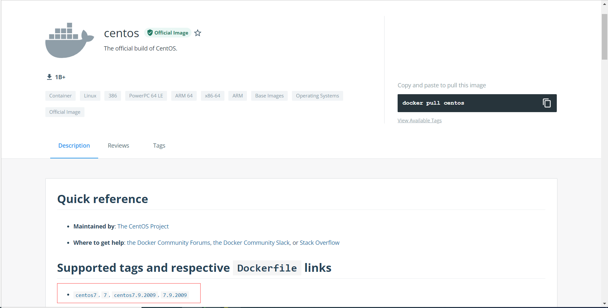
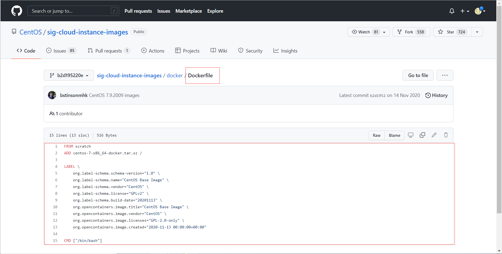
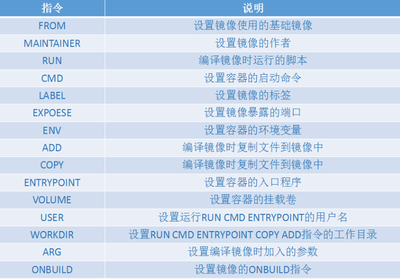
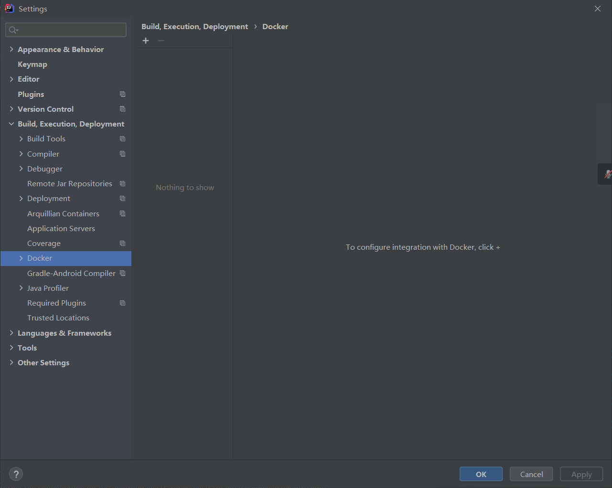
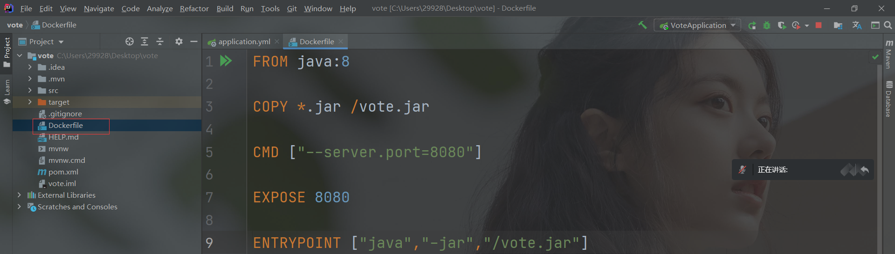

### DockerFile是什么

- DockerFile就是用来构建Docker镜像文件的构建文件（命令脚本）
- 构建镜像有两种方式，第一种是docker commit命令，第二钟就是通过DockerFile进行构建
- 通过这个脚本可以生成镜像，镜像是一层一层的，而脚本也是一个个的命令，每个命令都是一层。

### 使用DockerFile挂载数据卷

- 找一个测试文件夹，新建一个无后缀名文件，然后在该文件中写入我们的命令脚本

  ```shell
  [root@iZ0jldalqlhwtqori6z48lZ /]# cd home
  [root@iZ0jldalqlhwtqori6z48lZ home]# mkdir test-docker-volume
  [root@iZ0jldalqlhwtqori6z48lZ home]# cd test-docker-volume/
  [root@iZ0jldalqlhwtqori6z48lZ test-docker-volume]# ls
  #按ESC输入:wq保存，输入内容为cat命令显示的，所有指令都是大写的
  [root@iZ0jldalqlhwtqori6z48lZ test-docker-volume]# vim dockerfile1 #创建并写入命令
  [root@iZ0jldalqlhwtqori6z48lZ test-docker-volume]# cat dockerfile1 #查看写入是否成功，这里的每个命令就是镜像的每一层
  FROM centos #基础镜像为centos
  #设置挂载的卷，这里就相当于-v，这里没写的话run容器时写也可以，[]中有几个数据就是几个-v，这里的volume01等同于 -v volume01，是匿名挂载，只有容器内路径
  VOLUME ["volume01","volume02"] #如果创建挂载不了，就加上“/”，/volume01和/volume02
  CMD echo "------END------" #执行到这里就打印信息
  CMD /bin/bash #进入bash控制台
  #build命令构建镜像
  #-f（file）为dockerfile文件的路径，因为现在就在dockerfile1的父目录中，所以没写全
  #-t（tag）为构造的镜像名称（作者/镜像名）和版本
  #.为构造的镜像放在当前目录
  [root@iZ0jldalqlhwtqori6z48lZ test-docker-volume]# docker build -f dockerfile1 -t hzc/centos:1.0 .
  Sending build context to Docker daemon  2.048kB
  Step 1/4 : FROM centos
   ---> 5d0da3dc9764
  Step 2/4 : VOLUME ["volume01","volume02"]
   ---> Running in 898b20d1f73f
  Removing intermediate container 898b20d1f73f
   ---> e8174617ab1f
  Step 3/4 : CMD echo "------END------"
   ---> Running in 8715842bb75b
  Removing intermediate container 8715842bb75b
   ---> 521c074212cc
  Step 4/4 : CMD /bin/bash
   ---> Running in 8e0577d227fb
  Removing intermediate container 8e0577d227fb
   ---> e764d038f521
  Successfully built e764d038f521
  Successfully tagged hzc/centos:1.0
  [root@iZ0jldalqlhwtqori6z48lZ test-docker-volume]# docker images #查看刚刚创建的镜像
  REPOSITORY   TAG       IMAGE ID       CREATED          SIZE
  hzc/centos   1.0       e764d038f521   12 minutes ago   231MB
  mysql        5.7       538ec2c8721c   34 hours ago     448MB
  centos       latest    5d0da3dc9764   5 months ago     231MB
  [root@iZ0jldalqlhwtqori6z48lZ volumes]# docker run -it hzc/centos:1.0 /bin/bash #这里不写版本会默认去远程仓库找最新版，会报错
  [root@8b68fb75a5f5 /]# ls #发现自动创建了volume01和volume02
  bin  dev  etc  home  lib  lib64  lost+found  media  mnt  opt  proc  root  run  sbin  srv  sys  tmp  usr  var  volume01	volume02
  ```
  
- 这种方式我们以后会用的非常多，因为我们通常会构建自己的镜像

### 查看镜像的DockerFile

- 进入dockerhub，选择centos镜像点击其版本

- 点击版本后会跳转gitbub，这里就是centos的docker镜像，可以看见其dockerfile文件

- **很多官方镜像都只是基础包，很多功能都没有，我们通常会搭建自己的镜像，这里的镜像通常只有一个环境，我们需要搭建一个有一系列开发环境（centos+jdk+tomcat+mysql...）的镜像**

###  DockerFile常用指令

- 基础知识
  - 每个保留关键字( 指令 )都必须是大写字母
  - 每一个指令都会创建提交一个新的镜像层
  - 指令的执行顺序从上到下
  - `#` 表示注释(注意需要单独一行)
  - dockerfile是面向开发的，我们以后要发布项目，做镜像，就需要编写dockerfile文件。docker逐渐成为企业交付的标准。
  
- **指令**（按编写顺序）

  - FROM : 基础镜像，一切从这里开始构建
  - MAINTAINER : 镜像的维护者（作者）信息 : 姓名 + 邮箱
  - RUN : 镜像构建的时需要运行的命令
  - ADD : 将所需文件（压缩包要.tar.gz后缀名）拷贝到镜像中，压缩包会自动解压，ADD read.txt /usr/local/，将当前目录的read.txt复制到镜像的/usr/local/目录中，ADD test.tar.gz /usr/local/，将压缩包test复制到镜像的/usr/local/目录中解压
  - WORKDIR : 指定镜像的工作目录
  - VOLUME : 设置挂载目录，等同于docker run命令中的-v
  - EXPOSE : 暴露端口配置，-P随机端口时会默认expose配置的端口，也可以-p另外指定
  - CMD : 指定容器启动时要运行的命令，但只有最后一个生效且可被替代，例如CMD echo “hello” echo “hi”只打印hi
  - ENTRYPOINT : 与 CMD 功能相同，区别为其可追加命令
  - ONBUILD : 当构建一个被继承 Dockerfile 时这个指令就会被触发执行
  - COPY : 与 ADD 指令类似，可以更改文件名称，即可将文件拷贝到镜像中，不会解压压缩包，COPY read.txt /usr/local/rearme.txt，将当前目录的read.txt复制到镜像的/usr/local/目录中，并重命名为readme.txt
  - ENV : 设置构建时所需的环境变量，等同于docker run命令中的-e，也能设置jvm参数和mysql的密码
  - USER : 指定运行用户
  - 


### 实战测试

- centos镜像dockerfile演示

  ```shell
  #centos的dockerfile
  
  #scratch基础镜像，它是一个虚拟概念，并不实际存在，表示一个空白的镜像。DockerHub中99%的镜像都是从这个基础镜像过来的，然后配置需要的软件和配置构建。
  FROM scratch 
  #添加了一个centos7的压缩包
  ADD centos-7-x86_64-docker.tar.xz / 
  
  LABEL \
      org.label-schema.schema-version="1.0" \
      org.label-schema.name="CentOS Base Image" \
      org.label-schema.vendor="CentOS" \
      org.label-schema.license="GPLv2" \
      org.label-schema.build-date="20201113" \
      org.opencontainers.image.title="CentOS Base Image" \
      org.opencontainers.image.vendor="CentOS" \
      org.opencontainers.image.licenses="GPL-2.0-only" \
      org.opencontainers.image.created="2020-11-13 00:00:00+00:00"
  
  CMD ["/bin/bash"]
  ```

- 因为centos镜像很多命令都没有，所以我们在centos镜像基础上构建一个升级版的镜像

  ```shell
  [root@iZ0jldalqlhwtqori6z48lZ ~]# docker run -it centos /bin/bash
  [root@d4ce9485fd98 /]# vim 
  bash: vim: command not found
  [root@d4ce9485fd98 /]# ifconfig
  bash: ifconfig: command not found
  ```

- 自己创建一个centos升级版镜像

  ```shell
  [root@iZ0jldalqlhwtqori6z48lZ ~]# cd /home
  [root@iZ0jldalqlhwtqori6z48lZ home]# ls
  centoss  mysql  mysql.conf  test  test-docker-volume
  [root@iZ0jldalqlhwtqori6z48lZ home]# mkdir dockerfile
  [root@iZ0jldalqlhwtqori6z48lZ home]# cd dockerfile/
  
  #第一步：编写自己的dockerfile文件
  [root@iZ0jldalqlhwtqori6z48lZ dockerfile]# vim mydockerfile
  [root@iZ0jldalqlhwtqori6z48lZ dockerfile]# cat mydockerfile 
  FROM centos #设置基础镜像，本镜像基于centos构建
  MAINTAINER hzc<2992833016@qq.com> #作者信息，作者<邮箱>
  
  ENV MYPATH /usr/local #设置环境变量，键值对MYPATH=/usr/local
  WORKDIR $MYPATH #设置镜像工作目录为环境变量MYPATH指向的/usr/local，$符引用环境变量
  
  RUN yum -y install vim #使用yum安装vim命令
  RUN yum -y install net-tools #使用yum安装net-tools命令
  
  EXPOSE 80 #暴露80端口
  
  CMD echo $MYPATH #echo打印，这里打印MYPATH环境变量的值
  CMD echo "------end------" #打印输出------end------
  
  CMD /bin/bash #启动后进入bash命令行
  
  #第二步：通过这个文件构建镜像
  #docker build -f mydockerfile -t mycentos:0.1 .
  #其实build时最好镜像名要加上作者的，例如dreamlandmen/centos，作者名要和你dockerhub的名字一样，否则后面push时还要再使用docker tag命令
  [root@iZ0jldalqlhwtqori6z48lZ dockerfile]# docker build -f mysockerfile -t mycentos:0.1 .
  Sending build context to Docker daemon  2.048kB
  Step 1/10 : FROM centos
   ---> 5d0da3dc9764
  Step 2/10 : MAINTAINER hzc<2992833016@qq.com>
   ---> Using cache
   ---> a5524df3f250
  Step 3/10 : ENV MYPATH /usr/local
   ---> Using cache
   ---> b67261760ee2
  Step 4/10 : WORKDIR $MYPATH
   ---> Using cache
   ---> 5e77a7d2a1b1
  Step 5/10 : RUN yum -y install vim
   ---> Running in b778a1629ebb
  CentOS Linux 8 - AppStream                       56  B/s |  38  B     00:00    
  #这里报错可能是因为centos8不再维护，CentOS团队从官方镜像中移除了centos8所有的包的问题，改成centos7试试，FROM centos:7
  Error: Failed to download metadata for repo 'appstream': Cannot prepare internal mirrorlist: No URLs in mirrorlist
  The command '/bin/sh -c yum -y install vim' returned a non-zero code: 1
  
  #报错了，解决错误
  [root@iZ0jldalqlhwtqori6z48lZ dockerfile]# cat mysockerfile 
  FROM centos:7
  MAINTAINER hzc<2992833016@qq.com>
  ...
  [root@iZ0jldalqlhwtqori6z48lZ dockerfile]# docker build -f mydockerfile -t mycentos:0.1 .
  Sending build context to Docker daemon  2.048kB
  ...
  warning: /var/cache/yum/x86_64/7/base/packages/groff-base-1.22.2-8.el7.x86_64.rpm: Header V3 RSA/SHA256 Signature, key ID f4a80eb5: NOKEY #这个警告没什么问题
  ...
  Successfully built 85dfea7b70ca
  Successfully tagged mycentos:0.1
  [root@iZ0jldalqlhwtqori6z48lZ dockerfile]# docker images
  REPOSITORY   TAG       IMAGE ID       CREATED          SIZE
  mycentos     0.1       85dfea7b70ca   10 minutes ago   580MB
  hzc/centos   1.0       e764d038f521   23 hours ago     231MB
  mysql        5.7       538ec2c8721c   2 days ago       448MB
  centos       7         eeb6ee3f44bd   5 months ago     204MB
  centos       latest    5d0da3dc9764   5 months ago     231MB
  [root@iZ0jldalqlhwtqori6z48lZ dockerfile]# docker run -it mycentos:0.1 #因为dockerfile中CMD已经指定了/bin/bash，所以这里不用再加了，并且会默认进入工作目录
  [root@d50a4b7de3a9 /]# ifconfig #该命令生效了，原生centos把该命令阉割了
  eth0: flags=4163<UP,BROADCAST,RUNNING,MULTICAST>  mtu 1500
          inet 172.17.0.2  netmask 255.255.0.0  broadcast 172.17.255.255
  ...
  ```
  
- 通过docker history命令查看镜像构建过程，平时拿到一个镜像可以研究研究

  ```shell
  docker history 容器id
  
  #示例
  [root@iZ0jldalqlhwtqori6z48lZ dockerfile]# docker images
  REPOSITORY   TAG       IMAGE ID       CREATED          SIZE
  mycentos     0.1       85dfea7b70ca   19 minutes ago   580MB
  hzc/centos   1.0       e764d038f521   23 hours ago     231MB
  mysql        5.7       538ec2c8721c   2 days ago       448MB
  centos       7         eeb6ee3f44bd   5 months ago     204MB
  centos       latest    5d0da3dc9764   5 months ago     231MB
  [root@iZ0jldalqlhwtqori6z48lZ dockerfile]# docker history 85dfea7b70ca
  IMAGE          CREATED          CREATED BY                                      SIZE      COMMENT
  85dfea7b70ca   19 minutes ago   /bin/sh -c #(nop)  CMD ["/bin/sh" "-c" "/bin…   0B        
  16d76b7a45ba   19 minutes ago   /bin/sh -c #(nop)  CMD ["/bin/sh" "-c" "echo…   0B        
  639db56070d7   19 minutes ago   /bin/sh -c #(nop)  CMD ["/bin/sh" "-c" "echo…   0B        
  c6eda0a012e3   19 minutes ago   /bin/sh -c #(nop)  EXPOSE 80                    0B        
  dcb828a70459   19 minutes ago   /bin/sh -c yum -y install net-tools             161MB     
  41ba6df6591b   19 minutes ago   /bin/sh -c yum -y install vim                   216MB     
  bb818899ecf4   20 minutes ago   /bin/sh -c #(nop) WORKDIR /usr/local            0B        
  2dee9b0ed972   20 minutes ago   /bin/sh -c #(nop)  ENV MYPATH=/usr/local        0B        
  46fbf0f6923c   20 minutes ago   /bin/sh -c #(nop)  MAINTAINER hzc<2992833016…   0B        
  eeb6ee3f44bd   5 months ago     /bin/sh -c #(nop)  CMD ["/bin/bash"]            0B        
  <missing>      5 months ago     /bin/sh -c #(nop)  LABEL org.label-schema.sc…   0B        
  <missing>      5 months ago     /bin/sh -c #(nop) ADD file:b3ebbe8bd304723d4…   204MB   
  
  [root@iZ0jldalqlhwtqori6z48lZ dockerfile]# docker history mysql:5.7
  IMAGE          CREATED       CREATED BY                                      SIZE      COMMENT
  538ec2c8721c   2 days ago    /bin/sh -c #(nop)  CMD ["mysqld"]               0B        
  <missing>      2 days ago    /bin/sh -c #(nop)  EXPOSE 3306 33060            0B        
  <missing>      2 days ago    /bin/sh -c #(nop)  ENTRYPOINT ["docker-entry…   0B        
  <missing>      2 days ago    /bin/sh -c ln -s usr/local/bin/docker-entryp…   34B       
  <missing>      2 days ago    /bin/sh -c #(nop) COPY file:baf57873956bd59e…   12.9kB    
  <missing>      2 days ago    /bin/sh -c #(nop)  VOLUME [/var/lib/mysql]      0B        
  <missing>      2 days ago    /bin/sh -c {   echo mysql-community-server m…   313MB     
  <missing>      2 days ago    /bin/sh -c echo 'deb [ signed-by=/etc/apt/ke…   97B       
  <missing>      2 days ago    /bin/sh -c #(nop)  ENV MYSQL_VERSION=5.7.37-…   0B        
  <missing>      2 days ago    /bin/sh -c #(nop)  ENV MYSQL_MAJOR=5.7          0B        
  <missing>      2 days ago    /bin/sh -c set -eux;  key='859BE8D7C586F5384…   2.29kB    
  <missing>      2 days ago    /bin/sh -c set -eux;  apt-get update;  apt-g…   52.2MB    
  <missing>      4 weeks ago   /bin/sh -c mkdir /docker-entrypoint-initdb.d    0B        
  <missing>      4 weeks ago   /bin/sh -c set -eux;  savedAptMark="$(apt-ma…   4.06MB    
  <missing>      4 weeks ago   /bin/sh -c #(nop)  ENV GOSU_VERSION=1.14        0B        
  <missing>      4 weeks ago   /bin/sh -c apt-get update && apt-get install…   9.34MB    
  <missing>      4 weeks ago   /bin/sh -c groupadd -r mysql && useradd -r -…   329kB     
  <missing>      4 weeks ago   /bin/sh -c #(nop)  CMD ["bash"]                 0B        
  <missing>      4 weeks ago   /bin/sh -c #(nop) ADD file:c51141702f568a28a…   69.3MB    
  ```


### CMD和ENTRYPOINT的区别

- 创建一个镜像用来测试cmd指令

  - 创建DockerFile

    ```shell
    #创建DockerFile
    [root@iZ0jldalqlhwtqori6z48lZ dockerfile]# vim cmd-docker-test #创建镜像
    [root@iZ0jldalqlhwtqori6z48lZ dockerfile]# cat cmd-docker-test #查看dockerfile内容
    FROM centos:7 #基于centos7
    CMD ["ls","-a"] #启动时运行ls -a，展示所有目录的结构
    ```

  - #构建镜像

    ```shell
    #构建镜像
    [root@iZ0jldalqlhwtqori6z48lZ dockerfile]# docker build -f cmd-docker-test -t cmdtest .
    Sending build context to Docker daemon  3.072kB
    Step 1/2 : FROM centos:7
     ---> eeb6ee3f44bd
    Step 2/2 : CMD ["ls","-a"]
     ---> Running in 253cc4e5f099
    Removing intermediate container 253cc4e5f099
     ---> d9a0ca618903
    Successfully built d9a0ca618903
    Successfully tagged cmdtest:latest #build时不写tag版本默认latest
    [root@iZ0jldalqlhwtqori6z48lZ dockerfile]# docker images
    REPOSITORY   TAG       IMAGE ID       CREATED          SIZE
    cmdtest      latest    d9a0ca618903   56 seconds ago   204MB
    ```

  - 启动容器测试CMD指令

    ```shell
    #运行镜像，会执行cmd指定的命令，ls -a列出容器内所有目录
    [root@iZ0jldalqlhwtqori6z48lZ dockerfile]# docker run cmdtest
    .
    ..
    .dockerenv
    anaconda-post.log
    bin
    dev
    etc
    home
    lib
    lib64
    media
    mnt
    opt
    proc
    root
    run
    sbin
    srv
    sys
    tmp
    usr
    var
    
    #测试有了cmd指令之后，运行时还能不能追加其它参数，按理来说应该是ls -al，但结果报错了
    #原因是追加的命令会替换CMD指令设置的命令，-l替换了ls -a，因为-l不是命令，所有报错了
    [root@iZ0jldalqlhwtqori6z48lZ dockerfile]# docker run cmdtest -l
    docker: Error response from daemon: OCI runtime create failed: container_linux.go:380: starting container process caused: exec: "-l": executable file not found in $PATH: unknown.
    #测试CMD会不会被追加的命令覆盖，覆盖掉了
    [root@iZ0jldalqlhwtqori6z48lZ dockerfile]# docker run cmdtest echo "hello"
    hello
    ```

- 创建一个镜像用来测试ENTRYPOINT命令

  - 创建DockerFile

    ```shell
    [root@iZ0jldalqlhwtqori6z48lZ dockerfile]# vim enterpoint-test 
    [root@iZ0jldalqlhwtqori6z48lZ dockerfile]# cat enterpoint-test 
    FROM centos:7
    ENTRYPOINT ["ls","-a"]
    ```

  - 构建镜像

    ```shell
    [root@iZ0jldalqlhwtqori6z48lZ dockerfile]# docker build -f entrypoint-test -t entrypointtest .
    Sending build context to Docker daemon  4.096kB
    Step 1/2 : FROM centos:7
     ---> eeb6ee3f44bd
    Step 2/2 : ENTRYPOINT ["ls","-a"]
     ---> Running in 082a969f26e6
    Removing intermediate container 082a969f26e6
     ---> f29e42cac710
    Successfully built f29e42cac710
    Successfully tagged entrypointtest:latest
    [root@iZ0jldalqlhwtqori6z48lZ dockerfile]# docker images
    REPOSITORY       TAG       IMAGE ID       CREATED          SIZE
    entrypointtest   latest    f29e42cac710   9 seconds ago    204MB
    cmdtest          latest    d9a0ca618903   19 minutes ago   204MB
    ```

  - 启动容器测试CMD指令

    ```shell
    #正常运行，ls -a列出目录
    [root@iZ0jldalqlhwtqori6z48lZ dockerfile]# docker run entrypointtest
    .
    ..
    .dockerenv
    anaconda-post.log
    bin
    dev
    etc
    home
    lib
    lib64
    media
    mnt
    opt
    proc
    root
    run
    sbin
    srv
    sys
    tmp
    usr
    var
    #测试能不能追加：追加-l，ls -al列出详细信息，可追加
    [root@iZ0jldalqlhwtqori6z48lZ dockerfile]# docker run entrypointtest -l
    total 64
    drwxr-xr-x   1 root root  4096 Feb 27 08:38 .
    drwxr-xr-x   1 root root  4096 Feb 27 08:38 ..
    -rwxr-xr-x   1 root root     0 Feb 27 08:38 .dockerenv
    -rw-r--r--   1 root root 12114 Nov 13  2020 anaconda-post.log
    lrwxrwxrwx   1 root root     7 Nov 13  2020 bin -> usr/bin
    drwxr-xr-x   5 root root   340 Feb 27 08:38 dev
    drwxr-xr-x   1 root root  4096 Feb 27 08:38 etc
    drwxr-xr-x   2 root root  4096 Apr 11  2018 home
    lrwxrwxrwx   1 root root     7 Nov 13  2020 lib -> usr/lib
    lrwxrwxrwx   1 root root     9 Nov 13  2020 lib64 -> usr/lib64
    drwxr-xr-x   2 root root  4096 Apr 11  2018 media
    drwxr-xr-x   2 root root  4096 Apr 11  2018 mnt
    drwxr-xr-x   2 root root  4096 Apr 11  2018 opt
    dr-xr-xr-x 100 root root     0 Feb 27 08:38 proc
    dr-xr-x---   2 root root  4096 Nov 13  2020 root
    drwxr-xr-x  11 root root  4096 Nov 13  2020 run
    lrwxrwxrwx   1 root root     8 Nov 13  2020 sbin -> usr/sbin
    drwxr-xr-x   2 root root  4096 Apr 11  2018 srv
    dr-xr-xr-x  13 root root     0 Feb 27 08:38 sys
    drwxrwxrwt   7 root root  4096 Nov 13  2020 tmp
    drwxr-xr-x  13 root root  4096 Nov 13  2020 usr
    drwxr-xr-x  18 root root  4096 Nov 13  2020 var
    #测试能不能覆盖，不能
    [root@iZ0jldalqlhwtqori6z48lZ dockerfile]# docker run entrypointtest echo "hello"
    ls: cannot access echo: No such file or directory
    ls: cannot access hello: No such file or directory
    ```

- CMD：

  - 设置容器启动时运行的命令，但是容器启动时追加了命令，则会覆盖CMD指令设置的命令，CMD失效
  - 追加正常的完整命令会覆盖，例如echo "hello"和ls -a，追加不完整的会报错，例如-l

  ```shell
  #CMD格式
  #必须使用双引号，逗号分隔，逗号相当于空格，ls -a写成CMD ["ls","-a"]
  #容器启动时追加命令会使其失效，例如 docker run testdocker echo "hello"，将只打印hello，没有ls -a的结果
  CMD ["命令1","命令2"] 
  ```

- ENTRYPOINT：

  - 设置容器启动时运行的命令，如果容器启动时追加了命令，不会覆盖，会接在ENTRYPOINT指令设置的命令后面
  - 追加命令的可选项会连接，例如entrypoint指令设置ls，追加-a，可达到ls -a的效果，但追加其它完整命令可能会出现错误

  ```shell
  #CMD格式
  #写法格式和CMD指令一样
  #但和CMD不同的是，容器启动时追加命令会不会使其失效，例如 docker run testdocker -l，将会打印ls -al的结果
  ENTRYPOINT ["命令1","命令2"] 
  ```

  

### IDEA内置了Docker



可以在项目根目录创建一个file文件，名字叫做**Dockerfile**，idea会自动识别，可以在里面敲Docker构建命令，然后把这个文件上传到服务器。



服务器执行命令进行镜像构建

```bash
[root@iZwz9dz9p8ei9h0gwdz6ohZ vote]# docker build -t vote:0.1 .
Sending build context to Docker daemon  57.58MB
Step 1/5 : FROM java:8
8: Pulling from library/java
5040bd298390: Pull complete 
fce5728aad85: Pull complete 
76610ec20bf5: Pull complete 
60170fec2151: Pull complete 
e98f73de8f0d: Pull complete 
11f7af24ed9c: Pull complete 
49e2d6393f32: Pull complete 
bb9cdec9c7f3: Pull complete 
Digest: sha256:c1ff613e8ba25833d2e1940da0940c3824f03f802c449f3d1815a66b7f8c0e9d
Status: Downloaded newer image for java:8
 ---> d23bdf5b1b1b
Step 2/5 : COPY *.jar /vote.jar
 ---> cb5b3f0d54ad
Step 3/5 : CMD ["--server.port=8080"]
 ---> Running in fc0b9bd054c7
Removing intermediate container fc0b9bd054c7
 ---> d9da962e5a3b
Step 4/5 : EXPOSE 8080
 ---> Running in 13b643fc2c50
Removing intermediate container 13b643fc2c50
 ---> 1787a49af8a0
Step 5/5 : ENTRYPOINT ["java","-jar","/vote.jar"]
 ---> Running in 54d221d79083
Removing intermediate container 54d221d79083
 ---> 1db993bf4d03
Successfully built 1db993bf4d03
Successfully tagged vote:0.1
[root@iZwz9dz9p8ei9h0gwdz6ohZ vote]# 
```

