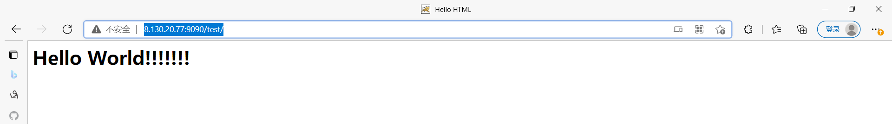

#### 构建和使用一个自制的tomcat镜像

- 需要：tomcat压缩包（.tar.gz后缀名）和JDK压缩包，因为tomcat基于jdk，没有jdk运行不了

- 编写DockerFile文件，官方命名`Dockerfile`，注意大小写，这样build时就会自动在当前文件夹寻找这个文件，不用-f指定了

  ```shell
  [root@iZ0jldalqlhwtqori6z48lZ dockerfile]# mkdir tomcat
  [root@iZ0jldalqlhwtqori6z48lZ dockerfile]# cd tomcat
  [root@iZ0jldalqlhwtqori6z48lZ tomcat]# ls
  apache-tomcat-9.0.52.tar.gz  DockerFile  jdk-8u181-linux-x64.tar.gz  readme.txt
  
  [root@iZ0jldalqlhwtqori6z48lZ tomcat]# vim Dockerfile
  [root@iZ0jldalqlhwtqori6z48lZ tomcat]# cat Dockerfile 
  FROM centos:7 #以centos7为基础构建镜像
  MAINTAINER hzc<2992833016@qq.com>
  
  COPY readme.txt /usr/local/readme.txt #将当前目录的readme.txt复制为容器的/usr/local/中的readme.txt
  
  ADD apache-tomcat-9.0.52.tar.gz /usr/local #将tomcat压缩包复制到/usr/local目录解压
  ADD jdk-8u181-linux-x64.tar.gz /usr/local #将jdk压缩包复制到/usr/local目录解压
  
  RUN yum -y install vim #安装vim命令
  
  ENV MYPATH /usr/local #配置环境变量MYPATH
  
  WORKDIR $MYPATH #配置工作目录
  
  #配置jdk和tomcat的环境变量
  ENV JAVA_HOME /usr/local/jdk1.8.0_181 #这个路径是解压后的文件夹，不一定和压缩包同名
  ENV CLASSPATH $JAVA_HOME/lib/dt.jar:$JAVA_HOME/lib/tools.jar #“:”在配置多个值时分隔
  ENV CATALINA_HOME /usr/local/apache-tomcat-9.0.52
  ENV CATALINA_BASE /usr/local/apache-tomcat-9.0.52
  ENV PATH $PATH:$JAVA_HOME/bin:$CATALINA_HOME/lib:$CATALINA_HOME/bin #$PATH继承原来的PATH，后面的跟在Windows配环境变量差不多，“:”分隔
  
  EXPOSE 8080 #暴露端口8080
  
  CMD $CATALINA_HOME/bin/startup.sh && tail -F $CATALINA_HOME/logs/catalina.out #启动容器时运行startup.sh可执行文件启动tomcat，运行catalina.out打印日志，&&分隔命令
  
  ```

- 构建镜像

  ```shell
  #构建镜像，因为dockerfile文件命名为Dockerfile，所以不需要-f指定了
  [root@iZ0jldalqlhwtqori6z48lZ tomcat]# docker build -t mytomcat .
  Sending build context to Docker daemon  197.2MB
  Step 1/15 : FROM centos:7
  ...
  
  #查看是否构建成功
  [root@iZ0jldalqlhwtqori6z48lZ tomcat]# docker images
  REPOSITORY       TAG       IMAGE ID       CREATED              SIZE
  mytomcat         latest    fbe8e66ae407   About a minute ago   817MB
  ```

- 启动容器

  ```shell
  #启动容器
  #挂载webapps目录下的test目录
  #挂载tomcat的logs目录
  [root@iZ0jldalqlhwtqori6z48lZ tomcat]# docker run -d -p 9090:8080 --name hzctomcat -v /home/dockerfile/tomcat/test:/usr/local/apache-tomcat-9.0.52/webapps/test -v /home/dockerfile/tomcat/logs:/usr/local/apache-tomcat-9.0.52/logs mytomcat
  2ed3857d3c05c041e053021ad6bf91716906fd7ca3b4c70024897ce035ecd582
  
  #测试是否成功，要在容器外
  [root@iZ0jldalqlhwtqori6z48lZ tomcat]# curl localhost:9090
  <!DOCTYPE html>
  <html lang="en">
      <head>
          <meta charset="UTF-8" />
          <title>Apache Tomcat/9.0.52</title>
  ...
  ```

- 发布项目（因为做了卷挂载，我们直接在本地编写项目就可以发布了）

  ```shell
  [root@iZ0jldalqlhwtqori6z48lZ tomcat]# ls
  apache-tomcat-9.0.52.tar.gz  Dockerfile  jdk-8u181-linux-x64.tar.gz  logs  readme.txt  test
  #把test目录作为一个项目
  [root@iZ0jldalqlhwtqori6z48lZ tomcat]# cd test/
  
  #创建WEB-INF目录以及web.xml
  [root@iZ0jldalqlhwtqori6z48lZ test]# mkdir WEB-INF
  [root@iZ0jldalqlhwtqori6z48lZ test]# cd WEB-INF/
  [root@iZ0jldalqlhwtqori6z48lZ WEB-INF]# vim web.xml
  [root@iZ0jldalqlhwtqori6z48lZ WEB-INF]# cat web.xml 
  <?xml version="1.0" encoding="UTF-8"?>
  <web-app version="2.4" 
      xmlns="http://java.sun.com/xml/ns/j2ee" 
      xmlns:xsi="http://www.w3.org/2001/XMLSchema-instance"
      xsi:schemaLocation="http://java.sun.com/xml/ns/j2ee 
          http://java.sun.com/xml/ns/j2ee/web-app_2_4.xsd">
  
  </web-app>
  
  #创建index主页
  [root@iZ0jldalqlhwtqori6z48lZ WEB-INF]# cd ..
  [root@iZ0jldalqlhwtqori6z48lZ test]# vim index.html
  [root@iZ0jldalqlhwtqori6z48lZ test]# cat index.html 
  <html>
  <head>
  	<title>Hello HTML</title>
  </head>
  <body>
  	<h1>Hello World!!!!!!!</h1>
  </body>
  </html>
  
  ```

- 测试访问 8.130.20.77:9090/test/