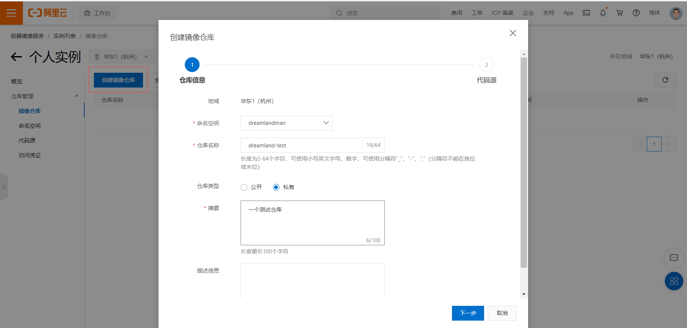

#### Docker Hub上发布镜像

- https://hub.docker.com/ 注册账号

- 确定账号可以登陆

- 在服务器上提及自己的镜像

- 服务器登录Docker

  ```shell
  [root@iZ0jldalqlhwtqori6z48lZ logs]# docker login --help
  Usage:  docker login [OPTIONS] [SERVER]
  Log in to a Docker registry.
  If no server is specified, the default is defined by the daemon.
  Options:
    -p, --password string   Password
        --password-stdin    Take the password from stdin
    -u, --username string   Username
  
  #登录
  [root@iZ0jldalqlhwtqori6z48lZ logs]# docker login -u dreamlandmen -p 17870033452Hzc
  WARNING! Using --password via the CLI is insecure. Use --password-stdin.
  WARNING! Your password will be stored unencrypted in /root/.docker/config.json.
  Configure a credential helper to remove this warning. See
  https://docs.docker.com/engine/reference/commandline/login/#credentials-store
  
  Login Succeeded
  ```

- docker push提交镜像到仓库

  ```shell
  #push时提示没有tag
  [root@iZ0jldalqlhwtqori6z48lZ logs]# docker push dreamlandmen/mytomcat:1.0
  The push refers to repository [docker.io/dreamlandmen/mytomcat]
  An image does not exist locally with the tag: dreamlandmen/mytomcat
  
  #使用tag命令为镜像添加tag，其实是添加一个有tag的新镜像
  An image does not exist locally with the tag: dreamlandmen/mytomcat
  [root@iZ0jldalqlhwtqori6z48lZ logs]# docker tag mytomcat dreamlandmen/tomcat:1.0
  [root@iZ0jldalqlhwtqori6z48lZ logs]# docker images
  REPOSITORY            TAG       IMAGE ID       CREATED        SIZE
  dreamlandmen/tomcat   1.0       fbe8e66ae407   4 hours ago    817MB
  mytomcat              latest    fbe8e66ae407   4 hours ago    817MB
  
  #提交镜像到dockerhub，也是一层一层来的
  [root@iZ0jldalqlhwtqori6z48lZ logs]# docker push dreamlandmen/tomcat:1.0
  The push refers to repository [docker.io/dreamlandmen/tomcat]
  ed9e96f5d11b: Pushing [>                                                  ]  537.6kB/215.5MB
  ddb73c798a53: Pushing [>                                                  ]  1.609MB/381.7MB
  5a0163e8c5e3: Pushing [=>                                                 ]  522.8kB/15.97MB
  2358278699fe: Pushing [==================================================>]  3.072kB
  174f56854903: Preparing 
```

- 登出账号：docker logout

  ```shell
  [root@iZ0jldalqlhwtqori6z48lZ logs]# docker logout
  Removing login credentials for https://index.docker.io/v1/
  ```

#### 发布镜像到阿里云

- 进入阿里云的容器镜像服务，进入步骤和03.Docker安装.md中进入镜像加速器一样

- 创建个人实例（企业版好几百啊啊啊），设置密码
- 创建命名空间

- 创建镜像仓库，设置私有，代码源选择本地仓库

- 浏览仓库内容，可以通过公网地址远程访问该仓库，操作指南里有详细的使用步骤

- 使用

  - 登录阿里云Docker Registry

    ```shell
    $ docker login --username=徊游的鱼 registry.cn-hangzhou.aliyuncs.com
    ```

    用于登录的用户名为阿里云账号全名，密码为开通服务时设置的密码。

    您可以在访问凭证页面修改凭证密码。

  - 从Registry中拉取镜像

    ```shell
    $ docker pull registry.cn-hangzhou.aliyuncs.com/dreamlandman/dreamland-test:[镜像版本号]
    ```

  - 将镜像推送到Registry，tag之后会生成一个`registry.cn-hangzhou.aliyuncs.com/dreamlandman/dreamland-test`镜像，push完就删了吧，不然tag别的镜像时生成的镜像名字一样容易搞混

    ```shell
    $ docker login --username=徊游的鱼 registry.cn-hangzhou.aliyuncs.com
    #tag之后会生成一个registry.cn-hangzhou.aliyuncs.com/dreamlandman/dreamland-test镜像，这也是仓库地址
    $ docker tag [ImageId] registry.cn-hangzhou.aliyuncs.com/dreamlandman/dreamland-test:[镜像版本号]
    #将这个镜像push到这个仓库
    $ docker push registry.cn-hangzhou.aliyuncs.com/dreamlandman/dreamland-test:[镜像版本号]
    ```

  - ```shell
    #登录阿里镜像仓库
    [root@iZ0jldalqlhwtqori6z48lZ logs]# docker login --username=徊游的鱼 registry.cn-hangzhou.aliyuncs.com
    Password: 
    WARNING! Your password will be stored unencrypted in /root/.docker/config.json.
    Configure a credential helper to remove this warning. See
    https://docs.docker.com/engine/reference/commandline/login/#credentials-store
    
    Login Succeeded
    
    #这里使用docker原生push命令也能push到阿里云，因为之前登录的是阿里云的容器镜像服务，可事实上没push上去
    #显示信息：提交仓库为docker.io/dreamlandman/hello-world，不是阿里云的
    [root@iZ0jldalqlhwtqori6z48lZ logs]# docker push dreamlandman/hello-world:1.0
    The push refers to repository [docker.io/dreamlandman/hello-world]
    e07ee1baac5f: Preparing 
    denied: requested access to the resource is denied
    
    #解决:使用阿里的push方法
    [root@iZ0jldalqlhwtqori6z48lZ ~]# docker images
    REPOSITORY                                                      TAG       IMAGE ID       CREATED        SIZE
    hello-world                                                     latest    feb5d9fea6a5   5 months ago   13.3kB
    [root@iZ0jldalqlhwtqori6z48lZ ~]# docker tag feb5d9fea6a5 registry.cn-hangzhou.aliyuncs.com/dreamlandman/dreamland-test:1.0 #创建一个符合阿里标准的镜像
    [root@iZ0jldalqlhwtqori6z48lZ ~]# docker images
    REPOSITORY                                                      TAG       IMAGE ID       CREATED        SIZE
    hello-world                                                     latest    feb5d9fea6a5   5 months ago   13.3kB
    registry.cn-hangzhou.aliyuncs.com/dreamlandman/dreamland-test   1.0       feb5d9fea6a5   5 months ago   13.3kB
    [root@iZ0jldalqlhwtqori6z48lZ ~]# docker push registry.cn-hangzhou.aliyuncs.com/dreamlandman/dreamland-test:1.0
    The push refers to repository [registry.cn-hangzhou.aliyuncs.com/dreamlandman/dreamland-test]
    e07ee1baac5f: Pushed 
    1.0: digest: sha256:f54a58bc1aac5ea1a25d796ae155dc228b3f0e11d046ae276b39c4bf2f13d8c4 size: 525
    ```

    

