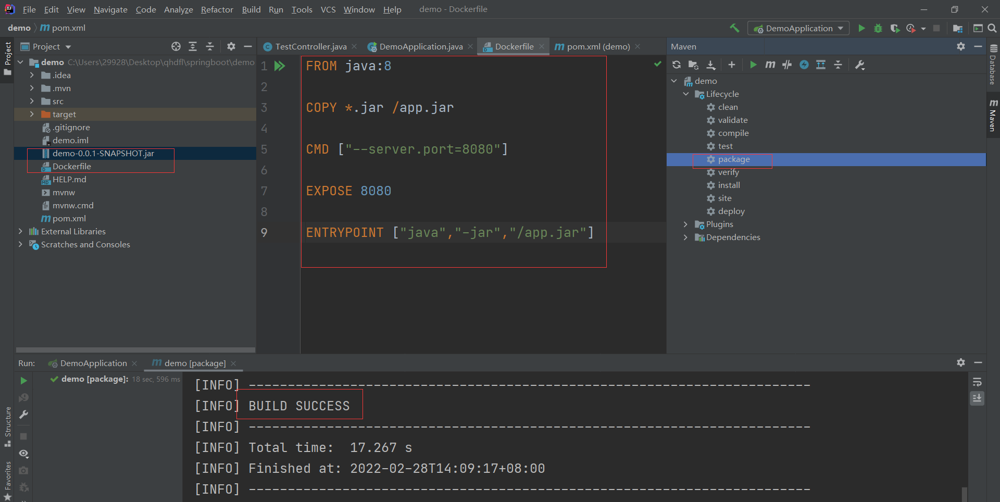
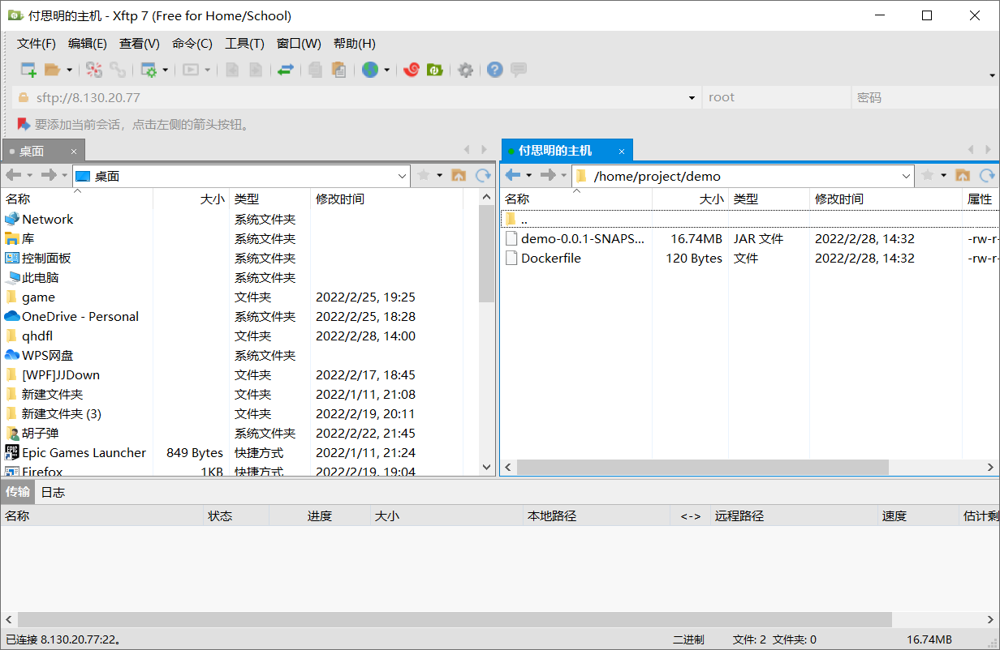

#### 发布SpringBoot项目

- 使用Lifecycle的package命令把springboot打成jar包，命令行提示BUILD SUCCESS代表打包成功，并把jar包从target目录移动到和pom.xml同级

- 在项目根目录，于pom.xml同级创建Dockerfile无后缀名文件，名称不要错了，在里面写Dockerfile脚本

  ```dockerfile
  FROM java:8 #基于java8镜像
  
  COPY *.jar /app.jar #将当前目录的jar包（因为名字太长且只有一个jar，所以用*.jar指代）复制到镜像根目录的app.jar
  
  CMD ["--server.port=8080"] #启动时指定端口，启动时也可以覆盖另外指定
  
  EXPOSE 8080 #暴露8080端口
  
  ENTRYPOINT ["java","-jar","/app.jar"] #启动后运行jar包
  ```

- 发布项目时只需要项目打的jar包和这个Dockerfile文件

- 把jar包和Dockerfile通过xftp发送到服务器，放在自己创建的合适的文件夹，这里放在了/home/project/demo目录下

- 服务器中将Dockerfile打包成镜像，并运行

  ```shell
  [root@iZ0jldalqlhwtqori6z48lZ demo]# ls
  demo-0.0.1-SNAPSHOT.jar  Dockerfile
  [root@iZ0jldalqlhwtqori6z48lZ demo]# docker build -t demo .
  Sending build context to Docker daemon  17.56MB
  Step 1/5 : FROM java:8
  8: Pulling from library/java
  5040bd298390: Pull complete 
  fce5728aad85: Pull complete 
  76610ec20bf5: Pull complete 
  60170fec2151: Pull complete 
  e98f73de8f0d: Pull complete 
  11f7af24ed9c: Pull complete 
  49e2d6393f32: Pull complete 
  bb9cdec9c7f3: Pull complete 
  Digest: sha256:c1ff613e8ba25833d2e1940da0940c3824f03f802c449f3d1815a66b7f8c0e9d
  Status: Downloaded newer image for java:8
   ---> d23bdf5b1b1b
  Step 2/5 : COPY *.jar /app.jar
   ---> 6c054e2f5510
  Step 3/5 : CMD ["--server.port=8080"]
   ---> Running in 2e1d37275cbc
  Removing intermediate container 2e1d37275cbc
   ---> beecf9202941
  Step 4/5 : EXPOSE 8080
   ---> Running in 435d42eb1d2e
  Removing intermediate container 435d42eb1d2e
   ---> 5064620de0fa
  Step 5/5 : ENTRYPOINT ["java","-jar","/app.jar"]
   ---> Running in 8d12b5c89cff
  Removing intermediate container 8d12b5c89cff
   ---> 1fa9e299da58
  Successfully built 1fa9e299da58
  Successfully tagged demo:latest
  
  #查看镜像是否构建成功
  #成功了，还是有点大，以后要精简
  [root@iZ0jldalqlhwtqori6z48lZ demo]# docker images
  REPOSITORY                                                      TAG       IMAGE ID       CREATED              SIZE
  demo                                                            latest    1fa9e299da58   About a minute ago   661MB 
  
  #这里使用随机端口映射运行
  [root@iZ0jldalqlhwtqori6z48lZ demo]# docker run -d -P --name test-web demo
  35886a6df9bd8011614fac5b625ced5f98736ff8b9f1a5f226a54fc0dbf5f932
  
  #查看随机端口是什么，是49153
  [root@iZ0jldalqlhwtqori6z48lZ demo]# docker ps
  CONTAINER ID   IMAGE       COMMAND                  CREATED         STATUS         PORTS                     NAMES
  35886a6df9bd   demo        "java -jar /app.jar …"   3 minutes ago   Up 3 minutes   0.0.0.0:49153->8080/tcp   test-web
  
  #测试访问
  [root@iZ0jldalqlhwtqori6z48lZ demo]# curl localhost:49153
  {"timestamp":"2022-02-28T06:42:56.638+00:00","status":404,"error":"Not Found","path":"/"}[root@iZ0jldalqlhwtqori6z48lZ demo]# curl localhost:49153/hello
  Hello
  
  #指定映射8080端口启动并测试
  [root@iZ0jldalqlhwtqori6z48lZ demo]# docker run -d -p 8080:8080 --name test-web1 demo
  9cd085daa0b6ac64bfaf51d9b0c1c516375b8a4d0af41f8e1147726c7bf9904b
  [root@iZ0jldalqlhwtqori6z48lZ demo]# curl localhost:8080/hello
  Hello
  ```

#### Docker网络回头还要看看

