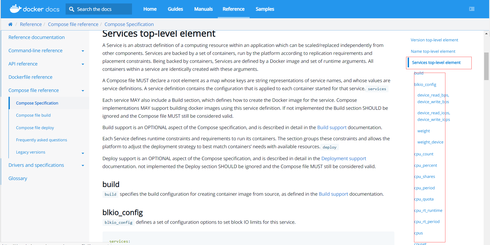
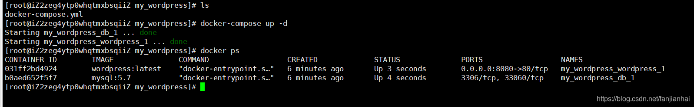

# Docker Compose

## 简介

Docker

Dockerfile build run 手动操作，单个容器！

微服务，100个微服务，依赖关系。

Docker Compose 来轻松高效的管理容器，定义运行多个容器。

> 官方介绍

1. 定义运行多个容器
2. YAML file配置文件
3. single command。命令有哪些？

Compose is a tool for defining and running multi-container Docker applications. With Compose, you use a YAML file to configure your application’s services. Then, with a single command, you create and start all the services from your configuration. To learn more about all the features of Compose, see the list of features.

1. 所有的环境都可以使用compose。

Compose works in all environments: production, staging, development, testing, as well as CI workflows. You can learn more about each case in Common Use Cases.

**三步骤：**

Using Compose is basically a three-step process:

1. Define your app’s environment with a Dockerfile so it can be reproduced anywhere.
   1. Dockerfile保证我们的项目再任何地方可以运行
2. Define the services that make up your app in docker-compose.yml so they can be run together in an isolated environment.
   1. services 什么是服务。
3. Run docker-compose up and Compose starts and runs your entire app.
   1. 启动项目

**作用：批量容器编排**

> 我自己的理解

Compose是Docker官方的[开源项目](https://so.csdn.net/so/search?q=开源项目&spm=1001.2101.3001.7020)，需要安装！

`Dockerfile`让程序在任何地方运行。web服务、redis、mysql、nginx... 多个容器。 run

Compose

```
version: '2.0'
services:
  web:
    build: .
    ports:
    - "5000:5000"
    volumes:
    - .:/code
    - logvolume01:/var/log
    links:
    - redis
  redis:
    image: redis
volumes:
  logvolume01: {}
```

docker-compose up 100个服务

Compose：重要概念

- 服务services， 容器、应用（web、redis、mysql...）
- 项目project。 一组关联的容器

## 安装

1. 下载

   ```
   # 官网提供 （没有下载成功）
   curl -L "https://github.com/docker/compose/releases/download/1.26.2/docker-compose-$(uname -s)-$(uname -m)" -o /usr/local/bin/docker-compose
    
   # 国内地址
   curl -L https://get.daocloud.io/docker/compose/releases/download/1.25.5/docker-compose-`uname -s`-`uname -m` > /usr/local/bin/docker-compose
   ```

2. 授权	

```perl
chmod +x /usr/local/bin/docker-compose
```


## 体验(没有测试通过)

地址：https://docs.docker.com/compose/gettingstarted/

python应用。 计数器。redis！

1. 应用app.py

   ```bash
   [root@iZwz9dz9p8ei9h0gwdz6ohZ docker]# mkdir composetest
   [root@iZwz9dz9p8ei9h0gwdz6ohZ docker]# cd composetest/
   [root@iZwz9dz9p8ei9h0gwdz6ohZ composetest]# vim app.py
   [root@iZwz9dz9p8ei9h0gwdz6ohZ composetest]# cat app.py
   import time
   
   import redis
   from flask import Flask
   
   app = Flask(__name__)
   cache = redis.Redis(host='redis', port=6379)
   
   def get_hit_count():
       retries = 5
       while True:
           try:
               return cache.incr('hits')
           except redis.exceptions.ConnectionError as exc:
               if retries == 0:
                   raise exc
               retries -= 1
               time.sleep(0.5)
   
   @app.route('/')
   def hello():
       count = get_hit_count()
       return 'Hello World! I have been seen {} times.\n'.format(count)
   [root@iZwz9dz9p8ei9h0gwdz6ohZ composetest]# vim requirements.txt	#创建文件，引用redis和flask，现在没什么用，后面会在Dockerfile中用到
   [root@iZwz9dz9p8ei9h0gwdz6ohZ composetest]# cat requirements.txt 
   flask
   redis
   ```

2. Dockerfile 应用打包为镜像

   ```bash
   [root@iZwz9dz9p8ei9h0gwdz6ohZ composetest]# vim Dockerfile
   [root@iZwz9dz9p8ei9h0gwdz6ohZ composetest]# cat Dockerfile 
   # syntax=docker/dockerfile:1
   FROM python:3.7-alpine	#基于python3.7
   WORKDIR /code	#工作目录为/code
   ENV FLASK_APP=app.py	#环境变量
   ENV FLASK_RUN_HOST=0.0.0.0	#环境变量
   RUN apk add --no-cache gcc musl-dev linux-headers	#运行
   COPY requirements.txt requirements.txt	#复制requirements.txt文件到工作目录中
   RUN pip install -r requirements.txt	#使用pip安装
   EXPOSE 5000	#暴露端口5000
   COPY . .	#把当前目录所有内容拷贝到工作目录
   CMD ["flask", "run"]	#运行时加上flask run命令
   ```

   ```
   #备用Dockerfile
   FROM python:3.7-alpine
   RUN echo -e http://mirrors.ustc.edu.cn/alpine/v3.12/main/ > /etc/apk/repositories
   WORKDIR /code
   ENV FLASK_APP=app.py
   ENV FLASK_RUN_HOST=0.0.0.0
   RUN apk add --no-cache gcc musl-dev linux-headers
   COPY requirements.txt requirements.txt
   RUN pip install -i https://pypi.tuna.tsinghua.edu.cn/simple --no-cache-dir -r requirements.txt
   EXPOSE 5000
   COPY . .
   CMD ["flask", "run"]
   ```

   ```
   #原笔记
   FROM python:3.6-alpine
   ADD . /code
   WORKDIR /code
   RUN pip install -r requirements.txt
   CMD ["python", "app.py"]
    
   # 官网的用来flask框架，我们这里不用它
   # 这告诉Docker
   # 从python3.7开始构建镜像
   # 将当前目录添加到/code印像中的路径中
   # 将工作目录设置为/code
   # 安装Python依赖项
   # 将容器的默认命令设置为python app.py
   ```

3. Docker-compose.yml文件（定义整个服务，需要的环境 web、redis） 完整的上线服务！

   ```
   [root@iZwz9dz9p8ei9h0gwdz6ohZ composetest]# vim docker-compose.yml
   [root@iZwz9dz9p8ei9h0gwdz6ohZ composetest]# cat docker-compose.yml 
   version: "3.9"
   services:
     web:	#名字不重要，只是docker build .打包后好辨识而已
       build: .	#web服务通过docker build .命令生成镜像
       ports:
         - "8000:5000"	#暴露端口5000，映射到主机8000端口
     redis:
       image: "redis:alpine"	#redis服务镜像从从官方拉取
   
   ```

   ```
   #原笔记
   version: '3.8'
   services:
     web:
       build: .
       ports:
         - "5000:5000"
       volumes:
         - .:/code
     redis:
       image: "redis:alpine"
   ```

4. 启动compose 项目 （docker-compose up）

   ```bash
   [root@iZwz9dz9p8ei9h0gwdz6ohZ composetest]# docker-compose up
   #报错了，提示版本docker-compose版本和yml版本不符，yml中版本应该是2.2或3.3
   ERROR: Version in "./docker-compose.yml" is unsupported. You might be seeing this error because you're using the wrong Compose file version. Either specify a supported version (e.g "2.2" or "3.3") and place your service definitions under the `services` key, or omit the `version` key and place your service definitions at the root of the file to use version 1.
   For more on the Compose file format versions, see https://docs.docker.com/compose/compose-file/
   [root@iZwz9dz9p8ei9h0gwdz6ohZ composetest]# vim docker-compose.yml 
   #将docker-compose.yml的version值改为3.3后，重新启动
   [root@iZwz9dz9p8ei9h0gwdz6ohZ composetest]# docker-compose up
   #流程：
   #1. 创建网络
   #2. 执行Docker-compose.yaml
   #3. 启动服务
   Creating network "composetest_default" with the default driver
   Building web
   Step 1/10 : FROM python:3.7-alpine
   3.7-alpine: Pulling from library/python
   df9b9388f04a: Pull complete
   a1ef3e6b7a02: Pull complete
   592c86358a0b: Pull complete
   cb59fb21dd58: Pull complete
   71f822da1bbc: Pull complete
   Digest: sha256:9490484ee67ff879ed17a88628268ebbe95c229e6fa008bf6283ebff6e82e53a
   Status: Downloaded newer image for python:3.7-alpine
    ---> 6a41fe9d0cbc
   Step 2/10 : WORKDIR /code
   ...
   fetch https://dl-cdn.alpinelinux.org/alpine/v3.15/main/x86_64/APKINDEX.tar.gz
   #下载好慢啊
   #如果安装gcc卡住的，可以使用去第二步使用备用Dockerfile
   (1/15) Downgrading musl (1.2.2-r7 -> 1.1.24-r10)
   (2/15) Downgrading apk-tools (2.12.7-r3 -> 2.10.8-r1)
   ...
   Executing busybox-1.34.1-r5.trigger
   OK: 156 MiB in 49 packages
   Removing intermediate container b25ba08ae04c
    ---> cd34c7368d2c
   Step 7/11 : COPY requirements.txt requirements.txt
   ...
   Successfully built 18a0ca5b47ba
   Successfully tagged composetest_web:latest
   WARNING: Image for service web was built because it did not already exist. To rebuild this image you must use `docker-compose build` or `docker-compose up --build`.
   Pulling redis (redis:alpine)...
   alpine: Pulling from library/redis
   df9b9388f04a: Already exists
   192e03523482: Pull complete
   7151bccd2756: Pull complete
   683d62ead94f: Pull complete
   b4ca937b9a43: Pull complete
   b4bb2d8d1296: Pull complete
   Digest: sha256:541e6d75df5dfb08e8859929bab06da265673808a6f2285abe6b7c76c1c98c6e
   Status: Downloaded newer image for redis:alpine
   Creating composetest_web_1   ... done
   Creating composetest_redis_1 ... done
   Attaching to composetest_redis_1, composetest_web_1
   redis_1  | 1:C 22 May 2022 08:38:04.387 # oO0OoO0OoO0Oo Redis is starting oO0OoO0OoO0Oo
   redis_1  | 1:C 22 May 2022 08:38:04.387 # Redis version=7.0.0, bits=64, commit=00000000, modified=0, pid=1, just started
   ...
   web_1    |  * Serving Flask app 'app.py' (lazy loading)
   web_1    |  * Environment: production
   ...
   ```

5. docker image命令可以看到很多新的镜像，是因为docker-compose up命令下载的

   ```bash
   [root@iZwz9dz9p8ei9h0gwdz6ohZ ~]# docker images
   REPOSITORY        TAG          IMAGE ID       CREATED        SIZE
   composetest_web   latest       18a0ca5b47ba   6 hours ago    203MB
   #这个none不知道是什么，可能是之前中断下载，重新下载导致的吧
   <none>            <none>       c98d57756abe   6 hours ago    45.6MB
   python            3.7-alpine   6a41fe9d0cbc   4 days ago     45.6MB
   redis             alpine       8a0942cae737   3 weeks ago    36.5MB
   ```

6. docker ps查看当前正在运行的容器，运行着composetest_web_1和composetest_redis_1两个容器，composetest是Docker-compose.yml所在文件夹名称，web和redis为镜像名称，后面的_1是容器的序号，因为后面可能会搭建集群，这个名称是由docker-compose自动生成的

   ```bash
   [root@iZwz9dz9p8ei9h0gwdz6ohZ ~]# docker ps
   CONTAINER ID   IMAGE             COMMAND                  CREATED        STATUS        PORTS                               NAMES
   7281f04df197   composetest_web   "flask run"              6 hours ago    Up 6 hours    0.0.0.0:8000->5000/tcp              composetest_web_1
   
   2551a8e1ea71   redis:alpine      "docker-entrypoint.s…"   6 hours ago    Up 6 hours    6379/tcp                            composetest_redis_1
   ```

7. docker network ls查看docker网络

   - 如果一个项目的docker太多，其之间的网络会非常麻烦，docker-compose会自动创建一个网络
   - 网络中有多个镜像的容器，比如说10个mysql容器，mysql_1、mysql_2、...，这时访问mysql:3306，docker会把这个请求转接到mysql的10个实例，不用写IP，可以类比成localhost

   ```bash
   [root@iZwz9dz9p8ei9h0gwdz6ohZ ~]# docker network ls
   NETWORK ID     NAME                  DRIVER    SCOPE
   1e803a28d016   bridge                bridge    local
   #除了其它三个默认的网络，docker-compose会自动创建一个网络
   e5f9fe5a03ae   composetest_default   bridge    local
   9ff6c3db6461   host                  host      local
   0dbefcc4d53f   none                  null      local
   #查看composetest_default的网络细节
   [root@iZwz9dz9p8ei9h0gwdz6ohZ ~]# docker inspect composetest_default
   [
       {
           "Name": "composetest_default",
           "Id": "e5f9fe5a03aed1b929041b18a10853842b18de05072c6cca2b4769569463d5c6",
           "Created": "2022-05-22T16:17:25.437778402+08:00",
           "Scope": "local",
           "Driver": "bridge",
           "EnableIPv6": false,
           "IPAM": {
               "Driver": "default",
               "Options": null,
               "Config": [
                   {
                       "Subnet": "172.18.0.0/16",
                       "Gateway": "172.18.0.1"
                   }
               ]
           },
           "Internal": false,
           "Attachable": true,
           "Ingress": false,
           "ConfigFrom": {
               "Network": ""
           },
           "ConfigOnly": false,
           #容器，之前启动的redis和web服务都在这里
           "Containers": {
               "2551a8e1ea717a1ff68b9faca274b937f647013df388fa7c662dfcd33acee21c": {
                   "Name": "composetest_redis_1",
                   "EndpointID": "f52bdb6197ebd0ed346e7b70b188636c6ed0f6a6da3040ef6133a875741e71be",
                   "MacAddress": "02:42:ac:12:00:03",
                   "IPv4Address": "172.18.0.3/16",
                   "IPv6Address": ""
               },
               "7281f04df197e5e5c6af455d7d01d0bae86bcee47ebaaa3c3debdb5843a62dbd": {
                   "Name": "composetest_web_1",
                   "EndpointID": "445c84e690aff09b2ba5978efbdb5b1e0e238d83c0c07245170363603fc34fe7",
                   "MacAddress": "02:42:ac:12:00:02",
                   "IPv4Address": "172.18.0.2/16",
                   "IPv6Address": ""
               }
           },
           "Options": {},
           "Labels": {
               "com.docker.compose.network": "default",
               "com.docker.compose.project": "composetest",
               "com.docker.compose.version": "1.24.0"
           }
       }
   ]
   
   ```

8. 其它设置

9. 停止所有服务，需要在docker-compose.yml目录中使用

   -  docker-compose stop：停止服务中的容器
   - docker-compose down：暴力停止，卡住就ctrl+c，同时删除已停止的容器及其网络

## yaml规则

docker-compose.yaml 核心！

https://docs.docker.com/compose/compose-file/#compose-file-structure-and-examples

```yml
#三层
#第一层版本
version:'版本号'
#第二层服务
services:
	服务1:web
		images:	#容器创建使用的镜像
		build:	#容器创建使用的命令
		netword:	#网络
	服务2:redis
	服务3:
#第三层，其它配置
#网络配置、卷挂载、全局规则
volumes:
networks:
configs:
```

Service层能使用的命令，其它层同理

### **services常用命令**

1. build：容器生成命令

   ```yml
   services:
   	webapp:
   		build: ./dir #生成当前目录的一些应用
   ```

   1. context：声明Dockerfile的位置

      ```yml
      services:
      	webapp:
      		build:
        			context: ./dir	#表示Dockerfile文件在当前目录的dir目录中
      ```

   2. dockerfile：指定Dockerfile文件

      ```yml
      services:
      	webapp:
      		build:
        			dockerfile: webapp.Dockerfile
      ```

2. container_name：容器名称，不使用其默认生成的名称

   ```yml
   container_name: my-web-container
   ```

3. depends_on：声明该服务需要依赖其它哪些服务，比如web项目需要依赖mysql，那么web将在mysql之后启动

   ```yml
   services:
     web:
       build: .
       depends_on:
         - db
         - redis
     redis:
       image: redis
     db:
       image: postgres
   ```

4. deploy：部署，在集群中使用

   ```yml
   services:
     frontend:
       image: awesome/webapp
       ports:
         - "8080:80"
       deploy:
         mode: replicated
         replicas: 2	#副本，指定在任何给定时间应运行的容器数
         endpoint_mode: vip
   ```

5. devices

6. dns

7. entrypoint

8. environment

9. expose

10. images

11. links

**例子**

```yml
#2 个服务，由 Docker 映像提供支持：和webappdatabase
#1 个密钥（HTTPS 证书），注入前端
#1 个配置 （HTTP），注入前端
#1 个持久卷，附加到后端
#2 个网络

services:
  frontend:	#服务名称
    image: awesome/webapp	#镜像名称
    ports:
      - "443:8043"	#端口映射
    networks:	#网络
      - front-tier	#第三层网络配置中的
      - back-tier
    configs:	#配置
      - httpd-config	#第三层全局配置
    secrets:	#密钥
      - server-certificate

  backend:	#服务名称
    image: awesome/database
    volumes:	#第三层的卷挂载
      - db-data:/etc/data
    networks:	#网络配置
      - back-tier

volumes:	#卷挂载
  db-data:
    driver: flocker
    driver_opts:
      size: "10GiB"

configs:	#全局配置
  httpd-config:
    external: true

secrets:	#密钥
  server-certificate:
    external: true

networks:	#网络
  # The presence of these objects is sufficient to define them
  front-tier: {}
  back-tier: {}
```

## 开源项目：博客

https://docs.docker.com/compose/wordpress/

下载程序、安装数据库、配置....

compose应用 => 一键启动

1. 下载项目（docker-compse.yaml）
2. 如果需要文件。Dockerfile
3. 文件准备齐全，一键启动项目即可



## 实战1：自己编写微服务上线

### 编写项目微服务

导入依赖

```xml
<!--springboot版本2.3.4.RELEASE-->
<dependencies>
    <dependency>
        <groupId>org.springframework.boot</groupId>
        <artifactId>spring-boot-starter-data-redis</artifactId>
    </dependency>
    <dependency>
        <groupId>org.springframework.boot</groupId>
        <artifactId>spring-boot-starter-web</artifactId>
    </dependency>

    <dependency>
        <groupId>org.springframework.boot</groupId>
        <artifactId>spring-boot-starter-test</artifactId>
        <scope>test</scope>
    </dependency>
</dependencies>
```

控制器

```java
package com.hzc.redisdemo.controller;

import org.springframework.beans.factory.annotation.Autowired;
import org.springframework.data.redis.core.StringRedisTemplate;
import org.springframework.web.bind.annotation.GetMapping;
import org.springframework.web.bind.annotation.RestController;

@RestController
public class HelloController {
    @Autowired
    StringRedisTemplate stringRedisTemplate;

    @GetMapping("hello")
    public String hello(){
        //名称请求views值+1
        Long views = stringRedisTemplate.opsForValue().increment("views");
        //显示请求次数
        return "hello hzc,views"+views;
    }
}
```

application.yml

```yml
server:
  port: 8080
spring:
  redis:
  #host原本应该是主机的IP，或者是localhost，这里值为docker-compose.yml的服务名称
  #在本机是跑不起来的，因为本机没有redis主机，需要部署到docker上
    host: redis
```

Dockerfile

```dockerfile
FROM java:8

COPY *.jar /app.jar

CMD ["--server.port=8080"]

EXPOSE 8080

ENTRYPOINT ["java","-jar","/app.jar"]
```

docker-compose.yml

```yml
version: '3.3'
services:
  redis-demo:
    build: .
    image: redis-demo
    depends_on:
      - redis
    ports:
      - "8080:8080"
  redis:
    image: "library/redis:alpine"
```


### Dockerfile构建镜像

```sql
FROM java:8
 
COPY *.jar /app.jar
 
CMD ["--server.port=8080"]
 
EXPOSE 8080
 
ENTRYPOINT ["java", "-jar", "/app.jar"]
```

### docker-compose.yml编排项目

```
version '3.8'
services:
  xiaofanapp:
    build: .
    image: xiaofanapp
    depends_on:
      - redis
    ports:
      - "8080:8080"
 
  redis:
    image: "library/redis:alpine"
```

### 丢到服务器运行 docker-compose up

```bash
[root@iZwz9dz9p8ei9h0gwdz6ohZ redisDemo]# ls
docker-compose.yml  Dockerfile  redis-demo-0.0.1-SNAPSHOT.jar
[root@iZwz9dz9p8ei9h0gwdz6ohZ redisDemo]# docker-compose up
redisdemo_redis_1 is up-to-date
Starting redisdemo_redis-demo_1 ... done
Attaching to redisdemo_redis_1, redisdemo_redis-demo_1
redis_1       | 1:C 23 May 2022 08:03:07.408 # oO0OoO0OoO0Oo Redis is starting oO0OoO0OoO0Oo
redis_1       | 1:C 23 May 2022 08:03:07.408 # Redis version=7.0.0, bits=64, commit=00000000, modified=0, pid=1, just started
redis_1       | 1:C 23 May 2022 08:03:07.408 # Warning: no config file specified, using the default config. In order to specify a config file use redis-server /path/to/redis.conf
redis_1       | 1:M 23 May 2022 08:03:07.409 * monotonic clock: POSIX clock_gettime
redis_1       | 1:M 23 May 2022 08:03:07.410 * Running mode=standalone, port=6379.
redis_1       | 1:M 23 May 2022 08:03:07.410 # WARNING: The TCP backlog setting of 511 cannot be enforced because /proc/sys/net/core/somaxconn is set to the lower value of 128.
redis_1       | 1:M 23 May 2022 08:03:07.410 # Server initialized
redis_1       | 1:M 23 May 2022 08:03:07.410 # WARNING overcommit_memory is set to 0! Background save may fail under low memory condition. To fix this issue add 'vm.overcommit_memory = 1' to /etc/sysctl.conf and then reboot or run the command 'sysctl vm.overcommit_memory=1' for this to take effect.
redis_1       | 1:M 23 May 2022 08:03:07.410 * The AOF directory appendonlydir doesn't exist
redis_1       | 1:M 23 May 2022 08:03:07.410 * Ready to accept connections
redis-demo_1  | 
redis-demo_1  |   .   ____          _            __ _ _
redis-demo_1  |  /\\ / ___'_ __ _ _(_)_ __  __ _ \ \ \ \
redis-demo_1  | ( ( )\___ | '_ | '_| | '_ \/ _` | \ \ \ \
redis-demo_1  |  \\/  ___)| |_)| | | | | || (_| |  ) ) ) )
redis-demo_1  |   '  |____| .__|_| |_|_| |_\__, | / / / /
redis-demo_1  |  =========|_|==============|___/=/_/_/_/
redis-demo_1  |  :: Spring Boot ::        (v2.3.4.RELEASE)
redis-demo_1  | 
redis-demo_1  | 2022-05-23 08:05:08.992  INFO 1 --- [           main] com.hzc.redisdemo.RedisDemoApplication   : Starting RedisDemoApplication v0.0.1-SNAPSHOT on 192a9440fa54 with PID 1 (/app.jar started by root in /)
redis-demo_1  | 2022-05-23 08:05:09.001  INFO 1 --- [           main] com.hzc.redisdemo.RedisDemoApplication   : No active profile set, falling back to default profiles: default
redis-demo_1  | 2022-05-23 08:05:10.851  INFO 1 --- [           main] .s.d.r.c.RepositoryConfigurationDelegate : Multiple Spring Data modules found, entering strict repository configuration mode!
redis-demo_1  | 2022-05-23 08:05:10.854  INFO 1 --- [           main] .s.d.r.c.RepositoryConfigurationDelegate : Bootstrapping Spring Data Redis repositories in DEFAULT mode.
redis-demo_1  | 2022-05-23 08:05:10.938  INFO 1 --- [           main] .s.d.r.c.RepositoryConfigurationDelegate : Finished Spring Data repository scanning in 39ms. Found 0 Redis repository interfaces.
redis-demo_1  | 2022-05-23 08:05:12.381  INFO 1 --- [           main] o.s.b.w.embedded.tomcat.TomcatWebServer  : Tomcat initialized with port(s): 8080 (http)
redis-demo_1  | 2022-05-23 08:05:12.421  INFO 1 --- [           main] o.apache.catalina.core.StandardService   : Starting service [Tomcat]
redis-demo_1  | 2022-05-23 08:05:12.421  INFO 1 --- [           main] org.apache.catalina.core.StandardEngine  : Starting Servlet engine: [Apache Tomcat/9.0.38]
redis-demo_1  | 2022-05-23 08:05:12.614  INFO 1 --- [           main] o.a.c.c.C.[Tomcat].[localhost].[/]       : Initializing Spring embedded WebApplicationContext
redis-demo_1  | 2022-05-23 08:05:12.614  INFO 1 --- [           main] w.s.c.ServletWebServerApplicationContext : Root WebApplicationContext: initialization completed in 3476 ms
redis-demo_1  | 2022-05-23 08:05:14.971  INFO 1 --- [           main] o.s.s.concurrent.ThreadPoolTaskExecutor  : Initializing ExecutorService 'applicationTaskExecutor'
redis-demo_1  | 2022-05-23 08:05:15.785  INFO 1 --- [           main] o.s.b.w.embedded.tomcat.TomcatWebServer  : Tomcat started on port(s): 8080 (http) with context path ''
redis-demo_1  | 2022-05-23 08:05:15.801  INFO 1 --- [           main] com.hzc.redisdemo.RedisDemoApplication   : Started RedisDemoApplication in 8.059 seconds (JVM running for 9.221)
#查看运行的容器
[root@iZwz9dz9p8ei9h0gwdz6ohZ ~]# docker ps
CONTAINER ID   IMAGE          COMMAND                  CREATED          STATUS          PORTS                               NAMES
192a9440fa54   redis-demo     "java -jar /app.jar …"   23 minutes ago   Up 21 minutes   0.0.0.0:8080->8080/tcp              redisdemo_redis-demo_1
c976ca8c3a34   redis:alpine   "docker-entrypoint.s…"   23 minutes ago   Up 23 minutes   6379/tcp                            redisdemo_redis_1
#查看镜像
[root@iZwz9dz9p8ei9h0gwdz6ohZ ~]# docker images
REPOSITORY        TAG          IMAGE ID       CREATED          SIZE
redis-demo        latest       6c3340d3f6ce   24 minutes ago   669MB
redis             alpine       8a0942cae737   3 weeks ago      36.5MB
java              8            d23bdf5b1b1b   5 years ago      643MB
#访问服务
[root@iZwz9dz9p8ei9h0gwdz6ohZ ~]# curl localhost:8080/hello
hello hzc,views1[root@iZwz9dz9p8ei9h0gwdz6ohZ ~]# curl localhost:8080/hello
hello hzc,views2[root@iZwz9dz9p8ei9h0gwdz6ohZ ~]# 
```

```bash
#如果docker-compose up报错了，根据警告修改后
#需要执行down命令关闭并清除容器，再使用up --build命令重构项目，--build是为了构建镜像，防止容器存在但是镜像不存在而报错
docker-compose down         # 关闭容器
docker-compose up --build   # 重新构建
```

**总结：**

**工程、服务、容器**

项目 compose： 三层

- 工程 Project
- 服务
- 容器 运行实例！ docker k8s 容器

## 实战2：将war包项目上线

- 项目使用的SSM框架+mysql技术

- 在pom.xml中将项目的打包类型改成war

  ```xml
  <packaging>war</packaging>
  ```

- 将配置文件中的jdbc的url中的`localhost:3306`，改成`mysql`，因为后面通过docker网络访问，`mysql`是一个docker服务的名称

- 在idea中启动项目，idea会自动将项目打成war包，`club.war`

- 在服务器中创建目录

  - /data/tomcat/webapps
  - /data/tomcat/logs
  - /data/mysql/data
  - /data/mysql/conf
  - /data/mysql/log

- 将war包上传到服务器的/data/tomcat/webapps目录中

- 将项目需要的sql语句保存成sql文件上传到服务器任意目录（放到mysql挂载的目录也可以）

- 编写docker-compose.yml文件，并使用`docker-compose up`命令构建docker服务和docker网络

  - 如果期间出现错误，更正之后应当先使用`docker-compose down`删除docker容器并且移除docker网络，然后使用`docker-compose up --build`重新构建

  ```yml
  version: "3.3"
  services:
    tomcat:
      image: "tomcat:8.5-jdk11-temurin-focal"
      ports:
        - "80:8080"
      volumes:
        - "/data/tomcat/webapps:/usr/local/tomcat/webapps"
        - "/data/tomcat/logs:/usr/local/tomcat/logs"
      depends_on:
        - mysql
        
    mysql:
      restart: always
      image: "mysql:5.7"
      ports:
        - 3366:3306
      volumes:
        - "/data/mysql/data:/var/lib/mysql"
        - "/data/mysql/conf:/etc/mysql"
        - "/data/mysql/log:/var/log/mysql"
      environment:
        - "TZ=Asia/Shanghai"
        - "MYSQL_ROOT_PASSWORD=root"
      command:
        --character-set-server=utf8mb4
        --collation-server=utf8mb4_general_ci
  ```

- 查看容器

  ```bash
  [root@iZwz9dz9p8ei9h0gwdz6ohZ club]# docker ps
  CONTAINER ID   IMAGE                            COMMAND                  CREATED          STATUS          PORTS                               NAMES
  be81c432b59b   tomcat:8.5-jdk11-temurin-focal   "catalina.sh run"        20 minutes ago   Up 20 minutes   0.0.0.0:8088->8080/tcp              club_tomcat_1
  e6459a808ac6   mysql:5.7                        "docker-entrypoint.s…"   20 minutes ago   Up 20 minutes   33060/tcp, 0.0.0.0:3366->3306/tcp   club_mysql_1
  ```

- tomcat容器启动之后会自动将挂载目录中的club.war解压成同名文件夹club

- 使用`docker cp sql文件路径 club_mysql_1:/`，将sql文件上传到容器的根目录，进入容器并且进入mysql控制台，使用`source /xxx.sql`执行其中的sql语句

- 构建成功之后通过http://120.77.96.250:80/club访问