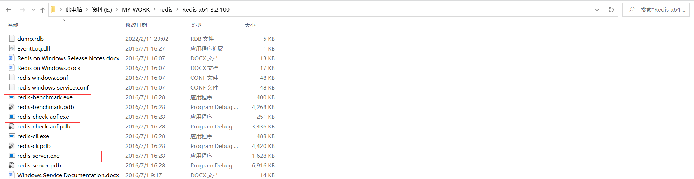
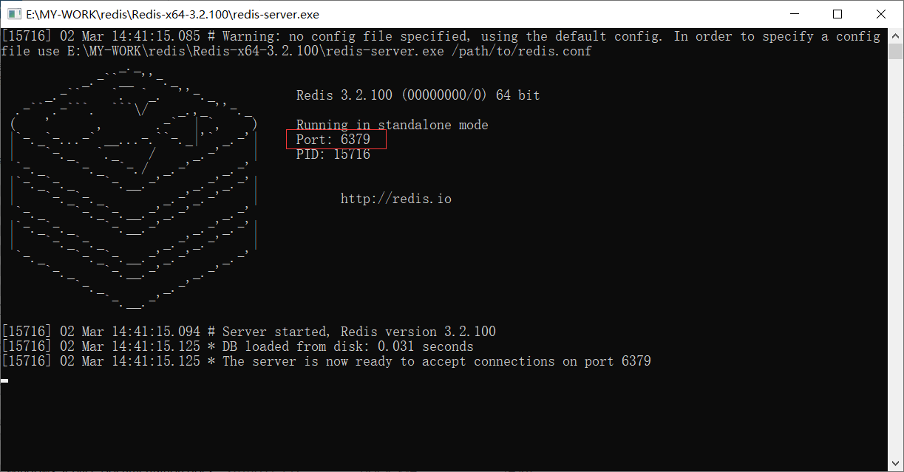
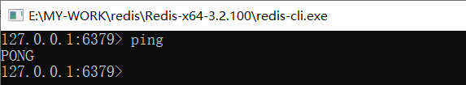

#### Redis是什么？

- Redis（**Re**mote **Di**ctionary **S**erver )，即**远程字典服务**。

- 是一个免费开源的使用ANSI、C语言编写、支持网络、可基于内存亦可持久化的日志型、Key-Value数据库，并提供多种语言的API。是当下最热门的NoSQL技术之一，也被人称之为结构化数据库。

- 与memcached一样，为了保证效率，**数据都是缓存在内存中**。区别的是redis会周期性的把更新的数据写入磁盘或者把修改操作写入追加的记录文件，并且在此基础上实现了master-slave(主从)同步。

#### Redis能干什么？

- 内存存储、持久化，内存是断电即失的，所以需要持久化（RDB、AOF）
- 高效率、用于高速缓冲
- 发布订阅系统
- 地图信息分析
- 计时器、计数器（浏览量）
- ...

#### 特性

- 多样的数据类型
- 持久化
- 集群
- 事务
- …

#### 性能

- 读的速度是110000次/s
- 写的速度是81000次/s 。

#### 学习中要用到的东西

- 官网：https://redis.io/
- 中文网：http://www.redis.cn/

#### 注意

- 推荐使用Linux服务器学习。
- windows版本的Redis已经停更很久了，不建议使用…
- 教程中redis6的make会报错，已解决

#### Windows版下载

- https://github.com/dmajkic/redis，下载完解压

- redis-server.exe：开启服务端，双击运行
  - **默认端口：6379**
- redis-cli.exe：开启客户端，双击运行，默认连接127.0.0.1:6379
  - 测试连接：输入命令`ping`，打印PONG表示连接成功 
- redis-check-aof.exe：检查持久化
- redis-benchmark.exe：测试性能的