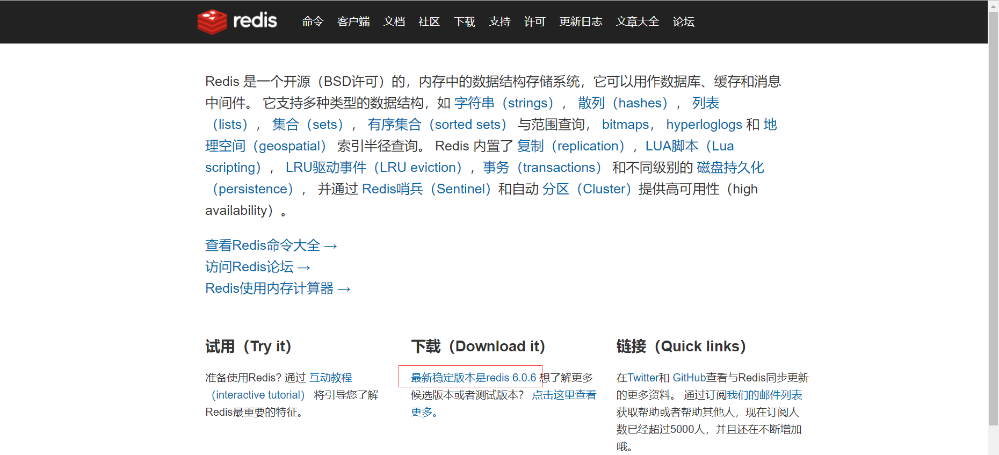
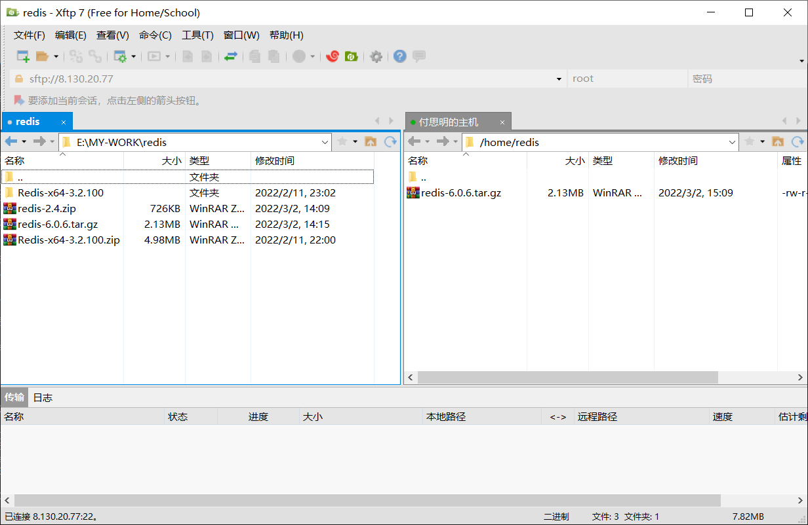

#### Linux版下载

- 可以宝塔安装，但是还是建议学学

- 访问redis中文网下载，最新版不要怂，`redis-6.0.6.tar.gz`

- 使用xftp将压缩包复制到服务器，路径没关系，反正待会还会移动到/opt

- 在服务器将压缩包移动到/opt目录

  ```shell
  [root@iZ0jldalqlhwtqori6z48lZ redis]# mv redis-6.0.6.tar.gz /opt
  [root@iZ0jldalqlhwtqori6z48lZ redis]# cd /opt
  [root@iZ0jldalqlhwtqori6z48lZ opt]# ls #查看移动是否成功，成功了，redis-6.0.6.tar.gz
  config.log  containerd  gcc-5.3.0  gcc-5.3.0.tar.gz  gmp-4.3.2.tar.bz2  redis-6.0.6.tar.gz
  
  #将压缩包解压
  [root@iZ0jldalqlhwtqori6z48lZ opt]# tar -zxvf redis-6.0.6.tar.gz 
  redis-6.0.6/
  redis-6.0.6/.github/
  redis-6.0.6/.github/workflows/
  ...
  #解压成功了，redis-6.0.6
  [root@iZ0jldalqlhwtqori6z48lZ opt]# ls 
  config.log  containerd  gcc-5.3.0  gcc-5.3.0.tar.gz  gmp-4.3.2.tar.bz2  redis-6.0.6  redis-6.0.6.tar.gz
  
  #查看redis中的文件
  [root@iZ0jldalqlhwtqori6z48lZ opt]# cd redis-6.0.6
  [root@iZ0jldalqlhwtqori6z48lZ redis-6.0.6]# ls #redis的配置文件：redis.conf
  00-RELEASENOTES  CONTRIBUTING  deps     Makefile   README.md   runtest          runtest-moduleapi  sentinel.conf  tests   utils
  BUGS             COPYING       INSTALL  MANIFESTO  redis.conf  runtest-cluster  runtest-sentinel   src            TLS.md
  ```

- 发现文件夹中没有redis-server可执行文件，需要安装

  ```shell
  #因为redis是c++编写的，所以运行redis-server需要最基本的c++环境
  #不要用这个命令了，版本太低了
  [root@iZ0jldalqlhwtqori6z48lZ redis-6.0.6]# yum install gcc-c++
  Loaded plugins: fastestmirror
  Loading mirror speeds from cached hostfile
  ...
  #查看gcc版本，看看是否安装成功
  [root@iZ0jldalqlhwtqori6z48lZ redis-6.0.6]# gcc -v
  Using built-in specs.
  COLLECT_GCC=gcc
  ...
  
  #安装6.0以上版本需要升级gcc到5.3及以上,如下：升级到gcc 9.3：
  #yum -y install centos-release-scl
  #yum -y install devtoolset-9-gcc devtoolset-9-gcc-c++ devtoolset-9-binutils
  #scl enable devtoolset-9 bash
  #需要注意的是scl命令启用只是临时的，退出shell或重启就会恢复原系统gcc版本。如果要长期使用gcc 9.3的话：
  #echo "source /opt/rh/devtoolset-9/enable" >>/etc/profile
  #这样退出shell重新打开就是新版的gcc了
  
  [root@iZ0jldalqlhwtqori6z48lZ redis-6.0.6]# yum -y install centos-release-scl
  Loaded plugins: fastestmirror
  ...
  [root@iZ0jldalqlhwtqori6z48lZ redis-6.0.6]# yum -y install devtoolset-9-gcc devtoolset-9-gcc-c++ devtoolset-9-binutils
  Loaded plugins: fastestmirror
  ...
  [root@iZ0jldalqlhwtqori6z48lZ redis-6.0.6]# scl enable devtoolset-9 bash
  [root@iZ0jldalqlhwtqori6z48lZ redis-6.0.6]# echo "source /opt/rh/devtoolset-9/enable" >>/etc/profile
  
  #不升级gcc会报很多错，make把所有需要的文件全部配置上
  [root@iZ0jldalqlhwtqori6z48lZ redis-6.0.6]# make
  cd src && make all
  make[1]: Entering directory `/opt/redis-6.0.6/src'
      CC server.o
      ...
   
  #最后再make install一下确认是否安装成功	
  [root@iZ0jldalqlhwtqori6z48lZ redis-6.0.6]# make install
  cd src && make install
  make[1]: Entering directory `/opt/redis-6.0.6/src'
  
  Hint: It's a good idea to run 'make test' ;)
  
      INSTALL install
      INSTALL install
      INSTALL install
      INSTALL install
      INSTALL install
  make[1]: Leaving directory `/opt/redis-6.0.6/src'
  
  ```
  
- 查看make的结果

  ```shell
  #发现多了一个src文件夹
  [root@iZ0jldalqlhwtqori6z48lZ redis-6.0.6]# ls
  00-RELEASENOTES  CONTRIBUTING  deps     Makefile   README.md   runtest          runtest-moduleapi  sentinel.conf  tests   utils
  BUGS             COPYING       INSTALL  MANIFESTO  redis.conf  runtest-cluster  runtest-sentinel   src            TLS.md
  [root@iZ0jldalqlhwtqori6z48lZ redis-6.0.6]# cd src
  #发现src目录中有很多很多文件，下面是一部分，有modules文件夹和一系列可执行文件，包括redis-server和redis-cli
  [root@iZ0jldalqlhwtqori6z48lZ src]# ls
  mkreleasehdr.sh redis-sentinel redis-server redis-trib.rb modules 
  redis-benchmark redis-check-aof redis-check-rdb redis-cli ...  
  ```

- redis默认安装目录`usr/local/bin`，不只有redis

  ```shell
  #查看redis的安装结果
  [root@iZ0jldalqlhwtqori6z48lZ src]# cd /usr/local/bin/
  [root@iZ0jldalqlhwtqori6z48lZ bin]# ls #发现redis-server和redis-cli都在，redis-sentinel哨兵
  chardetect  cloud-init      easy_install      easy_install-3.8  jsonpatch    jsonschema       redis-check-aof  redis-cli       redis-server
  cloud-id    cloud-init-per  easy_install-3.6  jsondiff          jsonpointer  redis-benchmark  redis-check-rdb  redis-sentinel
  
  #将redis解压目录（/opt/redis-6.0.6）中的redis.conf复制到redis安装目录（usr/local/bin）中
  #为了安全我们以后就用安装目录中的redis.conf，
  [root@iZ0jldalqlhwtqori6z48lZ bin]# mkdir redisConfig
  [root@iZ0jldalqlhwtqori6z48lZ redisConfig]# cp /opt/redis-6.0.6/redis.conf redisConfig #不要用mv命令，mv是移动
  [root@iZ0jldalqlhwtqori6z48lZ bin]# cd redisConfig/
  [root@iZ0jldalqlhwtqori6z48lZ bin]# ls
  redis.conf
  ```
  
- redis默认不是后台启动的，所以我们要修改配置文件，远程连接的话还要改别的配置，详见`15.Jedis.md`

  ```shell
  #把daemonize no改成yes，是否后台运行，yes
  #daemonize大约在配置文件的10%左右位置，这个配置文件很长
  [root@iZ0jldalqlhwtqori6z48lZ redisConfig]# vim redis.conf 
  [root@iZ0jldalqlhwtqori6z48lZ redisConfig]# cat redis.conf 
  ...
  daemonize yes
  ...
  ```

- 启动redis，设置启动的配置文件

  ```shell
  [root@iZ0jldalqlhwtqori6z48lZ bin]# redis-server redisConfig/redis.conf 
  15090:C 03 Mar 2022 16:15:59.695 # oO0OoO0OoO0Oo Redis is starting oO0OoO0OoO0Oo
  15090:C 03 Mar 2022 16:15:59.695 # Redis version=6.0.6, bits=64, commit=00000000, modified=0, pid=15090, just started
  15090:C 03 Mar 2022 16:15:59.695 # Configuration loaded
  ```

- 连接redis，设置端口，测试连接

  ```shell
  #redis-cli -h 127.0.0.1 -p 6379
  #-h 127.0.0.1可以省略
  [root@iZ0jldalqlhwtqori6z48lZ bin]# redis-cli -p 6379
  127.0.0.1:6379> ping #测试连接
  PONG
  127.0.0.1:6379> set name hzc #设置属性（键）name值为hzc
  OK
  127.0.0.1:6379> get name #获取name属性的值
  "hzc"
  127.0.0.1:6379> keys * #查看所有属性（key）
  1) "name"
  ```

- 新建一个连接，查看redis的进程

  ```shell
  [root@iZ0jldalqlhwtqori6z48lZ bin]# ps -ef|grep redis #管道命令，查看所有进程信息，然后过滤出redis相关的
  root     15091     1  0 16:15 ?        00:00:00 redis-server 127.0.0.1:6379
  root     15096 10762  0 16:16 pts/1    00:00:00 redis-cli -p 6379
  root     15106 10715  0 16:20 pts/0    00:00:00 grep --color=auto redis
  ```

- 退出redis

  ```shell
  127.0.0.1:6379> shutdown #断开连接，同时让服务端关闭,，如果还有客户端要连接就别shutdown了
  not connected> exit #退出客户端
  [root@iZ0jldalqlhwtqori6z48lZ bin]# ps -ef|grep redis #查看redis进程，发现属于客户端的进程已经不见了
  root     15109 10715  0 16:25 pts/0    00:00:00 grep --color=auto redis
  ```

  