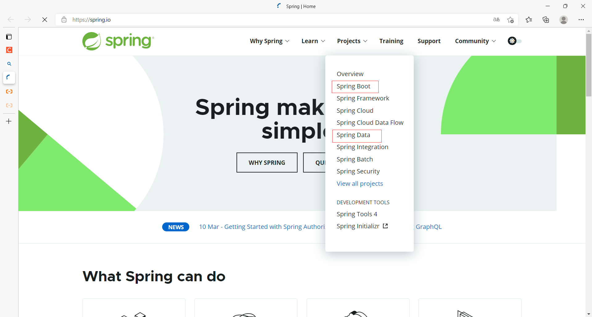
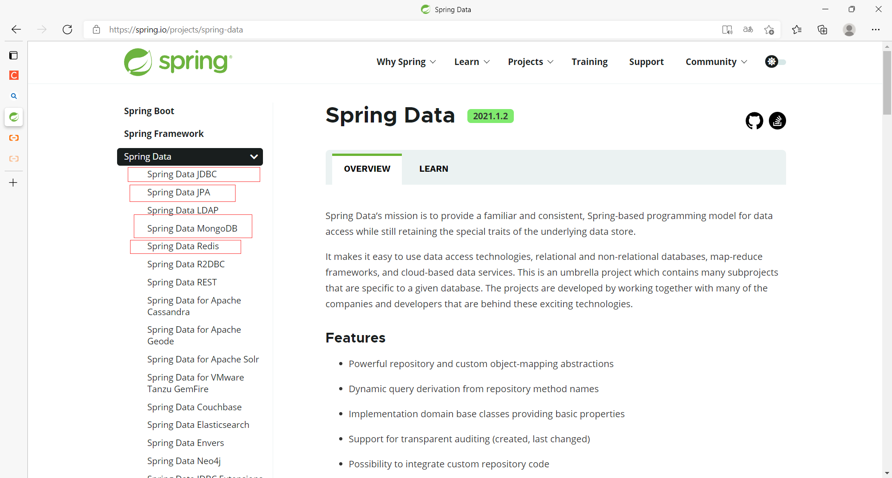
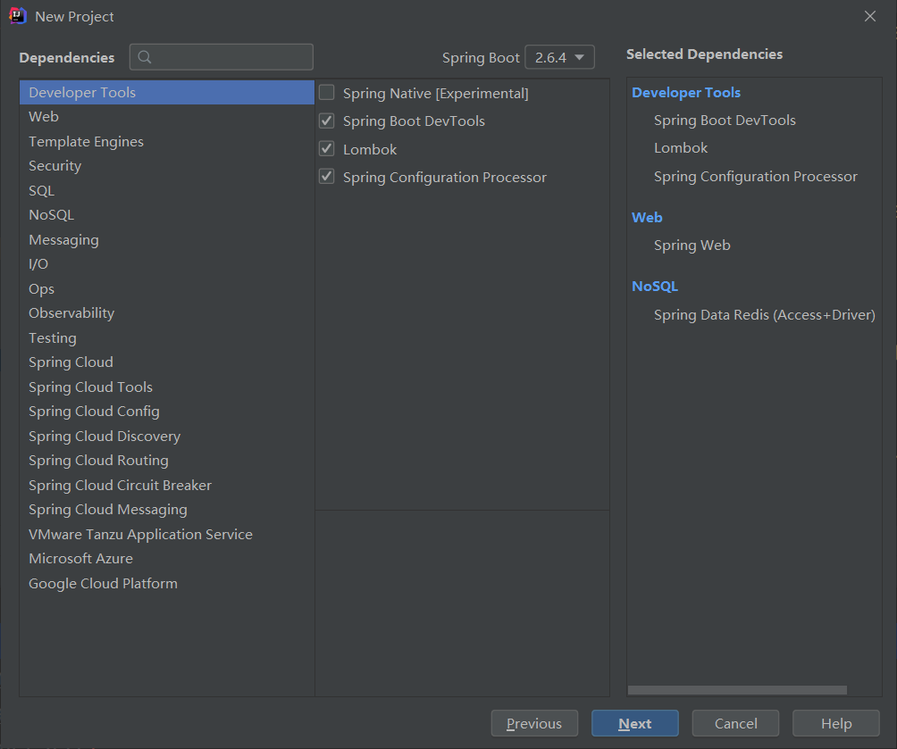
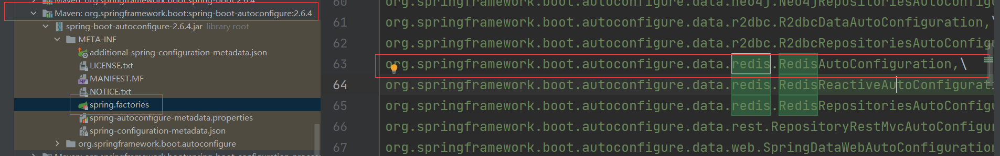

#### 概述

- **SpringData**是和SpringBoot齐名的项目，[Spring | Home](https://spring.io/)

- SpringBoot操作数据：使用**SpringData**，jpa、jdbc、mongodb、redis都在SpringData中


#### 创建项目导入依赖

- 创建spring项目，添加Dependencies
  - Developer Tools勾选**除了Spring Native [Experimental]**
    - 勾选后SpringBoot启动类会报错Cannot instantiate interface org.springframework.context.ApplicationListener : org.springframework.nativex.NativeListener
    - 勾选后@SpringBootTest测试类会报错勾选后SpringBoot启动类会报错
    - 大坑！！！
  - Web勾选Spring Web
  - NoSQL勾选Spring Data Redis(Access+Driver)
  
- 导入依赖

  ```xml
  <!--按照上面的操作会导入很多依赖-->
  <!--如果只操作redis引入依赖这个就可以了-->
  <!--对应NoSQL中的Spring Data Redis(Access+Driver)-->
  <dependency>
      <groupId>org.springframework.boot</groupId>
      <artifactId>spring-boot-starter-data-redis</artifactId>
  </dependency>
  ```

  - springboot 2.x后 ，原来使用的 Jedis 被 **lettuce** 替换。
    - jedis：采用的直连，**多个线程**操作的话，是**不安全**的。如果要避免不安全，使用jedis pool连接池！更像**BIO**（同步阻塞）模式
    - lettuce：采用netty（高性能网络框架，异步请求），实例可以在**多个线程**中共享，不存在**线程**不**安全**的情况！可以减少线程数量了，更像**NIO**（同步非阻塞）模式
  - 我们在学习SpringBoot自动配置的原理时，**整合**一个组件并进行**配置**一定会有一个**自动配置类xxxAutoConfiguration**,并且在**spring.factories**中也一定能找到这个类的完全限定名。Redis也不例外。


#### 源码分析

- **RedisAutoConfiguration**源码，里面一定还存在一个**RedisProperties**类

  - 这里有**两个模板**，redisTemplate和stringRedisTemplate，使用**@Autowired**注解引用
  - 使用redisTemplate模板操作redis，所有redis操作都需要**序列化**，否则虽然不会报错，但是无法与服务器的redis交互
  
  ```java
  /**
  RedisAutoConfiguration源码
  **/
  package org.springframework.boot.autoconfigure.data.redis;
  
  import ...
  
  @Configuration(proxyBeanMethods = false)
  @ConditionalOnClass({RedisOperations.class})
  
  //绑定了RedisProperties，它绑定了一个properties配置文件
  @EnableConfigurationProperties({RedisProperties.class})
      
  @Import({LettuceConnectionConfiguration.class, JedisConnectionConfiguration.class})
  public class RedisAutoConfiguration {
      public RedisAutoConfiguration() {
      }
  
      @Bean
      //当redisTemplate这个bean不存在时，这个类就生效
      //也就是说可以自己写一个redisTemplate来替换它
      //可以使用Autowired注解使用该模板
      @ConditionalOnMissingBean(name = {"redisTemplate"})
      @ConditionalOnSingleCandidate(RedisConnectionFactory.class)
      //redis模板
      //RedisConnectionFactory是一个接口，它有两个实现类JedisConnectionFactory（下载source会爆红）和LettuceConnectionFactory
      //SpringBoot2.X一般使用LettuceConnectionFactory
      //Maven下载JedisConnectionFactory的source会爆红，源码都没有导入进来，所以yml配置连接池时使用Lettuce的，不要用Jedis的
      public RedisTemplate<Object, Object> redisTemplate(RedisConnectionFactory redisConnectionFactory) 	{
          //这里是默认的RedisTemplate，本方法中没有对其进行过多的设置，redis对象都需要序列化！
          //两个泛型都是Object，所以后面使用需要强制转换
          RedisTemplate<Object, Object> template = new RedisTemplate();
          template.setConnectionFactory(redisConnectionFactory);
          return template;
      }
  
      @Bean
      @ConditionalOnMissingBean
      @ConditionalOnSingleCandidate(RedisConnectionFactory.class)
      //由于redis中String类型是最常用的
      //所以单独有一个string类型的redis模板
      //可以使用Autowired注解使用该模板
      public StringRedisTemplate stringRedisTemplate(RedisConnectionFactory redisConnectionFactory) {
          return new StringRedisTemplate(redisConnectionFactory);
      }
  }
  
  
  /**
  RedisProperties源码
  **/
  package org.springframework.boot.autoconfigure.data.redis;
  
  import ...
  
  //yml配置时，以spring.redis开头
  //例如配置主机：spring.redis.host
  @ConfigurationProperties(prefix = "spring.redis")
  public class RedisProperties {
      //这些属性都是yml文件中需要配置的
      private int database = 0;
      private String url;
      private String host = "localhost";
      private String username;
      private String password;
      private int port = 6379;
      private boolean ssl;
      private Duration timeout;
      private Duration connectTimeout;
      private String clientName;
      private RedisProperties.ClientType clientType;
      private RedisProperties.Sentinel sentinel;
      private RedisProperties.Cluster cluster;
      private final RedisProperties.Jedis jedis = new RedisProperties.Jedis();
      private final RedisProperties.Lettuce lettuce = new RedisProperties.Lettuce();
  
      ...
  }
  
  ```
  
  

#### 测试连接

1. 导入依赖

   - 上面导入好了

     ```xml
     <dependency>
         <groupId>org.springframework.boot</groupId>
         <artifactId>spring-boot-starter-data-redis</artifactId>
     </dependency>
     ```

2. 配置连接，application.yml

   - ```yml
     spring:
       redis:
         host: 120.77.96.250
         port: 6379
         password: 17870033452
     #    lettuce:
     #      pool:
     #        ...
     ```

3. 测试，在test文件夹中测试

   - RedisTemplate对象的**opsForXXX方法**是选择数据类型，然后返回**XXXOperations对象**，里面有redis操作该类型数据**命令的对应方法**
   - redisTemplate也有一些**常用方法**，比如redisTemplate.multi开启事务，比如**事务和基本的CRUD**
   - redisTemplate.getConnectionFactory().getConnection()**获取连接对象**
   
   ```java
   package com.zi.redistest;
   
   import ...
   
   @SpringBootTest
   class RedisTestApplicationTests {
   
       @Autowired
       //可以按住Ctrl点击注解中的redisTemplate，跳转到其源码注入的位置，查看源代码
       @Qualifier("redisTemplate")
       private RedisTemplate redisTemplate;
       
       @Test
       void contextLoads() {
           // 获取连接对象
           //RedisConnection connection = redisTemplate.getConnectionFactory().getConnection();
           //connection.ping();
           //connection.flushAll();
           //connection.flushAll();
           
           // redisTemplate 操作不同的数据类型，api和我们的指令是一样的
           // opsForValue 操作字符串 类似String
           // opsForList 操作List 类似List
           // opsForHash
   		// opsForZSet
           // opsForGeo
           // opsForHyperLogLog
           ValueOperations value = redisTemplate.opsForValue();
           value.append("name","hhzzcc");
           
           ListOperations list = redisTemplate.opsForList();
           list.leftPush("stus","zs");
           list.leftPush("stus","ls");
           
           // 除了基本的操作，我们常用的方法都可以直接通过redisTemplate操作，比如事务和基本的CRUD
   		redisTemplate.watch("user");
           redisTemplate.multi();
           value.append("user","one people");
           redisTemplate.exec();
           redisTemplate.discard();
           
   
           //connection.close();
       }
   
   }
   ```

#### RedisTemplate事务

- 开启事务有两种方法

  1. **redisTemplate.setEnableTransactionSupport(true)**开启事务支持。开启失败，还是报错ERR EXEC without MULTI。。。

     - 方法加上@Transactional注解可以达到一样的效果

     ```java
     package com.hzc.springbootredis;
     
     import org.junit.jupiter.api.Test;
     import org.springframework.beans.factory.annotation.Autowired;
     import org.springframework.boot.test.context.SpringBootTest;
     import org.springframework.data.redis.connection.RedisConnection;
     import org.springframework.data.redis.core.RedisTemplate;
     
     import java.util.List;
     
     @SpringBootTest
     class SpringbootRedisApplicationTests {
     
         @Autowired
         private RedisTemplate redisTemplate;
     
         @Test
         void contextLoads() {
             RedisConnection connection = redisTemplate.getConnectionFactory().getConnection();
             System.out.println(connection.ping());
     
             try {
                 
                 redisTemplate.watch("user");
                 //开启事务支持
                 redisTemplate.setEnableTransactionSupport(true);
                 redisTemplate.multi();
                 redisTemplate.opsForValue().append("user","andls");
                 System.out.println(redisTemplate.exec());
     
             }catch (Exception e){
                 connection.discard();
                 e.printStackTrace();
             }finally {
                 System.out.println(redisTemplate.opsForValue().get("user"));
                 connection.close();
             }
     
         }
     
     }
     ```

  2. 通过 **SessionCallback**，保证所有的操作都在同一个 Session 中完成，**常用**。如果获取不到数据要序列化

     ```java
     /**
      * <h2>使用 SessionCallback, 在同一个 Redis Connection 中执行事务: 成功执行事务</h2>
      * */
     @Test
     @SuppressWarnings("all")
     public void testSessionCallback() {
     
         SessionCallback<Object> callback = new SessionCallback<Object>() {
             @Override
             public Object execute(RedisOperations operations) throws DataAccessException {
                 //序列化
                 redisTemplate.setKeySerializer(new StringRedisSerializer());
                 redisTemplate.setValueSerializer(new StringRedisSerializer());
                 
                 operations.multi();
                 operations.opsForValue().set("name", "qinyi");
                 operations.opsForValue().set("gender", "male");
                 operations.opsForValue().set("age", "19");
                 operations.opsForValue().get("user");
                 return operations.exec();
             }
         };
     
         // [true, true, true]
         System.out.println(stringRedisTemplate.execute(callback));
     }
     ```

     

