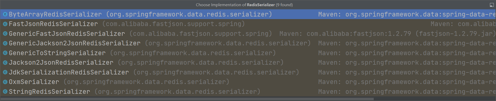

#### 为什么要自定义RedisTemplate

- 因为redis所有操作都要**序列化**，默认的RedisTemplate是没有序列化的
- 因为没有序列化，所有操作执行成功却都无法生效到服务器的redis服务（或者直接报错说没有序列化），提交也可能出现乱码\xac\xed\x00\x05t\x00\x03

#### 代码

- 创建一个pojo类

  - 需要实现**Serializable**接口，否则User对象将无法传输到redis，User对象转化的Json字符串也不行

  ```java
  package com.hzc.springbootredis.pojo;
  
  import lombok.AllArgsConstructor;
  import lombok.Data;
  import lombok.NoArgsConstructor;
  import org.springframework.stereotype.Component;
  
  import java.io.Serializable;
  
  @Component
  @AllArgsConstructor
  @NoArgsConstructor
  @Data
  public class User implements Serializable {
      private String name;
      private int age;
  }
  ```

- 创建测试类

  ```java
  @Test
  void testUser(){
      User user = new User("须朝", 13);
      String jsonString = JSONObject.toJSONString(user);
  
      redisTemplate.opsForValue().set("user",jsonString);
  
      //可以正常取出，但是redis命令行会显示乱码
      System.out.println(redisTemplate.opsForValue().get("user"));
  
      redisTemplate.getConnectionFactory().getConnection().close();
  }
  ```

  - 传输到redis了，可是key是乱码的

    ```shell
    127.0.0.1:6379> keys *
    "\xac\xed\x00\x05t\x00\x04user"
    ```


#### 解决乱码办法

- 注入使用**StringRedisTemplate**
- 自定义RedisTemplate，自己进行序列化


#### 源码

- **RedisTemplate**类中有这样一段代码，如果没有设置序列化方式，那么**默认使用jdk的序列化**方式，企业80%都不会使用这个方式

  ```java
  if (defaultSerializer == null) {
      defaultSerializer = new JdkSerializationRedisSerializer(
      classLoader != null ? classLoader : this.getClass().getClassLoader());
  }
  ```

- **JdkSerializationRedisSerializer**实现了**RedisSerializer**接口，RedisSerializer接口有很多实现类，都是不同的序列化方式

  ```java
  public class JdkSerializationRedisSerializer implements RedisSerializer<Object>{...}
  ```

  

- 上面图片中就有JdkSerializationRedisSerializer类，如果要序列化JSON的话，就使用Jackson2JsonRedisSerializer

- 自定义RedisTemplate模板，这样一来，只要实体类也进行了序列化，我们存什么都不会有乱码的担忧了

  - 这里使用RedisSerializer.json()代替Jackson2JsonRedisSerializer，更简单点
  - 配置类不要放在项目包（com.xxx.xxx）外，否则会**扫描不到**
  - key使用String序列化，value使用Json序列化

  ```java
  package config;
  
  import org.springframework.context.annotation.Bean;
  import org.springframework.context.annotation.Configuration;
  import org.springframework.data.redis.connection.RedisConnectionFactory;
  import org.springframework.data.redis.core.RedisTemplate;
  import org.springframework.data.redis.serializer.RedisSerializer;
  
  @Configuration
  public class RedisConfig {
  
      @Bean
      //RedisConnectionFactory参数爆红，用来取消警告
      @SuppressWarnings("all")
      public RedisTemplate<String,Object> redisTemplate(RedisConnectionFactory factory){
          //因为我们常用的key类型为String，所有泛型设为<String, Object>
          RedisTemplate<String, Object> template = new RedisTemplate<>();
          //连接工厂，这个不用改
          template.setConnectionFactory(factory);
  
          /*
          * 序列化设置，这里不使用Jackson2JsonRedisSerializer，使用RedisSerializer.json()
          * */
          //Hash和String的key采用string的序列化方式
          template.setKeySerializer(RedisSerializer.string());
          template.setHashKeySerializer(RedisSerializer.string());
          //Hash和String的value采用json的序列化方式
          template.setValueSerializer(RedisSerializer.json());
          template.setHashValueSerializer(RedisSerializer.json());
  
  
          return template;
      }
  }
  ```

  