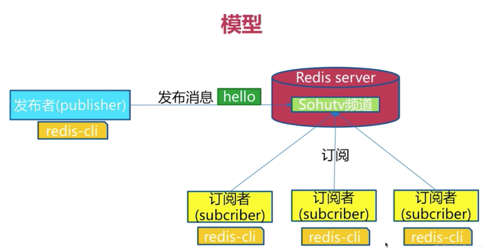

#### 简述

- Redis 发布订阅(pub/sub)是一种**消息通信（队列）模式**：发送者(pub)发送消息，订阅者(sub)接收消息。
- 订阅/发布消息图
- 下图展示了**频道 channel1** ， 以及订阅这个频道的**三个客户端** —— client2 、 client5 和 client1 之间的关系：

- 当有新消息通过 **PUBLISH 命令**发送给频道 channel1 时， 这个消息就会被发送给订阅它的三个客户端：

#### 命令

- 这些命令（Pub/Sub命令）被广泛用于构建**即时通信应用**，比如网络聊天室、实时广播、实时提醒等

| 命令                                                   | 描述                                 | 追加描述                          |
| ------------------------------------------------------ | ------------------------------------ | --------------------------------- |
| SubScribe channel [channel..]                          | 订阅给定的一个或多个频道。           |                                   |
| UnSubScribe channel [channel..]PubLish channel message | 退订一个或多个频道向指定频道发布消息 |                                   |
| PubLish channel message                                | 向指定频道发布消息                   |                                   |
| PubSub subcommand [argument[argument]]                 | 查看订阅与发布系统状态。             | PUBSUB channels查看当前活跃的频道 |
| PSubScribe pattern [pattern..]                         | 订阅一个或多个符合给定模式的频道。   |                                   |
| PUnSubScribe pattern [pattern..]                       | 退订一个或多个符合给定模式的频道。   |                                   |

```shell
------------订阅端----------------------
127.0.0.1:6379> SUBSCRIBE dreamland
Reading messages... (press Ctrl-C to quit)
1) "subscribe"
2) "dreamland"
3) (integer) 1
1) "message" #消息
2) "dreamland" #哪个频道的消息
3) "hello"#消息内容


--------------消息发布端-------------------
127.0.0.1:6379> PUBLISH dreamland hello
(integer) 1


-----------------查看活跃的频道------------
127.0.0.1:6379> PUBSUB channels
1) "dreamland"
```

#### 原理

- redis是用c语言实现的，通过分析源码的pubsub.c文件，可以了解发布和订阅的底层实现
- 通过PUBLISH发布、SUBSCRIBE订阅、PSUBSCRIBE指定条件订阅等命令实现发布和订阅功能
- redis-server里维护了一个字典，字典的键就是一个个频道，字典的值则是一个链表，链表中保存了所有订阅这个频道channel的客户端。**SUBSCRIBE命令**订阅频道，就是将客户端添加到指定chanel的订阅链表中。

- 客户端订阅，就被链接到对应频道的链表的尾部，退订则就是将客户端节点从链表中移除。

#### 缺点

- 如果一个客户端订阅了频道，但自己读取消息的速度却不够快的话，那么不断积压的消息会使redis输出缓冲区的体积变得越来越大
- 这可能使得redis本身的速度变慢，甚至直接崩溃。
- 这和数据传输可靠性有关，如果在订阅方断线，那么他将会丢失所有在短线期间发布者发布的消息。

#### 应用

- 消息订阅：公众号订阅，微博关注等等（起始更多是使用消息队列来进行实现）
- 多人在线聊天室。
- 稍微复杂的场景，我们就会使用消息中间件MQ处理。

#### SpringBoot使用

- **spring boot 项目导入依赖**

  ```xml
  <dependency>
      <groupId>org.springframework.boot</groupId>
      <artifactId>spring-boot-starter-data-redis</artifactId>
  </dependency>
  ```

- **注册redis消息监听器容器，并且订阅消息**

  - 当另一个客户端

  ```java
   
  import org.springframework.context.annotation.Bean;
  import org.springframework.context.annotation.Configuration;
  import org.springframework.data.redis.connection.RedisConnectionFactory;
  import org.springframework.data.redis.listener.PatternTopic;
  import org.springframework.data.redis.listener.RedisMessageListenerContainer;
  import org.springframework.data.redis.listener.adapter.MessageListenerAdapter;
   
  @Configuration
  public class MyRedisConfig {
      @Bean
      public RedisMessageListenerContainer container(RedisConnectionFactory connectionFactory,
                                                     MessageListenerAdapter listenerAdapter) {
          //创建一个Redis 消息监听器容器
          RedisMessageListenerContainer container = new RedisMessageListenerContainer();
          container.setConnectionFactory(connectionFactory);
          //mytopic是订阅的频道名称
          container.addMessageListener(listenerAdapter, new ChannelTopic("mytopic"));
          //订阅所有满足条件（正则表达式）的频道名称
          //当之后要订阅新的频道，只要频道名称满足，会自动订阅
          container.addMessageListener(listenerAdapter, new PatternTopic("user-*"));
          return container;
      }
      /**
       * 绑定消息监听者和接收监听的方法,必须要注入这个监听器，不然会报错
       */
      @Bean
      public MessageListenerAdapter listenerAdapter(){
          //当监听到消息，返回MessageListenerAdapter对象，调用Receiver类对象的receiveMessage方法
          return new MessageListenerAdapter(new Receiver(),"receiveMessage");
      }
   
       class Receiver {
           //打印消息内容
          public void receiveMessage(String message) {
              System.out.format("Received <%s>%n",message);
          }
          /* 
          //打印频道名称和消息内容
          //(String message,String channel)顺序不要错了
          //打印的channel并不一定是频道名称，可能是订阅对象PatternTopic的参数正则表达式
          public void receiveMessage(String message,String channel) {
              System.out.format("Received <%s> <%s>%n",channel,message);
          }
          */
      }
  }
  ```

- **发布消息**

  - stringRedisTemplate的convertAndSend(String channel,String message)方法
    - channel：要发送的频道
    - message：该频道发送的消息

  ```java
  @RequestMapping("/publish")
      public String action(){
          Scanner scanner = new Scanner(System.in);
          while (true){
              String line = scanner.nextLine();
              stringRedisTemplate.convertAndSend("channel1",line);
              System.out.println("发送了："+line);
              if (line.equals("bye"))break;
          }
          scanner.close();
          return "";
      }
  ```

- **订阅频道**

  - 这里是**手动**订阅，也可以在配置类中使用通配符匹配**自动**订阅

  ```java
  //引用的两个对象都是配置类MyRedisConfig中注入好的
  @Autowired
  private RedisMessageListenerContainer container;//监听器容器
  @Autowired
  private MessageListenerAdapter listenerAdapter;//监听器
  @RequestMapping("/subScribe")
  public String action(){
      container.addMessageListener(listenerAdapter,new ChannelTopic("people"));
      return "";
  }
  ```

  