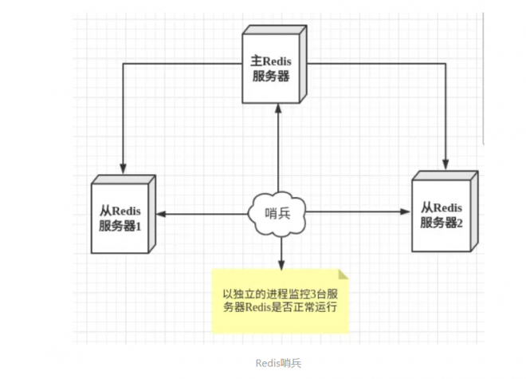
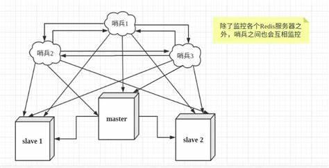

## 哨兵模式

#### 概述

- 主从切换技术的方法是：当主服务器宕机后，需要**手动**把一台从服务器切换为主服务器，这就需要**人工干预，费事费力**，还会造成**一段时间内服务不可用**。这不是一种推荐的方式，更多时候，我们优先考虑**哨兵模式**。
- 哨兵模式是一种特殊的模式，首先redis提供了哨兵的命令，哨兵是一个独立的进程，它会独立运行。其原理是：**哨兵通过发送命令，等待redis服务器响应，从而监控多个redis实例**。
- 上图是**单机哨兵**，如果哨兵也死了怎么办，所以我们会给哨兵也配置一个集群（**多哨兵模式**），使用多个哨兵进行监控，同时哨兵之间还会进行监控
- 哨兵（sentinel）的作用：
  - 通过发送命令，让Redis服务器返回**监控**其运行状态，包括主服务器和从服务器。**心跳检测**
  - 当一个哨兵监测到master宕机（master**主观下线**），不会直接进行failover（选举），其它哨兵也会来监测master的状态，当一定数量的哨兵监测到master宕机了，哨兵们会发起投票自动将slave切换成master，然后通过**发布订阅模式**通知其他的从服务器，修改配置文件，让它们切换主机（master**客观下线**）。

#### 使用

- 创建一个哨兵配置文件sentinel.conf。

  - sentinel（哨兵）、monitor（监测）

  - 先写最基本也是最核心的，哨兵监控哪个主机，主机名随便起`sentinel monitor mymaster 127.0.0.1 6379 1`

    ```shell
    [root@iZwz9dz9p8ei9h0gwdz6ohZ redisConfig]# vim sentinel.conf
    [root@iZwz9dz9p8ei9h0gwdz6ohZ redisConfig]# cat sentinel.conf 
    #数字1表示 ：当一个哨兵主观认为主机断开，就可以客观认为主机故障，然后开始选举新的主机。
    sentinel monitor mymaster 127.0.0.1 6379 1
    ```

- 启动哨兵

  - 如果主机设置了密码，需要加上sentinel auth-pass mymaster xxxx，mymaster是起的主机名称，xxxx是密码。主从密码最好设置一样的
  - 主机宕机后，选举新主机，就主机回来只能当新主机的从机

  ```shell
  [root@iZwz9dz9p8ei9h0gwdz6ohZ bin]# redis-sentinel redisConfig/sentinel.conf 
  22107:X 13 Mar 2022 21:34:00.731 # oO0OoO0OoO0Oo Redis is starting oO0OoO0OoO0Oo
  22107:X 13 Mar 2022 21:34:00.731 # Redis version=6.0.6, bits=64, commit=00000000, modified=0, pid=22107, just started
  22107:X 13 Mar 2022 21:34:00.731 # Configuration loaded
                  _._                                                  
             _.-``__ ''-._                                             
        _.-``    `.  `_.  ''-._           Redis 6.0.6 (00000000/0) 64 bit
    .-`` .-```.  ```\/    _.,_ ''-._                                   
   (    '      ,       .-`  | `,    )     Running in sentinel mode
   |`-._`-...-` __...-.``-._|'` _.-'|     Port: 26379 #当前端口26379
   |    `-._   `._    /     _.-'    |     PID: 22107
    `-._    `-._  `-./  _.-'    _.-'                                   
   |`-._`-._    `-.__.-'    _.-'_.-'|                                  
   |    `-._`-._        _.-'_.-'    |           http://redis.io        
    `-._    `-._`-.__.-'_.-'    _.-'                                   
   |`-._`-._    `-.__.-'    _.-'_.-'|                                  
   |    `-._`-._        _.-'_.-'    |                                  
    `-._    `-._`-.__.-'_.-'    _.-'                                   
        `-._    `-.__.-'    _.-'                                       
            `-._        _.-'                                           
                `-.__.-'                                               
  
  22188:X 13 Mar 2022 21:43:13.787 # WARNING: The TCP backlog setting of 511 cannot be enforced because /proc/sys/net/core/somaxconn is set to the lower value of 128.
  22188:X 13 Mar 2022 21:43:13.787 # Sentinel ID is 832628f4846ae34324c7e7d4d976d003ed0d4994
  #监测到主机mymaster
  22188:X 13 Mar 2022 21:43:13.787 # +monitor master mymaster 127.0.0.1 6379 quorum 1 
  #监测到一个从机，IP为127.0.0.1，端口为6381。其主机为mymaster，主机IP和端口为127.0.0.1和6379
  22188:X 13 Mar 2022 21:43:13.788 * +slave slave 127.0.0.1:6381 127.0.0.1 6381 @ mymaster 127.0.0.1 6379
  22188:X 13 Mar 2022 21:43:13.797 * +slave slave 127.0.0.1:6380 127.0.0.1 6380 @ mymaster 127.0.0.1 6379
  
  #这个时候去把master服务6379的关掉
  
  #主机宕机了
  22188:X 13 Mar 2022 21:49:59.309 # +sdown master mymaster 127.0.0.1 6379 
  #满足条件：一个哨兵监测到master宕机了
  22188:X 13 Mar 2022 21:49:59.309 # +odown master mymaster 127.0.0.1 6379 #quorum 1/1
  #开始选举failover，故障转移
  22188:X 13 Mar 2022 21:49:59.309 # +new-epoch 4
  22188:X 13 Mar 2022 21:49:59.309 # +try-failover master mymaster 127.0.0.1 6379
  22188:X 13 Mar 2022 21:49:59.312 # +vote-for-leader 832628f4846ae34324c7e7d4d976d003ed0d4994 4
  22188:X 13 Mar 2022 21:49:59.312 # +elected-leader master mymaster 127.0.0.1 6379
  22188:X 13 Mar 2022 21:49:59.312 # +failover-state-select-slave master mymaster 127.0.0.1 6379
  22188:X 13 Mar 2022 21:49:59.367 # +selected-slave slave 127.0.0.1:6380 127.0.0.1 6380 @ mymaster 127.0.0.1 6379
  22188:X 13 Mar 2022 21:49:59.367 * +failover-state-send-slaveof-noone slave 127.0.0.1:6380 127.0.0.1 6380 @ mymaster 127.0.0.1 6379
  22188:X 13 Mar 2022 21:49:59.419 * +failover-state-wait-promotion slave 127.0.0.1:6380 127.0.0.1 6380 @ mymaster 127.0.0.1 6379
  22188:X 13 Mar 2022 21:50:00.228 # +promoted-slave slave 127.0.0.1:6380 127.0.0.1 6380 @ mymaster 127.0.0.1 6379
  22188:X 13 Mar 2022 21:50:00.228 # +failover-state-reconf-slaves master mymaster 127.0.0.1 6379
  22188:X 13 Mar 2022 21:50:00.325 * +slave-reconf-sent slave 127.0.0.1:6381 127.0.0.1 6381 @ mymaster 127.0.0.1 6379
  22188:X 13 Mar 2022 21:50:01.263 * +slave-reconf-inprog slave 127.0.0.1:6381 127.0.0.1 6381 @ mymaster 127.0.0.1 6379
  22188:X 13 Mar 2022 21:50:01.263 * +slave-reconf-done slave 127.0.0.1:6381 127.0.0.1 6381 @ mymaster 127.0.0.1 6379
  22188:X 13 Mar 2022 21:50:01.324 # +failover-end master mymaster 127.0.0.1 6379
  #选举failover结束，将127.0.0.1的6380端口服务设为新的主机mymaster。顶替掉127.0.0.1的6379端口服务
  22188:X 13 Mar 2022 21:50:01.324 # +switch-master mymaster 127.0.0.1 6379 127.0.0.1 6380
  #将6381服务设为6380的从机
  22188:X 13 Mar 2022 21:50:01.324 * +slave slave 127.0.0.1:6381 127.0.0.1 6381 @ mymaster 127.0.0.1 6380
  #将6379服务设为6380的从机
  22188:X 13 Mar 2022 21:50:01.324 * +slave slave 127.0.0.1:6379 127.0.0.1 6379 @ mymaster 127.0.0.1 6380
  #监测到6379服务从机宕机了
  22188:X 13 Mar 2022 21:50:31.357 # +sdown slave 127.0.0.1:6379 127.0.0.1 6379 @ mymaster 127.0.0.1 6380
  
  
  #这时把6379服务重启，发现主机还是6380，6379是从机
  22188:X 13 Mar 2022 22:03:35.307 # -sdown slave 127.0.0.1:6379 127.0.0.1 6379 @ mymaster 127.0.0.1 6380
  #6379转换成从机，6380是主机
  #江山易主，时代变了，回来了也当不了老大
  22188:X 13 Mar 2022 22:03:45.275 * +convert-to-slave slave 127.0.0.1:6379 127.0.0.1 6379 @ mymaster 127.0.0.1 6380
  ```

#### 哨兵模式优缺点

##### 优点：

- 哨兵集群，基于主从复制模式，所有主从复制的优点，它都有
- 主从可以切换，故障可以转移，系统的可用性更好
- 哨兵模式是主从模式的升级，手动到自动，更加健壮

##### 缺点：

- Redis不好在线扩容，集群容量一旦达到上限，在线扩容就十分麻烦
- 实现哨兵模式的配置其实是很麻烦的，里面有很多配置项

#### 完整的哨兵模式配置文件 sentinel.conf

- 哨兵集群的搭建方式和redis-server集群搭建差不多

```shell
# Example sentinel.conf
 
# 哨兵sentinel实例运行的端口 默认26379
#如果有哨兵集群就需要配置
port 26379
 
# 哨兵sentinel的工作目录
dir /tmp
 
# 哨兵sentinel监控的redis主节点的 ip port 
# master-name  可以自己命名的主节点名字 只能由字母A-z、数字0-9 、这三个字符".-_"组成。
# quorum 当这些quorum个数sentinel哨兵认为master主节点失联 那么这时 客观上认为主节点失联了
# sentinel monitor <master-name> <ip> <redis-port> <quorum>
sentinel monitor mymaster 127.0.0.1 6379 1
 
# 当在Redis实例中开启了requirepass授权密码 这样所有连接Redis实例的客户端都要提供密码
# 设置哨兵sentinel 连接主从的密码 注意必须为主从设置一样的验证密码
# sentinel auth-pass <master-name> <password>
sentinel auth-pass mymaster MySUPER--secret-0123passw0rd
 
 
# 指定多少毫秒之后 主节点没有应答哨兵sentinel 此时 哨兵主观上认为主节点下线 默认30秒
# sentinel down-after-milliseconds <master-name> <milliseconds>
sentinel down-after-milliseconds mymaster 30000
 
# 这个配置项指定了在发生failover主备切换时最多可以有多少个slave同时对新的master进行 同步，
这个数字越小，完成failover所需的时间就越长，
但是如果这个数字越大，就意味着越 多的slave因为replication而不可用。
可以通过将这个值设为 1 来保证每次只有一个slave 处于不能处理命令请求的状态。
# sentinel parallel-syncs <master-name> <numslaves>
sentinel parallel-syncs mymaster 1
 
 
 
# 故障转移的超时时间 failover-timeout 可以用在以下这些方面： 
#1. 同一个sentinel对同一个master两次failover之间的间隔时间。
#2. 当一个slave从一个错误的master那里同步数据开始计算时间。直到slave被纠正为向正确的master那里同步数据时。
#3.当想要取消一个正在进行的failover所需要的时间。  
#4.当进行failover时，配置所有slaves指向新的master所需的最大时间。不过，即使过了这个超时，slaves依然会被正确配置为指向master，但是就不按parallel-syncs所配置的规则来了
# 默认三分钟
# sentinel failover-timeout <master-name> <milliseconds>
sentinel failover-timeout mymaster 180000
 
# SCRIPTS EXECUTION
 
#配置当某一事件发生时所需要执行的脚本，可以通过脚本来通知管理员，例如当系统运行不正常时发邮件通知相关人员。
#对于脚本的运行结果有以下规则：
#若脚本执行后返回1，那么该脚本稍后将会被再次执行，重复次数目前默认为10
#若脚本执行后返回2，或者比2更高的一个返回值，脚本将不会重复执行。
#如果脚本在执行过程中由于收到系统中断信号被终止了，则同返回值为1时的行为相同。
#一个脚本的最大执行时间为60s，如果超过这个时间，脚本将会被一个SIGKILL信号终止，之后重新执行。
 
#通知型脚本:当sentinel有任何警告级别的事件发生时（比如说redis实例的主观失效和客观失效等等），将会去调用这个脚本，
#这时这个脚本应该通过邮件，SMS等方式去通知系统管理员关于系统不正常运行的信息。调用该脚本时，将传给脚本两个参数，
#一个是事件的类型，
#一个是事件的描述。
#如果sentinel.conf配置文件中配置了这个脚本路径，那么必须保证这个脚本存在于这个路径，并且是可执行的，否则sentinel无法正常启动成功。
#通知脚本
# sentinel notification-script <master-name> <script-path>
  sentinel notification-script mymaster /var/redis/notify.sh
 
# 客户端重新配置主节点参数脚本
# 当一个master由于failover而发生改变时，这个脚本将会被调用，通知相关的客户端关于master地址已经发生改变的信息。
# 以下参数将会在调用脚本时传给脚本:
# <master-name> <role> <state> <from-ip> <from-port> <to-ip> <to-port>
# 目前<state>总是“failover”,
# <role>是“leader”或者“observer”中的一个。 
# 参数 from-ip, from-port, to-ip, to-port是用来和旧的master和新的master(即旧的slave)通信的
# 这个脚本应该是通用的，能被多次调用，不是针对性的。
# sentinel client-reconfig-script <master-name> <script-path>
sentinel client-reconfig-script mymaster /var/redis/reconfig.sh

```

