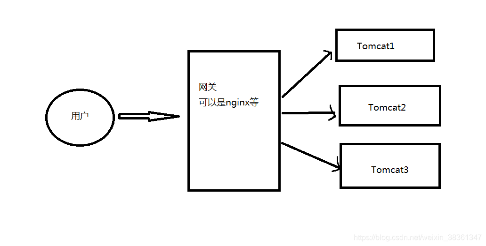

### 理论

**什么是 Session**
由于 HTTP 协议是无状态的协议，因而服务端需要记录用户的状态时，就需要用某种机制来识具体的用户。Session 是另一种记录客户状态的机制，不同的是 Cookie 保存在客户端浏览器中，而 Session 保存在服务器上。客户端浏览器访问服务器的时候，服务器把客户端信息以某种形式记录在服务器上，这就是 Session。客户端浏览器再次访问时只需要从该 Session 中查找该客户的状态就可以了。

**为什么需要同步session ？**

> 当用户量比较大时候一个tomcat可能无法处理更多的请求，超过单个tomcat的承受能力，可能会出现用户等待，严重的导致tomcat宕机。



> 这时候我们后端可能会采用多个tomcat去处理请求，分派请求，不同请求让多个tomcat分担处理。
>
> 登录的时候可能采用的是tomca1，下单的时候可能采用的是tomcat2 等等等。

若没有session共享同步，可能在tomcat1登录了，下一次请求被分派到tomcat2上，这时候用户就需要重新登录。

> 在实际工作中我们建议使用外部的缓存设备来共享 Session，避免单个节点挂掉而影响服务，使用外部缓存 Session 后，我们的
> 共享数据都会放到外部缓存容器中，服务本身就会变成无状态的服务，可以随意的根据流量的大小增加或者减少负载的设备。

### **目前主流的分布式 Session 管理有两种方案。**

#### **1、Session 复制**

部分 Web 服务器能够支持 Session 复制功能，如 Tomcat。用户可以通过修改 Web 服务器的配置文件，让 Web 服务器进行 Session 复制，保持每一个服务器节点的 Session 数据都能达到一致。

这种方案的实现依赖于 Web 服务器，需要 Web 服务器有 Session 复制功能。当 Web 应用中 Session 数量较多的时候，每个服务器节点都需要有一部分内存用来存放 Session，将会占用大量内存资源。同时大量的 Session 对象通过网络传输进行复制，不但占用了网络资源，还会因为复制同步出现延迟，导致程序运行错误。

在微服务架构中，往往需要 N 个服务端来共同支持服务，不建议采用这种方案。

#### **2、Session 集中存储**

在单独的服务器或服务器集群上使用缓存技术，如 Redis 存储 Session 数据，集中管理所有的 Session，所有的 Web 服务器都从这个存储介质中存取对应的 Session，实现 Session 共享。将 Session 信息从应用中剥离出来后，其实就达到了服务的无状态化，这样就方便在业务极速发展时水平扩充。

**Spring Session**
Spring Session 提供了一套创建和管理 Servlet HttpSession 的方案。Spring Session 提供了集群 Session（Clustered Sessions）功能，默认采用外置的 Redis 来存储 Session 数据，以此来解决 Session 共享的问题。

Spring Session 为企业级 Java 应用的 Session 管理带来了革新，使得以下的功能更加容易实现：

API 和用于管理用户会话的实现； HttpSession，允许以应用程序容器（即 Tomcat）中性的方式替换 HttpSession；
将 Session 所保存的状态卸载到特定的外部 Session 存储中，如 Redis 或 Apache Geode
中，它们能够以独立于应用服务器的方式提供高质量的集群； 支持每个浏览器上使用多个
Session，从而能够很容易地构建更加丰富的终端用户体验； 控制 Session ID
如何在客户端和服务器之间进行交换，这样的话就能很容易地编写 Restful API，因为它可以从 HTTP 头信息中获取 Session
ID，而不必再依赖于 cookie； 当用户使用 WebSocket 发送请求的时候，能够保持 HttpSession 处于活跃状态。
需要说明的很重要的一点就是，Spring Session 的核心项目并不依赖于 Spring 框架，因此，我们甚至能够将其应用于不使用
Spring 框架的项目中。


### 需求

服务A和服务B之间session共享


### 导入依赖

服务A和服务B都导入

```xml
<!--redis-->
<dependency>
    <groupId>org.springframework.boot</groupId>
    <artifactId>spring-boot-starter-data-redis</artifactId>
</dependency>

<!-- springboot使用redis实现session共享依赖 -->
<dependency>
    <groupId>org.springframework.session</groupId>
    <artifactId>spring-session-data-redis</artifactId>
</dependency>
```


### 配置类

服务A和服务B都编写

```java
import org.springframework.context.annotation.Configuration;
import org.springframework.session.data.redis.config.annotation.web.http.EnableRedisHttpSession;

@Configuration
@EnableRedisHttpSession(maxInactiveIntervalInSeconds = 86400*30)
public class SessionConfig {
}
```


### 测试

服务A的session存入name

```java
@PostMapping("/session")
@ApiOperation("测试Session共享")
public String session(HttpSession session,@ApiParam("session的name") @RequestParam String name){
    session.setAttribute("name",name);
    return "name = "+name;
}

// 执行结果：name = 付思
```

服务B从session取出name

```java
@PostMapping("/getSession")
@ApiOperation("测试session共享")
public String getSession(HttpSession session){
    String name = (String) session.getAttribute("name");
    return "name "+name;
}
// 执行结果：name 付思
```


### 报错

**BeanCreationException: Error creating bean with name 'enableRedisKeyspaceNotificationsInitializer'**

- 项目未配置redis相关yml，导致连接不上

**READONLY You can't write against a read only replica.** 

- 当前redis服务是从节点，从节点不能写入，去客户端命令行输入`SLAVEOF no one命令`独立出主节点