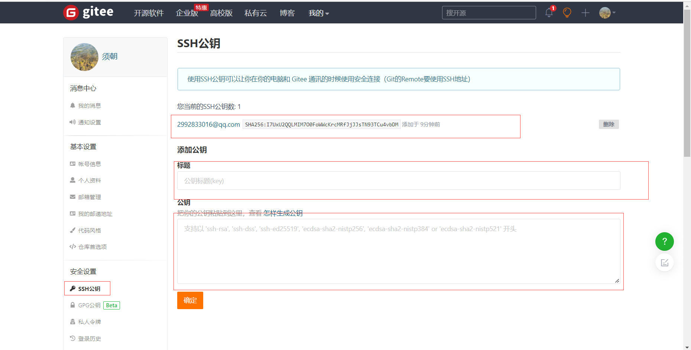

## 使用码云

> github 是有墙的，比较慢，在国内的话，我们一般使用 gitee ，公司中有时候会搭建自己的gitlab服务器。这个其实可以作为大家未来找工作的一个重要信息！

1. 这个其实可以作为大家未来找工作的一个重要信息！

2. 设置本机绑定SSH公钥，实现免密码登录！（免密码登录，这一步挺重要的，码云是远程仓库，我们是平时工作在本地仓库！)

   ```bash
   # 进入 C:\Users\Administrator\.ssh 目录
   # 生成公钥
   ssh-keygen -t rsa -C '邮箱地址'
   ```

   

3. 将公钥信息public key（C:\Users\xxx\\.ssh\id_rsa.pub）添加到码云账户中即可！




1. 使用码云创建一个自己的仓库！

   1. 许可证：开源是否可以随意转载，开源但是不能商业使用，不能转载，...  限制！

2. 克隆到本地！