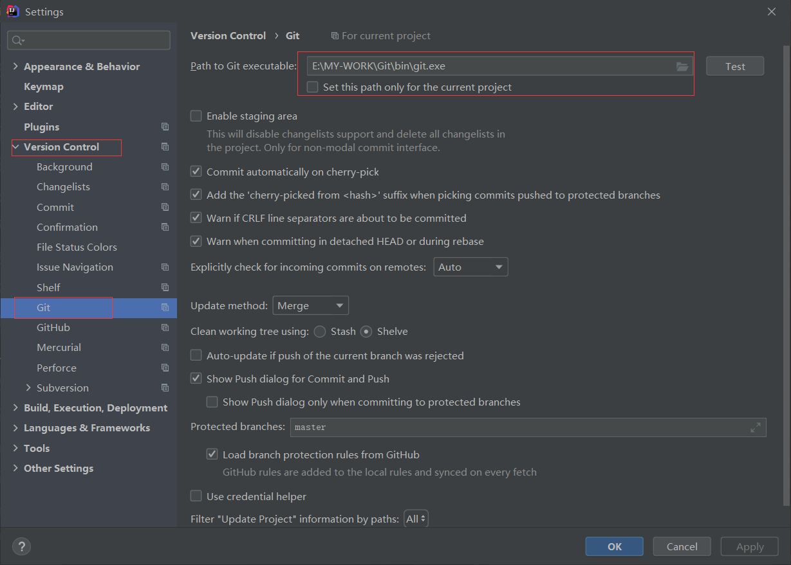
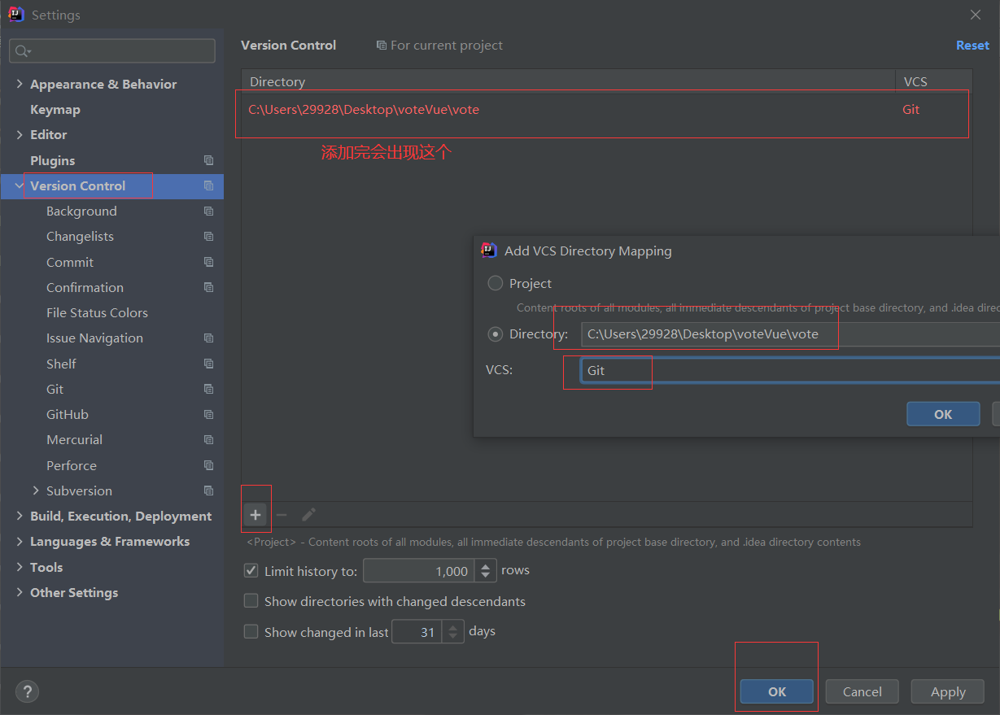
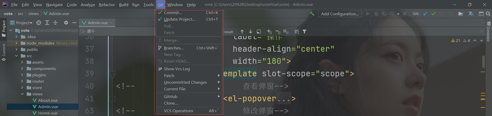
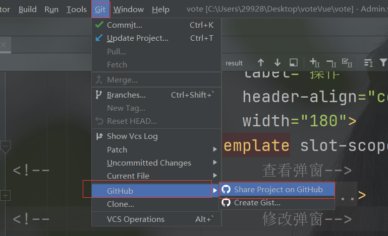

## IDEA中集成Git

### 新建项目，绑定git。

将项目目录变成git工作目录

### 修改文件，使用IDEA操作git。

- add添加到暂存区
- commit 提交
- push到远程仓库

### 提交测试

这些都是单个人的操作！

学习的方式最重要！学会学习！我上课的更多时候都是在教大家去学习一种理念和思想（学习方式）

有道无术、术尚可求。有术无道、止于术！

真正的教学，授人以渔！