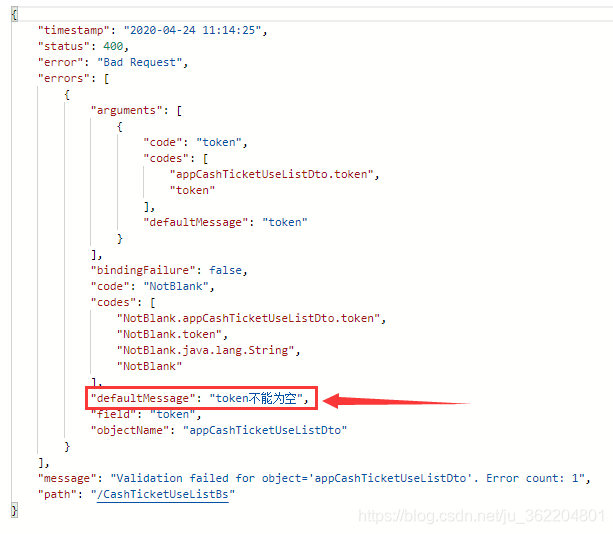
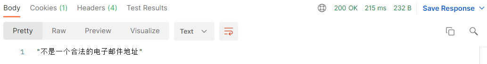

## JSR303数据校验

### 先看看如何使用

导入依赖

```xml
<dependency>
    <groupId>org.springframework.boot</groupId>
    <artifactId>spring-boot-starter-validation</artifactId>
</dependency>
```

Springboot中可以用@validated来校验数据，如果数据异常则会统一抛出异常，方便异常中心统一处理。我们这里来写个注解让我们的name只能支持Email格式；

```java
@Component //注册bean
@ConfigurationProperties(prefix = "person")
@Validated  //数据校验
public class Person {

    @Email(message="邮箱格式错误") //name必须是邮箱格式
    private String name;
    
    //传入的email参数必须是邮箱格式
    public String login(@Email String email, HttpSession session){
        System.out.println(email);
        return "success";
    }
}
```

运行结果 ：default message [不是一个合法的电子邮件地址];

**使用数据校验，可以保证数据的正确性；** 

### 常见参数

```

@NotNull(message="名字不能为空")
private String userName;
@Max(value=120,message="年龄最大不能查过120")
private int age;
@Email(message="邮箱格式错误")
private String email;

空检查
@Null       验证对象是否为null
@NotNull    验证对象是否不为null, 无法查检长度为0的字符串（推荐@NotBlank）
@NotBlank   检查约束字符串是不是Null还有被Trim的长度是否大于0,只对字符串,且会去掉前后空格（推荐）.
@NotEmpty   检查约束元素是否为NULL或者是EMPTY.
    
Booelan检查
@AssertTrue     验证 Boolean 对象是否为 true  
@AssertFalse    验证 Boolean 对象是否为 false  
    
长度检查
@Size(min=, max=) 验证对象（Array,Collection,Map,String）长度是否在给定的范围之内  
@Length(min=, max=) string is between min and max included.

日期检查
@Past       验证 Date 和 Calendar 对象是否在当前时间之前  
@Future     验证 Date 和 Calendar 对象是否在当前时间之后  
@Pattern    验证 String 对象是否符合正则表达式的规则

.......等等
除此以外，我们还可以自定义一些数据校验规则
```

@Valid ，@NotBlank，@NotNull是比较常用的参数校验注解

但是validate参数校验失败后，返回的json数据可能并不是咱们最终想要的，下图就是校验失败后它默认返回的数据



一般情况下，咱们可能只需要图中标红的那个提示信息就OK了

那怎么改它的返回数据呢？

只要添加一个异常处理类就行了，**当属性赋值或方法参数不符规范，将返回异常处理中设置的数据，不会赋值或执行方法体**

```java
import com.alibaba.fastjson.JSON;
import org.springframework.context.support.DefaultMessageSourceResolvable;
import org.springframework.http.converter.HttpMessageNotReadableException;
import org.springframework.validation.BindException;
import org.springframework.web.bind.MethodArgumentNotValidException;
import org.springframework.web.bind.annotation.ControllerAdvice;
import org.springframework.web.bind.annotation.ExceptionHandler;
import org.springframework.web.bind.annotation.ResponseBody;

import javax.validation.ConstraintViolation;
import javax.validation.ConstraintViolationException;
import java.util.stream.Collectors;

/**
 * validate校验 异常统一捕捉处理类
 */
@ControllerAdvice
public class WebExceptionHandler {

    /**
     * 处理请求参数格式错误 @RequestBody上使用@Valid 实体上使用@NotNull等，验证失败后抛出的异常是MethodArgumentNotValidException异常
     */
    @ExceptionHandler(MethodArgumentNotValidException.class)
    @ResponseBody
    public String MethodArgumentNotValidExceptionHandler(MethodArgumentNotValidException e) {
        String message = e.getBindingResult().getAllErrors().stream().map(DefaultMessageSourceResolvable::getDefaultMessage).collect(Collectors.joining());
        return JSON.toJSONString(message);
    }

    /**
     * 处理Get请求中 使用@Valid 验证路径中请求实体校验失败后抛出的异常
     */
    @ExceptionHandler(BindException.class)
    @ResponseBody
    public String BindExceptionHandler(BindException e) {
        String message = e.getBindingResult().getAllErrors().stream().map(DefaultMessageSourceResolvable::getDefaultMessage).collect(Collectors.joining());
        return JSON.toJSONString(message);
    }

    /**
     * 处理请求参数格式错误 @RequestParam上validate失败后抛出的异常是ConstraintViolationException
     */
    @ExceptionHandler(ConstraintViolationException.class)
    @ResponseBody
    public String ConstraintViolationExceptionHandler(ConstraintViolationException e) {
        String message = e.getConstraintViolations().stream().map(ConstraintViolation::getMessage).collect(Collectors.joining());
        return JSON.toJSONString(message);
    }

    /**
     * 参数格式异常
     */
    @ExceptionHandler(HttpMessageNotReadableException.class)
    @ResponseBody
    public String HttpMessageNotReadableExceptionHandler(HttpMessageNotReadableException e) {
        return "参数格式异常";
    }

}

```

配置完，看下效果

可以看到现在返回的数据已经是咱们自定义的数据了

| 验证注解                                     | 验证的数据类型                                               | 说明                                                         |
| -------------------------------------------- | ------------------------------------------------------------ | ------------------------------------------------------------ |
| @AssertFalse                                 | Boolean,boolean                                              | 验证注解的元素值是false                                      |
| @AssertTrue                                  | Boolean,boolean                                              | 验证注解的元素值是true                                       |
| @NotNull                                     | 任意类型                                                     | 验证注解的元素值不是null                                     |
| @Null                                        | 任意类型                                                     | 验证注解的元素值是null                                       |
| @Min(value=值)                               | BigDecimal，BigInteger, byte,short, int, long，等任何Number或CharSequence(存储的是数字)子类型 | 验证注解的元素值大于等于@Min指定的value值                    |
| @Max(value=值)                               | 和@Min要求一样                                               | 验证注解的元素值小于等于@Max指定的value值                    |
| @DecimalMin(value=值)                        | 和@Min要求一样                                               | 验证注解的元素值大于等于@ DecimalMin指定的value值            |
| @DecimalMax(value=值)                        | 和@Min要求一样                                               | 验证注解的元素值小于等于@ DecimalMax指定的value值            |
| @Digits(integer=整数位数, fraction=小数位数) | 和@Min要求一样                                               | 验证注解的元素值的整数位数和小数位数上限                     |
| @Size(min=下限, max=上限)                    | 字符串、Collection、Map、数组等                              | 验证注解的元素值的在min和max(包含)指定区间之内，如字符长度、集合大小 |
| @Past                                        | java.util.Date,java.util.Calendar;Joda Time类库的日期类型    | 验证注解的元素值(日期类型)比当前时间早                       |
| @Future                                      | 与@Past要求一样                                              | 验证注解的元素值(日期类型)比当前时间晚                       |
| @NotBlank                                    | CharSequence子类型                                           | 验证注解的元素值不为空(不为null、去除首位空格后长度为0)，不同于@NotEmpty，@NotBlank只应用于字符串且在比较时会去除字符串的首位空格 |
| @Length(min=下限, max=上限)                  | CharSequence子类型                                           | 验证注解的元素值长度在min和max区间内                         |
| @NotEmpty                                    | CharSequence子类型、Collection、Map、数组                    | 验证注解的元素值不为null且不为空(字符串长度不为0、集合大小不为0) |
| @Range(min=最小值, max=最大值)               | BigDecimal,BigInteger,CharSequence, byte, short, int, long等原子类型和包装类型 | 验证注解的元素值在最小值和最大值之间                         |
| @Email(regexp=正则表达式,flag=标志的模式)    | CharSequence子类型(如String)                                 | 验证注解的元素值是Email，也可以通过regexp和flag指定自定义的email格式 |
| @Pattern(regexp=正则表达式,flag=标志的模式)  | String，任何CharSequence的子类型                             | 验证注解的元素值与指定的正则表达式匹配                       |
| @Valid                                       | 任何非原子类型                                               | 指定递归验证关联的对象如用户对象中有个地址对象属性，如果想在验证用户对象时一起验证地址对象的话，在地址对象上加@Valid注解即可级联验证 |

**校验注解也可以放在控制器接口的参数前，搭配@RequestParam使用，但是接口必须加上@Validated注解**


## 多环境切换

profile是Spring对不同环境提供不同配置功能的支持，可以通过激活不同的环境版本，实现快速切换环境；


### 多配置文件

我们在主配置文件编写的时候，文件名可以是 application-{profile}.properties/yml , 用来指定多个环境版本；

**例如：**

application-test.properties 代表测试环境配置

application-dev.properties 代表开发环境配置

但是Springboot并不会直接启动这些配置文件，它**默认使用application.properties主配置文件**；

我们需要通过一个配置来选择需要激活的环境：

```
#比如在配置文件中指定使用dev环境，我们可以通过设置不同的端口号进行测试；
#我们启动SpringBoot，就可以看到已经切换到dev下的配置了；
spring.profiles.active=dev
```


### yaml的多文档块

和properties配置文件中一样，但是使用yml去实现不需要创建多个配置文件，更加方便了 !

```

server:
  port: 8081
#选择要激活那个环境块
spring:
  profiles:
    active: prod

---
server:
  port: 8083
spring:
  profiles: dev #配置环境的名称


---

server:
  port: 8084
spring:
  profiles: prod  #配置环境的名称
```

**注意：如果yml和properties同时都配置了端口，并且没有激活其他环境 ， 默认会使用properties配置文件的！**


### 配置文件加载位置

**外部加载配置文件的方式十分多，我们选择最常用的即可，在开发的资源文件中进行配置！**

官方外部配置文件说明参考文档


springboot 启动会扫描以下位置的application.properties或者application.yml文件作为Spring boot的默认配置文件：

```
优先级1：项目路径下的config文件夹配置文件
优先级2：项目路径下配置文件
优先级3：资源路径下的config文件夹配置文件
优先级4：资源路径下配置文件
```

优先级由高到底，高优先级的配置会覆盖低优先级的配置；

**SpringBoot会从这四个位置全部加载主配置文件；互补配置；**

我们在最低级的配置文件中设置一个项目访问路径的配置来测试互补问题；

```
#配置项目的访问路径
server.servlet.context-path=/kuang
```


### 拓展，运维小技巧

指定位置加载配置文件

我们还可以通过spring.config.location来改变默认的配置文件位置

项目打包好以后，我们可以使用命令行参数的形式，启动项目的时候来指定配置文件的新位置；这种情况，一般是后期运维做的多，相同配置，外部指定的配置文件优先级最高

```
java -jar spring-boot-config.jar --spring.config.location=F:/application.properties
```


## 使用IDEA开发SpringBoot实现多Module共用配置文件

 一般来说，开发一个项目会实现很多个服务接口，以前的做法是可以将全部接口糅合一起对外提供服务，但在现在，越来越提倡微服务理念，这种做法明显与微服务的理念背道而驰。更合理的做法，就是对项目进行服务拆分，使项目被拆分成多个小的服务，而服务采用面向接口的编程，这将极大的有利于项目的扩展和团队分工。

   使用IDEA，开发SpringBoot时，可以在一个项目下创建多个Module来进行服务拆分。每个Module可以有自己的配置，但难免会有一些配置是相同，比如数据库的配置，每个module都配置的话很麻烦而且不易于修改。所以，这篇文章里，我们要实现两个目标：

   （1）多个Module共用一套配置文件；

   （2）配置文件可以灵活切换环境，比如测试环境/开发环境，只需在共用的配置文件中切换指定的环境，就能实现多个module同时切换到指定的环境。

   新建一个springboot的demo工程，在该工程下分别创建三个moodue: config、module_a,module_b，其中，config是共用的模块，我们把共用的配置文件部署到config中，其他模块通过依赖config来使用共用的配置。

###  **一、共用模块的配置**

​    首先，config模块下的启动类、测试类都删掉，配置文件一定要以application-XX的形式命名，不然其他模块无法识别。

​    config模块的结构如下：

其中，application-dev.properties表示开发环境下的配置:

```properties
spring.datasource.url=url_dev
spring.datasource.name=name_dev
```

application-test.properties表示测试环境下的配置:

```properties
spring.datasource.url=url_test
spring.datasource.name=name_test
```

application-prod.properties表示正式环境下的配置:

```properties
spring.datasource.url=url_prod
spring.datasource.name=name_prod
```

application-config.properties是config模块的配置:

```bash
#激活测试环境配置
spring.profiles.active=test
```

这里激活的是测试环境的配置。

​    由于config模块已删除启动类及其测试类，因此需改动默认的pom文件配置：

```xml
<build>
    <plugins>
        <plugin>
            <groupId>org.springframework.boot</groupId>
            <artifactId>spring-boot-maven-plugin</artifactId>
        </plugin>
    </plugins>
</build>
```

上面这段配置需删除掉，或者注释掉，否则打包时会报错。

​    然后右键pom文件，选择install，打包以备其他模块引用。


### **二、其他模块引用共用模块的配置文件**

​    以模块A为例，要想引用config的配置

​    1、必须在pom中添加config的依赖：

```xml
<dependency>
    <groupId>org.stone.example</groupId>
    <artifactId>config</artifactId>
    <version>0.0.1-SNAPSHOT</version>
</dependency>
```

 2、在application.properties配置文件中包含config：

```properties
#config：application-config中的config
spring.profiles.include=config
```

强调一下，必须是spring.profiles.include！这样就可以使用config模块的公共配置了。我们来试验一下，写一个控制器：

```java
package org.stone.example.module_a;
 
import org.springframework.beans.factory.annotation.Value;
import org.springframework.web.bind.annotation.RequestMapping;
import org.springframework.web.bind.annotation.RestController;
 
/**
 * Title: ModuleAController$
 * Description: TODO
 *
 * @version V1.0
 * @author: yetong
 * @since: 2019/11/24$ 14:44$
 */
@RequestMapping("moduleA")
@RestController
public class ModuleAController {
 
    @Value("${spring.datasource.url}")
    private String url;
 
    @Value("${spring.datasource.name}")
    private String name;
 
    @RequestMapping("hello")
    public String helloModuleA() {
        System.out.println("url: " + url);
        System.out.println("name: " + name);
        return "Hello moduleA! url=" + url + ", name=" + name;
    }
}
```

这里采用@Value注解的方式引用配置，运行模块A的启动类ModuleAApplication，在地址栏中输入：http://127.0.0.1:8080/moduleA/hello

结果如下：
