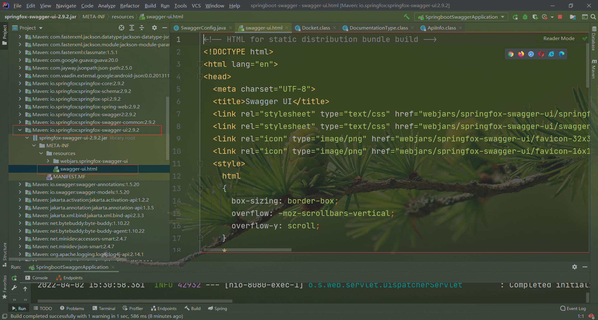
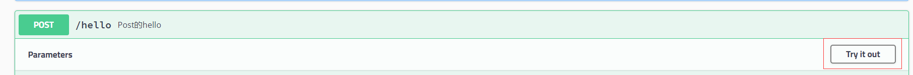
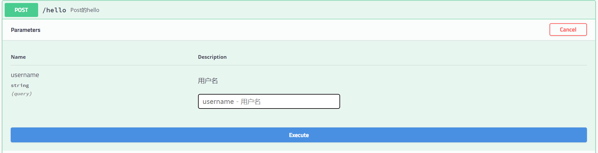
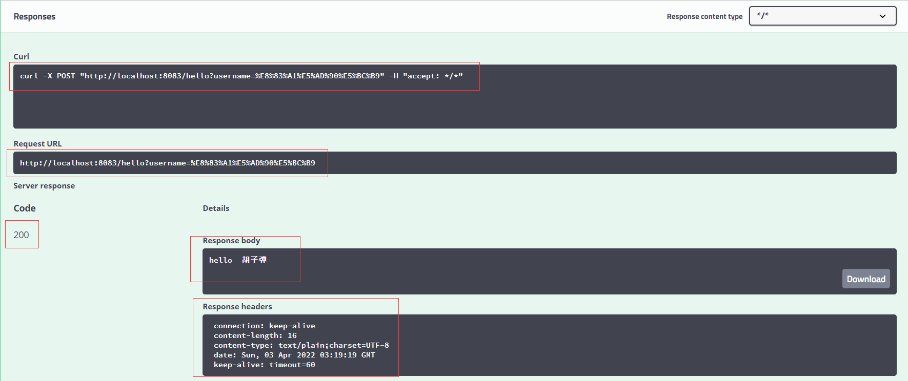
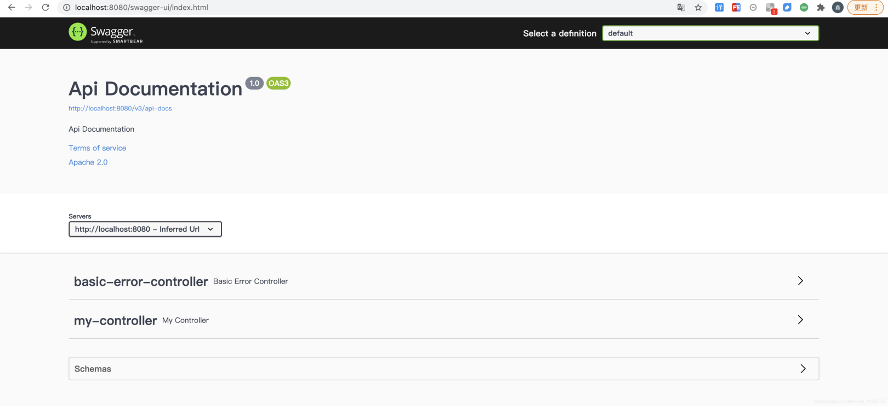

## 项目集成Swagger


**学习目标：**

- 了解Swagger的概念及作用
- 掌握在项目中集成Swagger自动生成API文档


### Swagger简介

**前后端分离**

- 前端 -> 前端控制层、视图层
- 后端 -> 后端控制层、服务层、数据访问层
- 前后端通过API进行交互
- 前后端相对独立且松耦合

**产生的问题**

- 前后端集成，前端或者后端无法做到“及时协商，尽早解决”，最终导致问题集中爆发

**解决方案**

- 首先定义schema [ 计划的提纲 ]，并实时跟踪最新的API，降低集成风险

**Swagger**

- 号称世界上最流行的API框架
- Restful Api 文档在线自动生成器 => **API 文档 与API 定义同步更新**
- 直接运行，在线测试API
- 支持多种语言 （如：Java，PHP等）
- 官网：https://swagger.io/
- 主要用于处理前后端分离下的API同步更新


### SpringBoot集成Swagger

**SpringBoot集成Swagger** => **springfox**，两个jar包

- **Springfox-swagger2**
- swagger-springmvc

**使用Swagger**

要求：jdk 1.8 + 否则swagger2无法运行

正式发布要关闭Swagger，否则用户可以通过swagger看到项目的所有接口

步骤：

1、新建一个SpringBoot-web项目

2、添加Maven依赖，注意SpringBoot版本不要用2.6，建议2.5.6，否则会空指针`Failed to start bean 'documentationPluginsBootstrapper'; nested exception is java.lang.NullPointerException`

- 如果导致其它依赖变红，用2.7.0看看

```xml
<!-- https://mvnrepository.com/artifact/io.springfox/springfox-swagger2 -->
<dependency>
   <groupId>io.springfox</groupId>
   <artifactId>springfox-swagger2</artifactId>
   <version>2.9.2</version>
</dependency>
<!-- https://mvnrepository.com/artifact/io.springfox/springfox-swagger-ui -->
<dependency>
   <groupId>io.springfox</groupId>
   <artifactId>springfox-swagger-ui</artifactId>
   <version>2.9.2</version>
</dependency>
```

3、编写HelloController，测试确保运行成功！

4、要使用Swagger，我们需要编写一个配置类-SwaggerConfig来配置 Swagger，也可以直接在启动类上加上@EnableSwagger2

```java
@Configuration //配置类
@EnableSwagger2// 开启Swagger2的自动配置
public class SwaggerConfig {  
}
```

5、访问测试 ：http://localhost:8080/swagger-ui.html ，可以看到swagger的界面，从上到下看

- 下拉框
- api文档信息
- 控制器接口信息
- 实体类信息


6、为什么是访问这个页面？源码里写的


### 配置Swagger（放在前面定义的SwaggerConfig类中）

1、Swagger实例Bean是Docket，所以通过配置Docket实例来配置Swaggger。

```java
@Bean //配置docket以配置Swagger具体参数
public Docket docket() {
   return new Docket(DocumentationType.SWAGGER_2);
}
```

2、可以通过apiInfo()属性配置文档信息

```java
//配置文档信息
private ApiInfo apiInfo() {
   Contact contact = new Contact("联系人名字", "http://xxx.xxx.com/联系人访问链接", "联系人邮箱");
   return new ApiInfo(
           "Swagger学习", // 标题
           "学习演示如何配置Swagger", // 描述
           "v1.0", // 版本
           "http://terms.service.url/组织链接", // 组织链接
           contact, // 联系人信息
           "Apach 2.0 许可", // 许可
           "许可链接", // 许可连接
           new ArrayList<>()// 扩展
  );
}
```

3、Docket 实例关联上 apiInfo()

```java
@Bean
public Docket docket() {
   return new Docket(DocumentationType.SWAGGER_2).apiInfo(apiInfo());
}
```

4、重启项目，访问测试 http://localhost:8080/swagger-ui.html  看下效果；


### 配置扫描接口

1、构建Docket时通过select()方法配置怎么扫描接口，默认全部扫描。

```java
@Bean
public Docket docket() {
   return new Docket(DocumentationType.SWAGGER_2)
      .apiInfo(apiInfo())
      .select()// 通过.select()方法，去配置扫描接口,RequestHandlerSelectors配置如何扫描接口
      .apis(RequestHandlerSelectors.basePackage("com.kuang.swagger.controller"))
      .apis(RequestHandlerSelectors...)
      .apis(RequestHandlerSelectors...)
      .build();
}
```

2、重启项目测试，由于我们配置根据包的路径扫描接口，所以我们只能看到一个类

3、除了通过包路径配置扫描接口（basePackage方法）外，还可以通过配置其他方式扫描接口，这里注释一下所有的`apis()`配置方式：

```java
any() // 扫描所有，项目中的所有接口都会被扫描到
none() // 不扫描接口
// 通过方法上的注解扫描，如withMethodAnnotation(GetMapping.class)只扫描GetMapping注解注解的接口，可以去测试一下
withMethodAnnotation(final Class<? extends Annotation> annotation)
// 通过类上的注解扫描，如.withClassAnnotation(Controller.class)只扫描有controller注解的类中的接口
withClassAnnotation(final Class<? extends Annotation> annotation)
basePackage(final String basePackage) // 根据包路径扫描接口，最常用
```

4、除此之外，我们还可以配置接口扫描过滤：

```java
@Bean
public Docket docket() {
   return new Docket(DocumentationType.SWAGGER_2)
      .apiInfo(apiInfo())
      .select()// 通过.select()方法，去配置扫描接口,RequestHandlerSelectors配置如何扫描接口
      .apis(RequestHandlerSelectors.basePackage("com.kuang.swagger.controller"))
       // 配置如何通过path过滤,即这里只扫描请求以/kuang开头的接口
      .paths(PathSelectors.ant("/kuang/**"))
      .build();
}
```

5、`paths()`，这里PathSelectors的可选值还有

```java
any() // 任何请求都扫描
none() // 任何请求都不扫描
regex(final String pathRegex) // 通过正则表达式控制
ant(final String antPattern) // 通过ant()控制
```


### 配置Swagger开关

1、通过enable()方法配置是否启用swagger，如果是false，swagger将不能在浏览器中访问了

```java
@Bean
public Docket docket() {
   return new Docket(DocumentationType.SWAGGER_2)
      .apiInfo(apiInfo())
      .enable(false) //配置是否启用Swagger，如果是false，在浏览器将无法访问
      .select()// 通过.select()方法，去配置扫描接口,RequestHandlerSelectors配置如何扫描接口
      .apis(RequestHandlerSelectors.basePackage("com.kuang.swagger.controller"))
       // 配置如何通过path过滤,即这里只扫描请求以/kuang开头的接口
      .paths(PathSelectors.ant("/kuang/**"))
      .build();
}
```

2、如何动态配置当项目处于test、dev环境时显示swagger，处于prod时不显示？

```java
@Bean
public Docket docket(Environment environment) {
   // 设置要显示swagger的环境
   Profiles of = Profiles.of("dev", "test");
   // 判断当前是否处于该环境
   // 通过 enable() 接收此参数判断是否要显示
   boolean b = environment.acceptsProfiles(of);
   
   return new Docket(DocumentationType.SWAGGER_2)
      .apiInfo(apiInfo())
      .enable(b) //配置是否启用Swagger，如果是false，在浏览器将无法访问
      .select()// 通过.select()方法，去配置扫描接口,RequestHandlerSelectors配置如何扫描接口
      .apis(RequestHandlerSelectors.basePackage("com.kuang.swagger.controller"))
       // 配置如何通过path过滤,即这里只扫描请求以/kuang开头的接口
      .paths(PathSelectors.ant("/kuang/**"))
      .build();
}
```

3、再次访问，因为yml没有配置多环境，开启失败！


4.可以在项目中增加一个dev的配置文件查看效果，active: dev时，可以访问8083端口，active: prop时，访问8085会404

```yml
spring:
  profiles:
    active: dev

---
server:
  port: 8083
spring:
  profiles: dev #配置环境的名称

---
server:
  port: 8084
spring:
  profiles: test  #配置环境的名称
  
---
server:
  port: 8085
spring:
  profiles: prop  #配置环境的名称
```


### 配置API分组


1、如果没有配置分组，默认是default。通过groupName()方法即可配置分组：

```java
@Bean
public Docket docket(Environment environment) {
   return new Docket(DocumentationType.SWAGGER_2).apiInfo(apiInfo())
      .groupName("hello") // 配置分组
       // 省略配置....
}
```

2、重启项目查看分组

3、如何配置多个分组？配置多个分组只需要配置多个docket即可：

```java
@Bean
public Docket docket1(){
   return new Docket(DocumentationType.SWAGGER_2).groupName("group1");
}
@Bean
public Docket docket2(){
   return new Docket(DocumentationType.SWAGGER_2).groupName("group2");
}
@Bean
public Docket docket3(){
   return new Docket(DocumentationType.SWAGGER_2).groupName("group3");
}
```

4、重启项目查看即可


### 实体配置

1、新建一个实体类

```java
@ApiModel("用户实体")
public class User {
   @ApiModelProperty("用户名")
   public String username;
   @ApiModelProperty("密码")
   public String password;
}
```

2、只要这个实体在**请求接口**的**返回值**上（即使是泛型），都能映射到实体项中：

```java
@RequestMapping("/getUser")
public User getUser(){
   return new User();
}
```

3、重启查看测试


注：并不是因为@ApiModel这个注解让实体显示在这里了，而是只要出现在接口方法的返回值上的实体都会显示在这里，而@ApiModel和@ApiModelProperty这两个注解**只是为实体添加注释**的。

@ApiModel为类添加注释

@ApiModelProperty为类属性添加注释


### 常用注解

Swagger的所有注解定义在io.swagger.annotations包下

下面列一些经常用到的，未列举出来的可以另行查阅说明：

| Swagger注解                                            | 简单说明                                             |
| ------------------------------------------------------ | ---------------------------------------------------- |
| @Api(tags = "xxx模块说明")                             | 作用在模块类上，也可以放在控制器类                   |
| @ApiOperation("xxx接口说明")                           | 作用在接口方法上                                     |
| @ApiModel("xxxPOJO说明")                               | 作用在模型类上：如VO、BO                             |
| @ApiModelProperty(value = "xxx属性说明",hidden = true) | 作用在类方法和属性上，hidden设置为true可以隐藏该属性 |
| @ApiParam("xxx参数说明")                               | 作用在参数、方法和字段上，类似@ApiModelProperty      |

我们也可以给请求的接口配置一些注释

```java
@ApiOperation("狂神的接口")
@PostMapping("/kuang")
@ResponseBody
public String kuang(@ApiParam("这个名字会被返回")String username){
   return username;
}
```

这样的话，可以给一些比较难理解的属性或者接口，增加一些配置信息，让人更容易阅读！

相较于传统的Postman或Curl方式测试接口，使用swagger简直就是傻瓜式操作，不需要额外说明文档(写得好本身就是文档)而且更不容易出错，只需要录入数据然后点击Execute，如果再配合自动化框架，可以说基本就不需要人为操作了。

Swagger是个优秀的工具，现在国内已经有很多的中小型互联网公司都在使用它，相较于传统的要先出Word接口文档再测试的方式，显然这样也更符合现在的快速迭代开发行情。当然了，提醒下大家在正式环境要记得关闭Swagger，一来出于安全考虑二来也可以节省运行时内存。

### 测试

感觉不如PostMan好用，主要还是给前端看文档的

```java
@ApiOperation("Post的hello")
@PostMapping("/hello")
public String hello(@ApiParam("用户名") @RequestParam("username") String username){
	return "hello  "+username;
}
```

点开接口，点击`Try it out`



输入测试所需的接口参数，注意接口的参数必须要有`@RequestParam注解`，点击Execute执行（可是如果参数是User对象怎么办？）



测试结果

### 拓展：其他皮肤

我们可以导入不同的包实现不同的皮肤定义：

1、默认的  **访问 http://localhost:8080/swagger-ui.html**

```
<dependency>
   <groupId>io.springfox</groupId>
   <artifactId>springfox-swagger-ui</artifactId>
   <version>2.9.2</version>
</dependency>
```


2、bootstrap-ui  **访问 http://localhost:8080/doc.html**

```
<!-- 引入swagger-bootstrap-ui包 /doc.html-->
<dependency>
   <groupId>com.github.xiaoymin</groupId>
   <artifactId>swagger-bootstrap-ui</artifactId>
   <version>1.9.1</version>
</dependency>
```


3、Layui-ui  **访问 http://localhost:8080/docs.html**

```
<!-- 引入swagger-ui-layer包 /docs.html-->
<dependency>
   <groupId>com.github.caspar-chen</groupId>
   <artifactId>swagger-ui-layer</artifactId>
   <version>1.1.3</version>
</dependency>
```


4、mg-ui  **访问 http://localhost:8080/document.html**

```
<!-- 引入swagger-ui-layer包 /document.html-->
<dependency>
   <groupId>com.zyplayer</groupId>
   <artifactId>swagger-mg-ui</artifactId>
   <version>1.0.6</version>
</dependency>
```


## Swagger 3.0使用教程

#### swagger介绍

>  Swagger 是一套基于 OpenAPI 规范（OpenAPI Specification，OAS）构建的开源工具，后来成为了 Open API 标准的主要定义者，现在最新的版本为17年发布的 Swagger3（Open Api3）。 国内绝大部分人还在用过时的swagger2（17年停止维护并更名为swagger3） 对于 Rest API 来说很重要的一部分内容就是文档，Swagger 为我们提供了一套通过代码和注解自动生成文档的方法，这一点对于保证API 文档的及时性将有很大的帮助。 OAS本身是一个API规范，它用于描述一整套API接口，包括一个接口是哪种请求方式、哪些参数、哪些header等，都会被包括在这个文件中。它在设计的时候通常是YAML格式，这种格式书写起来比较方便，而在网络中传输时又会以json形式居多，因为json的通用性比较强。 SpringFox是 spring 社区维护的一个项目（非官方），帮助使用者将 swagger2 集成到 Spring 中。

#### Swagger 主要包含了以下三个部分：

- Swagger Editor：基于浏览器的编辑器，我们可以使用它编写我们 OpenAPI 规范。
- Swagger UI：它会将我们编写的 OpenAPI 规范呈现为交互式的 API 文档，后文我将使用浏览器来查看并且操作我们的 Rest API。
- Swagger Codegen：它可以通过为 OpenAPI（以前称为 Swagger）规范定义的任何 API 生成[服务器](https://cloud.tencent.com/product/cvm?from=10680)存根和客户端 SDK 来简化构建过程。

#### springfox介绍

由于Spring的流行，Marty Pitt编写了一个基于Spring的组件swagger-springmvc，用于将swagger集成到springmvc中来，而springfox则是从这个组件发展而来。

通常SpringBoot项目整合swagger需要用到两个依赖：`springfox-swagger2`和`springfox-swagger-ui`，用于自动生成swagger文档。

- springfox-swagger2：这个组件的功能用于帮助我们自动生成描述API的json文件
- springfox-swagger-ui：就是将描述API的json文件解析出来，用一种更友好的方式呈现出来。

#### SpringFox 3.0.0 发布

##### 官方说明：

- SpringFox 3.0.0 发布了，SpringFox 的前身是 swagger-springmvc，是一个开源的 API doc 框架，可以将 Controller 的方法以文档的形式展现。
- 首先，非常感谢社区让我有动力参与这个项目。在这个版本中，在代码、注释、bug报告方面有一些非常惊人的贡献，看到人们在问题论坛上跳槽来解决问题，我感到很谦卑。它确实激励我克服“困难”，开始认真地工作。有什么更好的办法来摆脱科维德的忧郁！
- 注意：这是一个突破性的变更版本，我们已经尽可能地保持与springfox早期版本的向后兼容性。在2.9之前被弃用的api已经被积极地删除，并且标记了将在不久的将来消失的新api。所以请注意这些，并报告任何遗漏的内容。

##### 新特性：

-  Remove explicit dependencies on springfox-swagger2 `删除对 springfox-swagger2 的显式依赖`
-  Remove any @EnableSwagger2… annotations `删除所有@EnableSwagger2...附注`
-  Add the springfox-boot-starter dependency `添加 springfox-boot-starter 依赖项`
-  Springfox 3.x removes dependencies on guava and other 3rd party libraries (not zero dep yet! depends on spring plugin and open api libraries for annotations and models) so if you used guava predicates/functions those will need to transition to java 8 function interfaces. `Springfox 3.x删除了对guava和其他第三方库的依赖（还不是零dep！依赖于spring插件和开放的API库来注释和模型），所以如果你使用guava谓词/函数，这些将需要过渡到java 8函数接口。`

##### 此版本的亮点：

- Spring5，Webflux支持（仅支持请求映射，尚不支持功能端点）。
- Spring Integration支持。
- SpringBoot支持springfox Boot starter依赖性（零配置、自动配置支持）。
- 具有自动完成功能的文档化配置属性。
- 更好的规范兼容性与2.0。
- 支持OpenApi 3.0.3。
- 零依赖。几乎只需要spring-plugin，swagger-core(https://github.com/swagger-api/swagger-core) ，现有的swagger2注释将继续工作并丰富openapi3.0规范。

##### 兼容性说明：

- 需要Java 8
- 需要Spring5.x（未在早期版本中测试）
- 需要SpringBoot 2.2+（未在早期版本中测试）

##### 注意：

应用主类增加注解@EnableOpenApi，删除之前版本的SwaggerConfig.java。

启动项目，访问地址：`http://localhost:8080/swagger-ui/index.html`，(注意swagger2.x版本中访问的地址的为http://localhost:8080/swagger-ui.html)

##### swagger3与swagger2区别：

|     区别      |                   swagger2                   |           swagger3            |
| :-----------: | :------------------------------------------: | :---------------------------: |
|  **依赖包**   | `springfox-swagger2`、`springfox-swagger-ui` |   `springfox-boot-starter`    |
|   启用方式    |              `@EnableSwagger2`               |       `@EnableOpenApi`        |
|   访问方式    |           ip:port/swagger-ui.html            | ip:port/swagger-ui/index.html |
| Doucument类型 |        `DocumentationType.SWAGGER_2`         |  `DocumentationType.OAS_30`   |

作者：Geroge1226
链接：https://www.jianshu.com/p/f50eebbd529e
来源：简书
著作权归作者所有。商业转载请联系作者获得授权，非商业转载请注明出处。

##### 整合使用

Maven项目中引入springfox-boot-starter依赖：

```xml
<dependency>
    <groupId>io.springfox</groupId>
    <artifactId>springfox-boot-starter</artifactId>
    <version>3.0.0</version>
</dependency>
```

application.yml配置

```yml
spring:
  application:
    name: springfox-swagger
server:
  port: 8080
# ===== 自定义swagger配置 ===== #
swagger:
  #是否启动swagger 本地和测试环境为true 正式环境为false
  enable: true 
  # 项目应用名
  application-name: ${spring.application.name} 
  # 项目版本信息
  application-version: 1.0 
  # 项目描述信息
  application-description: springfox swagger 3.0整合Demo 
  try-host: http://localhost:${server.port}
```

使用@EnableOpenApi注解，启用swagger配置

```java
@EnableOpenApi
@Configuration
public class SwaggerConfiguration {

}
```

自定义swagger配置类SwaggerProperties

```java
@Component
@ConfigurationProperties("swagger")
public class SwaggerProperties {
    /**
     * 是否开启swagger，生产环境一般关闭，所以这里定义一个变量
     */
    private Boolean enable;
    
    /**
     * 项目应用名
     */
    private String applicationName;

    /**
     * 项目版本信息
     */
    private String applicationVersion;

    /**
     * 项目描述信息
     */
    private String applicationDescription;

    /**
     * 接口调试地址
     */
    private String tryHost;

    public Boolean getEnable() {
        return enable;
    }

    public void setEnable(Boolean enable) {
        this.enable = enable;
    }

    public String getApplicationName() {
        return applicationName;
    }

    public void setApplicationName(String applicationName) {
        this.applicationName = applicationName;
    }

    public String getApplicationVersion() {
        return applicationVersion;
    }

    public void setApplicationVersion(String applicationVersion) {
        this.applicationVersion = applicationVersion;
    }

    public String getApplicationDescription() {
        return applicationDescription;
    }

    public void setApplicationDescription(String applicationDescription) {
        this.applicationDescription = applicationDescription;
    }

    public String getTryHost() {
        return tryHost;
    }

    public void setTryHost(String tryHost) {
        this.tryHost = tryHost;
    }
}
```

一个完整详细的springfox swagger配置示例：

```java
import io.swagger.models.auth.In;
import org.apache.commons.lang3.reflect.FieldUtils;
import org.springframework.boot.SpringBootVersion;
import org.springframework.context.annotation.Bean;
import org.springframework.context.annotation.Configuration;
import org.springframework.util.ReflectionUtils;
import org.springframework.web.servlet.config.annotation.InterceptorRegistration;
import org.springframework.web.servlet.config.annotation.InterceptorRegistry;
import org.springframework.web.servlet.config.annotation.WebMvcConfigurer;
import springfox.documentation.builders.ApiInfoBuilder;
import springfox.documentation.builders.PathSelectors;
import springfox.documentation.builders.RequestHandlerSelectors;
import springfox.documentation.oas.annotations.EnableOpenApi;
import springfox.documentation.service.*;
import springfox.documentation.spi.DocumentationType;
import springfox.documentation.spi.service.contexts.SecurityContext;
import springfox.documentation.spring.web.plugins.Docket;

import java.lang.reflect.Field;
import java.util.*;

@EnableOpenApi
@Configuration
public class SwaggerConfiguration implements WebMvcConfigurer {
    private final SwaggerProperties swaggerProperties;

    public SwaggerConfiguration(SwaggerProperties swaggerProperties) {
        this.swaggerProperties = swaggerProperties;
    }

    @Bean
    public Docket createRestApi() {
        return new Docket(DocumentationType.OAS_30).pathMapping("/")

                // 定义是否开启swagger，false为关闭，可以通过变量控制
                .enable(swaggerProperties.getEnable())

                // 将api的元信息设置为包含在json ResourceListing响应中。 
                .apiInfo(apiInfo())

                // 接口调试地址
                .host(swaggerProperties.getTryHost())

                // 选择哪些接口作为swagger的doc发布
                .select()
                .apis(RequestHandlerSelectors.any())
                .paths(PathSelectors.any())
                .build()

                // 支持的通讯协议集合
                .protocols(newHashSet("https", "http"))

                // 授权信息设置，必要的header token等认证信息
                .securitySchemes(securitySchemes())

                // 授权信息全局应用
                .securityContexts(securityContexts());
    }

    /**
     * API 页面上半部分展示信息
     */
    private ApiInfo apiInfo() {
        return new ApiInfoBuilder().title(swaggerProperties.getApplicationName() + " Api Doc")
                .description(swaggerProperties.getApplicationDescription())
                .contact(new Contact("lighter", null, "123456@gmail.com"))
                .version("Application Version: " + swaggerProperties.getApplicationVersion() + ", Spring Boot Version: " + SpringBootVersion.getVersion())
                .build();
    }

    /**
     * 设置授权信息
     */
    private List<SecurityScheme> securitySchemes() {
        ApiKey apiKey = new ApiKey("BASE_TOKEN", "token", In.HEADER.toValue());
        return Collections.singletonList(apiKey);
    }

    /**
     * 授权信息全局应用
     */
    private List<SecurityContext> securityContexts() {
        return Collections.singletonList(
                SecurityContext.builder()
                        .securityReferences(Collections.singletonList(new SecurityReference("BASE_TOKEN", new AuthorizationScope[]{new AuthorizationScope("global", "")})))
                        .build()
        );
    }

    @SafeVarargs
    private final <T> Set<T> newHashSet(T... ts) {
        if (ts.length > 0) {
            return new LinkedHashSet<>(Arrays.asList(ts));
        }
        return null;
    }

    /**
     * 通用拦截器排除swagger设置，所有拦截器都会自动加swagger相关的资源排除信息
     */
    @SuppressWarnings("unchecked")
    @Override
    public void addInterceptors(InterceptorRegistry registry) {
        try {
            Field registrationsField = FieldUtils.getField(InterceptorRegistry.class, "registrations", true);
            List<InterceptorRegistration> registrations = (List<InterceptorRegistration>) ReflectionUtils.getField(registrationsField, registry);
            if (registrations != null) {
                for (InterceptorRegistration interceptorRegistration : registrations) {
                    interceptorRegistration
                            .excludePathPatterns("/swagger**/**")
                            .excludePathPatterns("/webjars/**")
                            .excludePathPatterns("/v3/**")
                            .excludePathPatterns("/doc.html");
                }
            }
        } catch (Exception e) {
            e.printStackTrace();
        }
    }

}
```

##### 一些常用注解说明

>  @Api：用在controller类，描述API接口 @ApiOperation：描述接口方法 @ApiModel：描述对象 @ApiModelProperty：描述对象属性 @ApiImplicitParams：描述接口参数 @ApiResponses：描述接口响应 @ApiIgnore：忽略接口方法

效果图：



##### 资料

swagger 官网：swagger.io(https://swagger.io/) 

springfox 官网：springfox(http://springfox.github.io/springfox/) 

springfox Github 仓库：springfox / springfox(https://github.com/springfox/springfox)

 springfox-demos Github 仓库：springfox / springfox-demos(https://github.com/springfox/springfox-demos) 

springfox Maven 仓库：Home » io.springfox(https://mvnrepository.com/artifact/io.springfox)
