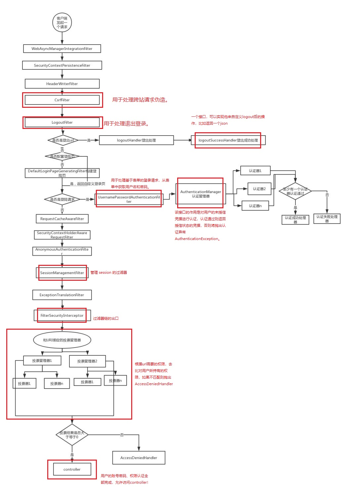
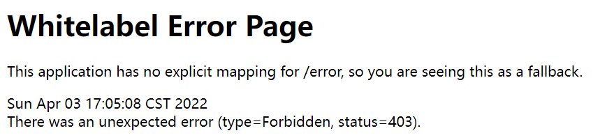
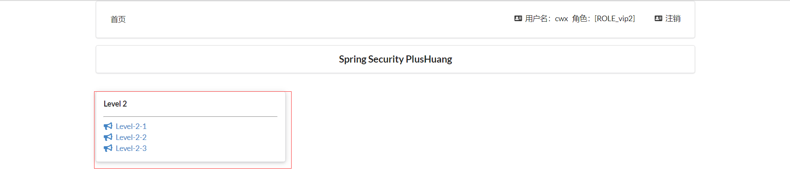
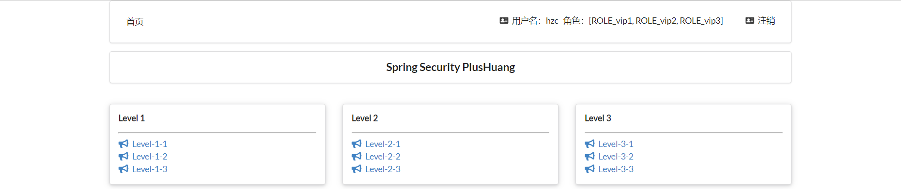

## SpringSecurity

### 安全简介

在 Web 开发中，安全一直是非常重要的一个方面。安全虽然属于应用的非功能性需求，但是应该在应用开发的初期就考虑进来。如果在应用开发的后期才考虑安全的问题，就可能陷入一个两难的境地：一方面，应用存在严重的安全漏洞，无法满足用户的要求，并可能造成用户的隐私数据被攻击者窃取；另一方面，应用的基本架构已经确定，要修复安全漏洞，可能需要对系统的架构做出比较重大的调整，因而需要更多的开发时间，影响应用的发布进程。因此，从应用开发的第一天就应该把安全相关的因素考虑进来，并在整个应用的开发过程中。

市面上存在比较有名的：Shiro，Spring Security ！

这里需要阐述一下的是，每一个框架的出现都是为了解决某一问题而产生了，那么Spring Security框架的出现是为了解决什么问题呢？

首先我们看下它的官网介绍：Spring Security官网地址

Spring Security is a powerful and highly customizable authentication and access-control framework. It is the de-facto standard for securing Spring-based applications.

Spring Security is a framework that focuses on providing both authentication and authorization to Java applications. Like all Spring projects, the real power of Spring Security is found in how easily it can be extended to meet custom requirements

Spring Security是一个功能强大且高度可定制的身份验证和访问控制框架。它实际上是保护基于spring的应用程序的标准。

Spring Security是一个框架，侧重于为Java应用程序提供身份验证和授权。与所有Spring项目一样，Spring安全性的真正强大之处在于它可以轻松地扩展以满足定制需求

从官网的介绍中可以知道这是一个权限框架。想我们之前做项目是没有使用框架是怎么控制权限的？对于权限 一般会细分为功能权限，访问权限，和菜单权限。代码会写的非常的繁琐，冗余。

怎么解决之前写权限代码繁琐，冗余的问题，一些主流框架就应运而生而Spring Scecurity就是其中的一种。

Spring 是一个非常流行和成功的 Java 应用开发框架。Spring Security 基于 Spring 框架，提供了一套 Web 应用安全性的完整解决方案。一般来说，Web 应用的安全性包括用户认证（Authentication）和用户授权（Authorization）两个部分。用户认证指的是验证某个用户是否为系统中的合法主体，也就是说用户能否访问该系统。用户认证一般要求用户提供用户名和密码。系统通过校验用户名和密码来完成认证过程。用户授权指的是验证某个用户是否有权限执行某个操作。在一个系统中，不同用户所具有的权限是不同的。比如对一个文件来说，有的用户只能进行读取，而有的用户可以进行修改。一般来说，系统会为不同的用户分配不同的角色，而每个角色则对应一系列的权限。

对于上面提到的两种应用情景，Spring Security 框架都有很好的支持。在用户认证方面，Spring Security 框架支持主流的认证方式，包括 HTTP 基本认证、HTTP 表单验证、HTTP 摘要认证、OpenID 和 LDAP 等。在用户授权方面，Spring Security 提供了基于角色的访问控制和访问控制列表（Access Control List，ACL），可以对应用中的领域对象进行细粒度的控制。

### SpringSecurity（安全）

功能性：否，并不是说没有这个项目就跑不起来了

做网站，安全应该在什么时候考虑？设计之初！否则后期要改动很多代码，容易产生bug

### SpringSecurity的原理图



## 实战测试

### 实验环境搭建

1、新建一个初始的springboot项目web模块，thymeleaf模块

2、导入静态资源

```
welcome.html
|views
	|level1
		1.html
		2.html
		3.html
	|level2
		1.html
		2.html
		3.html
	|level3
		1.html
		2.html
		3.html
	Login.html
```

3、controller跳转！

```java
package com.kuang.controller;

import org.springframework.stereotype.Controller;
import org.springframework.web.bind.annotation.PathVariable;
import org.springframework.web.bind.annotation.RequestMapping;

@Controller
public class RouterController {

   @RequestMapping({"/","/index"})
   public String index(){
       return "index";
  }

   @RequestMapping("/toLogin")
   public String toLogin(){
       return "views/login";
  }

   @RequestMapping("/level1/{id}")
   public String level1(@PathVariable("id") int id){
       return "views/level1/"+id;
  }

   @RequestMapping("/level2/{id}")
   public String level2(@PathVariable("id") int id){
       return "views/level2/"+id;
  }

   @RequestMapping("/level3/{id}")
   public String level3(@PathVariable("id") int id){
       return "views/level3/"+id;
  }

}
```

4、测试实验环境是否OK！


### 认识SpringSecurity

Spring Security 是针对Spring项目的安全框架，也是Spring Boot底层安全模块默认的技术选型，他可以实现强大的Web安全控制，对于安全控制，我们仅需要引入 spring-boot-starter-security 模块，进行少量的配置，即可实现强大的安全管理！

AOP编程，横切思想

记住几个类：

- **WebSecurityConfigurerAdapter**：自定义Security策略，适配器模式
- **AuthenticationManagerBuilder**：自定义认证策略，建造者模式
- **@EnableWebSecurity**：开启WebSecurity模式

Spring Security的两个主要目标是 “认证” 和 “授权”（访问控制）。

**“认证”（Authentication）**

身份验证是关于验证您的凭据，如用户名/用户ID和密码，以验证您的身份。

身份验证通常通过用户名和密码完成，有时与身份验证因素结合使用。

 **“授权” （Authorization）**

授权发生在系统成功验证您的身份后，最终会授予您访问资源（如信息，文件，数据库，资金，位置，几乎任何内容）的完全权限。

这个概念是通用的，而不是只在Spring Security 中存在。


### SpringSecurity匹配规则

#### URL匹配

1. **requestMatchers()** 配置一个request Mather数组，参数为RequestMatcher 对象，其match 规则自定义,需要的时候放在最前面，对需要匹配的的规则进行自定义与过滤
2. **authorizeRequests()**   URL权限配置
3. **antMatchers()** 配置一个request Mather 的 string数组，参数为 ant 路径格式， 直接匹配url
4. **anyRequest()** 匹配任意url，无参 ,最好放在最后面

#### 保护URL

1. **uthenticated()**  保护UrL，需要用户登录
2. **permitAll()**  指定URL无需保护，一般应用与静态资源文件
3. **hasRole(String role)**   限制单个角色访问，角色将被增加 “ROLE_” .所以”ADMIN” 将和 “ROLE_ADMIN”进行比较. 另一个方法是hasAuthority(String authority)
4. **hasAnyRole(String… roles)** 允许多个角色访问. 另一个方法是hasAnyAuthority(String… authorities)
5. **access(String attribute)** 该方法使用 SPEL, 所以可以创建复杂的限制 例如如access("permitAll"), access("hasRole('ADMIN') and hasIpAddress('123.123.123.123')")
6. **hasIpAddress(String ipaddressExpression)** 限制IP地址或子网

#### 登录login

1. **formLogin()** 基于表单登录
2. **loginPage()** 登录页
3. **defaultSuccessUrl()**  登录成功后的默认处理页
4. **failuerHandler()** 登录失败之后的处理器
5. **successHandler()** 登录成功之后的处理器
6. **failuerUrl()** 登录失败之后系统转向的url，默认是this.loginPage + "?error"

#### 登出logout

1. **logoutUrl()** 登出url ， 默认是/logout， 它可以是一个ant path url
2. **logoutSuccessUrl()** 登出成功后跳转的 url 默认是"/login?logout"
3. **logoutSuccessHandler()** 登出成功处理器，设置后会把logoutSuccessUrl  置为null

#### 使用格式

- **http.authorizeRequests().URL匹配.保护URL**

- **http.formLogin().loginPage().defaultSuccessUrl().failuerUrl()**

- **http.logoutUrl().logoutSuccessUrl()**

- 可以分开来写三个，也可以使用and连接，例如

  ```java
  http
      // 请求授权
      .authorizeRequests()
      .antMatchers("/")
      .permitAll()
      .anyRequest()
      .hasRole("vip1")
      //登录认证
      .and()
      .formLogin()
      .loginProcessingUrl("/login")
      .loginPage("/toLogin")
      //登出
      .and()
      .logout()
      .logoutSuccessUrl("/");
  ```

  

### 认证和授权

目前，我们的测试环境，是谁都可以访问的，我们使用 Spring Security 增加上认证和授权的功能

#### 1、引入 Spring Security 模块

```xml
<!-- 后端整合security -->
<dependency>
    <groupId>org.springframework.boot</groupId>
    <artifactId>spring-boot-starter-security</artifactId>
</dependency>
<!-- thymeleaf使用security -->
<dependency>
    <groupId>org.thymeleaf.extras</groupId>
    <artifactId>thymeleaf-extras-springsecurity5</artifactId>
    <version>3.0.4.RELEASE</version>
</dependency>
<!-- 整合thymeleaf -->
<dependency>
    <groupId>org.springframework.boot</groupId>
    <artifactId>spring-boot-starter-thymeleaf</artifactId>
</dependency>
<dependency>
    <groupId>org.springframework.boot</groupId>
    <artifactId>spring-boot-starter-web</artifactId>
</dependency>
```

#### 2、编写 Spring Security 配置类

参考官网：https://spring.io/projects/spring-security 

查看我们自己项目中的版本，找到对应的帮助文档：

https://docs.spring.io/spring-security/site/docs/5.3.0.RELEASE/reference/html5  #servlet-applications 8.16.4


```java
package com.kuang.config;

import org.springframework.security.config.annotation.web.builders.HttpSecurity;
import org.springframework.security.config.annotation.web.configuration.EnableWebSecurity;
import org.springframework.security.config.annotation.web.configuration.WebSecurityConfigurerAdapter;

@EnableWebSecurity // 开启WebSecurity模式，不需要@Configuration，因为底层实现了
public class SecurityConfig extends WebSecurityConfigurerAdapter {

}
```

#### 3、定制Http请求的安全**授权规则**

- antMatchers方法匹配的是控制器**接口访问路径**，不是前端页面路径

```java
package com.kuang.config;

import org.springframework.security.config.annotation.web.builders.HttpSecurity;
import org.springframework.security.config.annotation.web.configuration.EnableWebSecurity;
import org.springframework.security.config.annotation.web.configuration.WebSecurityConfigurerAdapter;

@EnableWebSecurity // 开启WebSecurity模式，不需要@Configuration，因为底层实现了
public class SecurityConfig extends WebSecurityConfigurerAdapter {

    @Override
    protected void configure(HttpSecurity http) throws Exception {
        // 定制请求的授权规则
        // 首页所有人可以访问
        //authorizeRequests()：认证请求
        //antMatchers("/").permitAll()：认证首页（“/”页面）所有人能够访问
        //antMatchers("/level1/**").hasRole("vip1")：认证（“/level1/**”页面）只有vip1用户能访问
        http.authorizeRequests()
            // spring-security 5.0 之后需要过滤静态资源
            // /abc/*：/abc/ab会被拦截，/abc/ab/aa不会被拦截
            // /abc/**：/abc/ab会被拦截，/abc/ab/aa也会被拦截
            //.antMatchers("/login", "/css/**", "/js/**", "/img/*").permitAll()
            .antMatchers("/").permitAll()
            .antMatchers("/level1/**").hasRole("vip1")
            .antMatchers("/level2/**").hasRole("vip2")
            .antMatchers("/level3/**").hasRole("vip3");
    }
}
```

4、测试一下：发现除了首页都进不去了，报错403！因为我们目前没有登录的角色，因为请求需要登录的角色拥有对应的权限才可以！

6、当没有权限，就跳转一个登录页面。在configure()方法中加入以下配置，开启自动配置的登录功能！

```java
// 开启自动配置的登录功能
// 没有权限就会跳转/login，请求来到登录页
// 登录失败就跳转/login?error，重定向到这里表示登录失败
http.formLogin();
```

7、测试一下：发现，没有权限的时候，会跳转到登录的页面！


8、查看刚才登录页的注释信息；

我们可以定义**认证规则**，重写configure(AuthenticationManagerBuilder auth)方法

```java
//定义认证规则
@Override
protected void configure(AuthenticationManagerBuilder auth) throws Exception {
   
   //在内存中定义，也可以在jdbc中去拿....
   auth.inMemoryAuthentication()
          .withUser("kuangshen").password("123456").roles("vip2","vip3")
          .and()
          .withUser("root").password("123456").roles("vip1","vip2","vip3")
          .and()
          .withUser("guest").password("123456").roles("vip1","vip2");
}
```

9、测试，我们可以使用这些账号登录进行测试！发现会报错！

There is no PasswordEncoder mapped for the id “null”


10、原因，我们要将前端传过来的密码进行某种方式加密，否则就无法登录，修改代码

```java
//定义认证规则
@Override
protected void configure(AuthenticationManagerBuilder auth) throws Exception {
   //在内存中定义，也可以在jdbc中去拿....
   //Spring security 5.0中新增了多种加密方式，也改变了密码的格式。
   //要想我们的项目还能够正常登陆，需要修改一下configure中的代码。我们要将前端传过来的密码进行某种方式加密
   //spring security 官方推荐的是使用bcrypt加密方式。
   
   auth.inMemoryAuthentication().passwordEncoder(new BCryptPasswordEncoder())
          .withUser("kuangshen").password(new BCryptPasswordEncoder().encode("123456")).roles("vip2","vip3")
          .and()
          .withUser("root").password(new BCryptPasswordEncoder().encode("123456")).roles("vip1","vip2","vip3")
          .and()
          .withUser("guest").password(new BCryptPasswordEncoder().encode("123456")).roles("vip1","vip2");
}
```

```java
//先去配置类注入一个datasource
@Autowired
private DataSource dataSource;
@Override
protected void configure(AuthenticationManagerBuilder auth) throws Exception {
    User.UserBuilder userBuilder = User.withDefaultPasswordEncoder();
    auth.jdbcAuthentication().passwordEncoder(new BCryptPasswordEncoder())
        .dataSource(dataSource)
        .withDefaultSchema()
        //下面的和内存中定义一样
        .withUser(userBuilder.username("hzc").password(new BCryptPasswordEncoder().encode("123")).roles("vip1","vip2"));
    }

//--------------------------------------------------------------------------

//从数据库中取用户
//需要在yml中配置数据源
@Autowired//(如果@Autowired报了Bean错误，就用@Resource试试)
DataSource dataSource;

@Autowired
public void configureGlobal(AuthenticationManagerBuilder auth) throws Exception {
    auth.jdbcAuthentication().dataSource(dataSource)
        .passwordEncoder(new BCryptPasswordEncoder())
        //此处必须3个参数，前2个用户名和密码，第三个可以随便找一个
        .usersByUsernameQuery("select u_name,u_password,a_id from `admin` where u_name = ?")
   	 	//此处必须为2个参数，第一个为用户名，第二个为用户权限（可以随意找一个）
        .authoritiesByUsernameQuery("select u_name, a_id from `admin` where u_name = ?");
}
//where u_name = ?不要忘记了，否则会报错：Parameter index out of range (1 > number of parameters, which is 0)
//passwordEncoder不要忘记设置了，否则会报错：There is no PasswordEncoder mapped for the id "null"
```

```yml
#配置数据源
spring:
  datasource:
    driver-class-name: com.mysql.cj.jdbc.Driver
    url: jdbc:mysql://localhost:3306/barter_user?characterEncoding=UTF-8&useUnicode=true&useSSL=true&serverTimezone=UTC
    username: root
    password: root
```

- 登录显示Bad credentials，后台警告**Encoded password does not look like BCrypt**

- 因为数据库中的密码格式不被BCryptPasswordEncoder识别，用户在设置密码是应该**`new BCryptPasswordEncoder().encode("xxx")`加密存储**

- 注意，**用户权限值**必须要加上**`ROLE_`前缀**，这样`http.authorizeRequests().antMatchers("/level1/**").hasRole("USER")`中的USER才能识别到权限字段的值

  ```java
  //因为数据库中的密码格式不被BCryptPasswordEncoder识别
  //用户在设置密码是应该如下所示：new BCryptPasswordEncoder().encode("xxx")
  User user = new User();
  user.setUsername("123456");
  user.setLevel("ROLE_"+"USER");
  user.setPassword(new BCryptPasswordEncoder().encode("666666"));
  userMapper.insert(user);
  ```

11、测试，发现，登录成功，并且每个角色只能访问自己认证下的规则！搞定


### 权限控制和注销

1、开启自动配置的注销的功能，现在好像自动开启了

```java
//定制请求的授权规则
@Override
protected void configure(HttpSecurity http) throws Exception {
   //....
   //开启自动配置的注销的功能
      // /logout 注销请求
   http.logout();
}
```

2、我们在前端，增加一个注销的按钮，index.html 导航栏中

```html
<a class="item" th:href="@{/logout}">
   <i class="address card icon"></i> 注销
</a>
```

3、我们可以去测试一下，登录成功后点击注销，发现注销完毕会跳转到登录页面！

4、但是，我们想让他注销成功后，依旧可以跳转到首页，该怎么处理呢？

```java
// .logoutSuccessUrl("/"); 注销成功来到首页
http.logout().logoutSuccessUrl("/");
```

5、测试，注销完毕后，发现跳转到首页OK

6、我们现在又来一个需求：用户没有登录的时候，导航栏上只显示登录按钮，用户登录之后，导航栏可以显示登录的用户信息及注销按钮！还有就是，比如kuangshen这个用户，它只有 vip2，vip3功能，那么登录则只显示这两个功能，而vip1的功能菜单不显示！这个就是真实的网站情况了！该如何做呢？

我们需要结合thymeleaf中的一些功能

sec：authorize="isAuthenticated()":是否认证登录！来显示不同的页面

Maven依赖：

```
<!-- https://mvnrepository.com/artifact/org.thymeleaf.extras/thymeleaf-extras-springsecurity4 -->
<dependency>
   <groupId>org.thymeleaf.extras</groupId>
   <artifactId>thymeleaf-extras-springsecurity5</artifactId>
   <version>3.0.4.RELEASE</version>
</dependency>
```

7、修改我们的 前端页面

1. 导入命名空间

2. ```html
   xmlns:sec="http://www.thymeleaf.org/thymeleaf-extras-springsecurity5"
   ```

3. 修改导航栏，增加认证判断

4. ```html
   <!--登录注销-->
   <div class="right menu">
   
      <!--如果未登录-->
      <div sec:authorize="!isAuthenticated()">
          <a class="item" th:href="@{/login}">
              <i class="address card icon"></i> 登录
          </a>
      </div>
   
      <!--如果已登录-->
      <div sec:authorize="isAuthenticated()">
          <a class="item">
              <i class="address card icon"></i>
             用户名：<span sec:authentication="principal.username"></span>
             角色：<span sec:authentication="principal.authorities"></span>
          </a>
      </div>
   
      <div sec:authorize="isAuthenticated()">
          <a class="item" th:href="@{/logout}">
              <i class="address card icon"></i> 注销
          </a>
      </div>
   </div>
   ```

8、重启测试，我们可以登录试试看，登录成功后确实，显示了我们想要的页面；

9、如果注销404了，就是因为它默认防止csrf跨站请求伪造，因为会产生安全问题，我们可以将请求改为post表单提交，或者在spring security中关闭csrf功能；我们试试：在 配置中增加 `http.csrf().disable();`

```java
http.csrf().disable();//关闭csrf功能:跨站请求伪造,默认只能通过post方式提交logout请求
http.logout().logoutSuccessUrl("/");
```

10、我们继续将下面的角色功能块认证完成！

```html
<!-- sec:authorize="hasRole('vip1')" -->
<div class="column" sec:authorize="hasRole('vip1')">
   <div class="ui raised segment">
       <div class="ui">
           <div class="content">
               <h5 class="content">Level 1</h5>
               <hr>
               <div><a th:href="@{/level1/1}"><i class="bullhorn icon"></i> Level-1-1</a></div>
               <div><a th:href="@{/level1/2}"><i class="bullhorn icon"></i> Level-1-2</a></div>
               <div><a th:href="@{/level1/3}"><i class="bullhorn icon"></i> Level-1-3</a></div>
           </div>
       </div>
   </div>
</div>

<div class="column" sec:authorize="hasRole('vip2')">
   <div class="ui raised segment">
       <div class="ui">
           <div class="content">
               <h5 class="content">Level 2</h5>
               <hr>
               <div><a th:href="@{/level2/1}"><i class="bullhorn icon"></i> Level-2-1</a></div>
               <div><a th:href="@{/level2/2}"><i class="bullhorn icon"></i> Level-2-2</a></div>
               <div><a th:href="@{/level2/3}"><i class="bullhorn icon"></i> Level-2-3</a></div>
           </div>
       </div>
   </div>
</div>

<div class="column" sec:authorize="hasRole('vip3')">
   <div class="ui raised segment">
       <div class="ui">
           <div class="content">
               <h5 class="content">Level 3</h5>
               <hr>
               <div><a th:href="@{/level3/1}"><i class="bullhorn icon"></i> Level-3-1</a></div>
               <div><a th:href="@{/level3/2}"><i class="bullhorn icon"></i> Level-3-2</a></div>
               <div><a th:href="@{/level3/3}"><i class="bullhorn icon"></i> Level-3-3</a></div>
           </div>
       </div>
   </div>
</div>
```

11、测试一下！

12、权限控制和注销搞定！


### 记住我

现在的情况，我们只要登录之后，关闭浏览器，再登录，就会让我们重新登录，但是很多网站的情况，就是有一个记住密码的功能，这个该如何实现呢？很简单

1、开启记住我功能

```java
//定制请求的授权规则
@Override
protected void configure(HttpSecurity http) throws Exception {
//。。。。。。。。。。。
   //记住我
   http.rememberMe();
}
```

2、我们再次启动项目测试一下，发现登录页多了一个记住我功能，我们登录之后关闭 浏览器，然后重新打开浏览器访问，发现用户依旧存在！

思考：如何实现的呢？其实非常简单

我们可以查看浏览器的cookie


3、我们点击注销的时候，可以发现，spring security 帮我们自动删除了这个 cookie

4、结论：登录成功后，将cookie发送给浏览器保存，以后登录带上这个cookie，只要通过检查就可以免登录了。如果点击注销，则会删除这个cookie，具体的原理我们在JavaWeb阶段都讲过了，这里就不在多说了！


### 定制登录页

现在这个登录页面都是spring security 默认的，怎么样可以使用我们自己写的Login界面呢？

1、在刚才的登录页配置后面指定 loginpage

```java
//设置权限认证应该跳转的控制器请求
http.formLogin().loginPage("/toLogin");
```

2、然后前端也需要指向我们自己定义的 login请求

```html
<a class="item" th:href="@{/toLogin}">
   <i class="address card icon"></i> 登录
</a>
```

3、我们登录，需要将这些信息发送到哪里，我们也需要配置，login.html 配置提交请求及方式，方式必须为post:

在 loginPage()源码中的注释上有写明：


```html
<!-- 提交到/login，/login是security自己写的接口 -->
<form th:action="@{/login}" method="post">
   <div class="field">
       <label>Username</label>
       <div class="ui left icon input">
           <input type="text" placeholder="Username" name="username">
           <i class="user icon"></i>
       </div>
   </div>
   <div class="field">
       <label>Password</label>
       <div class="ui left icon input">
           <input type="password" name="password">
           <i class="lock icon"></i>
       </div>
   </div>
   <input type="submit" class="ui blue submit button"/>
</form>
```

4、这个请求提交上来，我们还需要验证处理，怎么做呢？我们可以查看formLogin()方法的源码！我们配置接收登录的用户名和密码的参数！

```java

http.formLogin()
  	// /toLogin请求跳转的页面的name为email的组件提交的值，将作为SpringSecurity认证的username
    .usernameParameter("email")
 	// /toLogin请求跳转的页面的name为password的组件提交的值，将作为SpringSecurity认证的password
    .passwordParameter("password")
    //设置权限认证应该跳转的控制器请求，/toLogin控制器指向的页面
   	//该页面action为/login的指定表单，中name属性为email和password的组件上传的值，将作为SpringSecurity安全认证的用户名、密码
    .loginPage("/toLogin")
    // /login是security默认的登录认证接口，/toLogin请求跳转的页面，表单提交到/login接口
    .loginProcessingUrl("/login")
    .and()
    // 请求授权
    .authorizeRequests()
    //让跳转登录接口和security默认登录接口所有人可访问，否则没有权限进入登录页面
    .antMatchers("/toLogin", "/login").permitAll()
    //任意url都需要用户登录，
    .anyRequest().authenticated()
    .and()
    //禁止跨站攻击
    .csrf().disable();
```

5、在登录页增加记住我的多选框

```html
<input type="checkbox" name="remember"> 记住我
```

6、后端验证处理！

```java
//定制记住我的参数！
//http.formLogin().loginPage("/toLogin")设置的页面的remember单选框组件勾选后，浏览器将记住这次登录
http.rememberMe().rememberMeParameter("remember");
```

7、测试，OK


## 完整配置代码

```java
package com.kuang.config;

import org.springframework.security.config.annotation.authentication.builders.AuthenticationManagerBuilder;
import org.springframework.security.config.annotation.web.builders.HttpSecurity;
import org.springframework.security.config.annotation.web.configuration.EnableWebSecurity;
import org.springframework.security.config.annotation.web.configuration.WebSecurityConfigurerAdapter;
import org.springframework.security.crypto.bcrypt.BCryptPasswordEncoder;

@EnableWebSecurity
public class SecurityConfig extends WebSecurityConfigurerAdapter {

   //定制请求的授权规则
   @Override
   protected void configure(HttpSecurity http) throws Exception {

       http.authorizeRequests().antMatchers("/").permitAll()
      .antMatchers("/level1/**").hasRole("vip1")
      .antMatchers("/level2/**").hasRole("vip2")
      .antMatchers("/level3/**").hasRole("vip3");


       //开启自动配置的登录功能：如果没有权限，就会跳转到登录页面！
           // /login 请求来到登录页
           // /login?error 重定向到这里表示登录失败
       http.formLogin()
          .usernameParameter("username")
          .passwordParameter("password")
          .loginPage("/toLogin")
          .loginProcessingUrl("/login"); // 登陆表单提交请求

       //开启自动配置的注销的功能
           // /logout 注销请求
           // .logoutSuccessUrl("/"); 注销成功来到首页

       http.csrf().disable();//关闭csrf功能:跨站请求伪造,默认只能通过post方式提交logout请求
       http.logout().logoutSuccessUrl("/");

       //记住我
       http.rememberMe().rememberMeParameter("remember");
  }

   //定义认证规则
   @Override
   protected void configure(AuthenticationManagerBuilder auth) throws Exception {
       //在内存中定义，也可以在jdbc中去拿....
       //Spring security 5.0中新增了多种加密方式，也改变了密码的格式。
       //要想我们的项目还能够正常登陆，需要修改一下configure中的代码。我们要将前端传过来的密码进行某种方式加密
       //spring security 官方推荐的是使用bcrypt加密方式。

       auth.inMemoryAuthentication().passwordEncoder(new BCryptPasswordEncoder())
              .withUser("kuangshen").password(new BCryptPasswordEncoder().encode("123456")).roles("vip2","vip3")
              .and()
              .withUser("root").password(new BCryptPasswordEncoder().encode("123456")).roles("vip1","vip2","vip3")
              .and()
              .withUser("guest").password(new BCryptPasswordEncoder().encode("123456")).roles("vip1","vip2");
  }
}
```


## SpringBoot和Security版本对应关系

```java
springboot 版本  spring security版本
2.3.12.RELEASE	5.3.9.RELEASE
2.3.11.RELEASE	5.3.9.RELEASE
2.3.10.RELEASE	5.3.9.RELEASE
2.3.9.RELEASE	5.3.8.RELEASE
2.3.8.RELEASE	5.3.6.RELEASE
2.3.7.RELEASE	5.3.6.RELEASE
2.3.6.RELEASE	5.3.5.RELEASE
2.3.5.RELEASE	5.3.5.RELEASE
2.3.4.RELEASE	5.3.4.RELEASE
2.3.3.RELEASE	5.3.4.RELEASE
2.3.2.RELEASE	5.3.3.RELEASE
2.3.1.RELEASE	5.3.3.RELEASE
2.3.0.RELEASE	5.3.2.RELEASE
2.2.13.RELEASE	5.2.8.RELEASE
2.2.12.RELEASE	5.2.8.RELEASE
2.2.11.RELEASE	5.2.7.RELEASE
2.2.10.RELEASE	5.2.6.RELEASE
2.2.9.RELEASE	5.2.5.RELEASE
2.2.8.RELEASE	5.2.5.RELEASE
2.2.7.RELEASE	5.2.4.RELEASE
2.2.6.RELEASE	5.2.2.RELEASE
2.2.5.RELEASE	5.2.2.RELEASE
2.2.4.RELEASE	5.2.1.RELEASE
2.2.3.RELEASE	5.2.1.RELEASE
2.2.2.RELEASE	5.2.1.RELEASE
2.2.1.RELEASE	5.2.1.RELEASE
2.2.0.RELEASE	5.2.0.RELEASE
2.1.18.RELEASE	5.1.13.RELEASE
2.1.17.RELEASE	5.1.12.RELEASE
2.1.16.RELEASE	5.1.11.RELEASE
2.1.15.RELEASE	5.1.11.RELEASE
2.1.14.RELEASE	5.1.10.RELEASE
2.1.13.RELEASE	5.1.8.RELEASE
2.1.12.RELEASE	5.1.7.RELEASE
2.1.11.RELEASE	5.1.7.RELEASE
2.1.10.RELEASE	5.1.7.RELEASE
2.1.9.RELEASE	5.1.6.RELEASE
2.1.8.RELEASE	5.1.6.RELEASE
2.1.7.RELEASE	5.1.6.RELEASE
2.1.6.RELEASE	5.1.5.RELEASE
2.1.5.RELEASE	5.1.5.RELEASE
2.1.4.RELEASE	5.1.5.RELEASE
2.1.3.RELEASE	5.1.4.RELEASE
2.1.2.RELEASE	5.1.3.RELEASE
2.1.1.RELEASE	5.1.2.RELEASE
2.1.0.RELEASE	5.1.1.RELEASE
2.0.9.RELEASE	5.0.12.RELEASE
2.0.8.RELEASE	5.0.11.RELEASE
2.0.7.RELEASE	5.0.10.RELEASE
2.0.6.RELEASE	5.0.9.RELEASE
2.0.5.RELEASE	5.0.8.RELEASE
2.0.4.RELEASE	5.0.7.RELEASE
2.0.3.RELEASE	5.0.6.RELEASE
2.0.2.RELEASE	5.0.5.RELEASE
2.0.1.RELEASE	5.0.4.RELEASE
2.0.0.RELEASE	5.0.3.RELEASE
1.5.22.RELEASE	4.2.13.RELEASE
1.5.21.RELEASE	4.2.12.RELEASE
1.5.20.RELEASE	4.2.12.RELEASE
1.5.19.RELEASE	4.2.11.RELEASE
1.5.18.RELEASE	4.2.10.RELEASE
1.5.17.RELEASE	4.2.9.RELEASE
1.5.16.RELEASE	4.2.8.RELEASE
1.5.15.RELEASE	4.2.7.RELEASE
1.5.14.RELEASE	4.2.7.RELEASE
1.5.13.RELEASE	4.2.6.RELEASE
1.5.12.RELEASE	4.2.5.RELEASE
1.5.11.RELEASE	4.2.5.RELEASE
1.5.10.RELEASE	4.2.4.RELEASE
1.5.9.RELEASE	4.2.3.RELEASE
1.5.8.RELEASE	4.2.3.RELEASE
1.5.7.RELEASE	4.2.3.RELEASE
1.5.6.RELEASE	4.2.3.RELEASE
1.5.5.RELEASE	4.2.3.RELEASE
1.5.4.RELEASE	4.2.3.RELEASE
1.5.3.RELEASE	4.2.2.RELEASE
1.5.2.RELEASE	4.2.2.RELEASE
1.5.1.RELEASE	4.2.1.RELEASE
1.5.0.RELEASE	4.2.1.RELEASE
1.4.7.RELEASE	4.1.4.RELEASE
1.4.6.RELEASE	4.1.4.RELEASE
1.4.5.RELEASE	4.1.4.RELEASE
1.4.4.RELEASE	4.1.4.RELEASE
1.4.3.RELEASE	4.1.4.RELEASE
1.4.2.RELEASE	4.1.3.RELEASE
1.4.1.RELEASE	4.1.3.RELEASE
1.4.0.RELEASE	4.1.1.RELEASE
1.3.8.RELEASE	4.0.4.RELEASE
1.3.7.RELEASE	4.0.4.RELEASE
```

