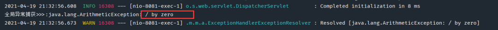
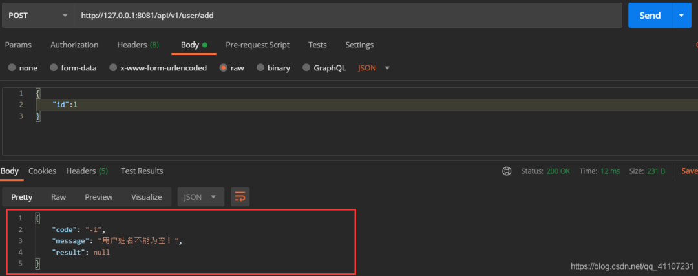
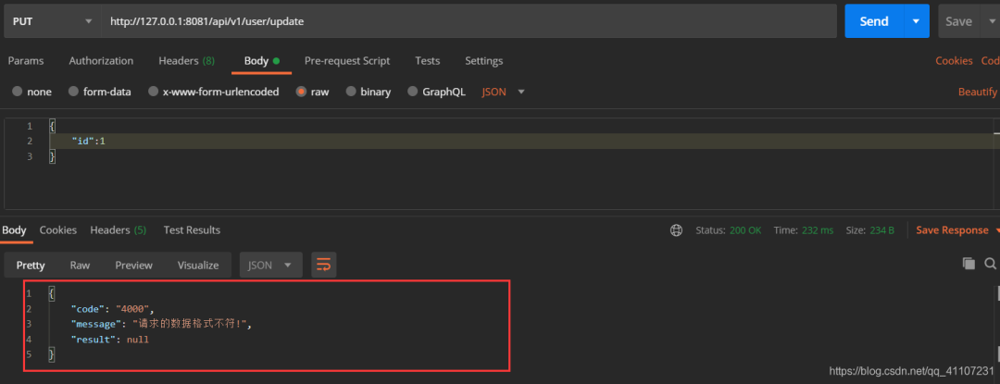
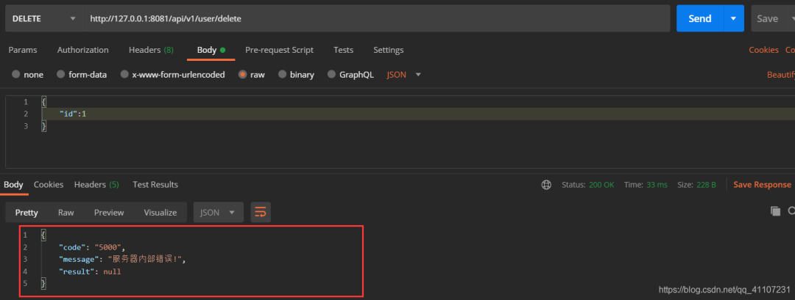
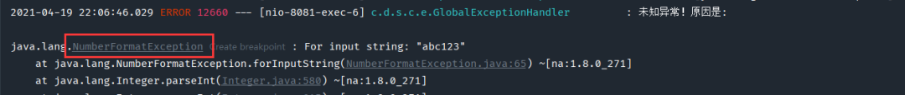

**前言**

在日常项目开发中，异常是常见的，但是如何更高效的处理好异常信息，让我们能快速定位到BUG，是很重要的，不仅能够提高我们的开发效率，还能让你代码看上去更舒服，SpringBoot的项目已经对有一定的异常处理了，但是对于我们开发者而言可能就不太合适了，因此我们需要对这些异常进行统一的捕获并处理。


**一、全局异常处理方式一**

SpringBoot中，**@ControllerAdvice** 即可开启全局异常处理，使用该注解表示开启了全局异常的捕获，我们只需在自定义一个方法使用**@ExceptionHandler**注解然后定义捕获异常的类型即可对这些捕获的异常进行统一的处理。

**1.1 自定义全局异常类**

```java
/**
 * @description: 自定义异常处理
 * @author: DT
 * @date: 2021/4/19 21:17
 * @version: v1.0
 */
@ControllerAdvice
public class MyExceptionHandler {
	
    //value值为要捕获的异常，方法参数
    @ExceptionHandler(value =Exception.class)
    //如果不加@ResponseBody，类注解@ControllerAdvice就要改用@RestControllerAdvice，否则就不是返回数据而是跳转页面
    @ResponseBody
    public String exceptionHandler(Exception e){
        System.out.println("全局异常捕获>>>:"+e);
        return "全局异常捕获,错误原因>>>"+e.getMessage();
    }
}

//也可以return一个JSON字符串格式的DTO对象：JSON.toObjectString(Object obj);
//不过要导一个依赖
/*
<dependency>
	<groupId>com.alibaba</groupId>
	<artifactId>fastjson</artifactId>
	<version>1.2.79</version>
</dependency>
*/
```

**1.2 手动抛出异常**

```java
@GetMapping("/getById/{userId}")
public CommonResult<User> getById(@PathVariable Integer userId){
    // 手动抛出异常
    int a = 10/0;
    return CommonResult.success(userService.getById(userId));
}
```

**1.3 测试打印**



很显然这样的用户体验效果是极差的，虽然这种能够让我们知道异常的原因，但是在很多的情况下来说，可能还是不够人性化，不符合我们的要求。

**二、全局异常处理方式二**

**2.1 定义基础接口类**

```java
/**
 * @description: 服务接口类
 * @author: DT
 * @date: 2021/4/19 21:39
 */
public interface BaseErrorInfoInterface {

    /**
     *  错误码
     * @return
     */
    String getResultCode();

    /**
     * 错误描述
     * @return
     */
    String getResultMsg();
}
```

**2.2 定义枚举类**

```java
/**
 * @description: 异常处理枚举类
 * @author: DT
 * @date: 2021/4/19 21:41
 * @version: v1.0
 */
public enum ExceptionEnum implements BaseErrorInfoInterface{
    
    // 数据操作错误定义
    SUCCESS("2000", "成功!"),
    BODY_NOT_MATCH("4000","请求的数据格式不符!"),
    SIGNATURE_NOT_MATCH("4001","请求的数字签名不匹配!"),
    NOT_FOUND("4004", "未找到该资源!"),
    INTERNAL_SERVER_ERROR("5000", "服务器内部错误!"),
    SERVER_BUSY("5003","服务器正忙，请稍后再试!");

    /**
     * 错误码
     */
    private final String resultCode;

    /**
     * 错误描述
     */
    private final String resultMsg;

    ExceptionEnum(String resultCode, String resultMsg) {
        this.resultCode = resultCode;
        this.resultMsg = resultMsg;
    }

    @Override
    public String getResultCode() {
        return resultCode;
    }

    @Override
    public String getResultMsg() {
        return resultMsg;
    }
}
```

**2.3 自定义异常类**

```java
/**
 * @description: 自定义异常类
 * @author: DT
 * @date: 2021/4/19 21:44
 * @version: v1.0
 */
public class BizException extends RuntimeException{

    private static final long serialVersionUID = 1L;

    /**
     * 错误码
     */
    protected String errorCode;
    /**
     * 错误信息
     */
    protected String errorMsg;

    public BizException() {
        super();
    }

    public BizException(BaseErrorInfoInterface errorInfoInterface) {
        super(errorInfoInterface.getResultCode());
        this.errorCode = errorInfoInterface.getResultCode();
        this.errorMsg = errorInfoInterface.getResultMsg();
    }

    public BizException(BaseErrorInfoInterface errorInfoInterface, Throwable cause) {
        super(errorInfoInterface.getResultCode(), cause);
        this.errorCode = errorInfoInterface.getResultCode();
        this.errorMsg = errorInfoInterface.getResultMsg();
    }

    public BizException(String errorMsg) {
        super(errorMsg);
        this.errorMsg = errorMsg;
    }

    public BizException(String errorCode, String errorMsg) {
        super(errorCode);
        this.errorCode = errorCode;
        this.errorMsg = errorMsg;
    }

    public BizException(String errorCode, String errorMsg, Throwable cause) {
        super(errorCode, cause);
        this.errorCode = errorCode;
        this.errorMsg = errorMsg;
    }


    public String getErrorCode() {
        return errorCode;
    }

    public void setErrorCode(String errorCode) {
        this.errorCode = errorCode;
    }

    public String getErrorMsg() {
        return errorMsg;
    }

    public void setErrorMsg(String errorMsg) {
        this.errorMsg = errorMsg;
    }

    @Override
    public Throwable fillInStackTrace() {
        return this;
    }
}
```

**2.4 自定义数据传输**：DTO类

```java
/**
 * @description: 自定义数据传输
 * @author: DT
 * @date: 2021/4/19 21:47
 * @version: v1.0
 */
public class ResultResponse {
    /**
     * 响应代码
     */
    private String code;

    /**
     * 响应消息
     */
    private String message;

    /**
     * 响应结果
     */
    private Object result;

    public ResultResponse() {
    }

    public ResultResponse(BaseErrorInfoInterface errorInfo) {
        this.code = errorInfo.getResultCode();
        this.message = errorInfo.getResultMsg();
    }

    public String getCode() {
        return code;
    }

    public void setCode(String code) {
        this.code = code;
    }

    public String getMessage() {
        return message;
    }

    public void setMessage(String message) {
        this.message = message;
    }

    public Object getResult() {
        return result;
    }

    public void setResult(Object result) {
        this.result = result;
    }

    /**
     * 成功
     *
     * @return
     */
    public static ResultResponse success() {
        return success(null);
    }

    /**
     * 成功
     * @param data
     * @return
     */
    public static ResultResponse success(Object data) {
        ResultResponse rb = new ResultResponse();
        rb.setCode(ExceptionEnum.SUCCESS.getResultCode());
        rb.setMessage(ExceptionEnum.SUCCESS.getResultMsg());
        rb.setResult(data);
        return rb;
    }

    /**
     * 失败
     */
    public static ResultResponse error(BaseErrorInfoInterface errorInfo) {
        ResultResponse rb = new ResultResponse();
        rb.setCode(errorInfo.getResultCode());
        rb.setMessage(errorInfo.getResultMsg());
        rb.setResult(null);
        return rb;
    }

    /**
     * 失败
     */
    public static ResultResponse error(String code, String message) {
        ResultResponse rb = new ResultResponse();
        rb.setCode(code);
        rb.setMessage(message);
        rb.setResult(null);
        return rb;
    }

    /**
     * 失败
     */
    public static ResultResponse error( String message) {
        ResultResponse rb = new ResultResponse();
        rb.setCode("-1");
        rb.setMessage(message);
        rb.setResult(null);
        return rb;
    }

    @Override
    public String toString() {
        return JSONObject.toJSONString(this);
    }

}
```

**2.5 自定义全局异常处理**

```java
/**
 * @description: 自定义异常处理
 * @author: DT
 * @date: 2021/4/19 21:51
 * @version: v1.0
 */
@ControllerAdvice
public class GlobalExceptionHandler {
    
    private static final Logger logger = LoggerFactory.getLogger(GlobalExceptionHandler.class);

    /**
     * 处理自定义的业务异常
     * @param req
     * @param e
     * @return
     */
    @ExceptionHandler(value = BizException.class)
    @ResponseBody
    public ResultResponse bizExceptionHandler(HttpServletRequest req, BizException e){
        logger.error("发生业务异常！原因是：{}",e.getErrorMsg());
        return ResultResponse.error(e.getErrorCode(),e.getErrorMsg());
    }

    /**
     * 处理空指针的异常
     * @param req
     * @param e
     * @return
     */
    @ExceptionHandler(value =NullPointerException.class)
    @ResponseBody
    public ResultResponse exceptionHandler(HttpServletRequest req, NullPointerException e){
        logger.error("发生空指针异常！原因是:",e);
        return ResultResponse.error(ExceptionEnum.BODY_NOT_MATCH);
    }

    /**
     * 处理其他异常
     * @param req
     * @param e
     * @return
     */
    @ExceptionHandler(value =Exception.class)
    @ResponseBody
    public ResultResponse exceptionHandler(HttpServletRequest req, Exception e){
        logger.error("未知异常！原因是:",e);
        return ResultResponse.error(ExceptionEnum.INTERNAL_SERVER_ERROR);
    }
}
```

**2.6 测试代码**

```java
@PostMapping("/add")
public boolean add(@RequestBody User user) {
    //如果姓名为空就手动抛出一个自定义的异常！
    if(user.getName()==null){
        throw  new BizException("-1","用户姓名不能为空！");
    }
    return true;
}
```



```java
@PutMapping("/update")
public boolean update(@RequestBody User user) {
    //这里故意造成一个空指针的异常，并且不进行处理
    String str = null;
    str.equals("111");
    return true;
}
```



```java
@DeleteMapping("/delete")
public boolean delete(@RequestBody User user)  {
    //这里故意造成一个异常，并且不进行处理
    Integer.parseInt("abc123");
    return true;
}
```



如果我们想捕获这个类型转换异常，是不是再添加一个遗产处理方法就可了。



```java
/**
* 处理类型转换异常
 * @param req
 * @param e
 * @return
 */
@ExceptionHandler(value = NumberFormatException.class)
@ResponseBody
public ResultResponse exceptionHandler(HttpServletRequest req, NumberFormatException e){
    logger.error("发生类型转换异常！原因是:",e);
    return ResultResponse.error(ExceptionEnum.PARAMS_NOT_CONVERT);
}

```

```java
PARAMS_NOT_CONVERT("4002","类型转换不对!"),
```


自定义全局异常处理除了可以处理上述的数据格式之外，也可以处理页面的跳转，只需在新增的异常方法的返回处理上填写该跳转的路径并不使用ResponseBody 注解即可。

**总结**

异常处理，能够减少代码的重复度和复杂度，有利于代码的维护，并且能够快速定位到BUG，大大提高我们的开发效率。