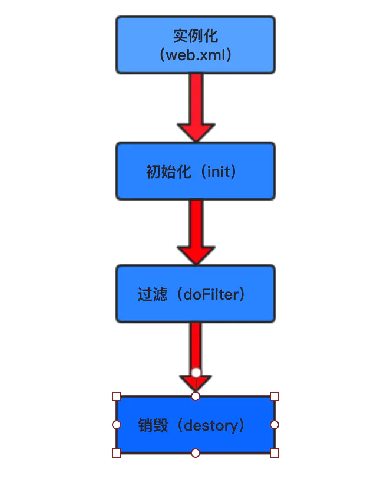
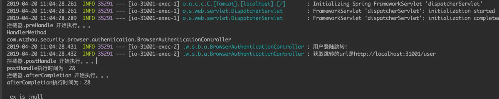
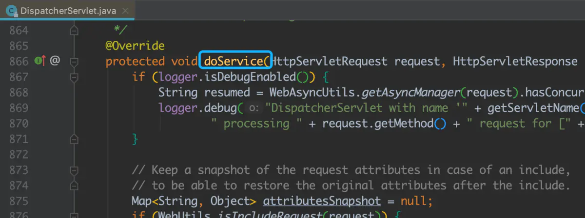
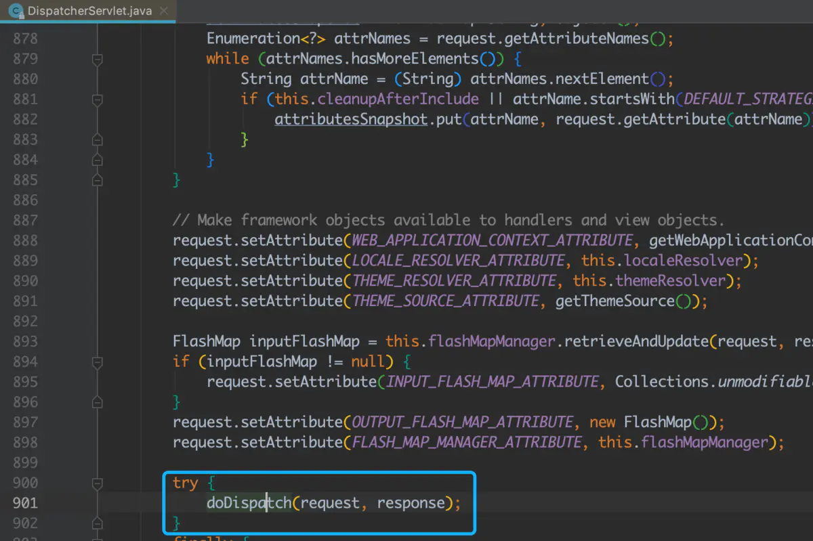
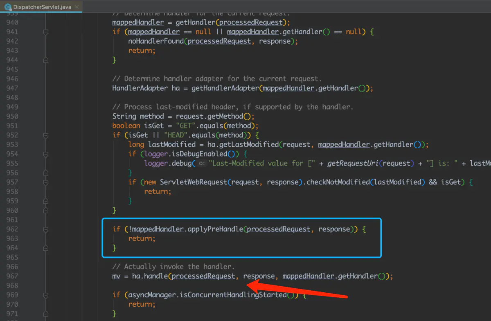
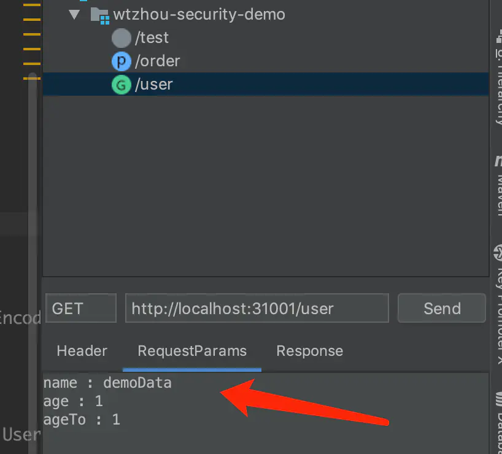
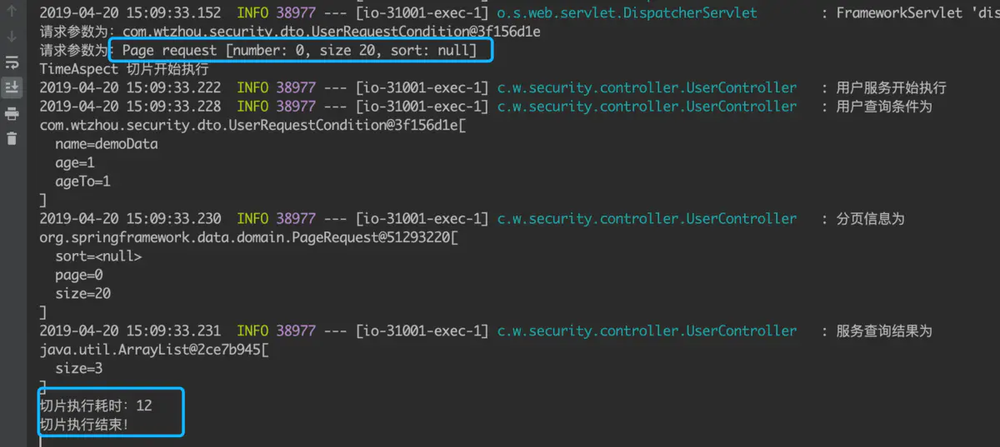
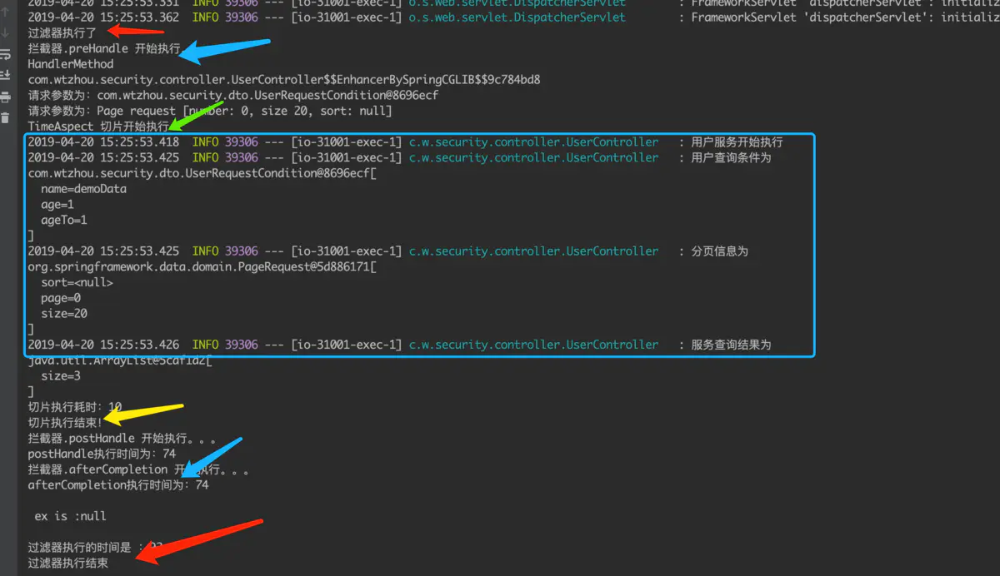
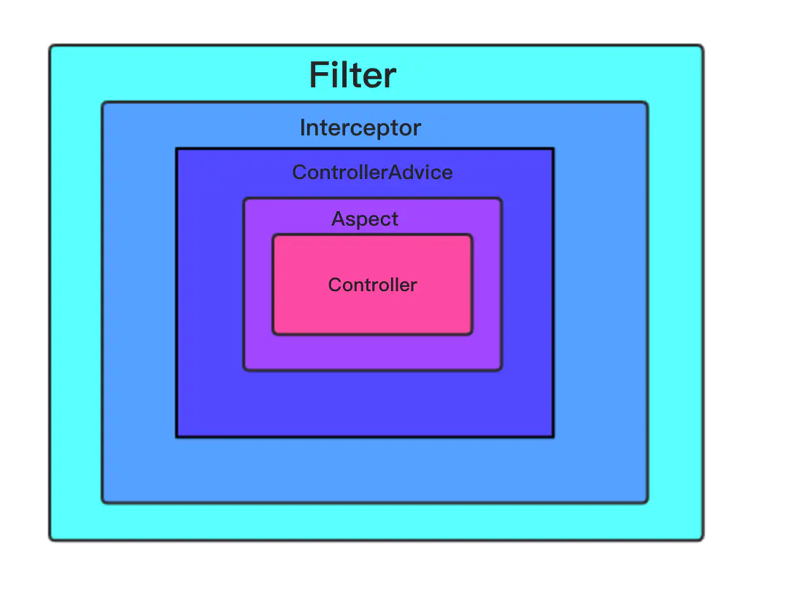

# 概述

## Filter

首先，过滤器是服务端的一个组件，是基于servlet实现从客户端访问服务端web资源的一种拦截机制，对请求request和响应response都进行过滤，依赖于serverlet容器，使用时，实现Filter接口，在web.xml里配置对应的class还有mapping-url，springboot工程可以通FilterRegisteration配置后,设置要过滤的URL， *注意*  两种方式过滤器都是有序的，谁在前就先调用谁！定义过滤器后会重写三个方法，分别是init(),doFilter(),和destory()

- init方法是过滤器的初始化方法，当web容器创建这个bean的时候就会执行，这个方法可以读取web.xml里面的参数

- doFilter方法是执行过滤的请求的核心，当客户端请求访问web资源时，这个时候我们可以拿到request里面的参数，对数据进行处理后，通过filterChain方法将请求将请求放行，放行后我们也可以通过response对响应进行处理（比如压缩响应），然后会传递到下一个过滤器

- destory方法是当web容器中的过滤器实例被销毁时，会被执行，释放资源

```java
/**
 * @author wtzhouc@gmail.com
 * @date 2019-04-12 19:36
 */
//@Component
public class TimeFilter implements Filter {

    @Override
    public void init(FilterConfig filterConfig) {
        System.out.println("过滤器初始化");
    }

    @Override
    public void doFilter(ServletRequest servletRequest, ServletResponse servletResponse, FilterChain filterChain) throws IOException, ServletException {
        System.out.println("过滤器执行了");
        long start2 = System.currentTimeMillis();
        filterChain.doFilter(servletRequest, servletResponse);
        long time = System.currentTimeMillis() - start2;
        System.out.println("过滤器执行的时间是 ：" + time);
        System.out.println("过滤器执行结束");
    }

    @Override
    public void destroy() {
        System.out.println("过滤器销毁了");
    }
}
```

spring boot工程可以通过加@Component注解添加进spring管理，也可以通过下面注册的方式去执行，推荐用下方的方式

```java
@Bean
public FilterRegistrationBean timeFilter() {
    FilterRegistrationBean filterRegistrationBean = new FilterRegistrationBean();
    TimeFilter filter = new TimeFilter();
    filterRegistrationBean.setFilter(filter);
    filterRegistrationBean.addUrlPatterns("/user","/users");
    return filterRegistrationBean;
}
```

```undefined
接下来，我们可以看下图示的过滤器执行流程和生命周期，就能很好的理解Filter了
```

> 流程图
>
> 
>
> 生命周期
>
> 

## interceptor（拦截器）

拦截器，顾名思义，他的作用就是拦截，这个要和过滤器区分开，过滤器依赖serverlet容器，获取request和response处理，是基于函数回调，简单说就是“去取你想取的”，拦截器是通过java反射机制，动态代理来拦截web请求，是“拒你想拒绝的”，他只拦截web请求，但不拦截静态资源，Struts2里面就是将拦截器串联，实现对请求的处理，下面以spring 的拦截器为例，写个demo

```java
/**
 * @author wtzhouc@gmail.com
 * @date 2019-04-13 14:50
 */
@Component
public class MyInterceptor implements HandlerInterceptor {

    @Override
    public boolean preHandle(HttpServletRequest httpServletRequest, HttpServletResponse httpServletResponse, Object hanlder) {
        out.println("拦截器.preHandle 开始执行。。。");
        out.println(hanlder.getClass().getSimpleName());
        out.println(((HandlerMethod) hanlder).getBean().getClass().getName());
        httpServletRequest.setAttribute("start", currentTimeMillis());
        return true;
    }

    @Override
    public void postHandle(HttpServletRequest httpServletRequest, HttpServletResponse httpServletResponse, Object hanlder, ModelAndView modelAndView) {
        out.println("拦截器.postHandle 开始执行。。。");
        long start = (long) httpServletRequest.getAttribute("start");
        out.println("postHandle执行时间为：" + (currentTimeMillis() - start));

    }

    @Override
    public void afterCompletion(HttpServletRequest httpServletRequest, HttpServletResponse httpServletResponse, Object hanlder, Exception e) {
        //会打印两次 spring里面的basic error 也会被拦截
        out.println("拦截器.afterCompletion 开始执行。。。");
        long start = (long) httpServletRequest.getAttribute("start");
        out.println("afterCompletion执行时间为：" + (currentTimeMillis() - start));
        out.println("\n ex is :" + e+"\n");
    }
}
```

再来看看拦截器再spring boot里面的配置，首先要继承WebMvcConfigurerAdapter适配器，重写addIntercepors方法再调用register方法添加拦截器，前提，自定义的interceptor要加上spring注解被spring容器管理

```java
/**
 * @author wtzhouc@gmail.com
 * @date 2019-04-13 14:19
 */
@Configuration
public class WebConfig extends WebMvcConfigurerAdapter {

    private final MyInterceptor myInterceptor;

    @Autowired
    public WebConfig(MyInterceptor myInterceptor) {
        this.myInterceptor = myInterceptor;
    }

//    @Bean
//    public FilterRegistrationBean timeFilter() {
//        FilterRegistrationBean filterRegistrationBean = new FilterRegistrationBean();
//        TimeFilter filter = new TimeFilter();
//        filterRegistrationBean.setFilter(filter);
//        filterRegistrationBean.addUrlPatterns("/user","/users");
//        return filterRegistrationBean;
//    }

    @Override
    public void addInterceptors(InterceptorRegistry registry) {
        registry.addInterceptor(myInterceptor);
    }
}
```


```undefined
    我们再来看看控制台的输出
```

> 

接下来来讲讲拦截器的三个方法,preHandle(),postHandle(),afterCompletion()

> ⚠️：拦截器与过滤器方法内参数不同，多了一个Object handler,在请求进入控制层前，spring mvc 会将请求交给handler处理，handler参数就是用来描述处理请求的，从上面的demo可以看出来 他的类型是handlerMethod的，处理的请求的是BrowserAuthenticationController

- preHandler(): 这个方法是在controller调用之前调用，通过返回true或者false决定是否进入Controller层

- postHandler()：在请求进入控制层之后调用，但是在处理请求抛出异常时不会调用

- afterCompletion(): 在请求处理完成之后，也就是在DispatherServlet渲染了视图之后执行，也就是说这个方法必定是执行，包含异常信息，它的主要作用就是清理资源

> 接下来总结一下过滤器和拦截的前后顺序，看下图：
>
> 
>
> image.png

## Aspect（切片）

在使用过滤器的时能获取request和response对象，对请求和响应进行处理，使用拦截器时，我们可以通过handler来获取当前请求控制器的方法名称，但是有一个弊端，我们拿不到控制器要接收的参数，先看下servlet源码的执行顺序

> img
>
> image.png
>
> 
>
> 

从DispatherServlet分发请求时，进入doService()方法内部，在方法参数封装之前，添加了判断，applyPreHandle()方法就时判断拦截器里面的preHandler（）方法，根据返回的true或者false，判断是否执行真正的handler，所以我们在拦截器的handler参数里面是获取不到请求的参数的，因此，我们要引入Spring AOP，也就是切片编程，它可以在控制器的执行之前，执行之后，抛出异常等等，进行控制！

> 切片编程，在网上看到了一个很贴切的说法，面对的是处理过程中的方法或者阶段，以获得各部分的低耦合性的隔离效果，它是基于动态代理，它关注的是行为和过程，它常用的注解为，下面通过spring boot 实现一个demo

- @Aspect(声明一个切面)

- @Before(相当于拦截器preHandler，在方法执行前调用)

- @After（相当于拦截器的afterComplement（）在方法执行后调用）

- @AfterThrowing（方法抛出异常时调用）

- @AfterReturning（当方法返回时调用）

- @Around(包含以上方的执行顺序)

```kotlin
/**
 * @author wtzhouc@gmail.com
 * @date 2019-04-13 16:31
 */
@Aspect
@Component
public class TimeAspect {

    @Around("execution(* com.wtzhou.security.controller.UserController.*(..))")
//    @After("")
//    @Before("")
//    @AfterThrowing()
//    @AfterReturning()
    public Object handlerControllerMethod(ProceedingJoinPoint proceedingJoinPoint) throws Throwable {
        Object[] args = proceedingJoinPoint.getArgs();
        for (Object arg : args) {
            out.println("请求参数为："+arg);
        }
        out.println("TimeAspect 切片开始执行");
        long start = currentTimeMillis();
        Object proceed = proceedingJoinPoint.proceed();
        out.println("切片执行耗时：" + (currentTimeMillis() - start));
        out.println("切片执行结束！");
        return proceed;
    }
}
```

> 通过注解内部的表达式不同，可以定义你想要的切入点，ProceedingJoinPoint对象可以当前的请求参数，对参数处理后，可以调用proceed方法放行，我们可以看看控制台的输出

> 
>
> 

# 总结一下

在代码里面将过滤器，拦截器，切片，还有我们常用的@ControllerAdvice异常拦截机制注解放开时，我们来看看控制台的输出

> 

```undefined
通过控制台的日志 我们可以用一张简单的图来直观展现出来
```

> 

**通过图示:**当收到请求响应时，执行的顺序为filter--》interceptor--》ControllerAdvice--》Aspect，然后到大控制层，如果控制层抛出异常，最先也会被Aspect捕获，如果未处理，会继续向上一层抛出，如果到Filter也没有处理的话，就会抛到容器内部

