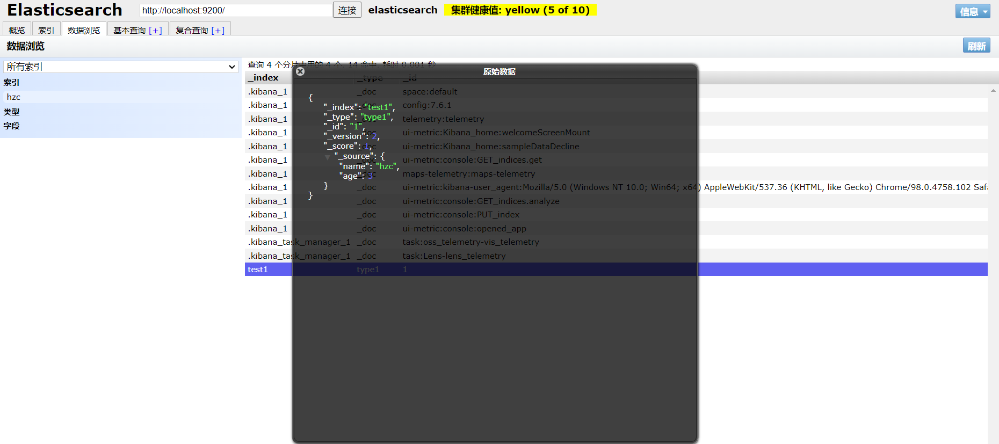

**一种软件架构风格**,而不是标准,只是提供了一组设计原则和约束条件。它主要用于客户端和服务器交互类的软件。基于这个风格设计的软件可以**更简洁**，**更有层次**，**更易于实现缓存**等机制。

### **基本Rest命令说明：**

Kibana操作，ElasticSearch-head查看

命令必须大写

运行命令时，鼠标光标需要在命令所在行，否则无效

|          method          |                       url地址                       |          描述          |
| :----------------------: | :-------------------------------------------------: | :--------------------: |
| **PUT**（**创建**,修改） |       localhost:9200/索引名称/类型名称/文档id       | 创建文档（指定文档id） |
|       POST（创建）       |          localhost:9200/索引名称/类型名称           | 创建文档（随机文档id） |
|     **POST（修改）**     | localhost:9200/索引名称/类型名称/文档id**/_update** |        修改文档        |
|    **DELETE（删除）**    |       localhost:9200/索引名称/类型名称/文档id       |        删除文档        |
|     **GET（查询）**      |       localhost:9200/索引名称/类型名称/文档id       |   查询文档通过文档ID   |
|       POST（查询）       | localhost:9200/索引名称/类型名称/文档id**/_search** |      查询所有数据      |

### 测试

#### 1、创建一个索引，添加

这个命令也可以不用Kibana，用浏览器、Postman也可以

类型现在最好用_doc

```json
PUT /test1/type1/1
{
	"name" : "流柚",
    "age" : 18
}

PUT /dreamland/user/0
{
  "name":"hzc",
  "age":"21",
  "birthday":"2000-07-11",
  "tags":["man","unknown"]
}
```




#### 2、字段数据类型

- 字符串类型

  - text、keyword

    - text：**支持分词**，全文检索,支持模糊、精确查询,不支持聚合,排序操作;text类型的最大支持的字符长度无限制,适合大字段存储；
  - keyword：**不支持分词**，直接索引、支持模糊、支持精确匹配，支持聚合、排序操作。keyword类型的最大支持的长度为——32766个UTF-8类型的字符,可以通过设置ignore_above指定自持字符长度，超过给定长度后的数据将不被索引，无法通过term精确匹配检索返回结果。
  
- 数值型

  - long、Integer、short、byte、double、float、**half float**、**scaled float**

- 日期类型

  - date

- te布尔类型

  - boolean

- 二进制类型

  - binary

- 等等…

#### 3、指定字段的类型（使用PUT）

> 类似于**建库**（建立索引和字段对应类型），也可看做规则的建立

```json
PUT /test2
{
  "mappings": { //映射规则
    "properties": { //要映射的属性
      "name": { //name属性
        "type": "text" //类型为text
      },
      "age":{
        "type": "long"
      },
      "birthday":{
        "type": "date"
      }
    }
  }
}
```


#### 4、获取3建立的规则

这里可以不用加”/“

```
GET test2
```


#### 5、获取默认信息

> `_doc` 默认类型（default type），type 在未来的版本中会逐渐弃用，因此产生一个默认类型进行代替

```json
PUT /test3/_doc/1
{
  "name": "流柚",
  "age": 18,
  "birth": "1999-08-10"  //date类型月份日期必须是两个数字，1999-8-2会报错
}
GET test3
```


> 如果自己的文档字段没有被指定，那么ElasticSearch就会给我们默认配置字段类型

扩展：通过`get _cat/` 可以获取ElasticSearch的当前的很多信息！

```json
GET _cat/indices
GET _cat/aliases
GET _cat/allocation
GET _cat/count
GET _cat/fielddata
GET _cat/health //健康状态
GET _cat/indices //所有的索引库,indices?v可以看到索引库的信息
GET _cat/master
GET _cat/nodeattrs
GET _cat/nodes
GET _cat/pending_tasks
GET _cat/plugins
GET _cat/recovery
GET _cat/repositories
GET _cat/segments
GET _cat/shards
GET _cat/snapshots
GET _cat/tasks
GET _cat/templates
GET _cat/thread_pool
```

#### 6、修改

> 两种方案

①旧的（使用put覆盖原来的值）

- 版本+1（_version），可以用来做锁
- 但是如果漏掉某个字段没有写，那么更新是没有写的字段 ，会消失

```json
PUT /test3/_doc/1
{
  "name" : "流柚是我的大哥",
  "age" : 18,
  "birth" : "1999-10-10"
}
GET /test3/_doc/1

// 修改会有字段丢失
PUT /test3/_doc/1
{
  "name" : "流柚"
}
GET /test3/_doc/1
```


②新的（使用post的update，没有_update跟PUT效果一样）

- version不会改变
- 需要注意doc
- 不会丢失字段
- 自由度更高

```json
POST /test3/_doc/1/_update
{
  "doc":{ //要修改的具体的文档
    "name" : "post修改，version不会加一", //修改该文档的name属性的值
    "age" : 2
  }
}
GET /test3/_doc/1
```


#### 7、删除

```json
//删除test1索引的type1类型的id为1的数据
DELETE /test1/type1/1
//删除整个test1索引
DELETE /test1
```


#### 8、查询（简单条件）

GET /索引/类型/_search?q=字段:值，默认是**分词查询**，如果查不到，要么是值不匹配，要么是字段不存在

查询出来的文档有一个_score字段，这就是权重，匹配度越高权重越高

值为 一人 可以匹配到 我是一个人，一人被拆分成一、人进行匹配

```json
GET /test3/_doc/1 //查询id为1的文档
GET /test3/_doc/_search?q=name:流柚 //按条件查询文档，默认是分词查询
GET /test3/_search?q=name:流柚 //这里可以不用带类型，但不是_search的不可以
GET /dreamland/user/_search?q=age:21 name:hzc birthday:2000-07-11 //多个条件查询，空格分隔
GET /dreamland/_search?q=age:21 name:hzc birthday:2000-07-11 
```


#### 9、复杂查询

> test3索引中的内容


##### ①查询匹配

- `match`：匹配（会使用**分词**器解析（先分析文档，然后进行查询），数字和keyword不能分词查询）
  - match的值会被分词匹配
  - match值为`一人`可以匹配到`我是一个人`，因为`一人`被拆分成`一`、`人`进行匹配
- `_source`：过滤字段，只查出的文档只有指定的字段
- `sort`：排序，设置了排序后结果集的_source字段就没了
- `form`、`size` 分页，from从哪条数据开始，下标从0开始，size当前页显示多少条数据

```json
  // 查询匹配
  GET /blog/user/_search
  {
    "query":{
      "match":{
        "name":"流" 
      }
    },
    "_source": ["name","desc"],
    "sort": [
      {
        "age": {
          "order": "asc"
        }
      }
    ],
    "from": 0,
    "size": 1
  }
```


##### ②多条件查询（bool）

- `must` 相当于 `and`
- `should` 相当于 `or`
- `must_not` 相当于 `not (... and ...)`
- `filter` 过滤，gte大于等于，lte小于等于，gt大于，lt小于

```json
/// bool 多条件查询
//// must <==> and
//// should <==> or
//// must_not <==> not (... and ...)
//// filter数据过滤
//// boost
//// minimum_should_match
GET /blog/user/_search
{
  "query":{
    "bool": {
      "must": [ //查询的数据必须age=3且name包含流
        {
          "match":{
            "age":3
          }
        },
        {
          "match": {
            "name": "流"
          }
        }
      ],
      "filter": {
        "range": {
          "age": {
            "gte": 1,
            "lte": 3
          }
        }
      }
    }
  }
}
```


##### ③匹配数组

- 貌似不能与其它字段一起使用
- 可以多关键字查（空格隔开）— 匹配字段也是符合的
- `match` 会使用分词器解析（先分析文档，然后进行查询），满足其中一个就能查出来，匹配的越多权重越高
- 搜词

```json
// 匹配数组 貌似不能与其它字段一起使用
// 可以多关键字查（空格隔开）
// match 会使用分词器解析（先分析文档，然后进行查询）
GET /blog/user/_search
{
  "query":{
    "match":{
      "desc":"年龄 牛 大"
    }
  }
}
```


##### ④精确查询

- `term` 直接通过 倒排索引 指定一个或多个**词条**查询
- 适合查询 **number、date、keyword** ，不适合text，查不了
- term不使用分词器，倒排索引效率高
- term的值不会被分词匹配，和match刚好相反，所以term的值太长将无法匹配要查询的数据
  - term值是`name`为`我是一个人`，查询目标数据`name`为`我是一个人`，无法命中，因为term值没有拆分，而分词器中没有`我是一个人`这个词条

```json
// 精确查询（必须全部都有，而且不可分，即按一个完整的词查询）
// term 直接通过 倒排索引 指定的词条 进行精确查找的
GET /blog/user/_search
{
  "query":{
    "term":{
      "desc":"年 "
    },
    "term":{
      "desc":"月 "
    }
  }
}
```


##### ⑤text和keyword

- text：
  - **支持分词**，**全文检索**、支持模糊、精确查询,不支持聚合,排序操作;
  - text类型的最大支持的字符长度无限制,适合大字段存储；
- keyword：
  - **不进行分词**，**直接索引**、支持模糊、支持精确匹配，支持聚合、排序操作。
  - keyword类型的最大支持的长度为——32766个UTF-8类型的字符,可以通过设置ignore_above指定自持字符长度，超过给定长度后的数据将不被索引，**无法通过term精确匹配检索返回结果**。

```json
// 测试keyword和text是否支持分词
// 设置索引类型
PUT /test
{
  "mappings": {
    "properties": {
      "text":{
        "type":"text"
      },
      "keyword":{
        "type":"keyword"
      }
    }
  }
}

// 设置字段数据
PUT /test/_doc/1
{
  "text":"测试keyword和text是否支持分词",
  "keyword":"测试keyword和text是否支持分词"
}

// text 支持分词
// keyword 不支持分词
GET /test/_doc/_search
{
  "query":{
   "match":{
      "text":"测试"
   }
  }
}// 查的到

GET /test/_doc/_search
{
  "query":{
   "match":{
      "keyword":"测试"
   }
  }
}// 查不到，必须是 "测试keyword和text是否支持分词" 才能查到

GET _analyze
{
  "analyzer": "keyword",
  "text": ["测试liu"]
}// 不会分词，即 测试liu

GET _analyze
{
  "analyzer": "standard",
  "text": ["测试liu"]
}// 分为 测 试 liu

GET _analyze
{
  "analyzer":"ik_max_word",
  "text": ["测试liu"]
}// 分为 测试 liu
```

##### ⑥高亮查询

```json
/// 高亮查询
GET blog/user/_search
{
  "query": {
    "match": {
      "name":"流"
    }
  }
  ,
  "highlight": {
    "fields": {
      "name": {} //搜索时传入的name将会高亮，这里query中name为流，那结果集中 流 将会高亮显示，<em>流</em>
    }
  }
}
// 自定义前缀和后缀
GET blog/user/_search
{
  "query": {
    "match": {
      "name":"流"
    }
  }
  ,
  "highlight": {
    "pre_tags": "<p class='key' style='color:red'>", //前缀
    "post_tags": "</p>",  //后缀
    "fields": {
      "name": {} 、//<p class='key' style='color:red'>流</p>
    }
  }
}
```

