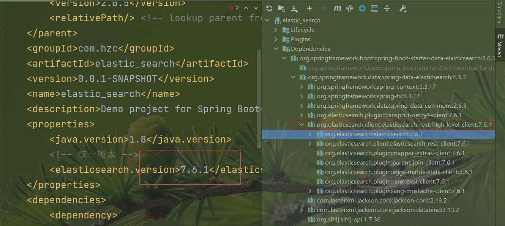

### 1、创建工程

略

**目录结构**


### 2、导入依赖

> 注意依赖版本和安装的版本一致

```xml
<properties>
    <java.version>1.8</java.version>
    <!-- 统一版本 -->
    <elasticsearch.version>7.6.1</elasticsearch.version>
</properties>
```

**导入elasticsearch**

```xml
<dependency>
    <groupId>org.springframework.boot</groupId>
    <artifactId>spring-boot-starter-data-elasticsearch</artifactId>
</dependency>
```

**提前导入fastjson、lombok**

```xml
<dependency>
    <groupId>com.alibaba</groupId>
    <artifactId>fastjson</artifactId>
    <version>1.2.70</version>
</dependency>
<!-- lombok需要安装插件 -->
<dependency>
    <groupId>org.projectlombok</groupId>
    <artifactId>lombok</artifactId>
    <optional>true</optional>
</dependency>
```

springboot默认集成的elasticsearch是6.8的，我们要使用跟安装的elasticsearch版本一致的依赖

```xml
spring2.6.5好像内置不是6.8的ES
它的es依赖点进源码
<dependency>
    <groupId>org.springframework.boot</groupId>
    <artifactId>spring-boot-starter-data-elasticsearch</artifactId>
</dependency>
源码中有一个spring-data-elasticsearch，再点进去看看
<dependency>
    <groupId>org.springframework.data</groupId>
    <artifactId>spring-data-elasticsearch</artifactId>
    <version>4.3.3</version>
    <scope>compile</scope>
    <exclusions>
        <exclusion>
            <artifactId>transport</artifactId>
            <groupId>org.elasticsearch.client</groupId>
        </exclusion>
    </exclusions>
</dependency>
发现下一层源码的properties标签有elasticsearch版本
<elasticsearch>7.15.2</elasticsearch>
```

### 3、创建并编写配置类

```java
@Configuration
public class ElasticSearchConfig {
    // 注册 rest高级客户端 
    @Bean
    public RestHighLevelClient restHighLevelClient(){
        RestHighLevelClient client = new RestHighLevelClient(
                RestClient.builder(
                        new HttpHost("127.0.0.1",9200,"http")
                )
        );
        return client;
    }
}
```

### 4、创建并编写实体类

```java
@Data
@NoArgsConstructor
@AllArgsConstructor
public class User implements Serializable {
    private static final long serialVersionUID = -3843548915035470817L;
    private String name;
    private Integer age;
}
```

### 5、测试

> 所有测试均在 `SpringbootElasticsearchApplicationTests`中编写

#### 注入 `RestHighLevelClient`

```java
@Autowired
public RestHighLevelClient restHighLevelClient;
```

#### 索引的操作 XXXIndexRequest对象，支持链式编程

restHighLevelClient.indices().xxx()，xxx是对索引操作的方法

##### 1、索引的创建CreateIndexRequest

CreateIndexRequest对象，create对应PUT命令

```java
// 测试索引的创建， Request PUT liuyou_index
@Test
public void testCreateIndex() throws IOException {
    //创建索引，liuyou_index是索引名称
    CreateIndexRequest request = new CreateIndexRequest("liuyou_index");
    //客户端执行创建索引的请求（执行PUT请求），获得响应
    CreateIndexResponse response = restHighLevelClient.indices().create(request, RequestOptions.DEFAULT);
    System.out.println(response.isAcknowledged());// 查看是否创建成功
    System.out.println(response);// 查看返回对象
    restHighLevelClient.close();
}
```

##### 2、索引的获取GetIndexRequest，并判断其是否存在

GetIndexRequest对象，get对应GET命令

```java
// 测试获取索引，并判断其是否存在
@Test
public void testIndexIsExists() throws IOException {
    //GET index
    GetIndexRequest request = new GetIndexRequest("index");
    //执行GET index命令
    boolean exists = restHighLevelClient.indices().exists(request, RequestOptions.DEFAULT);
    System.out.println(exists);// 索引是否存在
    restHighLevelClient.close();
}
```

##### 3、索引的删除DeleteIndexRequest

DeleteIndexRequest对象，delete对应DELETE命令

```java
// 测试索引删除
@Test
public void testDeleteIndex() throws IOException {
    //DELETE liuyou_index
    DeleteIndexRequest request = new DeleteIndexRequest("liuyou_index"); 
    //执行DELETE liuyou_index命令
    AcknowledgedResponse response = restHighLevelClient.indices().delete(request, RequestOptions.DEFAULT);
    System.out.println(response.isAcknowledged());// 是否删除成功
    restHighLevelClient.close();
}
```

我们现在用SpringBoot操作，就不需要kibana了，可以把之前通过kibana创建的索引全部删掉了

#### 文档的操作 XXXRequest对象，支持链式编程

restHighLevelClient.indices().xxx()，xxx是对文档操作的方法

##### 1、文档的添加

IndexRequest对象对应PUT命令

```java
// 测试添加文档(先创建一个User实体类，添加fastjson依赖)
@Test
public void testAddDocument() throws IOException {
    // 创建一个User对象
    User liuyou = new User("liuyou", 18);
    // 创建请求
    IndexRequest request = new IndexRequest("liuyou_index");
    // 制定规则 PUT /liuyou_index/_doc/1
    // 设置文档ID
    request.id("1");
    //设置请求的过期时间，超过1s没请求成功就不请求了
    // request.timeout("1s")也可以
    request.timeout(TimeValue.timeValueMillis(1000));
    // 将我们的数据放入请求中
    request.source(JSON.toJSONString(liuyou), XContentType.JSON);
    // 客户端发送请求，获取响应的结果
    IndexResponse response = restHighLevelClient.index(request, RequestOptions.DEFAULT);
    System.out.println(response.status());// 获取建立索引的状态信息 CREATED，为什么更新是OK不是UPDATE
    System.out.println(response);// 查看返回内容 IndexResponse[index=liuyou_index,type=_doc,id=1,version=1,result=created,seqNo=0,primaryTerm=1,shards={"total":2,"successful":1,"failed":0}]
}
```

```json
//kibana添加一个文档
PUT /test7/_doc/2
{
  "name":"我是一个人",
  "desc":"我是一个人"
}
//这是执行PUT命令打印的结果
//其各个带_的字段在客户端IndexRequest对象中都有对应的方法，例如_id对应id()
{
  "_index" : "test7",//文档所在索引
  "_type" : "_doc",//文档类型
  "_id" : "1",//文档id
  "_version" : 1,//更新次数
  "_seq_no" : 0,
  "_primary_term" : 1,
  "found" : true,
  "_source" : { //数据
    "name" : "我是一个人",
    "desc" : "我是一个人"
  }
}
```

##### 2、文档信息的获取

GetRequest对象对应GET命令

```java
// 测试获得文档信息
@Test
public void testGetDocument() throws IOException {
    GetRequest request = new GetRequest("liuyou_index","1");
    GetResponse response = restHighLevelClient.get(request, RequestOptions.DEFAULT);
    System.out.println(response.getSourceAsString());// 打印文档内容
    System.out.println(request);// 返回的全部内容和命令是一样的
    restHighLevelClient.close();
}
```

```json
//命令
GET /test7/_doc/1
//结果
{
  "_index" : "test7",
  "_type" : "_doc",
  "_id" : "1",
  "_version" : 2,
  "_seq_no" : 4,
  "_primary_term" : 1,
  "found" : true,
  "_source" : {
    "name" : "我是一个人",
    "desc" : "我是一个人"
  }
}
```

##### 3、文档的获取，并判断其是否存在

GetRequest对象对应GET命令

```java
// 获取文档，判断是否存在，GET /liuyou_index/_doc/1
@Test
public void testDocumentIsExists() throws IOException {
    GetRequest request = new GetRequest("liuyou_index", "1");
    // 只判断存在就不获取返回的_source的上下文了，效率更高了
    request.fetchSourceContext(new FetchSourceContext(false));
    //设置排序字段
    request.storedFields("_none_");
    boolean exists = restHighLevelClient.exists(request, RequestOptions.DEFAULT);
    System.out.println(exists);
    
    //获取文档数据,如果没有注释上面的fetchSourceContext方法，source将为null
    GetResponse response = client.get(getRequest, RequestOptions.DEFAULT);
    Map<String, Object> source = response.getSource();
    Set<Map.Entry<String, Object>> entries = source.entrySet();
    for (Map.Entry<String, Object> entry : entries) {
        System.out.println(entry.getKey()+" "+entry.getValue());
    }
}
```

```json
//文档各个带_的字段在客户端GetRequest对象中都有对应的方法，例如_id对应id()
//文档的各个带_的字段在客户端GetResponse对象中都有对应的方法，例如_id对应getId()
//不同对象对应的命令打印的结果不一样，打印结果的带_字段，设值方法在XXXRequest，取值方法在XXXResponse
{
  "_index" : "test7",
  "_type" : "_doc",
  "_id" : "1",
  "_version" : 2,
  "_seq_no" : 4,
  "_primary_term" : 1,
  "found" : true,
  "_source" : {
    "name" : "我是一个人",
    "desc" : "我是一个人"
  }
}
```

##### 4、文档的更新

UpdateRequest对象对应POST的_update命令

```java
// 测试更新文档内容
@Test
public void testUpdateDocument() throws IOException {
    //指定更新的是liuyou_index索引id为1的文档
    UpdateRequest request = new UpdateRequest("liuyou_index", "1");
    User user = new User();
    user.setAge(10000);
    //告诉request对象传入的是json类型的数据，数据为json类型的user
    request.doc(JSON.toJSONString(user),XContentType.JSON);
    //客户端更新数据，只更新doc方法中json字符串中有的字段和值，user对象没有设置name，那么name就不会变，而不是变成null
    UpdateResponse response = restHighLevelClient.update(request, RequestOptions.DEFAULT);
    System.out.println(response.status()); // OK
    restHighLevelClient.close();
}
```

```json
//命令
POST /test3/_doc/1_update
{
  "name":"cwx"
}
//结果
{
  "_index" : "test3",
  "_type" : "_doc",
  "_id" : "1_update",
  "_version" : 2,
  "result" : "updated",
  "_shards" : {
    "total" : 2,
    "successful" : 1,
    "failed" : 0
  },
  "_seq_no" : 4,
  "_primary_term" : 2
}
```

##### 5、文档的删除

DeleteRequest对应DELETE命令

```java
// 测试删除文档
@Test
public void testDeleteDocument() throws IOException {
    DeleteRequest request = new DeleteRequest("liuyou_index", "1");
    request.timeout("1s");
    DeleteResponse response = restHighLevelClient.delete(request, RequestOptions.DEFAULT);
    System.out.println(response.status());// OK
}
```

```json
//命令
DELETE /test/_doc/1

//结果
{
  "_index" : "test",
  "_type" : "_doc",
  "_id" : "1",
  "_version" : 2,
  "result" : "deleted",
  "_shards" : {
    "total" : 2,
    "successful" : 1,
    "failed" : 0
  },
  "_seq_no" : 1,
  "_primary_term" : 2
}
```

##### 6、文档的查询

SearchRequest对象对应GET的_search命令

查询的api和其他的不一样，查询的核心在SearchSourceBuilder，而不是SearchRequest

```java
// 查询
// SearchRequest 搜索请求
// SearchSourceBuilder 条件构造
// HighlightBuilder 高亮
// TermQueryBuilder 精确查询
// MatchAllQueryBuilder
// xxxQueryBuilder ...
@Test
public void testSearch() throws IOException {
    // 1.创建查询请求对象
    SearchRequest searchRequest = new SearchRequest();
    // 2.构建搜索条件 query
    SearchSourceBuilder searchSourceBuilder = new SearchSourceBuilder();
    // (1)查询条件 使用QueryBuilders工具类创建
    // 精确查询
    TermQueryBuilder termQueryBuilder = QueryBuilders.termQuery("name", "liuyou");
    // 匹配查询
    //MatchAllQueryBuilder matchAllQueryBuilder = QueryBuilders.matchAllQuery();
    // (2)其他<可有可无>：（可以参考 SearchSourceBuilder 的字段部分）
    // 设置高亮
    searchSourceBuilder.highlighter(new HighlightBuilder());
    // 分页
    searchSourceBuilder.from();
    searchSourceBuilder.size();
    searchSourceBuilder.timeout(new TimeValue(60, TimeUnit.SECONDS));
    // (3)条件投入
    searchSourceBuilder.query(termQueryBuilder);
    // 3.添加条件到请求
    searchRequest.source(searchSourceBuilder);
    // 4.客户端查询请求
    SearchResponse search = restHighLevelClient.search(searchRequest, RequestOptions.DEFAULT);
    // 5.查看返回结果
    SearchHits hits = search.getHits();
    System.out.println(JSON.toJSONString(hits));
    System.out.println("=======================");
    for (SearchHit documentFields : hits.getHits()) {
        System.out.println(documentFields.getSourceAsMap());
    }
}
```

##### 前面的操作都无法批量添加数据

```json
// 上面的这些api无法批量增加数据（只会保留最后一个source）
@Test
public void test() throws IOException {
    IndexRequest request = new IndexRequest("bulk");// 没有id会自动生成一个随机ID
    request.source(JSON.toJSONString(new User("liu",1)),XContentType.JSON);
    request.source(JSON.toJSONString(new User("min",2)),XContentType.JSON);
    request.source(JSON.toJSONString(new User("kai",3)),XContentType.JSON);
    IndexResponse index = restHighLevelClient.index(request, RequestOptions.DEFAULT);
    System.out.println(index.status());// created
}
```

##### 7、批量添加数据

```java
// 特殊的，真的项目一般会 批量插入数据
//批量更新删除
@Test
public void testBulk() throws IOException {
    BulkRequest bulkRequest = new BulkRequest();
    bulkRequest.timeout("10s");
    ArrayList<User> users = new ArrayList<>();
    users.add(new User("liuyou-1",1));
    users.add(new User("liuyou-2",2));
    users.add(new User("liuyou-3",3));
    users.add(new User("liuyou-4",4));
    users.add(new User("liuyou-5",5));
    users.add(new User("liuyou-6",6));
    // 批量请求处理
    for (int i = 0; i < users.size(); i++) {
        bulkRequest.add(
                // 这里是数据信息
                new IndexRequest("bulk")
                        .id(""+(i + 1)) // 没有设置id 会自定生成一个随机id
                        .source(JSON.toJSONString(users.get(i)),XContentType.JSON)
        );
    }
    BulkResponse bulk = restHighLevelClient.bulk(bulkRequest, RequestOptions.DEFAULT);
    System.out.println(bulk.status());// ok
}
```