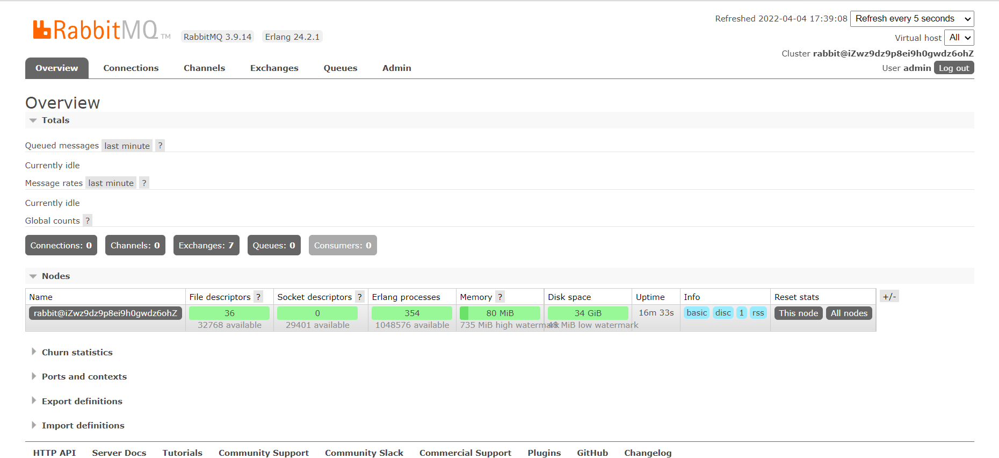
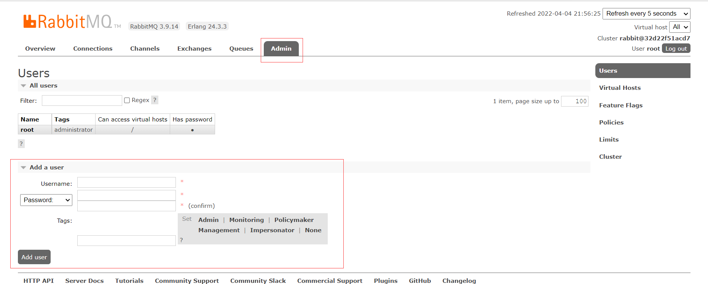

## 1、RabbitMQ入门及安装

### 1、概述

官网：https://www.rabbitmq.com/
什么是RabbitMQ,官方给出来这样的解释：

> RabbitMQ is the most widely deployed open source message broker.
> With tens of thousands of users, RabbitMQ is one of the most popular open source message brokers. From T-Mobile to Runtastic, RabbitMQ is used worldwide at small startups and large enterprises.
> RabbitMQ is lightweight and easy to deploy on premises and in the cloud. It supports multiple messaging protocols. RabbitMQ can be deployed in distributed and federated configurations to meet high-scale, high-availability requirements.
> RabbitMQ runs on many operating systems and cloud environments, and provides a wide range of developer tools for most popular languages.
>
> 翻译以后：
> RabbitMQ是部署最广泛的开源消息代理。
> RabbitMQ拥有成千上万的用户，是最受欢迎的开源消息代理之一。从T-Mobile 到Runtastic，RabbitMQ在全球范围内的小型初创企业和大型企业中都得到使用。
> RabbitMQ轻巧，易于在内部和云中部署。它支持多种消息传递协议。RabbitMQ可以部署在分布式和联合配置中，以满足大规模，高可用性的要求。
> RabbitMQ可在许多操作系统和云环境上运行，并为大多数流行语言提供了广泛的开发人员工具。

简单概述：
RabbitMQ是一个开源的遵循AMQP协议实现的基于Erlang语言编写，支持多种客户端（语言）。用于在分布式系统中存储消息，转发消息，具有高可用，高可扩性，易用性等特征。

> **RabbitMQ是一个由erlang开发的AMQP（Advanced Message Queue 高级消息队列协议 ）的开源实现，能够实现异步消息处理**
>  **RabbitMQ是一个消息代理：它接受和转发消息。**
> **你可以把它想象成一个邮局：当你把你想要发布的邮件放在邮箱中时，你可以确定邮差先生最终将邮件发送给你的收件人。在这个比喻中，RabbitMQ是邮政信箱，邮局和邮递员。** 
> **RabbitMQ和邮局的主要区别在于它不处理纸张，而是接受，存储和转发二进制数据块**
>
> **优点：异步消息处理**
>            **业务解耦（下订单操作：扣减库存、生成订单、发红包、发短信），将下单操作主流程：扣减库存、生成订单然后通过MQ消息队列完成通知，发红包、发短信**
>             **错峰流控 （通知量 消息量 订单量大的情况实现MQ消息队列机制，淡季情况下访问量会少）**
>
> **灵活的路由（Flexible Routing）** 
> **在消息进入队列之前，通过 Exchange 来路由消息的。对于典型的路由功能，RabbitMQ 已经提供了一些内置的 Exchange 来实现。针对更复杂的路由功能，可以将多个 Exchange 绑定在一起，也通过插件机制实现自己的 Exchange 。**
>
> ​	**RabbitMQ网站端口号：15672**
> ​    **程序里面实现的端口为：5672**


### 2、安装RabbitMQ

1：下载地址：https://www.rabbitmq.com/download.html
2：环境准备：CentOS7.x+ / Erlang
RabbitMQ是采用Erlang语言开发的，所以系统环境必须提供Erlang环境，第一步就是安装Erlang。

最新的版本对应关系可以在这里看，建议都下最新的，避免版本冲突：[RabbitMQ Erlang Version Requirements — RabbitMQ](https://www.rabbitmq.com/which-erlang.html)


### 3、 Erlang安装

1、在服务器创建一个RabbitMQ目录，把素材源码中的`erlang-solutions-2.0-1.noarch.rpm`和`rabbitmq-server-3.9.14-1.el8.noarch.rpm`上传进去

2、在RabbitMQ目录中，输入命令

```bash
[root@iZwz9dz9p8ei9h0gwdz6ohZ RabbitMQ]# ls
erlang-solutions-2.0-1.noarch.rpm  rabbitmq-server-3.9.14-1.el8.noarch.rpm
#解压erlang
[root@iZwz9dz9p8ei9h0gwdz6ohZ RabbitMQ]# rpm -Uvh erlang-solutions-2.0-1.noarch.rpm warning: erlang-solutions-2.0-1.noarch.rpm: Header V4 RSA/SHA256 Signature, key ID a14f4fca: NOKEY
Preparing...                          ################################# [100%]
Updating / installing...
   1:erlang-solutions-2.0-1           ################################# [100%]
#安装erlang
[root@iZwz9dz9p8ei9h0gwdz6ohZ RabbitMQ]# yum install -y erlang
Loaded plugins: fastestmirror
Determining fastest mirrors
 * centos-sclo-rh: mirrors.dgut.edu.cn
...

#解压rabbitmq
[root@iZwz9dz9p8ei9h0gwdz6ohZ RabbitMQ]# rpm -Uvh rabbitmq-server-3.9.14-1.el8.noarch.rpm 
warning: rabbitmq-server-3.9.14-1.el8.noarch.rpm: Header V4 RSA/SHA512 Signature, key ID 6026dfca: NOKEY
Preparing...                          ################################# [100%]
Updating / installing...
   1:rabbitmq-server-3.9.14-1.el8     ################################# [100%]
#安装rabbitmq
[root@iZwz9dz9p8ei9h0gwdz6ohZ RabbitMQ]# yum install rabbitmq-server -y
Loaded plugins: fastestmirror
Loading mirror speeds from cached hostfile
 * centos-sclo-rh: mirrors.dgut.edu.cn
 * centos-sclo-sclo: mirrors.dgut.edu.cn
Package matching rabbitmq-server-3.3.5-34.el7.noarch already installed. Checking for update.
Nothing to do
```

3、启动和停止rabbit-server，查看运行状态，active (running)表示开启，inactive (dead)表示停止

```bash
#启动rabbitmq
[root@iZwz9dz9p8ei9h0gwdz6ohZ RabbitMQ]# systemctl start rabbitmq-server
#查看rabbitmq运行状态
[root@iZwz9dz9p8ei9h0gwdz6ohZ RabbitMQ]# systemctl status rabbitmq-server
● rabbitmq-server.service - RabbitMQ broker
   Loaded: loaded (/usr/lib/systemd/system/rabbitmq-server.service; disabled; vendor preset: disabled)
   Active: active (running) since Mon 2022-04-04 17:03:48 CST; 27s ago
 Main PID: 10778 (beam.smp)
    CGroup: /system.slice/rabbitmq-server.service
           ├─10778 /usr/lib64/erlang/erts-12.2.1/bin/beam.smp -W w -MBas ageffcbf...
           ├─10793 erl_child_setup 32768
           ├─10817 /usr/lib64/erlang/erts-12.2.1/bin/epmd -daemon
           ├─10837 inet_gethost 4
           └─10838 inet_gethost 4
...
#停止RabbitMQ
[root@iZwz9dz9p8ei9h0gwdz6ohZ RabbitMQ]# systemctl stop rabbitmq-server
#查看rabbitmq运行状态
[root@iZwz9dz9p8ei9h0gwdz6ohZ RabbitMQ]# systemctl status rabbitmq-server
● rabbitmq-server.service - RabbitMQ broker
   Loaded: loaded (/usr/lib/systemd/system/rabbitmq-server.service; enabled; vendor preset: disabled)
   Active: inactive (dead) since Mon 2022-04-04 17:08:56 CST; 33s ago
  Process: 11070 ExecStop=/usr/sbin/rabbitmqctl shutdown (code=exited, status=0/SUCCESS)
  Process: 10778 ExecStart=/usr/sbin/rabbitmq-server (code=exited, status=0/SUCCESS)
 Main PID: 10778 (code=exited, status=0/SUCCESS)
   Status: "Standing by"
...
```

4、设置rabbitmq开机自启动

```bash
[root@iZwz9dz9p8ei9h0gwdz6ohZ RabbitMQ]# systemctl enable rabbitmq-server
Created symlink from /etc/systemd/system/multi-user.target.wants/rabbitmq-server.service to /usr/lib/systemd/system/rabbitmq-server.service.
```

<mark>==下面的笔记是CSDN的，先不用看，先看上面跟着视频写的==</mark>

查看系统版本号

```bash
#教程的
[root@iZm5eauu5f1ulwtdgwqnsbZ ~]# lsb_release -a
LSB Version:    :core-4.1-amd64:core-4.1-noarch
Distributor ID: CentOS
Description:    CentOS Linux release 8.3.2011
Release:        8.3.2011
Codename:       n/a

#我的
[root@iZwz9dz9p8ei9h0gwdz6ohZ ~]# lsb_release -a
LSB Version:	:core-4.1-amd64:core-4.1-noarch
Distributor ID:	CentOS
Description:	CentOS Linux release 7.7.1908 (Core)
Release:	7.7.1908
Codename:	Core
```

> 3-1:安装下载

参考地址：https://www.erlang-solutions.com/downloads/

```
wget https://packages.erlang-solutions.com/erlang-solutions-2.0-1.noarch.rpm
rpm -Uvh erlang-solutions-2.0-1.noarch.rpm
```

> 3-2：安装成功

```
yum install -y erlang
```

> 3-3：安装成功

```
erl -v
```

### 4、安装socat

```
yum install -y socat
```

### 5、安装RabbitMQ

下载地址：https://www.rabbitmq.com/download.html


> 5-1:下载rabbitmq

```bash
#这种下载是托管到github中，这样下载是非常慢的，先去官网把他下载到本机，然后使用工具上传到服务器更快
> wget https://github.com/rabbitmq/rabbitmq-server/releases/download/v3.8.13/rabbitmq-server-3.8.13-1.el8.noarch.rpm
> rpm -Uvh rabbitmq-server-3.8.13-1.el8.noarch.rpm
```

<mark>==到这就可以继续看了==</mark>

> 5-2:启动rabbitmq服务

```
# 启动服务
> systemctl start rabbitmq-server
# 查看服务状态
> systemctl status rabbitmq-server
# 停止服务
> systemctl stop rabbitmq-server
# 开机启动服务
> systemctl enable rabbitmq-server
```


### 6、RabbitMQ的配置

RabbitMQ默认情况下有一个配置文件，定义了RabbitMQ的相关配置信息，默认情况下能够满足日常的开发需求。如果需要修改需要，需要自己创建一个配置文件进行覆盖。
参考官网：
1:https://www.rabbitmq.com/documentation.html
2:https://www.rabbitmq.com/configure.html
3:https://www.rabbitmq.com/configure.html#config-items
4：https://github.com/rabbitmq/rabbitmq-server/blob/add-debug-messages-to-quorum_queue_SUITE/docs/rabbitmq.conf.example

#### 1、相关端口

> 5672:RabbitMQ的通讯端口
> 25672:RabbitMQ的节点间的CLI通讯端口是
> 15672:RabbitMQ HTTP_API的端口，管理员用户才能访问，用于管理RabbitMQ,需要启动Management插件。
> 1883，8883：MQTT插件启动时的端口。
> 61613、61614：STOMP客户端插件启用的时候的端口。
> 15674、15675：基于webscoket的STOMP端口和MOTT端口

一定要注意：RabbitMQ 在安装完毕以后，会绑定一些端口，如果你购买的是阿里云或者腾讯云相关的服务器一定要在安全组中把对应的端口添加到防火墙。

## 2、RabbitMQWeb管理界面及授权操作

### 01、RabbitMQ管理界面

1-1：默认情况下，rabbitmq是没有安装web端的客户端插件，需要安装才可以生效

```bash
#注意rabbitmq_management是下划线连接，安装客户端插件
[root@iZwz9dz9p8ei9h0gwdz6ohZ RabbitMQ]# rabbitmq-plugins enable rabbitmq_management
Enabling plugins on node rabbit@iZwz9dz9p8ei9h0gwdz6ohZ:
rabbitmq_management
The following plugins have been configured:
  rabbitmq_management
  rabbitmq_management_agent
  rabbitmq_web_dispatch
Applying plugin configuration to rabbit@iZwz9dz9p8ei9h0gwdz6ohZ...
Plugin configuration unchanged.
```

> 说明：rabbitmq有一个默认账号和密码是：`guest` 默认情况只能在localhost本机下访问，所以需要添加一个远程登录的用户。

1-2：安装完毕以后，重启服务即可

```
systemctl restart rabbitmq-server
```

> 一定要记住，在对应服务器(阿里云，腾讯云等)的安全组中开放`15672`的端口。

1-3：在浏览器访问http://ip:15672/ 如下：


### 02、授权账号和密码

2-1：新增用户

```bash
#添加一个用户，账号admin，密码admin
[root@iZwz9dz9p8ei9h0gwdz6ohZ RabbitMQ]# rabbitmqctl add_user admin admin
Adding user "admin" ...
Done. Don't forget to grant the user permissions to some virtual hosts! See 'rabbitmqctl help set_permissions' to learn more.
```

2-2:设置用户分配操作权限

```bash
[root@iZwz9dz9p8ei9h0gwdz6ohZ RabbitMQ]# rabbitmqctl set_user_tags admin administrator
Setting tags for user "admin" to [administrator] ...
```

用户级别：

- 1、administrator 可以登录控制台、查看所有信息、可以对rabbitmq进行管理
- 2、monitoring 监控者 登录控制台，查看所有信息
- 3、policymaker 策略制定者 登录控制台,指定策略
- 4、managment 普通管理员 登录控制台

2-3：为用户添加所有资源权限，administrator 自动拥有所有权限，所以这条命令可执行也可忽略

```bash
[root@iZwz9dz9p8ei9h0gwdz6ohZ RabbitMQ]# rabbitmqctl set_permissions -p / admin ".*" ".*" ".*"
Setting permissions for user "admin" in vhost "/" ...
```



### 03、小结

```
rabbitmqctl add_user 账号 密码
rabbitmqctl set_user_tags 账号 administrator
rabbitmqctl change_password Username Newpassword 修改密码
rabbitmqctl delete_user Username 删除用户
rabbitmqctl list_users 查看用户清单
rabbitmqctl set_permissions -p / 用户名 ".*" ".*" ".*" 为用户设置administrator角色
rabbitmqctl set_permissions -p / root ".*" ".*" ".*"
```


## 3、RabbitMQ之Docker安装

### 1、Docker安装RabbitMQ

> **虚拟化容器技术—Docker的安装**

（本教程）

```bash
#（1）yum 包更新到最新
[root@iZwz9dz9p8ei9h0gwdz6ohZ RabbitMQ]# yum update
...

#（2）安装需要的软件包， yum-util 提供yum-config-manager功能，另外两个是devicemapper驱动依赖的
> yum install -y yum-utils device-mapper-persistent-data lvm2
#（3）设置yum源为阿里云
> yum-config-manager --add-repo http://mirrors.aliyun.com/docker-ce/linux/centos/docker-ce.repo
#（4）安装docker
> yum install docker-ce -y
#（5）安装后查看docker版本
> docker -v
# (6) 安装加速镜像
 sudo mkdir -p /etc/docker
 sudo tee /etc/docker/daemon.json <<-'EOF'
 {
  "registry-mirrors": ["https://0wrdwnn6.mirror.aliyuncs.com"]
 }
 EOF
 sudo systemctl daemon-reload
 sudo systemctl restart docker
```

（之前的docker教程，修改了一下）

```bash
#（1）yum 包更新到最新
[root@iZwz9dz9p8ei9h0gwdz6ohZ RabbitMQ]# yum update
...

#（2）安装需要的软件包， yum-util 提供yum-config-manager功能，另外两个是devicemapper驱动依赖的
[root@iZwz9dz9p8ei9h0gwdz6ohZ RabbitMQ]#  yum install -y yum-utils device-mapper-persistent-data lvm2
...

#1.卸载旧的版本
yum remove docker \
                  docker-client \
                  docker-client-latest \
                  docker-common \
                  docker-latest \
                  docker-latest-logrotate \
                  docker-logrotate \
                  docker-engine


#3.设置镜像的仓库
yum-config-manager \
    --add-repo \
    https://download.docker.com/linux/centos/docker-ce.repo #这是国外的，速度十分慢，建议安装阿里云的
 
yum-config-manager \
    --add-repo \
    http://mirrors.aliyun.com/docker-ce/linux/centos/docker-ce.repo #推荐：阿里云镜像地址
 
 #4.更新软件包的索引
 yum makecache fast
 
 #5.安装最新的Docker相关依赖，询问Is this ok [y/d/N]，输入y，docker-ce是社区版（官方推荐），ee是企业版
 yum install docker-ce docker-ce-cli containerd.io
 
 #6.启动Docker，没打印报错内容就是成功了
 systemctl start docker
 
 #7.查看是否安装成功，打印了Docker信息就是成功了
 docker version
 
```

> docker的相关命令

```
# 启动docker：
systemctl start docker
# 停止docker：
systemctl stop docker
# 重启docker：
systemctl restart docker
# 查看docker状态：
systemctl status docker
# 开机启动：  
systemctl enable docker
systemctl unenable docker
# 查看docker概要信息
docker info
# 查看docker帮助文档
docker --help
```

> **安装rabbitmq**

参考网站：
1：https://www.rabbitmq.com/download.html
2：https://registry.hub.docker.com/_/rabbitmq/

> **获取rabbit镜像：**

```bash
#拉取管理面板插件
#不拉取也可以，run时没有镜像会自动拉取
docker pull rabbitmq:management
```

> **创建并运行容器**

```bash
#-di：后台运行，且即使未连接，也保持 STDIN 打开
#如果error说端口占用，先systemctl status rabbitmq-server看看之前的rabbit-server在不在运行
#如果在，就systemctl stop rabbitmq-server停止掉
docker run -di -p 15672:15672 --name=myrabbit rabbitmq:management
```

—hostname：指定容器主机名称
—name:指定容器名称
-p:将mq端口号映射到本地
或者运行时创建一个用户和密码替换掉guest用户

```bash
docker run -di --name myrabbit -e RABBITMQ_DEFAULT_USER=admin -e RABBITMQ_DEFAULT_PASS=admin -p 15672:15672 -p 5672:5672 -p 25672:25672 -p 61613:61613 -p 1883:1883 rabbitmq:management

#或者
[root@iZwz9dz9p8ei9h0gwdz6ohZ RabbitMQ]# docker images
REPOSITORY   TAG          IMAGE ID       CREATED      SIZE
rabbitmq     management   ef71b89e8bfa   4 days ago   257MB
[root@iZwz9dz9p8ei9h0gwdz6ohZ RabbitMQ]# docker run ef71b89e8bfa 
...
```

查看日志

```bash
docker logs -f myrabbit
```

> 容器运行正常

使用 `http://你的IP地址:15672` 访问rabbit控制台

为什么可以远程登录guest账户了？

### 2、额外Linux相关排查命令

```bash
> more xxx.log  查看日记信息
> netstat -naop | grep 5672 查看端口是否被占用
> ps -ef | grep 5672  查看进程
> systemctl stop 服务
1234
```

## 4、RabbitMQ的角色分类

### 1：none：啥都不能干，访问都不行

- 不能访问management plugin

### 2：management：查看自己相关节点信息

- **列出**自己可以通过AMQP登入的虚拟机
- **查看**自己的虚拟机节点 virtual hosts的queues,exchanges和bindings信息
- **查看和关闭**自己的channels和connections
- **查看**有关自己的虚拟机节点virtual hosts的统计信息。包括其他用户在这个节点virtual hosts中的活动信息。

### 3：Policymaker：查看创建删除自己相关节点信息

- 包含management所有权限
- **查看和创建和删除**自己的virtual hosts所属的policies和parameters信息。

### 4：Monitoring：查看创建删除自己的相关节点信息，查看别人的相关节点信息

- 包含management所有权限
- **罗列**出所有的virtual hosts，包括不能登录的virtual hosts。
- **查看**其他用户的connections和channels信息
- **查看**节点级别的数据如clustering和memory使用情况
- **查看**所有的virtual hosts的全局统计信息。

### 5：Administrator：查看创建删除所有人的节点信息

- **最高权限**
- 可以**创建和删除**virtual hosts
- 可以**查看，创建和删除**users
- **查看创建**permisssions
- **关闭**所有用户的connections

### 6、具体操作的界面


**管理面板创建角色**

