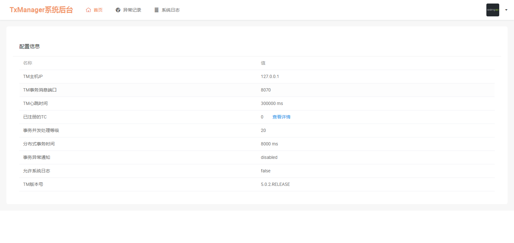

# SpringCloud系列——TX-LCN分布式事务管理

## 前言

SpringCloud分布式架构给我们带来开发上的便利，同时增加了我们对事务管理的难度，微服务的遍地开花，本地事务已经无法满足分布式的要求，由此分布式事务问题诞生。 分布式事务被称为世界性的难题。

更多分布式事务介绍请看这篇文章：[再有人问你分布式事务，把这篇扔给他](https://juejin.im/post/5b5a0bf9f265da0f6523913b)

本文记录整合TX-LCN分布式事务框架管理分布式事务，用的版本是5.0.2.RELEASE

## TX-LCN

### 简单介绍

TX-LCN分布式事务框架，LCN并不生产事务，LCN只是本地事务的协调工，LCN是一个高性能的分布式事务框架，兼容dubbo、springcloud框架，支持RPC框架拓展，支持各种ORM框架、NoSQL、负载均衡、事务补偿

### 特性一览

1、一致性，通过TxManager协调控制与事务补偿机制确保数据一致性

2、易用性，仅需要在业务方法上添加@TxTransaction注解即可

3、高可用，项目模块不仅可高可用部署，事务协调器也可集群化部署

4、扩展性，支持各种RPC框架扩展，支持通讯协议与事务模式扩展

更多介绍跟文档说明请看官网：https://www.txlcn.org/zh-cn/index.html

## 撸代码

我们按照官方文档（https://www.txlcn.org/zh-cn/docs/preface.html）一步步操作：

### Tx-Manager

创建数据库、表

1. 创建MySQL数据库, 名称为：tx-manager（我们直接选择在我们自己的数据库下面创建表就行了，这里就不创建这个数据库）

2. 创建数据表：t_tx_exception

   ```sql
   CREATE TABLE `t_tx_exception`  (
     `id` bigint(20) NOT NULL AUTO_INCREMENT,
     `group_id` varchar(64) CHARACTER SET utf8mb4 COLLATE utf8mb4_general_ci NULL DEFAULT NULL,
     `unit_id` varchar(32) CHARACTER SET utf8mb4 COLLATE utf8mb4_general_ci NULL DEFAULT NULL,
     `mod_id` varchar(128) CHARACTER SET utf8mb4 COLLATE utf8mb4_general_ci NULL DEFAULT NULL,
     `transaction_state` tinyint(4) NULL DEFAULT NULL,
     `registrar` tinyint(4) NULL DEFAULT NULL,
     `remark` varchar(4096) NULL DEFAULT  NULL,
     `ex_state` tinyint(4) NULL DEFAULT NULL COMMENT '0 未解决 1已解决',
     `create_time` datetime NULL DEFAULT NULL,
     PRIMARY KEY (`id`) USING BTREE
   ) ENGINE = InnoDB AUTO_INCREMENT = 1 CHARACTER SET = utf8mb4 COLLATE = utf8mb4_general_ci ROW_FORMAT = Dynamic;
   ```


下载官网提供的最新版的TM项目，修改配置文件（PS：由于官网的下载地址打不开，我们去GitHub上面下载例子：https://github.com/codingapi/txlcn-demo），参考txlcn-demo-tm工程，在我们之前的项目下面创建一个springboot项目叫txlcn-tm


创建好springboot项目后，参照例子修改pom.xml文件

```xml
<?xml version="1.0" encoding="UTF-8"?>
<project xmlns="http://maven.apache.org/POM/4.0.0" xmlns:xsi="http://www.w3.org/2001/XMLSchema-instance"
         xsi:schemaLocation="http://maven.apache.org/POM/4.0.0 http://maven.apache.org/xsd/maven-4.0.0.xsd">
    <modelVersion>4.0.0</modelVersion>
    <groupId>cn.huanzi.qch.txlcn</groupId>
    <artifactId>txlcn-tm</artifactId>
    <version>0.0.1-SNAPSHOT</version>
    <name>txlcn-tm</name>
    <description>Tx-Manager(TM)，TX-LCN分布式事务框架的独立服务</description>

    <!--继承信息-->
    <parent>
        <groupId>cn.huanzi.qch</groupId>
        <artifactId>parent</artifactId>
        <version>1.0.0</version>
    </parent>

    <dependencies>
        <!-- 参照例子引入需要的依赖jar -->
        <dependency>
            <groupId>com.codingapi.txlcn</groupId>
            <artifactId>txlcn-tm</artifactId>
            <version>5.0.2.RELEASE</version>
        </dependency>

        <!-- text报错，添加一下依赖-->
        <dependency>
            <groupId>org.springframework.boot</groupId>
            <artifactId>spring-boot-starter-test</artifactId>
            <scope>test</scope>
        </dependency>
    </dependencies>

    <!-- 构建工具 -->
    <build>
        <plugins>
            <plugin>
                <groupId>org.springframework.boot</groupId>
                <artifactId>spring-boot-maven-plugin</artifactId>
            </plugin>
        </plugins>
        <finalName>txlcn-tm</finalName>
    </build>

</project>
```

参照官网修改配置文件，详细的TM配置请戳：https://www.txlcn.org/zh-cn/docs/setting/manager.html，开发阶段最好开启日志，并设置为debug等级，这样方便追踪排查问题

```properties
spring.application.name=txlcn-tm
server.port=7970

spring.datasource.driver-class-name=com.mysql.jdbc.Driver
spring.datasource.url=jdbc:mysql://localhost:3306/test?characterEncoding=UTF-8&serverTimezone=Asia/Shanghai
spring.datasource.username=root
spring.datasource.password=123456
spring.jpa.database-platform=org.hibernate.dialect.MySQL5InnoDBDialect
spring.jpa.hibernate.ddl-auto=validate

# TM后台登陆密码
tx-lcn.manager.admin-key=123456

tx-lcn.manager.host=127.0.0.1
tx-lcn.manager.port=8070

# 开启日志,默认为false
tx-lcn.logger.enabled=true
tx-lcn.logger.driver-class-name=${spring.datasource.driver-class-name}
tx-lcn.logger.jdbc-url=${spring.datasource.url}
tx-lcn.logger.username=${spring.datasource.username}
tx-lcn.logger.password=${spring.datasource.password}logging.level.com.codingapi.txlcn=DEBUG

#redis 主机
spring.redis.host=127.0.0.1
#redis 端口
spring.redis.port=6379
#redis 密码
spring.redis.password=
```

在启动类添加注解 @EnableTransactionManagerServer

```java
package cn.huanzi.qch.txlcn.tm;

import com.codingapi.txlcn.tm.config.EnableTransactionManagerServer;
import org.springframework.boot.SpringApplication;
import org.springframework.boot.autoconfigure.SpringBootApplication;

@SpringBootApplication
@EnableTransactionManagerServer
public class TxlcnTmApplication {

    public static void main(String[] args) {
        SpringApplication.run(TxlcnTmApplication.class, args);
    }

}
```

把我们的Redis服务运行起来，然后启动txlcn-tm，启动成功后访问tm后台管理系统，使用默认密码登录（可以配置登录密码），访问 http://127.0.0.1:7970/admin/index.html进入管理后台，默认密码是`codingapi，我们这里配置了123456`



启动TM之前记得先启动我们的Redis服务，到这里，我们的tm搭建成功，更多TM介绍，请看官网TM管理手册：https://www.txlcn.org/zh-cn/docs/manageradmin.html

### Tx-Client

TC端参照官网一步步操作：https://www.txlcn.org/zh-cn/docs/start.html

1、TC引入依赖

```xml
<dependency>
    <groupId>com.codingapi.txlcn</groupId>
    <artifactId>txlcn-tc</artifactId>
    <version>5.0.2.RELEASE</version>
</dependency>

<dependency>
    <groupId>com.codingapi.txlcn</groupId>
    <artifactId>txlcn-txmsg-netty</artifactId>
    <version>5.0.2.RELEASE</version>
</dependency>
```

PS：如果你没有添加jdbc驱动，启动的时候会报错

```
Parameter 0 of constructor in com.codingapi.txlcn.tc.core.transaction.txc.analy.TableStructAnalyser required a bean of type 'javax.sql.DataSource' that could not be found.
```

因此要添加jdbc依赖

```xml
<dependency>
    <groupId>org.springframework.boot</groupId>
    <artifactId>spring-boot-starter-jdbc</artifactId>
</dependency>
```

2、配置文件添加TM地址跟监听端口，如果TM是默认8070端口，且跟TC部署在同一台机器，可以忽略这个配置，并且开启日志，开发阶段最好开启日志，并设置为debug等级，这样方便追踪排查问题

```properties
# 是否启动LCN负载均衡策略(优化选项，开启与否，功能不受影响)
tx-lcn.ribbon.loadbalancer.dtx.enabled=true
# 默认之配置为TM的本机默认端口
tx-lcn.client.manager-address=127.0.0.1:8070
# 开启日志,默认为false
tx-lcn.logger.enabled=true
tx-lcn.logger.driver-class-name=${spring.datasource.driver-class-name}
tx-lcn.logger.jdbc-url=${spring.datasource.url}
tx-lcn.logger.username=${spring.datasource.username}
tx-lcn.logger.password=${spring.datasource.password}
logging.level.com.codingapi.txlcn=DEBUG
```

3、在启动类上使用 @EnableDistributedTransaction

```java
//省略其他代码...
@EnableDistributedTransaction
public class MyspringbootApplication {
    public static void main(String[] args) {
        SpringApplication.run(MyspringbootApplication.class, args);
    }
}
```

4、在提交本地事务的地方添加**@LcnTransaction**，分布式事务注解，PS：@LcnTransaction的target是在方法上的，@Target({ElementType.METHOD})

###  测试代码

我们挑选之前的两个项目myspringboot、springdatejpa，按照步骤设置成TC，

并且在两个TC添加测试接口，

### myspringboot

controller

```java
/**
     * 测试分布式事务
     */
@GetMapping("feign/save")
Result<UserVo> save(UserVo userVo){
    //模拟数据
    Description description = new Description();
    description.setUserId("111");
    description.setDescription("测试用户描述");

    Result<Description> save = descriptionService.save(description);
    System.out.println(save);
    return null;
}
```

service

```
    @Override
    @LcnTransaction//分布式事务
    @Transactional //本地事务
    public Result<Description> save(Description description) {
        UserVo userVo = new UserVo();
        userVo.setUsername("huanzi");
        userVo.setPassword("123");
        //调用springdatejpa服务保存userVo
        Result<UserVo>  result = myspringbootFeign.save(userVo);
        System.out.println(result);

        //myspringboot本地服务保存description
        Description save = descriptionRepository.save(description);
        System.out.println(save);
        
        //模拟发生异常
        throw new RuntimeException("business code error");
    }
```

feign

```
@FeignClient(name = "springdatejpa", path = "/user/",fallback = MyspringbootFeignFallback.class,fallbackFactory = MyspringbootFeignFallbackFactory.class)
public interface MyspringbootFeign {

    @RequestMapping(value = "save")
    Result<UserVo> save(@RequestBody UserVo userVo);
}
```

### springdatejpa

这个原先就已经有对应的save接口，其他的代码我们就不贴了，在UserServiceImpl类重写save方法，在save方法上添加@LcnTransaction注解

```java
@LcnTransaction//分布式事务
@Transactional //本地事务
@Override
public Result<UserVo> save(UserVo entity) {
    User user = userRepository.save(FastCopy.copy(entity, User.class));
    return Result.of(FastCopy.copy(user, UserVo.class));
}
```

## 演示效果

启动所有项目，TM跟Redis服务也要记得启动


 查看TM后台，可以看到成功注册了两个TC


访问http://localhost:10010/myspringboot/feign/save，被单点登录拦截，登录后跳转正常跳转该接口，这些就不再演示了，下面直接看后台debug日志

调用流程

myspringboot（A） ---> springdatejpa（B）

### 事务回滚

myspringboot（A）


 springdatejpa（B）


 　到这里springdatejpa（B）已经响应了user数据给myspringboot（A），而后收到回滚通知


 事务提交

　　我们看一下事务正常提交是怎么样的，我们把模拟异常注释起来，并返回保存后的数据

```java
//模拟发生异常
//throw new RuntimeException("business code error");
return Result.of(save);
```

我们直接从springdatejpa（B）响应数据之后看

myspringboot（A）


　　springdatejpa（B）

 

具体的流程已经事务控制原理可以查看官网：https://www.txlcn.org/zh-cn/docs/principle/control.html，这里简单的贴出官网提供的原理图：

## 后记

要注意我们的springboot版本跟txlcn的版本是不是兼容，按照官网的快速开始（https://www.txlcn.org/zh-cn/docs/start.html），以及参考官方例子（https://github.com/codingapi/txlcn-demo），一路下来碰到了一下小问题在这里总结一下：

1、A调B，A抛出异常，A事务回滚，B事务没有回滚

　　原因：这个是因为刚开始我是在A的controller层调用B，相当于B是一个单独是事务组，A又是一个单独的事务组

　　解决：在A开启事务后再调用B