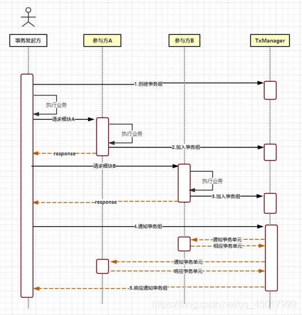
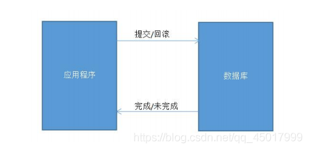
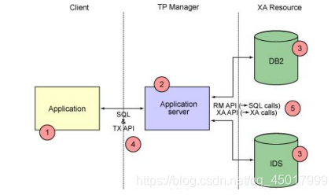
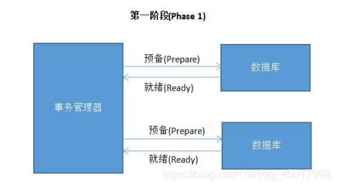
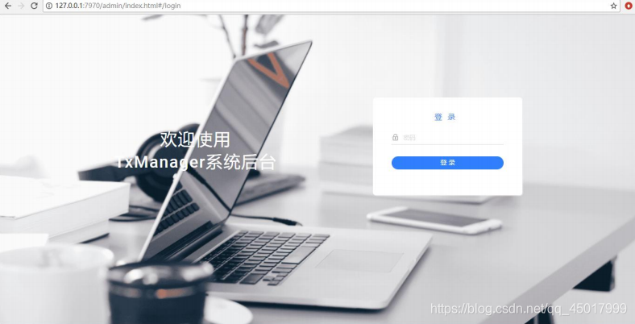
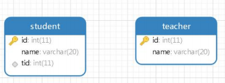
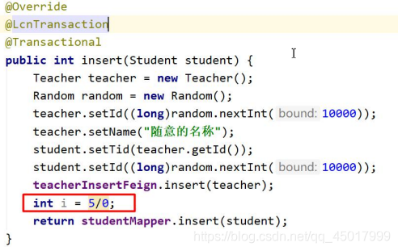

# 概述

## 1.简介

- LCN 框架在 2017 年 6 月发布第一个版本
- LCN 早期设计时，1.0 版本和 2.0 版本设计步骤如下：
  1. 锁定事务单元（Lock）（发起方创建事务组并加入，参与方也加入）
  2. 确认事务模块状态（Confirm）（判断所有接口的事务状态）
  3. 通知事务（Notify）（所有接口的状态成功就提交，有一个不成功就回滚）
- 取各自首字母后名称为 LCN。
- LCN 框架从 5.0 开始兼容了 LCN、TCC、TXC 三种事务模式，为了和 LCN 框架区分，从 5.0 开始把 LCN 框架更名为：TX-LCN 分布式事务框架

## 2.TX-LCN 原理

- TX-LCN 由两大模块组成，TxClient、TxManager
- TxClient 作为模块的依赖框架，提供了 TX-LCN 的标准支持，事务发起方和参与方都属于 TxClient。TxManager 作为分布式事务的控制方，控制整个事务
  

### 2.1 原理中核心内容

#### 2.1.1 创建事务组

- 是指在事务发起方开始执行业务代码之前先调用 TxManager 创建事务组对象，然后拿到事务标识 GroupId 的过程。

#### 2.1.2 加入事务组

- 添加事务组是指参与方在执行完业务方法以后，将该模块的事务信息通知给 TxManager 的操作。

#### 2.1.3 通知事务组

- 是指在发起方执行完业务代码以后，将发起方执行结果状态通知给 TxManager,TxManager 将根据事务最终状态和事务组的信息来通知相应的参与模块提交或回滚事务，并返回结果给事务发起方

# TX-LCN 事务模式

- Tx-LCN 5.0 开始支持三种事务模式，分别是：LCN、TCC、TXC 模式。

- 每种模式在实际使用时有着自己对应的注解。

  ```
  LCN：@LcnTransaction 
  TCC：@TccTransaction 
  TXC：@TxcTransaction
  ```

## 1.LCN 模式

### 1.1 原理介绍

- LCN 模式是通过代理 JDBC 中 Connection 的方式实现对本地事务的操作，然后在由TxManager 统一协调控制事务。当本地事务提交回滚或者关闭连接时将会执行假操作，该代 理的连接将由 LCN 连接池管理

### 1.2 模式特点

- 该模式对代码的嵌入性低。
- 该模式仅限于本地存在连接对象且可通过连接对象控制事务的模块。
- 该模式下的事务提交与回滚是由本地事务方控制，对于数据一致性上有较高的保障
- 该模式缺陷在于代理的连接需要随事务发起方一同释放连接，增加了连接占用的时间
- 总结：LCN 模式适合能用 JDBC 连接的所有支持事务的数据库

## 2.TCC 事务模式

### 2.1 原理介绍

- TCC 事务机制相对于传统事务机制（X/Open XA Two-Phase-Commit），其特征在于它不依赖资源管理器(RM)对 XA 的支持，而是通过对（由业务系统提供的）业务逻辑的调度来实现分布式事务。主要由三步操作，Try: 尝试执行业务、 Confirm:确认执行业务、 Cancel: 取消执行业务

### 2.2 代码说明

- 每个 TCC 事务处理方法可以额外包含 confirmXxx 和 cancelXxx 的方法（），出现失败问题，需要在 cancel 中通过业务逻辑把改变的数据还原回来
- confirmXxx 和 cancelXxx 两个方法会由 TxManager 进行统一协调调用
- confirmXxx 和 cancelXxx 也可以在@TccTransaction 注解中通过属性明确指定

```java
@TccTransaction 
public String demo(){ 
	// 正常的 service 方法，也是 Try 尝试执行执行 
}

public void confirmDemo(){ 
	// 当 demo 方法没有出现异常时执行的方法 
	// 方法名称必须叫做 confirm+代理方法首字母 
}

public void cancelDemo(){ 
	// 当 demo 方法出现异常时执行的方法 
	// 方法名称必须叫做 cancel+代理方法首字母 
}
```

### 2.3 模式特点

- 该模式对代码的嵌入性高，要求每个业务需要写二个以上步骤的操作
- 该模式对有无本地事务控制都可以支持，使用面更广
- 数据一致性控制几乎完全由开发者控制，对业务开发难度要求高
- 总结：Tcc 模式应用于所有不支持 XA 事务的软件。例如：redis，mongodb 等

## 3.TXC 事务模式

### 3.1 原理介绍

- TXC 模式命名来源于淘宝，实现原理是在执行 SQL 之前，先查询 SQL 的影响数据，然后保存执行的 SQL 信息和创建锁。当需要回滚的时候就采用这些记录数据回滚数据库，目前锁实现依赖 redis 分布式锁控制。（在使用 lcn 时必须要配置 redis 参数）

### 3.2 模式特点

- 该模式同样对代码的嵌入性低
- 该模式仅限于对支持 SQL 方式的模块支持
- 该模式由于每次执行 SQL 之前需要先查询影响数据，因此相比 LCN 模式消耗资源与时间要多
- 该模式不会占用数据库的连接资源
- 总结：只能用在支持 SQL 的数据库。对资源消耗较多。建议使用 LCN 模式

# XA 的两阶段提交方案（数据库支持分布式事务，为什么还用 TX-LCN）

## 1.什么是 XA 协议

- XA 协议由 Oracle Tuxedo 首先提出的，并交给 X/Open 组织，作为资源管理器（数据库）与事务管理器的接口标准。目前，Oracle、Informix、DB2 和 Sybase 等各大数据库厂家都提供对 XA 的支持。XA 协议采用两阶段提交方式来管理分布式事务。XA 接口提供资源管理器与事务管理器之间进行通信的标准接口。
- XA 就是 X/Open DTP 定义的交易中间件与数据库之间的接口规范（即接口函数），交易中间件用它来通知数据库事务的开始、结束以及提交、回滚等。XA 接口函数由数据库厂商提供。
- X/Open 组织（即现在的 Open Group）定义了分布式事务处理模型。X/Open DTP 模型（1994）包括应用程序（AP）、事务管理器（TM）、资源管理器（RM）、通信资源管理器（CRM）四部分。一般，常见的事务管理器（TM）是交易中间件，常见的资源管理器（RM）是数据库，常见的通信资源管理器（CRM）是消息中间件。

## 2.XA 协议的一阶段提交



- 如果在程序中开启了事务，那么在应用程序发出提交/回滚请求后，数据库执行操作，而后将成功/失败返回给应用程序，程序继续执行
- 一阶段提交协议相对简单。优点也很直观，它不用再与其他的对象交互，节省了判断步骤和时间，所以在性能上是在阶段提交协议中最好的。但缺点也很明显：数据库确认执行事务的时间较长，出问题的可能性就随之增大。如果有多个数据源，一阶段提交协议无法协调他们之间的关系

## 3.XA 协议的二阶段提交

- 在一阶段协议的基础上，有了二阶段协议，二阶段协议的好处是添加了一个管理者角色
  
- 很明显，二阶段协议通过将两层变为三层，增加了中间的管理者角色，从而协调多个数据源之间的关系，二阶段提交协议分为两个阶段
  

**第二阶段也分为两个步骤：**

- 事务管理器在接受各个消息后，开始分析，如果有任意其一失败，则发送回滚命令，否则发送提交命令
- 各个资源管理器接收到命令后，执行（耗时很少），并将提交消息返回给事务管理器
- 事务管理器接受消息后，事务结束，应用程序继续执行
- 为什么要分两步执行？一是因为分两步，就有了事务管理器统一管理的机会；二尽可能晚地提交事务，让事务在提交前尽可能地完成所有能完成的工作，这样，最后的提交阶段将是耗时极短，耗时极短意味着操作失败的可能性也就降低
- 同时，二阶段提交协议为了保证事务的一致性，不管是事务管理器还是各个资源管理器，每执行一步操作，都会记录日志，为出现故障后的恢复准备依据

**缺点：**

- 二阶段提交协议的存在的弊端是阻塞，因为事务管理器要收集各个资源管理器的响应消息，如果其中一个或多个一直不返回消息，则事务管理器一直等待，应用程序也被阻塞，甚至可能永久阻塞
- 两阶段提交理论的一个广泛工业应用是 XA 协议。目前几乎所有收费的商业数据库都支持 XA 协议。XA 协议已在业界成熟运行数十年，但目前它在互联网海量流量的应用场景中，吞吐量这个瓶颈变得十分致命，因此很少被用到

# TxManager 搭建

## 1.创建项目，添加依赖

- 新建项目 TxManager，并添加依赖

- 依赖包含了 Spring-boot 的依赖，版本是 2.0.5，如果希望把版本改变成 2.2.2 或其他版本只需要添加 spring-boot-starter-parent 继承即可

  ```xml
  <dependencies> 
  	<dependency> 
  		<groupId>com.codingapi.txlcn</groupId> 
  		<artifactId>txlcn-tm</artifactId> 
  		<version>5.0.2.RELEASE</version> 
  	</dependency> 
  </dependencies>
  ```

## 2.执行 SQL 文件

- 执行 tx-manager.sql 文件（在任意的数据库下执行即可）

- tx-manager.sql 在 txlcn-tm-5.0.2.RELEASE.zip 压缩包中。

- 在 MySQL 生成 tx-manager 的数据库，在数据库中新建 t_tx_exception 的表，此表用作存储事务组信息

- **注意：**

- 默认情况下 tx-manager 需要记录日志信息的，需要在项目中配置日志连接数据库相关参数，其中日志存储数据库没有要求，可以存储到任意数据库中，当运行后会自动在数据库中生成一个日志表。如果不希望记录日志可以直接设置 tx-lcn.logger.enabled=false，关闭日志功能，下面的日志连接数据库参数也可以不用配置。

- 在实际案例演示中会把所有的日志记录功能关闭。如果希望记录记录日志需要把下面代码在所有引用 tx-lcn 的项目的配置文件中进行配置

  ```
  tx-lcn.logger.enabled=true 
  tx-lcn.logger.driver-class-name=com.mysql.jdbc.Driver 
  tx-lcn.logger.jdbc-url=jdbc:mysql://192.168.8.131:3306/tx-manager?characterEncoding=UTF-8 
  tx-lcn.logger.username=root 
  tx-lcn.logger.password=root
  ```

## 3.配置配置文件

- 在 TxManager 项目的 resource 下新建 application.properties。tx-lcn 在当前版本有个 bug 只能使用 properties 文件，使用 yml 文件会导致配置文件无法被加载的问题

- 配置文件中内容上半部分是 tx-manager 数据库的连接信息。中间包含 redis 连接信息（此处连接的是 redis 单机版，端口默认，没有密码），下面是关闭日志记录功能

- 小提示：

- 依赖 Redis，所以需要安装 Redis。

- 7970 是客户端访问端口，是 Txmanager 可视化界面访问端口，此端口任意。

  ```properties
  spring.application.name=TransactionManager
  server.port=7970
  
  spring.datasource.driver-class-name=com.mysql.jdbc.Driver
  spring.datasource.url=jdbc:mysql://localhost:3306/tx-manager?characterEncoding=UTF-8
  spring.datasource.username=root
  spring.datasource.password=root
  spring.redis.host=192.168.8.129
  
  tx-lcn.logger.enabled=false
  ```

## 4.新建启动类

- 注意注解@EnableTrasactionManagerServer 必须有

  ```java
  @SpringBootApplication 
  @EnableTransactionManagerServer
  public class MyApplication { 
  	public static void main(String[] args) { 
  		SpringApplication.run(MyApplication.class,args); 
  	} 
  }
  ```

## 5.访问管理界面

- 在浏览器输入：http://localhost:7970 访问。
- 密码默认是 codingapi
- 可以在配置文件中修改登录密码

```properties
tx-lcn.manager.admin-key=dqcgm
```



# LCN 事务模式

## 1.创建数据库表

- 注意：不要给 student 表添加外键约束。如果添加会导致分布式事务执行时 student 新增失败，因为 teacher 没有提交时 student 的 tid 值无法获取。
  

## 2.创建项目

- 案例使用聚合项目进行演示。
- 创建父项目，名称为 LcnParent

### 2.1 配置 pom.xml

- txlcn-tc 是 TX-LCN 的客户端包

- txlcn-txmsg-netty 是 LCN 客户端连接 TxManager 需要的包

  ```xml
  <parent>
  	<groupId>org.springframework.boot</groupId> 
  	<artifactId>spring-boot-starter-parent</artifactId> 
  	<version>2.2.6.RELEASE</version>
  </parent>
  <dependencies>
  	<dependency> 
  		<groupId>org.springframework.boot</groupId> 
  		<artifactId>spring-boot-starter-web</artifactId> 
  	</dependency>
  	<dependency> 
  		<groupId>org.mybatis.spring.boot</groupId> 
  		<artifactId>mybatis-spring-boot-starter</artifactId> 
  		<version>2.1.2</version> 
  	</dependency>
  	<dependency> 
  		<groupId>org.springframework.cloud</groupId> 
  		<artifactId>spring-cloud-starter-netflix-eureka-client</artifactId> 
  	</dependency>
  	<dependency> 
  		<groupId>org.springframework.cloud</groupId> 
  		<artifactId>spring-cloud-starter-openfeign</artifactId> 
  	</dependency>
  
  	<dependency> 
  		<groupId>mysql</groupId> 
  		<artifactId>mysql-connector-java</artifactId> 
  		<version>5.1.48</version> 
  		<scope>runtime</scope> 
  	</dependency>
  	<dependency> 
  		<groupId>org.projectlombok</groupId> 
  		<artifactId>lombok</artifactId> 
  		<optional>true</optional> 
  	</dependency>
  	<dependency> 
  		<groupId>com.codingapi.txlcn</groupId> 
  		<artifactId>txlcn-tc</artifactId> 
  		<version>5.0.2.RELEASE</version> 
  	</dependency>
  	<dependency> 
  		<groupId>com.codingapi.txlcn</groupId> 
  		<artifactId>txlcn-txmsg-netty</artifactId> 
  		<version>5.0.2.RELEASE</version> 
  	</dependency>
  </dependencies>
  <dependencyManagement>
  	<dependencies> 
  		<dependency> 
  			<groupId>org.springframework.cloud</groupId> 
  			<artifactId>spring-cloud-dependencies</artifactId> 
  			<version>Hoxton.SR4</version> 
  			<type>pom</type> 
  			<scope>import</scope> 
  		</dependency> 
  	</dependencies> 
  </dependencyManagement>
  ```

## 3.新建 pojo 项目

- 把实体类提出来
- 新建两个实体类。
- 新建 com.dqcgm.pojo.Teacher

```java
@Data 
public class Teacher { 
	private Long id; 
	private String name; 
}
```

- 新建 com.dqcgm.pojo.Student

```java
@Data 
public class Student { 
	private Long id; 
	private String name; 
	private Long tid; 
}
```

## 4.创建项目 teacher_insert

- 新建 teacher_insert 项目

### 4.1 配置 pom.xml

- 依赖 pojo

```xml
<dependencies> 
	<dependency> 
		<artifactId>pojo</artifactId> 
		<groupId>com.dqcgm</groupId> 
		<version>0.0.1-SNAPSHOT</version> 
	</dependency> 
</dependencies>
```

### 4.2 编写配置文件

- 新建 application.yml.

- 数据源连接的是 Teacher 表所在数据库

- eureka 单机版可以省略。

- manager-address 配置 TxManager 项目的 ip 及端口。端口是内部访问端口，而不是可视化页面的端口

  ```properties
  spring: 
  	datasource:
  		url: jdbc:mysql://localhost:3306/microservice
  		driver-class-name: com.mysql.jdbc.Driver
  		username: root
  		password: root
  	application:
  		name: teacher-insert
  server: 
  	port: 8080
  
  eureka: 
  	client: 
  		service-url: 
  			defaultZone: http://localhost:8761/eureka/
  
  tx-lcn:
  	client: 
  		manager-address: 127.0.0.1:8070
  ```

### 4.3 新建 mapper

- 新建 com.dqcgm.mapper.TeacherMapper

  ```java
  @Mapper 
  public interface TeacherMapper { 
  	@Insert("insert into teacher values(#{id},#{name})") 
  	int insert(Teacher teacher); 
  }
  ```

### 4.4 新建 service 及实现类

- 新建 com.dqcgm.service.TeacherService 及实现类。
- 方法上@Transactional 一定要有。本地事务控制。
- @LcnTransaction 表示当前方法加入到分布式事务控制。
- @LcnTransaction 属性 propagation 可取值
  1.DTXPropagation.REQUIRED：默认值，表示如果当前没有事务组创建事务组，如果有事务组，加入事务组。多用在事务发起方。
  DTXPropagation.SUPPORTS：如果当前没有事务组以本地事务运行，如果当前有事务组加入事务组。多用在事务参与方法。

```java
public interface TeacherService { 
	int insert(Teacher teacher); 
}
```

```java
@Service 
public class TeacherServiceImpl implements TeacherService {
	@Autowired
	private TeacherMapper teacherMapper;

	@Override 
	@LcnTransaction 
	@Transactional
	public int insert(Teacher teacher) { 
		return teacherMapper.insert(teacher); 
	} 
}
```

### 4.5 新建控制器

- 新建 com.dqcgm.controller.TeacherController。

- 由于在 student_insert 中通过 OpenFeign 进行条件，参数使用请求体数据，所以控制器方法的参数需要添加@RequestBody

  ```java
  @Controller 
  public class TeacherController {
  	@Autowired 
  	private TeacherService teacherService;
  
  	@RequestMapping("/insert") 
  	@ResponseBody
  	public int insert(@RequestBody Teacher teacher){ 
  		System.out.println("taecher"+teacher); 
  		return teacherService.insert(teacher); 
  	} 
  }
  ```

### 4.6 新建启动器

- 新建 com.dqcgm.TeacherInsertApplication。

- 一定要有注解@EnableDistributedTransaction 表示启动分布式事务

  ```java
  @SpringBootApplication 
  @EnableDistributedTransaction 
  public class TeacherInsertApplication {
  	public static void main(String[] args) {
  		SpringApplication.run(TeacherInsertApplication.class,args); 
  	} 
  }
  ```

## 5.新建项目 student_insert

### 5.1 编写 pom.xml

- 添加对 pojo 依赖

  ```xml
  <dependencies> 
  	<dependency> 
  		<artifactId>pojo</artifactId> 
  		<groupId>com.dqcgm</groupId> 
  		<version>0.0.1-SNAPSHOT</version> 
  	</dependency> 
  </dependencies>
  ```

### 5.2 创建配置文件

- 新建 application.yml

  ```yml
  spring: 
  	datasource:
  		url: jdbc:mysql://localhost:3306/microservice 
  		driver-class-name: com.mysql.jdbc.Driver 
  		username: root 
  		password: root
  	application:
  		name: student-insert
  server: 
  	port: 8081
  
  eureka: 
  	client: 
  		service-url: 
  			defaultZone: http://localhost:8761/eureka/
  
  tx-lcn: 
  	client:
  		manager-address: 127.0.0.1:8070
  ```

### 5.3 新建 Feign 接口

- 新建 com.dqcgm.feign.TeacherInsertFeign

  ```java
  @FeignClient("teacher-insert") 
  public interface TeacherInsertFeign { 
  	@RequestMapping("/insert") int insert(Teacher teacher); 
  }
  ```

### 5.4 新建 Mapper

- 新建 com.dqcgm.mapper.StudentMapper

  ```java
  @Mapper 
  public interface StudentMapper { 
  	@Insert("insert into student values(#{id},#{name},#{tid})") 
  	int insert(Student student); 
  }
  ```

### 5.5 新建 service 及实现类

- 新建 com.dqcgm.service.StudentService
- 实现类中对 Teacher 和 Student 的主键都是随机数，为了测试时多次测试方便，所以没有给固定值
- Student 的姓名通过客户端请求参数传递的，其他都不需要通过参数设置

```java
public interface StudentService { 
	int insert(Student student); 
}
```

```java
@Service 
public class StudentServiceImpl implements StudentService {
	@Autowired
	private StudentMapper studentMapper;

	@Autowired 
	private TeacherInsertFeign teacherInsertFeign;

	@Override 
	@LcnTransaction 
	@Transactional 
	public int insert(Student student) {
		Teacher teacher = new Teacher();
		Random random = new Random();
		teacher.setId((long)random.nextInt(10000));
		teacher.setName("随意的名称");
		student.setTid(teacher.getId());
		student.setId((long)random.nextInt(10000));
		teacherInsertFeign.insert(teacher);
		return studentMapper.insert(student);
	}
}
```

### 5.6 新建控制器

- 新建 com.dqcgm.controller.StudentController

  ```java
  @Controller 
  public class StudentController {
  	@Autowired 
  	private StudentService studentService;
  	
  	@RequestMapping("/insert") 
  	@ResponseBody 
  	public int insert(Student student){ 
  		return studentService.insert(student); 
  	} 
  }
  ```

### 5.7 新建启动类

- 新建 com.dqcgm.StudentInsertApplication

  ```java
  @SpringBootApplication 
  @EnableDistributedTransaction 
  @EnableFeignClients 
  public class StudentInsertApplication {
  	public static void main(String[] args) {
  		SpringApplication.run(StudentInsertApplication.class,args);
  	}
  }
  ```

## 6.测试结果

- 在浏览器中输入 http://localhost:8081/insert?name=dqcgm后,如果页面显示 1 并且数据库 teacher 表和 student 表各增加一条数据表示新增成功。
- 为了测试分布式事务效果，在 student_insert 项目实现类方法 return 上面添加 int i =5/0; 的算术异常，再次访问 url 页面会报 500，并且数据库中没有新增数据，说明分布式事务成功了。



# TCC 事务模式（多模式混合使用）

## 1.新建项目 mongodb_insert

### 1.1 修改 pom.xml

- 在当前项目中引入 mongodb 的依赖。如果在父项目中进行引入，则所有的子项目都需要配置 mongodb 的相关属性

  ```xml
  <dependencies> 
  	<dependency> 
  		<groupId>org.springframework.boot</groupId> 
  		<artifactId>spring-boot-starter-data-mongodb</artifactId> 
  		<version>2.2.6.RELEASE</version> 
  	</dependency> 
  </dependencies>
  ```

### 1.2 新建配置文件

- 新建 application.yml。

- 虽然当前项目是连接 Mongodb 但是也需要配置 MySQL 数据源，因为 LCN 需要在 MySQL 中记录异常信息等

- 配置文件中比别的项目多了 MongoDB 的配置

  ```yml
  spring: 
  	datasource:
  		url: jdbc:mysql://localhost:3306/microservice
  		driver-class-name: com.mysql.jdbc.Driver
  		username: root
  		password: root
  	application:
  		name: mongodb-insert
  	data:
  		mongodb:
  			authentication-database: admin
  			username: dqcgm
  			password: dqcgmpwd
  			database: lcn
  			host: 192.168.8.139
  			port: 27017
  server:
  	port: 8082
  
  eureka: 
  	client: 
  		service-url: 
  			defaultZone: http://localhost:8761/eureka/
  
  tx-lcn: 
  	client: 
  		manager-address: 127.0.0.1:8070
  ```

### 1.3 新建实体类

- 新建 com.dqcgm.pojo.People

```java
@Data 
public class People { 
	private String id; 
	private String name; 
}
```

### 1.4 新建 service 及实现类

- 新建 com.dqcgm.service.PeopleService 及实现类
- 具有@TccTransaction 注解的方法有以下特性
  - 可以没有@Transactional
  - 如果整个分布式事务所有方法执行都没有异常，会回调名称为：confirm+方法名首字母大写的方法。insert 方法的回调方法叫做 confirmInsert()。同时方法参数也可以传递给回调方法
  - 只要整个分布式事务中有一个方法出现异常，会回调 cancel+方法名首字母大写的回调方法。需要在这个方法中编写事务回滚的业务。
- @TccTransaction 注解属性说明：
  - cancelMethod：明确指定失败的回调方法名
  - confirmMethod：明确指定成功的回调方法名

```java
public interface PeopleService { 
	int insert(People people); 
}
```

```java
@Service 
public class PeopleServiceImpl implements PeopleService {
	@Autowired 
	private MongoTemplate mongoTemplate;
	@Override 
	@TccTransaction
	public int insert(People people) {
		People result = mongoTemplate.insert(people);
		if(result!=null){
			return 1;
		}
		return 0;
	}

	public void cancelInsert(People people){ 
		System.out.println("执行了 cancel 方法"+people); 
		mongoTemplate.remove(people); 
		System.out.println("所谓的事务回滚就是删除新增的数据"); 
	}

	public void confirmInsert(People people){ 
		System.out.println("执行了 confirm 方法"+people); 
	}
}
```

### 1.5 新建控制器

- 新建 com.dqcgm.controller.PeopleController

  ```java
  @Controller
  public class PeopleController {
  	@Autowired 
  	private PeopleService peopleService; 
  	@RequestMapping("/insert") 
  	@ResponseBody
  	public int insert(People people){ 
  		return peopleService.insert(people); 
  	} 
  }
  ```

### 1.6 测试

- 在浏览器输入 http://localhost:8082/insert?name=dqcgm观察 mongodb 中是否出现了 lcn 的 数据库，数据库中是否出现 People 的集合，people 集合中 name 属性值为 dqcgm

## 2.修改 student_insert

### 2.1 新建 feign接口

- 新建 com.dqcgm.feign.MongodbInsertFeign。
- 为了传递普通表单数据，insert 方法参数由@RequestParam。mongodb_insert 控制器方法参数就可以使用 String name 或 People 进行接收

```java
@FeignClient("mongodb-insert") 
public interface MongodbInsertFeign { 
	@RequestMapping("/insert") 
	int insert(@RequestParam String name); 
}
```

### 2.2 修改 service 实现类

- 修改 com.dqcgm.service.impl.StudentServiceImpl。
- 在实现类中调用 feign 接口的方法
- 当前方法依然使用 LCN 事务模式。方法上面加什么事务模式注解只考虑当前方法本地事务，不考虑调用远程方法的事务。如果当前方法中没有本地事务，全是调用远程方法，那么当前方法使用 LCN 或 TCC 事务模式都可以，但是必须要有事务模式，因为如果没有注解就不会想 TxManager 中创建事务组。

```java
@Service 
public class StudentServiceImpl implements StudentService {
	@Autowired 
	private StudentMapper studentMapper; 
	@Autowired 
	private TeacherInsertFeign teacherInsertFeign;
	@Autowired 
	private MongodbInsertFeign mongodbInsertFeign; 
	@Override 
	@LcnTransaction 
	@Transactional 
	public int insert(Student student) {
		Teacher teacher = new Teacher();
		Random random = new Random();
		teacher.setId((long)random.nextInt(10000));
		teacher.setName("随意的名称");
		student.setTid(teacher.getId());
		student.setId((long)random.nextInt(10000));
		teacherInsertFeign.insert(teacher);
		mongodbInsertFeign.insert("随意的名称");
		return studentMapper.insert(student);
	}
}
```

