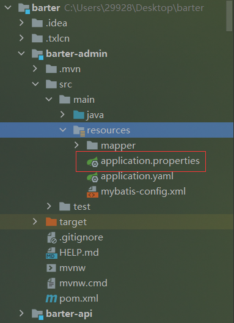

## 理论知识就看前面那个笔记：视频课件

## 创建一个模块txManager

### 导入依赖

```xml
<!--事务管理器服务端-->
<dependency>
    <groupId>com.codingapi.txlcn</groupId>
    <artifactId>txlcn-tm</artifactId>
    <version>5.0.2.RELEASE</version>
</dependency>
```

### 为启动类加上`EnableTransactionManagerServer`注解

```java
import com.codingapi.txlcn.tm.config.EnableTransactionManagerServer;
import org.springframework.boot.SpringApplication;
import org.springframework.boot.autoconfigure.SpringBootApplication;

@SpringBootApplication
// 开启Tx-LCN事务管理器服务端
@EnableTransactionManagerServer
public class BarterTxManagerApplication {
    public static void main(String[] args) {
        SpringApplication.run(BarterTxManagerApplication.class, args);
    }
}
```

### 配置application.properties文件

```properties
# 不要使用yml配置TM应用
# 因为TM提供的默认配置是基于properties文件提供的
# properties文件的优先级是高于yml的，所以使用yml会导致自定义配置无效

spring.application.name=barter-txManager
server.port=8000

# 是TX分布式事务通讯的端口，默认是server.port+100
# 所以配置端口时除了要防止server.port冲突，还要防止server.port+100的端口冲突
#tx-lcn.manager.port=

# 定义TM提供的网页版控制台的登录密码，无用户名，默认密码为codingapi
tx-lcn.manager.admin-key=1234

# 是否开启日志，默认关闭
tx-lcn.logger.enabled=false
# 如果开启日志，需要提供记录日志的数据库相关配置如下
#tx-lcn.logger.driver-class-name=
#tx-lcn.logger.jdbc-url=
#tx-lcn.logger.username=
#tx-lcn.logger.password=


# 提供TM记录事务组相关信息的数据源配置。必须执行一下TM提供的建表语句。
# sql语句在Maven:com.codingapi.txlcn:txlcn-tm:5.0.2.RELEASE的jar包根目录
# sql文件：tx-manager.sql
# 里面有建库语言，建议不要执行这一条，表建在spring.datasource.url定义的库中
spring.datasource.driver-class-name=org.gjt.mm.mysql.Driver
spring.datasource.type=com.alibaba.druid.pool.DruidDataSource
spring.datasource.url=jdbc:mysql://localhost:3306/barter_lcn?characterEncoding=UTF-8&useUnicode=true&useSSL=true&serverTimezone=UTC
spring.datasource.username=root
spring.datasource.password=root

#查看Tx-lcn的maven，发现其有redis依赖，配置redis
spring.redis.host=120.77.96.250
spring.redis.password=17870033452
```


### 启动服务后服务localhost:8000


### 登录成功后的页面

如果启动后报错**Request execution error. endpoint=DefaultEndpoint{ serviceUrl='http://localhost:8761/eureka/}**

**com.sun.jersey.api.client.ClientHandlerException: java.net.ConnectException: Connection refused: connect**，就加上eureka配置

```properties
eureka.client.service-url.defaultZone=http://eureka7001:7001/eureka/,http://eureka7002:7002/eureka/,http://eureka7003:7003/eureka/
eureka.instance.instance-id=barter-txManager
```


## 服务创建分布式事务

### 为需要分布式事务的服务添加依赖

```xml
<!--事务管理器客户端-->
<dependency> 
    <groupId>com.codingapi.txlcn</groupId> 
    <artifactId>txlcn-tc</artifactId> 
    <version>5.0.2.RELEASE</version> 
</dependency>
<!--做心跳、远程IO远程访问的相关依赖包-->
<dependency> 
    <groupId>com.codingapi.txlcn</groupId> 
    <artifactId>txlcn-txmsg-netty</artifactId> 
    <version>5.0.2.RELEASE</version> 
</dependency>
```

### 启动类加上`EnableEurekaClient`注解

```java
import com.codingapi.txlcn.tc.config.EnableDistributedTransaction;
import org.springframework.boot.SpringApplication;
import org.springframework.boot.autoconfigure.SpringBootApplication;
import org.springframework.cloud.netflix.eureka.EnableEurekaClient;

@SpringBootApplication
@EnableEurekaClient
//开启TX-LCN服务，可以识别TX-LCN框架提供的事务管理注解
@EnableDistributedTransaction
public class BarterAdminApplication {
    public static void main(String[] args) {
        SpringApplication.run(BarterAdminApplication.class, args);
    }
}
```

### 加上注解管理分布式事务

- 在需要分布式事务的service方法上加上@LcnTransaction注解开启分布式事务管理
- @LcnTransaction注解和@Transactional注解一般是一起使用的
- @LcnTransaction注解不开启事务，只是管理事务，事务还是需要@Transactional注解开启的
- 加上@LcnTransaction注解注解后原来的事务将会被代理变成伪事务，发起者创建事务组，参与者加入事务组，confirm确认事务组中事务是否成功，最后notify通知各个事务，如果所有事务都成功就提交，否则就回滚

### 配置application.yml

```yml
tx-lcn:
  client:
    # 分布式事务管理的通讯地址，格式：TM主机IP:TM事务消息端口
    manager-address: localhost:8100
```

### 启动服务TC

- **如果这个报错**，TM服务器就使用默认的数据库tx-manager

```
2022-04-14 22:12:26.730 ERROR 28852 --- [eate-1538883559] com.alibaba.druid.pool.DruidDataSource   : create connection SQLException, url: jdbc:mysql://127.0.0.1:3306/tx-manager?characterEncoding=UTF-8, errorCode 1049, state 42000

com.mysql.jdbc.exceptions.jdbc4.MySQLSyntaxErrorException: Unknown database 'tx-manager'
	at sun.reflect.NativeConstructorAccessorImpl.newInstance0(Native Method) ~[na:1.8.0_181]
	at sun.reflect.NativeConstructorAccessorImpl.newInstance(NativeConstructorAccessorImpl.java:62) ~[na:1.8.0_181]
	at sun.reflect.DelegatingConstructorAccessorImpl.newInstance(DelegatingConstructorAccessorImpl.java:45) ~[na:1.8.0_181]
	at java.lang.reflect.Constructor.newInstance(Constructor.java:423) ~[na:1.8.0_181]
```

- 如果这个报错，就换一个端口，不知道为什么原来的服务端口变掉了，比如说8001变成了7970，8004显示被占用


```
***************************
APPLICATION FAILED TO START
***************************

Description:

The Tomcat connector configured to listen on port 8004 failed to start. The port may already be in use or the connector may be misconfigured.

Action:

Verify the connector's configuration, identify and stop any process that's listening on port 8004, or configure this application to listen on another port.


Process finished with exit code 1
```

- 发现端口被改了，变成了7970，服务名称变成了**TRANSACTIONMANAGER**，是因为tm的application.properties中默认设置的，也就是说yml中的没生效，需要额外创建一个application.properties，里面配置tc需要的配置

  ```properties
  #spring.application.name=TransactionManager
  spring.application.name=barter-admin
  server.port=8004
  #spring.datasource.driver-class-name=com.mysql.jdbc.Driver
  #spring.datasource.url=jdbc:mysql://127.0.0.1:3306/tx-manager?characterEncoding=UTF-8
  #spring.datasource.username=root
  #spring.datasource.password=root
  #spring.jpa.database-platform=org.hibernate.dialect.MySQL5InnoDBDialect
  #spring.jpa.hibernate.ddl-auto=update
  ```

  

- 发现事务异常没有回滚，调用方和被调用方都要加上LcnTransaction注解，还是不行可能是`TransactionAspectSupport.currentTransactionStatus().setRollbackOnly(); ` 无法触发回滚，必须throw一个RuntimeException            

