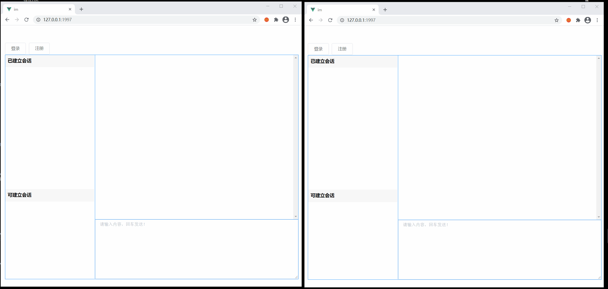

源码：xdxIm-master.zip

# 基于WebSocket实现Web端聊天系统【Vue+SpringBoot】

**最终效果如下：**


**github地址：https://github.com/xdxTao/xdxIm**

**B站视频地址：https://www.bilibili.com/video/BV1WU4y147we**

> 如果对你有帮助，点个start，谢谢。
> 可以关注我的微信公众号，一个有趣的程序员。微信搜索：**小道仙97**

## 一、WebSocket概述

> 一般我们前后端交互都是使用http，http是前端发起一个请求，后端回复。它的特点就是前端发起请求后端返回数据，一次交互就没了。
>
> 而我们在聊天的时候，A给B发送了一个消息，我们后台接收到了消息然后主动推送给B去显示。
>
> **websocket是一个双向通信的协议，前后端都可以主动的去发送消息。**


## 二、代码

> websocket本质上也是一个请求连接，所以我们也可以像http请求一样传递连接参数。
>
> 当我们连接成功后，后端会产生一个**session**，我们可以通过这个session去发消息（它里面提供了一个发送消息的方法）

### 2-1、前端代码，写在vue的methods代码块中

```javascript
//要在create代码块中调用一个initWebSocket初始化websocket：this.initWebSocket(参数...)
//初始化initWebSocket与后端建立连接
initWebSocket: function (userId,sessionId) {                
	// WebSocket与普通的请求所用协议有所不同，ws等同于http，wss等同于https                
	this.websock = new WebSocket("ws://127.0.0.1:1997/websocket/"+userId+"/"+sessionId);                
	this.websock.onopen = this.websocketonopen;                
	this.websock.onerror = this.websocketonerror;                
	this.websock.onmessage = this.websocketonmessage;                
	this.websock.onclose = this.websocketclose;
},  
// 连接成功时自动调用
websocketonopen: function () {                
	console.log("WebSocket连接成功");    
}, 
// 连接出错时自动调用
websocketonerror: function (e) { 
	console.log("WebSocket连接发生错误",e);              
},
// 后端推送消息时自动调用
websocketonmessage: function (e) {  
	console.log("获取到后端传递来的数据",e.data);     
},       
// 连接关闭时自动调用       
websocketclose: function (e) {
	console.log("WebSocket连接关闭",e);                
},
```

#### 2-1-1、initWebSocket

我们调用**initWebSocket**方法就可以和后端建立连接，**userId**、**sessionId**就是我们传递的参数。

这里的userId和sessionId是属于用户本身的吗？

#### 2-1-2、websocketonopen

websocket连接成功后，就会调用**websocketonopen**方法。

#### 2-1-3、websocketonerror

websocket连接失败后，就会调用**websocketonerror**方法

#### 2-1-4、websocketonmessage

当接收到后端发送消息的时候，就会调用 **websocketonmessage**方法，**e.data**就是传递的消息内容。

#### 2-1-4、websocketclose

当websocket连接关闭的时候，就会调用这个**websocketclose**方法。

关闭连接的原因有很多，后端异常、网络异常等一些原因，所以我们可以在这里考虑如何做中断后重连

#### 2-1-5、其它

- 如果我们要主动给后端发消息可以这样写**this.websock.send(content)**
- 如果我们需要关闭可以这样写**this.websock.close()**
- 这两个可以在前面几个自动调用的方法中使用

### 2-2、后端代码

#### controller.WebSocket片段

```java
@Component
//前端中"ws://127.0.0.1:8005/websocket/"+userId+"/"+sessionId，对应的就是这里
@ServerEndpoint("/websocket/{userId}/{sessionId}")
//此注解相当于设置访问URL
public class WebSocket {
    
    //每简历一次会话都会去创建一个Session，这个session后面发消息用得上
    @OnOpen
    public void onOpen(Session session,@PathParam(value="userId")Integer userId, @PathParam(value="sessionId")String sessionId) {
    }

    //当连接关闭时会调用，可以用来清除session
    @OnClose
    public void onClose() {
    }

    //前端发送消息到后端时，消息就会到这里
    @OnMessage
    public void onMessage(String message) {
    }

    // 此为单点消息 (发送文本)
    public void sendTextMessage(Integer userId, String message) {
        Session session = (Session)CurPool.sessionPool.get(userId).get(1);
        if (session != null) {
            try {
                session.getBasicRemote().sendText(message);
            } catch (Exception e) {
                e.printStackTrace();
            }
        }
    }
    
}
```

#### 2-2-1、onOpen

前端调用连接的时候，就会调用这个方法。我们可以拿到当前连接的session和传递的参数。

我们在这里去保存这个session，后面发消息需要用到

#### 2-2-2、onClose

当连接中断的时候，会调用这个方法。

我们可以在这里去清除这个session

#### 2-2-3、onMessage

当前端向我们发消息（this.websock.send(content)）的时候，就进入了这个方法

我们可以通过**this.session**拿到当前发消息的session（具体的代码可以看下源码）

这个方法就像一个中转站，一个客户端向服务端发送消息，服务端将这个消息发送给指定客户端

#### 2-2-4、sendTextMessage

发送文本消息，我们通过 **session.getBasicRemote().sendText(message)** 这个方法主动的向前端推送消息。

前端的**websocketonmessage**方法就可以接收到我们的消息了。

### 2-3、配置类

但是现在还是连接不上的，前端会报错：WebSocket连接发生错误 ，因为后端没有注入ServerEndpointExporter

```java
import org.springframework.context.annotation.Bean;
import org.springframework.context.annotation.Configuration;
import org.springframework.web.socket.server.standard.ServerEndpointExporter;

@Configuration
public class WebSocketConfig {
    @Bean
    public ServerEndpointExporter serverEndpointExporter() {
        return new ServerEndpointExporter();
    }
}
```

### 2-4、其它

**其实整个websocket的核心代码就是上面的这些了，我们需要一个思路来组装上面的代码，从而实现我们的聊天系统。**

整个系统除了vue和springboot之外，就使用到了一个mysql数据库。估计也承受不了很大的并发量，当然了我们总是小看了我们的技术。

后面会对这个项目进行升级，等我在实际项目中实践过后会出一个聊天系统2.0，到时候不管是样式，还是系统架构都会不同的。

#### 2-4-1、跨域

如果还是连接不上，可能是跨域问题，前后端都可以配置跨域，后端

```java
import org.springframework.context.annotation.Configuration;
import org.springframework.web.servlet.config.annotation.CorsRegistry;
import org.springframework.web.servlet.config.annotation.WebMvcConfigurer;

/**
 * 配置跨域
 * */
@Configuration
public class CrosConfig implements WebMvcConfigurer {
    @Override
    public void addCorsMappings(CorsRegistry registry) {
        //配置 可以访问的地址 /**，所有
        registry.addMapping("/**")
                // * 表示对所有的地址都可以访问
                .allowedOrigins("*")
                //  跨域的请求头
                .allowedHeaders("*")
                //  跨域的请求方法
                .allowedMethods("POST","GET","PUT","DELETE")
                //加上了这一句，大致意思是是否可以携带 cookie
                //最终的结果是不可以 在跨域请求的时候不能获取同一个 session
                .allowCredentials(false)
                .maxAge(3600);
    }
}
```


## 三、聊天系统实现思路

其实在写这个聊天系统之前，我是简单的使用过websocket的。上面的这些方法我也只是简单的使用过，我使用它们实现了一个简单的进度条功能，当我要写聊天系统的时候，我没有一点点的思路，然后我就以业务驱动，我脑海里面知道我想要的是一个什么效果，然后我就一点点的去实现。我也将以这个思路去给大家讲解。

### 3-1、实现两个界面，数据的实时传输

通过上面的介绍，我们知道每一个连接都对应一个session，通过这个session我们就可以把消息准确的推送到对应的前端。

设想一下，我们系统有两个用户，并且这两个用户都已经建立了连接。（直接调用一下连接的方法就好了）

```json
{
	"userId":"1",
	"userName":"小道仙"
}
{
	"userId":"2",
	"userName":"张三丰"
}
```

现在我们的小道仙要给张三丰发一个你好，我们要解决下面两个问题

- 这个**你好**怎么展示在小道仙的窗口
- 这个**你好**怎么展示在张三丰的窗口

第一个问题很好解决，我们的消息都是存在一个**List数组**里面的，而我们前端是使用vue实现的，我们只需要在发消息的时候把新的消息**push**到这个数组里面去就行了。

我们要推送消息，我们只要知道要推送的session就好了，我们可以在连接的时候，把每一个session装进Map里面去，key使用userId。我们改装一下上面的onOpen方法。

**这个map是一个全局变量，不定义在方法中，为了简单我就直接写到这里了**

```java
@OnOpen
public void onOpen(Session session,@PathParam(value="userId")Integer userId, @PathParam(value="sessionId")String sessionId) {
    Map<Integer, Session> map = new HashMap<>();
    map.put(userId, session);
}
```

因为我们已经假设了，我们只要两个用户，那么我们的onMessage，只需要这样改装一下就好了。

```java
 @OnMessage
 public void onMessage(String message) {
     // 通过这个我们拿到当前的userId
     String userId = this.session.getRequestParameterMap().get("userId").get(0);
     // 要发送消息的userId
     String sendUserId = "1";
     if ("1".equals(userId)){
         sendUserId = "2";
     }
     Session session = map.get(sendUserId);
     try {
         session.getBasicRemote().sendText(message);
     }catch (Exception e){
         
     }
}
```

前端拿到数据后，在websocketonmessage里面push到数组里面去就好了。

这样就实现了两个用户实时的聊天了。

### 3-2、当前会话存在就显示消息，当前会话不存在就显示消息+1

> 到这一步的时候，我们就要涉及到数据库了。因为对于**未读的消息，我们要存在数据库里面**。

#### 3-2-1、数据库设计

**用户表：**

```sql
CREATE TABLE `user` (
  `id` int(6) NOT NULL AUTO_INCREMENT COMMENT '用户id',
  `name` varchar(50) NOT NULL COMMENT '用户名',
  PRIMARY KEY (`id`) USING BTREE
) ENGINE=InnoDB AUTO_INCREMENT=21 DEFAULT CHARSET=utf8 ROW_FORMAT=COMPACT COMMENT='用户表';
```

**消息表：**

用来存每一个的对话消息，通过当前用户id，和点击会话列表，我们就和查询到当前会话的消息了。

```sql
CREATE TABLE `msg_info` (
  `id` int(6) NOT NULL AUTO_INCREMENT COMMENT '消息id',
  `from_user_id` int(6) NOT NULL COMMENT '消息发送者id',
  `from_user_name` varchar(50) NOT NULL COMMENT '消息发送者名称',
  `to_user_id` int(6) NOT NULL COMMENT '消息接收者id',
  `to_user_name` varchar(50) NOT NULL COMMENT '消息接收者名称',
  `content` varchar(200) NOT NULL COMMENT '消息内容',
  `create_time` datetime NOT NULL COMMENT '消息发送时间',
  `un_read_flag` int(1) NOT NULL COMMENT '是否已读（1 已读）',
  PRIMARY KEY (`id`) USING BTREE
) ENGINE=InnoDB AUTO_INCREMENT=264 DEFAULT CHARSET=utf8 ROW_FORMAT=COMPACT COMMENT='消息表';
```

**会话列表：**

A和B、A和C、A和D、B和A，都可以建立会话，我们需要把存在的会话都存在起来，这样用户一登陆就可以看到自己之前的会话列表了。

```sql
CREATE TABLE `session_list` (
  `id` int(6) NOT NULL AUTO_INCREMENT COMMENT 'id',
  `user_id` int(6) NOT NULL COMMENT '所属用户',
  `to_user_id` int(6) NOT NULL COMMENT '到用户',
  `list_name` varchar(50) NOT NULL COMMENT '会话名称',
  `un_read_count` int(6) NOT NULL COMMENT '未读消息数',
  PRIMARY KEY (`id`) USING BTREE
) ENGINE=InnoDB AUTO_INCREMENT=41 DEFAULT CHARSET=utf8 ROW_FORMAT=COMPACT COMMENT='会话列表';
```


#### 3-2-2、会话列表

从上面的展示图里面，我们可以看到有**左侧**的会话列表有上下两个部分，上面的部分是已建立会话、**下面的部分**是可建立会话。

**可建立会话：**

我们从用户表里面提取所有用户然后除去自己，除去已存在的会话列表即可。

**已建立会话：**

每次点击一下，下面的部分我们都创建一个会话

- user_id 当前登录用户的id
- to_user_id 点击下面的用户id
- list_name 下面用户的名称
- un_read_count 默认为0


#### 3-2-3、判断是推送会话列表，还是消息

> 我们知道一个人可能和多个用户聊天，如果当前消息是该会话用户发的，那么我们的消息要显示出来（上面说了直接push到list里面），如果不是当前会话，我们就要显示消息+1。

**如果是当前会话，我们就推送一个文本消息。如果不是我们就推送新的会话列表。**

所以前端就很好写了：

```javascript
websocketonmessage: function (e) {  
	let data = JSON.parse(e.data);
	if(data instanceof Array){
		// 列表数据
		this.sessionList_already = data
	}else{
		// 消息数据
		this.list.push(data)
	}
},    
```


后端的话，我们就需要考虑一下，我们要推送的消息是**文本消息**，还是**新的会话列表**

上文也说了websocket其实和http一样也是一个请求，它可以携带多个参数，我们上面是携带了一个userId，现在我们再多携带一个参数sessionId，这个sessionId其实就是上面会话表的id。

现在我们修改一下我们存储用户session的规则，之前是userId作为key，session作为value。现在改成下面的：

```java
Map<Integer, List<Object>> map = new HashMap<>();
List<Object> list = new ArrayList<>();
list.add(sessionId);
list.add(session);
CurPool.sessionPool.put(userId , list);
```

每次用户切换会话列表的时候，我们都先关闭连接，然后使用新的sessionId去建立连接。

**当A给B发消息时，先把消息持久化到数据库，然后再判断B当前连接的sessionId是否是和A建立的，如果是就直接推送消息，如果不是就推送新的会话列表。**


到这里，整个websocket聊天系统就实现好了，我的代码也完全是按照这个思路去写的。你也可以使用这个思路自己去尝试一下，也可以带着这个思路去看我写的代码。


## 四、其它

上面这个聊天系统，我把它称之为聊天系统1.0，因为它可能没解决任何问题，只是实现了基本的聊天功能，并且界面也不好看。

我也考虑过高并发的问题，可能一个系统无法支持，我们可以考虑把session存储到redis里面去，这样我们的系统也可以部署多分，从同一个redis里面取出同一个session就可以了。

也可以考虑把发消息和推送消息拆分出来，先把消息推送到MQ里面，然后另外一个服务从MQ里面取出来做持久化和推送的功能。

其实难点可能还是对于session的管理，还有我们断线重连的问题。在前面里面断开方法我们可以去判断断开的原因，然后进行重连。